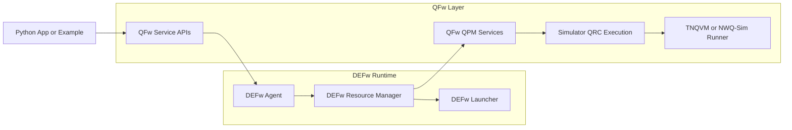

# QFw

QFw is a multi-node quantum execution framework built around DEFw,
simulator-specific QPM services, and application-side APIs. It is
designed to start a distributed simulation environment, launch
simulator backends such as TNQVM and NWQ-Sim on allocated resources,
and expose those services to Python applications and examples.

## Installation Instructions

### Clone the repositories

```bash
mkdir -p qhpc
cd qhpc
git clone git@github.com:openQSE/QFw.git
cd QFw
git submodule update --init --recursive
```

The `DEFw` submodule is currently configured from:

```bash
git@github.com:openQSE/DEFw.git
```

### Create an install configuration

QFw supports two installation modes.

1. Module-based environment:

```yaml
base-dir: </path/to/QFw/base/directory>               # example:
/sw/frontier/qhpc
qfw-module-path: </path/to/module/files>              # example:
/sw/frontier/qhpc/QFw/environment/
qfw-module-load: <module-name>                        # example: qsim
python-venv-activate: </path/to/venv/bin/activate>
install-py-requirements: [True | False]               # optional, default False
build-dependencies: [True | False]                    # optional, default False
qfw-dep-build-version: <existing build version>       # required if
                                                      # no dependency build
```

2. Explicit environment-variable setup:

```yaml
base-dir: </path/to/QFw/base/directory>
python-venv-activate: </path/to/venv/bin/activate>
libfabric-install: </path/to/libfabric/install>
mpi-install: </path/to/openmpi/install>
dev-install: </path/to/rocm-or-cuda/root>             # example:
                                                      # /opt/rocm-6.2.4/
install-py-requirements: [True | False]
build-dependencies: [True | False]
qfw-dep-build-version: <existing build version>       # required if
                                                      # no dependency build
```

If `build-dependencies` is `True`, `qfw_install` generates a new
`QFW_DEP_BUILD_VERSION` and uses it for TNQVM and NWQ-Sim builds. If
`build-dependencies` is `False`, `qfw-dep-build-version` must already be
provided so activation can resolve the versioned runtime paths.

### Run the installer

```bash
cd /path/to/QFw/setup
./qfw_install -c /path/to/config.yaml
```

This generates:

- `setup/qfw_activate`: activates the QFw environment only
- `setup/qfw_build_deps.sh`: installs Python requirements, builds
  dependencies when requested, then deactivates

## Run Instructions

### Activate the environment

```bash
source /path/to/QFw/setup/qfw_activate
```

`qfw_activate` now fails fast if `QFW_DEP_BUILD_VERSION` is missing,
because the simulator runtime paths are versioned.

### Allocate resources

QFw is typically run on Frontier with two SLURM heterogeneous job components:

- component 0: application side
- component 1: simulation environment

```bash
salloc -N 1 -t 4:00:00 -A <project> --network=single_node_vni: \
  -N 1 -t 4:00:00 -A <project> --network=single_node_vni
```

### Start QFw

After activation, start the framework from the setup scripts:

```bash
cd /path/to/QFw/setup
./qfw_setup.sh
```

For local development on one node:

```bash
cd /path/to/QFw/setup
./qfw_dev_setup.sh
```

### Run examples

```bash
cd /path/to/QFw/examples
./qfw_supermarq.sh async 1 4 100 0 ghz nwqsim
```

Example tests live under `examples/tests/` and can be run with:

```bash
pytest examples/tests
```

### Deactivate the environment

```bash
qfw_deactivate
```

## Developer Testing

To run the same checks as CI locally (not part of the QFw build or installation):

```bash
pip install flake8 pytest       # one-time dependency install
./.github/scripts/ci-checks.sh  # lint and syntax
./.github/scripts/ci-mock.sh    # CI-safe mock tests
```

## High Level Design

QFw uses DEFw as the distributed runtime and layers QFw-specific
services and APIs on top. DEFw handles process startup, messaging, role
management, and remote execution. QFw adds simulator-specific QPM
services, QRC execution paths, installation helpers, and example
applications.

The current repository is organized around:

- `setup/`: activation, installation, SLURM orchestration, and startup scripts
- `services/`: QFw-owned external DEFw services such as
  `svc_tnqvm_qpm` and `svc_nwqsim_qpm`
- `service-apis/`: QFw-owned external DEFw service APIs such as `api_qpm`
- `DEFw/`: the distributed runtime submodule
- `bin/`: simulator runner binaries copied from dependency builds
- `examples/`: runnable examples and integration-style tests

At runtime:

1. `qfw_activate` exports the QFw and DEFw environment.
2. `qfw_setup.sh` starts PRTE, DEFw resource-manager/launcher
   processes, and QPM services.
3. Applications connect through `api_qpm` and reserve QPM services.
4. QPM services launch simulator-specific QRC executions through the
   installed backend runners.



QFw-specific services and APIs are loaded into DEFw through:

- `DEFW_EXTERNAL_SERVICES_PATH`
- `DEFW_EXTERNAL_SERVICE_APIS_PATH`

This keeps the DEFw framework generic while allowing QFw to evolve its
simulator services independently.
