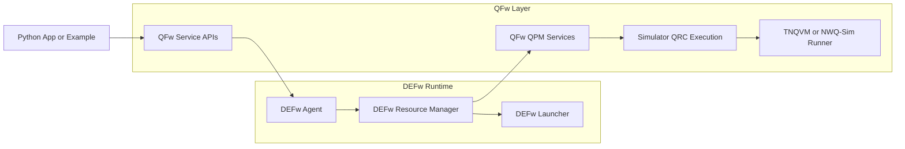

# QFw

QFw is a multi-node quantum execution framework built around DEFw,
simulator-specific QPM services, and application-side APIs. It is
designed to start a distributed simulation environment, launch
simulator backends such as TNQVM and NWQ-Sim on allocated resources,
and expose those services to Python applications and examples.

## Installation Instructions

### Clone the repositories

```bash
mkdir -p qhpc
cd qhpc
git clone git@github.com:openQSE/QFw.git
cd QFw
git submodule update --init --recursive
```

The `DEFw` submodule is currently configured from:

```bash
git@github.com:openQSE/DEFw.git
```

### Clone from Git (includes submodules)

```bash
git clone --recursive git@github.com:openQSE/QFw.git
```

### Create an install configuration

QFw supports three installation modes.

1. Module-based environment:

```yaml
base-dir: </path/to/QFw/base/directory>               # example:
/sw/frontier/qhpc
runtime-mode: cluster
service-runtime-config: services/config/frontier.yaml
mpi-transport-mode: ofi
qfw-module-path: </path/to/module/files>              # example:
/sw/frontier/qhpc/QFw/environment/
qfw-module-load: <module-name>                        # example: qsim
python-venv-activate: </path/to/venv/bin/activate>
qfw-dep-build-version: <existing build version>       # required unless
                                                      # generate-dep-build-version
                                                      # is True
generate-dep-build-version: [True | False]            # optional, default False
```

2. Explicit environment-variable setup:

```yaml
base-dir: </path/to/QFw/base/directory>
runtime-mode: cluster | container                     # optional, default:
                                                      # cluster unless
                                                      # install-profile is
                                                      # container
service-runtime-config: services/config/frontier.yaml # required for cluster;
                                                      # optional for container
mpi-transport-mode: ofi | auto                        # optional, default:
                                                      # ofi for cluster,
                                                      # auto for container
python-venv-activate: </path/to/venv/bin/activate>
libfabric-install: </path/to/libfabric/install>
mpi-install: </path/to/openmpi/install>
dev-install: </path/to/rocm-or-cuda/root>             # example:
                                                      # /opt/rocm-6.2.4/
dev-version: <toolchain version>                      # optional, helps when
                                                      # dev-install is not
                                                      # versioned in the path
qfw-dep-build-version: <existing build version>       # required unless
                                                      # generate-dep-build-version
                                                      # is True
generate-dep-build-version: [True | False]            # optional, default False
```

3. Container profile:

```yaml
install-profile: container
runtime-mode: container
service-runtime-config: services/config/container.yaml
mpi-transport-mode: auto
base-dir: /workspace/qfw-container-base
python-venv-activate: /workspace/qfw-container-base/venv/bin/activate
libfabric-install: /opt/qfw/libfabric
mpi-install: /opt/qfw/openmpi
dev-install: /workspace/qfw-container-base/rocm      # or /opt/rocm
dev-version: 6.2.4                                    # optional when the
                                                      # mounted ROCm root is
                                                      # not versioned
qfw-dep-build-version: <existing build version>      # required unless
                                                      # generate-dep-build-version
                                                      # is True
generate-dep-build-version: [True | False]            # optional, default False
```

The container profile is a convenience wrapper around the explicit
environment-variable mode. It does not load modules and defaults to the
paths provided by the QFw Slurm container image.

`qfw-dep-build-version` identifies the versioned dependency install
location used by activation and the generated build script. If
`generate-dep-build-version` is `True`, `qfw_configure` generates a new
timestamp-based version automatically. Otherwise, `qfw-dep-build-version`
must already be provided.

`runtime-mode` controls how QFw interprets the allocation and temp-path
layout. Supported values are:

- `cluster`: use the cluster-oriented startup and temp-path behavior
- `container`: use the mounted workspace for temp files while still
  supporting the same Slurm heterogeneous startup flow

`service-runtime-config` points to the runtime policy used by QFw services.
It controls MPI launch details such as MCA parameters, binding, mapping,
and backend wrappers. Relative paths are resolved under `QFW_PATH`.
Container installs default to `services/config/container.yaml`; cluster
installs should set this explicitly. QFw ships
`services/config/frontier.yaml` as the Frontier example, and sites such as
Aurora should provide their own YAML and point this key at it.

`mpi-transport-mode` controls whether QFw forces Open MPI onto the OFI
path:

- `ofi`: export the existing OFI-focused MCA environment settings
- `auto`: leave transport selection to the Open MPI installation

You can also add an `mpi-env:` mapping in the config to export explicit
MPI or MCA environment variables after activation.

Additional optional config keys used by the current configurator and
build path include:

- `cc`, `cxx`, `fc`
- `hip-arch`
- `tmp-dir`
- `mpi-env`
- `openblas-root`, `cmake-root`, `gcc-root`

### Run the configurator

Install the configure-time Python requirements into the Python
environment named by `python-venv-activate` before running
`qfw_configure`:

```bash
source /path/to/venv/bin/activate
python -m pip install -r /path/to/QFw/setup/build-requirements.txt
```

```bash
cd /path/to/QFw/setup
./qfw_configure -c /path/to/config.yaml
```

This generates:

- `setup/qfw_activate`: activates the QFw environment only
- `setup/qfw_build.sh`: installs Python requirements and builds
  dependencies when requested on the command line, then deactivates

The configurator does not execute `qfw_build.sh`. Run it as a separate
step when you want to install Python requirements or build TNQVM,
NWQ-Sim, and DEFw.

```bash
cd /path/to/QFw/setup
./qfw_build.sh
```

`qfw_build.sh` defaults to building everything. You can also target
specific pieces explicitly:

```bash
./qfw_build.sh --python
./qfw_build.sh --tnqvm --nwqsim
./qfw_build.sh --defw
```

For the container profile, the normal sequence is:

```bash
cd /workspace/qfw-container-base/QFw/setup
./qfw_configure -c config/qfw_config_sample_container.yaml
./qfw_build.sh
```

## Step-By-Step Workflows

### Run QFw In The Containerized Slurm Environment

This assumes:

- the `QFw-SLURM-Cluster` repository is already up and running
- the QFw checkout is mounted into the containers at
  `/workspace/qfw-container-base/QFw`
- you will run the commands below from inside the `slurmctld` container

1. Enter the controller container:

```bash
cd /path/to/QFw-SLURM-Cluster
./do_ssh.sh
```

2. Create the persistent venv in the mounted workspace if it does not
   already exist:

```bash
python3 -m venv /workspace/qfw-container-base/venv
source /workspace/qfw-container-base/venv/bin/activate
python -m pip install --upgrade pip
python -m pip install -r /workspace/qfw-container-base/QFw/setup/build-requirements.txt
```

3. Go to the QFw setup directory:

```bash
cd /workspace/qfw-container-base/QFw/setup
```

4. Generate the activation and build scripts:

```bash
./qfw_configure -c config/qfw_config_sample_container.yaml
```

5. Build the QFw environment:

```bash
./qfw_build.sh
```

To build only selected pieces instead of the full stack:

```bash
./qfw_build.sh --python --defw
./qfw_build.sh --tnqvm --nwqsim
```

6. Activate the generated environment:

```bash
source /workspace/qfw-container-base/QFw/setup/qfw_activate
```

`qfw_activate` fails fast if `QFW_DEP_BUILD_VERSION` is missing, because
the simulator runtime paths are versioned.

7. Take a heterogeneous allocation when you want to mirror the normal
   Frontier-style run shape:

```bash
salloc -N 1 -n 1 : -N 1 -n 1
```

8. Start QFw:

```bash
cd /workspace/qfw-container-base/QFw/setup
./qfw_setup.sh
```

`qfw_setup.sh` is the primary startup path. It performs the PRTE startup
phase and then launches the QFw framework phase.

9. Run a simple smoke path or example:

```bash
cd /workspace/qfw-container-base/QFw/examples
./qfw_mpi_smoke.sh
```

or:

```bash
cd /workspace/qfw-container-base/QFw/examples
./qfw_supermarq.sh async 1 4 100 0 ghz nwqsim
```

Example tests live under `examples/tests/` and can be run with:

```bash
cd /workspace/qfw-container-base/QFw
pytest examples/tests
```

10. Tear down or deactivate when finished:

```bash
qfw_deactivate
```

QFw expects a Slurm heterogeneous allocation in both container and cluster
mode. Use `qfw_setup.sh` as the supported startup path.

### Run QFw On A Real Cluster

This is the Frontier-style workflow using modules or explicit cluster
installs.

1. Clone the repository and submodules:

```bash
mkdir -p qhpc
cd qhpc
git clone git@github.com:openQSE/QFw.git
cd QFw
git submodule update --init --recursive
```

2. Choose a config file under `setup/config/` or create your own. For a
   module-based install, start from `setup/config/qfw_config_sample.yaml`.
   For an explicit-path install, start from
   `setup/config/qfw_config_sample_nomod.yaml`.

3. Edit the config so the paths match the cluster:

```bash
cd setup
cp config/qfw_config_sample.yaml my_cluster.yaml
python -m pip install -r build-requirements.txt
```

For non-Frontier clusters, also create a site runtime config and point
`service-runtime-config` at it. The bundled Frontier example is
`services/config/frontier.yaml`.

4. Generate the activation and build scripts:

```bash
./qfw_configure -c my_cluster.yaml
```

5. Build the QFw environment:

```bash
./qfw_build.sh
```

If you only need selected targets, pass them explicitly:

```bash
./qfw_build.sh --python --defw
./qfw_build.sh --tnqvm --nwqsim
```

6. Activate QFw:

```bash
source /path/to/QFw/setup/qfw_activate
```

`qfw_activate` fails fast if `QFW_DEP_BUILD_VERSION` is missing, because
the simulator runtime paths are versioned.

7. Take the two-component heterogeneous allocation:

```bash
salloc -N 1 -t 4:00:00 -A <project> --network=single_node_vni: \
  -N 1 -t 4:00:00 -A <project> --network=single_node_vni
```

8. Start QFw:

```bash
cd /path/to/QFw/setup
./qfw_setup.sh
```

`qfw_setup.sh` is the primary startup path. It performs the PRTE startup
phase and then launches the QFw framework phase.

9. Run an example:

```bash
cd /path/to/QFw/examples
./qfw_supermarq.sh async 1 4 100 0 ghz nwqsim
```

Example tests live under `examples/tests/` and can be run with:

```bash
cd /path/to/QFw
pytest examples/tests
```

### Container MPI Smoke Example

After activation and a heterogeneous Slurm allocation, run the MPI smoke
example through the normal QFw startup and application path:

```bash
cd /path/to/QFw/examples
./qfw_mpi_smoke.sh
```

This validates:

- PRTE startup through `qfw_setup.sh`
- Resource Manager startup through `qfw_setup.py`
- `svc_mpi_smoke` startup from `qfw_mpi_smoke_services.yaml`
- `api_mpi_smoke` use through `qfw_srun.sh`
- an `mpirun` payload launched by the smoke service

The example uses the same teardown path as the other QFw examples:

```bash
qfw_teardown.sh
```

### Deactivate the environment

```bash
qfw_deactivate
```

## Developer Testing

To run the same checks as CI locally (not part of the QFw build or installation):

```bash
pip install flake8 pytest       # one-time dependency install
./.github/scripts/ci-syntax.sh  # lint and syntax
./.github/scripts/ci-mock.sh    # CI-safe mock tests
```

## High Level Design

QFw uses DEFw as the distributed runtime and layers QFw-specific
services and APIs on top. DEFw handles process startup, messaging, role
management, and remote execution. QFw adds simulator-specific QPM
services, QRC execution paths, installation helpers, and example
applications.

The current repository is organized around:

- `setup/`: activation, installation, SLURM orchestration, and startup scripts
- `services/`: QFw-owned external DEFw services such as
  `svc_tnqvm_qpm` and `svc_nwqsim_qpm`
- `service-apis/`: QFw-owned external DEFw service APIs such as `api_qpm`
- `DEFw/`: the distributed runtime submodule
- `bin/`: simulator runner binaries copied from dependency builds
- `examples/`: runnable examples and integration-style tests

At runtime:

1. `qfw_activate` exports the QFw and DEFw environment.
2. `qfw_setup.sh` starts PRTE, DEFw resource-manager/launcher
   processes, and QPM services.
3. Applications connect through `api_qpm` and reserve QPM services.
4. QPM services launch simulator-specific QRC executions through the
   installed backend runners.



QFw-specific services and APIs are loaded into DEFw through:

- `DEFW_EXTERNAL_SERVICES_PATH`
- `DEFW_EXTERNAL_SERVICE_APIS_PATH`

This keeps the DEFw framework generic while allowing QFw to evolve its
simulator services independently.
