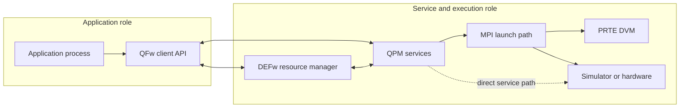

# QFw

QFw is a quantum execution framework for running quantum applications
against simulator or hardware services. It uses
[DEFw](https://github.com/openQSE/DEFw) as the distributed runtime, adds
QFw service APIs, and provides QPM services for execution targets such as
[TNQVM](https://github.com/ORNL-QCI/tnqvm) and
[NWQ-Sim](https://github.com/pnnl/NWQ-Sim).

A QPM is a Quantum Platform Manager. In QFw, a QPM service represents one
execution target, advertises its type and capabilities, accepts circuit
submissions through the `api_qpm` interface, and returns backend,
device, and job information to applications.

The same QFw application workflow can run on a local node, in a Slurm
allocation, or inside the containerized
[QFw-SLURM-Cluster](https://github.com/openQSE/QFw-SLURM-Cluster)
environment. The top-level scripts hide most of the differences between
those launch modes.

## Table Of Contents

- [Build QFw](#build-qfw)
- [Run QFw Locally](#run-qfw-locally)
- [Run Examples](#run-examples)
- [Run On A Real Cluster](#run-on-a-real-cluster)
- [Run With QFw-SLURM-Cluster](#run-with-qfw-slurm-cluster)
- [Install Configuration Reference](#install-configuration-reference)
- [Shared Filesystem Behavior](#shared-filesystem-behavior)
- [Developer Testing](#developer-testing)
- [High Level Design](#high-level-design)
- [Service Statevector Contract](#service-statevector-contract)

## Build QFw

Clone QFw with its submodules:

```bash
git clone --recursive git@github.com:openQSE/QFw.git
cd QFw
```

Create or activate the Python environment that QFw should use:

```bash
python3 -m venv /path/to/qfw-venv
source /path/to/qfw-venv/bin/activate
python -m pip install --upgrade pip setuptools wheel
python -m pip install -r setup/build-requirements.txt
```

Choose one of the existing install configurations under `setup/config/`:

- `qfw_config_sample_container.yaml`: container or QFw-SLURM-Cluster use.
- `qfw_config_sample.yaml`: module-based cluster use.
- `qfw_config_sample_nomod.yaml`: explicit path cluster use without modules.

For a same-node run or a normal local computer, start from
`qfw_config_sample_nomod.yaml` and replace the paths with local paths.
There is no separate `runtime-mode: local`. Local execution is detected at
launch time. For most local installs, use `services/config/container.yaml`
as the service runtime policy and `mpi-transport-mode: auto`, because the
Frontier runtime policy contains system-specific MPI assumptions.

Configure QFw from the selected file:

```bash
cd setup
./qfw_configure -c config/qfw_config_sample_container.yaml
```

Build the QFw pieces required by your environment:

```bash
./qfw_build.sh --python --defw
```

Use `--python --defw` when simulator runners are already available, such
as inside the QFw-SLURM-Cluster image. Build simulator dependencies only
when this checkout must provide them:

```bash
./qfw_build.sh --tnqvm --nwqsim
```

The configurator generates `setup/qfw_activate` and `setup/qfw_build.sh`.
It does not run the build script automatically.

## Run QFw Locally

Activate QFw and run one of the example wrappers. When QFw is not inside a
Slurm allocation, the launcher scripts use the local node for both the
application and the services.

Use a locally edited copy of `setup/config/qfw_config_sample_nomod.yaml`
for this mode. The allocation detector will set both QFw groups to the
current hostname.

```bash
source /path/to/QFw/setup/qfw_activate
cd "$QFW_PATH/examples"
./qfw_mpi_smoke.sh
qfw_deactivate
```

The example wrappers call `qfw_setup.sh`, run one application through the
QFw launch path, and then call `qfw_teardown.sh`. Do not call
`qfw_deactivate` until the wrapper completes.

## Run Examples

Activate QFw first, then run examples from the `examples/` directory:

```bash
source /path/to/QFw/setup/qfw_activate
cd "$QFW_PATH/examples"
```

Validate framework startup and Qiskit backend construction:

```bash
./qfw_init_test.sh
```

Run the MPI smoke service and verify an MPI payload can launch:

```bash
./qfw_mpi_smoke.sh
```

Run a simple Qiskit circuit through the NWQ-Sim backend:

```bash
./qfw_qiskit_simple.sh 4
```

Run GHZ through Qiskit:

```bash
./qfw_ghz.sh qiskit 4 nwqsim 4
```

Run GHZ through PennyLane:

```bash
./qfw_ghz.sh pennylane 4 nwqsim 4
```

Run the fixed PennyLane remote-backend example:

```bash
./qfw_pennylane.sh
```

Run the Qiskit QAOA Max-Cut example:

```bash
./qfw_qaoa.sh nwqsim
./qfw_qaoa.sh tnqvm
```

Run the Qiskit VQE example. The argument is the optimizer iteration limit:

```bash
./qfw_qiskit_vqe.sh 1
```

Run a SupermarQ workflow:

```bash
./qfw_supermarq.sh sync 1 4 128 false ghz nwqsim
```

Run a chemistry application script when the chemistry application tree is
available:

```bash
./qfw_chem_app.sh <script-name.py>
```

Run the standard example set sequentially:

```bash
./qfw_run_all.sh
```

Useful `qfw_run_all.sh` overrides:

```bash
QFW_RUN_ALL_BACKEND=nwqsim ./qfw_run_all.sh
QFW_RUN_ALL_QUBITS=4 QFW_RUN_ALL_VQE_ITERS=1 ./qfw_run_all.sh
```

`qfw_supermarq.batch` is a Frontier-oriented batch template. Edit the
account, node counts, paths, and arguments before submitting it with
`sbatch`:

```bash
sbatch qfw_supermarq.batch
```

For per-wrapper argument details, see
[examples/README.md](examples/README.md).

## Run On A Real Cluster

<details>
<summary>Cluster workflow</summary>

Use the same build and example commands from the earlier sections. The
cluster-specific work is selecting the right install configuration and
taking the right allocation before running examples.

Start from one of these configuration files:

- `setup/config/qfw_config_sample.yaml` for a module-based cluster setup.
- `setup/config/qfw_config_sample_nomod.yaml` for explicit cluster paths.
- `services/config/frontier.yaml` as the bundled Frontier runtime policy.

For other systems, create a site runtime policy under `services/config/`
or another site-controlled path and point the install configuration at it.

After configuring, building, and activating QFw, take the cluster
allocation required by the site. On Frontier-style systems this is usually
a two-component heterogeneous allocation:

```bash
salloc -N 1 -t 4:00:00 -A <project> --network=single_node_vni: \
  -N 1 -t 4:00:00 -A <project> --network=single_node_vni
```

Then run the wrappers from [Run Examples](#run-examples). The example
commands are the same as the local workflow.

</details>

## Run With QFw-SLURM-Cluster

<details>
<summary>Containerized Slurm workflow</summary>

Use the
[QFw-SLURM-Cluster README](https://github.com/openQSE/QFw-SLURM-Cluster#readme)
for the container build, image pull, shared directory setup, and cluster
startup steps.

Inside the container, QFw normally lives at:

```bash
/workspace/qfw-container-base/QFw
```

Use the container configuration files when building a development checkout
inside that environment:

- `setup/config/qfw_config_sample_container.yaml`
- `services/config/container.yaml`

The QFw-SLURM-Cluster image already contains the simulator runners, so a
development checkout normally only needs:

```bash
cd /workspace/qfw-container-base/QFw/setup
./qfw_configure -c config/qfw_config_sample_container.yaml
./qfw_build.sh --python --defw
```

After activation, run the wrappers from [Run Examples](#run-examples).
The example commands are the same as the local workflow.

</details>

## Install Configuration Reference

<details>
<summary>Configuration files and generated scripts</summary>

`qfw_configure` reads an install configuration and generates:

- `setup/qfw_activate`: activates the QFw runtime environment.
- `setup/qfw_build.sh`: installs Python requirements and builds requested
  components.

The most important install configuration keys are:

- `base-dir`: base directory for QFw runtime files, builds, and installs.
- `runtime-mode`: `container` or `cluster`.
- `service-runtime-config`: service runtime policy YAML.
- `mpi-transport-mode`: `auto` or `ofi`.
- `python-venv-activate`: Python virtual environment activation script.
- `libfabric-install`: Libfabric install prefix.
- `mpi-install`: Open MPI install prefix.
- `dev-install`: accelerator development root, such as ROCm.
- `qfw-dep-build-version`: dependency build version used for paths.
- `generate-dep-build-version`: generate a new timestamped build version.

Optional build and runtime keys include:

- `cc`, `cxx`, `fc`
- `hip-arch`
- `tmp-dir`
- `mpi-env`
- `openblas-root`, `cmake-root`, `gcc-root`

`runtime-mode` controls allocation and temp-path behavior:

- `container`: use the mounted workspace layout used by QFw-SLURM-Cluster.
- `cluster`: use the cluster-oriented runtime layout.

`service-runtime-config` controls service-level MPI launch policy. QFw
ships two examples:

- `services/config/container.yaml`
- `services/config/frontier.yaml`

`mpi-transport-mode` controls whether QFw forces Open MPI onto the OFI
path:

- `ofi`: export the existing OFI-focused MCA environment settings.
- `auto`: leave transport selection to the Open MPI installation.

Add `mpi-env` to the install configuration when a site needs explicit MPI
or MCA environment variables after activation.

</details>

## Shared Filesystem Behavior

<details>
<summary>Node-local and shared directory expectations</summary>

QFw does not enforce a shared filesystem across nodes in a Slurm
allocation. The setup layer treats the run id as global state, propagates
it to remote setup commands, and creates the required QFw temp directories
on each node before writing logs or startup artifacts there.

This means the QFw infrastructure can operate with node-local temp
directories for startup logs, service logs, pid files, and the PRTE DVM
URI as long as the producer and consumer of each file run on the same
node. In the current startup model, the resource manager, QPM services,
and DVM startup run on the group-1 head node, so those local files do not
require a cluster-wide shared directory.

Backend simulators can have stricter requirements. QFw does not rewrite
or stage simulator-specific files automatically.

QASM input files are written by QFw on the service node. This is safe for
backends that only read the QASM file from rank 0 on that same node.

NWQ-Sim count output is rank-0 guarded and does not require every MPI rank
to write a shared output file.

NWQ-Sim statevector dumps use NWQ-Sim's native `--dump_file` path. In the
MPI statevector backend, every MPI rank participates in writing the same
dump file in rank order. That requires the dump path to be visible and
writable from all MPI ranks, unless the run is single-rank or head-local.

For node-local filesystems, avoid multi-node NWQ-Sim statevector dumps
unless the dump directory is placed on shared storage or explicit staging
is added. QFw can run without a shared filesystem, but individual
simulator modes may still require one.

</details>

## Developer Testing

<details>
<summary>Local CI-style checks</summary>

Run these checks when editing QFw itself:

```bash
python -m pip install flake8 pytest
./.github/scripts/ci-syntax.sh
./.github/scripts/ci-mock.sh
```

The example wrappers under `examples/` are integration paths. They expect
a configured and activated QFw environment.

</details>

## High Level Design

<details>
<summary>Runtime architecture</summary>

QFw uses DEFw as the distributed runtime and layers QFw-specific services
and APIs on top. DEFw handles process startup, messaging, role management,
and remote execution. QFw adds simulator-specific QPM services, QRC
execution paths, installation helpers, and example applications.

The repository is organized around:

- `setup/`: activation, installation, allocation handling, and startup
  scripts.
- `services/`: QFw-owned DEFw services such as `svc_tnqvm_qpm` and
  `svc_nwqsim_qpm`.
- `service-apis/`: QFw-owned DEFw service APIs such as `api_qpm`.
- `DEFw/`: the distributed runtime submodule.
- `bin/`: simulator runner binaries copied from dependency builds.
- `examples/`: runnable examples and integration-style tests.

The Slurm runtime model uses group 0 for applications and group 1 for
services and simulator execution. Local mode maps those roles onto the
same node.


```mermaid
flowchart LR
    subgraph G0["Application role"]
        App["Application process"]
        API["QFw client API"]
    end

    subgraph G1["Service and execution role"]
        RM["DEFw resource manager"]
        DVM["PRTE DVM"]
        QPM["QPM services"]
        MPI["MPI launch path"]
        Target["Simulator or hardware"]
    end

    App --> API
    API <--> RM
    API <--> QPM
    RM <--> QPM
    QPM --> MPI
    MPI --> DVM
    MPI --> Target
    QPM -. direct service path .-> Target
```

The default service configuration, `setup/qfw_services.yaml`, starts the
configured QPM services on the service node. The NWQ-Sim and TNQVM
services launch simulator runners through MPI and pass MPI the DVM URI.
Other services may use a different path, such as calling hardware APIs
directly.

QFw-specific services and APIs are loaded into DEFw through:

- `DEFW_EXTERNAL_SERVICES_PATH`
- `DEFW_EXTERNAL_SERVICE_APIS_PATH`

This keeps DEFw generic while allowing QFw services to evolve
independently.

</details>

## Service Statevector Contract

<details>
<summary>Common statevector payload</summary>

QPM services may expose simulator statevectors when a backend requests
`QFW_CAP_STATEVECTOR`. Each service owns parsing of its simulator-native
output, but services should publish statevectors through the common
builder in `services/util/qpm/statevector.py`.

The common service payload is:

```python
{
    "type": "statevector",
    "format": "complex128",
    "num_qubits": 4,
    "num_amplitudes": 16,
    "data": [[real, imag], ...],
    "source": "nwqsim",
}
```

Services should return this structure under the `statevector` key:

```python
{
    "counts": counts,
    "statevector": statevector.to_dict(),
}
```

Count-only services may continue to return the existing plain counts
dictionary. The QFw backend accepts both forms.

NWQ-Sim writes statevectors through its native `--dump_file` option when
QFw requests statevector data. QFw names the dump file from the circuit
UUID with a `.dump` extension, parses it as the NWQ-Sim native
`complex128` statevector, converts it to the common payload, and removes
the dump file after parsing or failure cleanup.

For MPI statevector runs, NWQ-Sim expects that dump path to be visible to
all MPI ranks. Use shared storage for the dump directory or keep the run
single-rank/head-local when running on node-local filesystems.

</details>
