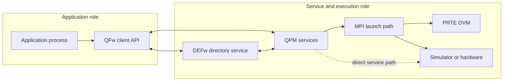

# QFw

QFw is a quantum execution framework for running quantum applications
against simulator or hardware services. It uses
[DEFw](https://github.com/openQSE/DEFw) as the distributed runtime, adds
QFw service APIs, and provides QPM services for execution targets such as
[TNQVM](https://github.com/ORNL-QCI/tnqvm) and
[NWQ-Sim](https://github.com/pnnl/NWQ-Sim).

A QPM is a Quantum Platform Manager. In QFw, a QPM service represents one
execution target, advertises its type and capabilities, accepts circuit
submissions through `api_qpm_execution`, and exposes separate admission,
policy, scheduler, telemetry, and service-control bindings.

The same QFw application workflow can run on a local node, in a Slurm
allocation, or inside the containerized
[QFw-SLURM-Cluster](https://github.com/openQSE/QFw-SLURM-Cluster)
environment. The top-level scripts hide most of the differences between
those launch modes.

For copy-and-paste installation and execution procedures, see the
[QFw recipes](docs/recipes/README.md).
The [site service lifecycle contract](docs/site-service-lifecycle.md) defines
ownership and run-directory boundaries for long-running QPM services.

## Table Of Contents

- [Build QFw](#build-qfw)
- [Run QFw Locally](#run-qfw-locally)
- [Run Examples](#run-examples)
- [Run On A Real Cluster](#run-on-a-real-cluster)
- [Run With QFw-SLURM-Cluster](#run-with-qfw-slurm-cluster)
- [Install Configuration Reference](#install-configuration-reference)
- [Shared Filesystem Behavior](#shared-filesystem-behavior)
- [Developer Testing](#developer-testing)
- [High Level Design](#high-level-design)
- [Service Statevector Contract](#service-statevector-contract)

## Build QFw

Clone QFw with its submodules:

```bash
git clone --recursive git@github.com:openQSE/QFw.git
cd QFw
```

The submodules provide DEFw and the QHW Python/runtime packages used by
QFw services. For an existing checkout that was not cloned with
`--recursive`, initialize or update them before building:

```bash
git submodule update --init --recursive
```

Create or activate the shared Python environment that QFw should use:

```bash
python3 -m venv /path/to/qfw-venv
source /path/to/qfw-venv/bin/activate
python -m pip install --upgrade pip setuptools wheel
python -m pip install -r setup/build-requirements.txt
python -m pip install -r setup/requirements.txt
```

Install QFw with the CMake-backed installer. Use `--with-defw` when this
install prefix should also build and install the bundled DEFw tree:

```bash
./setup/qfw_install.sh --prefix /path/to/qfw-install --with-defw
```

The same flow can be run manually:

```bash
cmake -S . -B build -DCMAKE_INSTALL_PREFIX=/path/to/qfw-install \
  -DQFW_BUILD_BUNDLED_DEFW=ON
cmake --build build
cmake --install build
```

The install places public commands in `/path/to/qfw-install/bin`,
including `qfw-activate`, `defw-python`, `qfw-setup`, `qfw-srun`,
`qfw-status`, `qfw-teardown`, `qfw-dir-svc`, and `qfw-qpm-svc`. The
two role commands are the only public interfaces for independently managed
directory services and QPMs.

Simulator runners and optional hardware client libraries must be available
through the activated environment or site image. The QFw install packages
the QFw service APIs, service modules, examples, QHW submodules, and
runtime configuration templates; it does not build TNQVM, NWQ-Sim, QRMI,
or QDMI-on-IQM from source.

## Run QFw Locally

Activate QFw and run one of the example wrappers. When QFw is not inside
a Slurm allocation, the launcher uses the local node for both the
application and the services.

```bash
source /path/to/qfw-install/bin/qfw-activate
cd "$QFW_SHARE_DIR/examples"
./qfw_mpi_smoke.sh
qfw-deactivate
```

The example wrappers call `qfw-setup`, run one application through
`qfw-srun`, and then call `qfw-teardown`. Do not call `qfw-deactivate`
until the wrapper completes.

For a manually prepared runtime, `qfw-status` reports the current run without
requiring its generated path:

```bash
qfw-setup --profile local
qfw-status
qfw-srun my_application.py
qfw-teardown
```

## Run Examples

Activate QFw first, then run examples from the installed examples
directory:

```bash
source /path/to/qfw-install/bin/qfw-activate
cd "$QFW_SHARE_DIR/examples"
```

Example wrappers are quiet by default. Pass `--verbose` before the wrapper's
other arguments to enable shell command tracing.

Validate framework startup and Qiskit backend construction:

```bash
./qfw_init_test.sh
```

Run the MPI smoke service and verify an MPI payload can launch:

```bash
./qfw_mpi_smoke.sh
```

Run a simple Qiskit circuit through the NWQ-Sim backend:

```bash
./qfw_qiskit_simple.sh 4
```

Run GHZ through Qiskit:

```bash
./qfw_ghz.sh qiskit 4 nwqsim 4
```

Run GHZ through PennyLane:

```bash
./qfw_ghz.sh pennylane 4 nwqsim 4
```

Run the fixed PennyLane remote-backend example:

```bash
./qfw_pennylane.sh
```

Run the Qiskit QAOA Max-Cut example:

```bash
./qfw_qaoa.sh nwqsim
./qfw_qaoa.sh tnqvm
```

Run the Qiskit VQE example. The argument is the optimizer iteration limit:

```bash
./qfw_qiskit_vqe.sh 1
```

Run a SupermarQ workflow:

```bash
./qfw_supermarq.sh sync 1 4 128 false ghz nwqsim
```

Run a chemistry application script when the chemistry application tree is
available:

```bash
./qfw_chem_app.sh <script-name.py>
```

Run the standard example set sequentially:

```bash
./qfw_run_all.sh --service-mode local --backend nwqsim
```

Run the same compatible set against an existing site-owned QPM:

```bash
./qfw_run_all.sh \
  --service-mode site \
  --backend nwqsim \
  --site-config "${QFW_SITE_CONFIG}" \
  --runtime-config "${QFW_RUNTIME_CONFIG}"
```

MPI validation remains separate because it has its own task-placement
contract. See the recipes for canonical site-service startup and recovery.

Examples that need a managed reservation should be launched through
`qfw_slurm_driver.sh`. This script is the test stand-in for the future
Slurm/SPANK integration: it reserves capacity, exports the service and
reservation tuple in `QFW_RESERVATIONS`, runs the application through
`qfw-srun`, and releases the reservation afterward.

The driver request carries the standardized reservation shape used by QPM
and qhw-admission: target device, workload kind, walltime, qtask count,
qubits, depth, one-qubit gate count, two-qubit gate count, shots, and
measurement count. It also carries trusted launcher context such as user,
job/allocation, and scope. Hardware runs may add a non-secret credential
hint or opaque credential handle; provider API keys stay in the site-owned
QPM environment and are not exported to the application.

```bash
./qfw_slurm_driver.sh \
  --backend nwqsim \
  --example supermarq \
  --qubits 4 \
  --depth 8 \
  --one-q-gates 4 \
  --two-q-gates 3 \
  --shots 128 \
  --count 1 \
  --workload-kind quantum \
  --operation async_run \
  --analytics-json '{"application":"supermarq"}' \
  -- ./qfw_supermarq.sh sync 1 4 128 false ghz nwqsim
```

For per-wrapper argument details, see
[examples/README.md](examples/README.md).

## Run On A Real Cluster

<details>
<summary>Cluster workflow</summary>

Use the same installed QFw prefix and example commands from the earlier
sections. The cluster-specific work is taking the right allocation and
selecting the site/runtime configuration used by `qfw-setup`.

On Frontier-style systems this is usually a two-component heterogeneous
allocation:

```bash
salloc -N 1 -t 4:00:00 -A <project> --network=single_node_vni: \
  -N 1 -t 4:00:00 -A <project> --network=single_node_vni
```

Then source `qfw-activate` from the installed prefix and run the wrappers
from [Run Examples](#run-examples). The example commands are the same as
the local workflow. Site defaults are read from `$QFW_SITE_CONFIG`, and
per-job runtime overrides can be passed to `qfw-setup` by custom wrappers
with `--runtime-config`.

</details>

## Run With QFw-SLURM-Cluster

<details>
<summary>Containerized Slurm workflow</summary>

Use the
[QFw-SLURM-Cluster README](https://github.com/openQSE/QFw-SLURM-Cluster#readme)
for the container build, image pull, shared directory setup, and cluster
startup steps.

Inside the container, QFw normally lives at:

```bash
/workspace/qfw-container-base/QFw
```

The QFw-SLURM-Cluster image already contains the simulator runners, so a
development checkout normally only needs a QFw install prefix:

```bash
cd /workspace/qfw-container-base/QFw
./setup/qfw_install.sh --prefix /workspace/qfw-container-base/qfw-install-dev \
  --with-defw
source /workspace/qfw-container-base/qfw-install-dev/bin/qfw-activate
```

After activation, run the wrappers from [Run Examples](#run-examples).
The example commands are the same as the local workflow.

</details>

## Install Configuration Reference

<details>
<summary>Installed layout and runtime configuration</summary>

QFw installation is CMake-backed. `setup/qfw_install.sh` is a convenience
wrapper around:

```bash
cmake -S . -B build -DCMAKE_INSTALL_PREFIX=<prefix>
cmake --build build
cmake --install build
```

Important CMake options:

- `CMAKE_INSTALL_PREFIX`: install prefix for QFw commands, Python modules,
  service APIs, examples, and configuration templates.
- `QFW_BUILD_BUNDLED_DEFW`: build and install the bundled DEFw tree.
- `QFW_DEFAULT_DEFW_PREFIX`: default DEFw prefix encoded into
  `qfw-activate`; use `self` when DEFw is installed into the same prefix.
- `QFW_PYTHON_INSTALL_DIR`: relative Python site-packages destination.

The installed prefix contains:

- `bin/qfw-activate`: prepares QFw, DEFw, Python, and library paths.
- `bin/defw-python`: runs Python through the DEFw executor bridge.
- `bin/qfw-setup`: creates runtime state and starts allocation-local
  services when requested.
- `bin/qfw-status`: reports the current application runtime and its recorded
  service-manager health.
- `bin/qfw-srun`: launches applications with the active QFw runtime state.
- `bin/qfw-teardown`: stops application-owned role managers and removes the
  application run directory.
- `bin/qfw-dir-svc`: manages one directory-service instance.
- `bin/qfw-qpm-svc`: manages one QPM and its optional PRTE DVM.
- `share/qfw/config`: site, runtime, service, and device configuration
  templates.
- `share/qfw/examples`: installed example wrappers and application tests.

The default runtime configuration files are:

- `share/qfw/config/site.yaml`: site directory and install-prefix defaults.
- `share/qfw/config/runtime.yaml`: site-only resolver defaults.
- `share/qfw/config/runtime/local.yaml`: allocation-local directory and QPM
  startup.
- `share/qfw/config/runtime/hybrid.yaml`: allocation-local startup with
  site fallback.
- `share/qfw/config/services/local-services.yaml`: allocation-owned simulator
  services, placement, and provider launch settings.
- `share/qfw/config/services/site-services.yaml`: operator-started hardware
  QPM implementations.

`qfw-activate` exports `QFW_PREFIX`, `QFW_SHARE_DIR`, `QFW_SITE_CONFIG`,
`QFW_RUN_BASE_DIR`, `DEFW_PREFIX`, `DEFW_EXTERNAL_SERVICES_PATH`, and
`DEFW_EXTERNAL_SERVICE_APIS_PATH`. It can also activate a shared Python virtual
environment before layering QFw paths:

```bash
source /path/to/qfw-install/bin/qfw-activate --venv /path/to/shared-venv
```

Activation prepends `(qfw) ` to the existing shell prompt independently of the
virtual environment prompt. Existing prompt behavior, including working
directory expansion, remains intact. Run `qfw-deactivate` to restore the
previous prompt and QFw environment variables. A virtual environment selected
with `--venv` remains active until its own `deactivate` command is run.

Without `--venv`, activation still works with the default installed
environment. If a user virtual environment is already active, it is preserved
and its site-packages are prepended to `PYTHONPATH` so services started through
`defw-python` see the same Python package set as the application. When
`--venv` is provided and a different virtual environment is already active, the
explicit `--venv` path takes precedence and `qfw-activate` switches to it.

Simulator and hardware-provider dependencies are site/image concerns.
Install them into the shared user environment or make them available
through the site module stack before sourcing `qfw-activate`.

The IQM service does not return `_raw_iqm` as a separate result field.
Instead, it embeds the full native IQM result payload in
`qhw_result["raw"]` by default. To turn that off, set this before starting
the IQM service:

```bash
export QFW_IQM_INCLUDE_RAW_RESULT=false
```

With that setting, QFw still returns `qhw_result`, including
`qhw_result["extensions"]["iqm.v1"]`, but omits the full raw IQM payload.

</details>

## Shared Filesystem Behavior

<details>
<summary>Node-local and shared directory expectations</summary>

For heterogeneous or multinode simulator execution,
`QFW_RUN_BASE_DIR` must be writable and visible at the same pathname on every
participating node. QFw records application state and the PRTE DVM URI below
that base. The QPM and simulator launch path must be able to resolve the same
URI file. Node-local `/tmp` is therefore unsuitable for these runs.

A same-node runtime may use node-local storage because every producer and
consumer sees the same filesystem. Site-owned directory and QPM managers use
their own explicit run directories; a multinode QPM run directory has the
same shared-path requirement when it owns a DVM.

Backend simulators can have stricter requirements. QFw does not rewrite
or stage simulator-specific files automatically.

QASM input files are written by QFw on the service node. This is safe for
backends that only read the QASM file from rank 0 on that same node.

NWQ-Sim count output is rank-0 guarded and does not require every MPI rank
to write a shared output file.

NWQ-Sim statevector dumps use NWQ-Sim's native `--dump_file` path. In the
MPI statevector backend, every MPI rank participates in writing the same
dump file in rank order. That requires the dump path to be visible and
writable from all MPI ranks, unless the run is single-rank or head-local.

For node-local filesystems, avoid multi-node NWQ-Sim statevector dumps
unless the dump directory is placed on shared storage or explicit staging
is added. QFw can run without a shared filesystem, but individual
simulator modes may still require one.

</details>

## Developer Testing

<details>
<summary>Local CI-style checks</summary>

Run these checks when editing QFw itself:

```bash
python -m pip install flake8 pytest
./.github/scripts/ci-syntax.sh
./.github/scripts/ci-mock.sh
```

The example wrappers under `examples/` are integration paths. They expect
a configured and activated QFw environment.

</details>

## High Level Design

<details>
<summary>Runtime architecture</summary>

QFw uses DEFw as the distributed runtime and layers QFw-specific services
and APIs on top. DEFw handles process startup, messaging, role management,
and remote execution. QFw adds simulator-specific QPM services, QRC
execution paths, installation helpers, and example applications.

The repository is organized around:

- `setup/`: the CMake install helper, runtime command implementation, and
  default service manifest.
- `services/`: QFw-owned DEFw services such as `svc_tnqvm_qpm` and
  `svc_nwqsim_qpm`.
- `service-apis/`: independent QFw-owned DEFw service APIs for QPM execution,
  admission, policy, scheduler, telemetry, and privileged control.
- `DEFw/`: the distributed runtime submodule.
- `bin/`: simulator runner binaries copied from dependency builds.
- `examples/`: runnable examples and integration-style tests.

The Slurm runtime model uses group 0 for applications and group 1 for
services and simulator execution. Local mode maps those roles onto the
same node.


```mermaid
flowchart LR
    subgraph G0["Application role"]
        App["Application process"]
        API["QFw client API"]
    end

    subgraph G1["Service and execution role"]
        DirSvc["DEFw directory service"]
        DVM["PRTE DVM"]
        QPM["QPM services"]
        MPI["MPI launch path"]
        Target["Simulator or hardware"]
    end

    App --> API
    API <--> DirSvc
    API <--> QPM
    DirSvc <--> QPM
    QPM --> MPI
    MPI --> DVM
    MPI --> Target
    QPM -. direct service path .-> Target
```

The local service manifest,
`share/qfw/config/services/local-services.yaml`, describes allocation-owned
simulators and their provider launch settings. The site service manifest,
`share/qfw/config/services/site-services.yaml`, describes operator-started
hardware QPM implementations. `site.yaml` selects the active site manifest,
device-access configuration, and common QPM retention settings.

QFw-specific services and APIs are loaded into DEFw through:

- `DEFW_EXTERNAL_SERVICES_PATH`
- `DEFW_EXTERNAL_SERVICE_APIS_PATH`

This keeps DEFw generic while allowing QFw services to evolve
independently.

</details>

## Service Statevector Contract

<details>
<summary>Common statevector payload</summary>

QPM services may expose simulator statevectors when a backend requests
`QFW_CAP_STATEVECTOR`. Each service owns parsing of its simulator-native
output, but services should publish statevectors through the common
builder in `services/util/qpm/statevector.py`.

The common service payload is:

```python
{
    "type": "statevector",
    "format": "complex128",
    "num_qubits": 4,
    "num_amplitudes": 16,
    "data": [[real, imag], ...],
    "source": "nwqsim",
}
```

Services should return this structure under the `statevector` key:

```python
{
    "counts": counts,
    "statevector": statevector.to_dict(),
}
```

Count-only services may continue to return the existing plain counts
dictionary. The QFw backend accepts both forms.

NWQ-Sim writes statevectors through its native `--dump_file` option when
QFw requests statevector data. QFw names the dump file from the circuit
UUID with a `.dump` extension, parses it as the NWQ-Sim native
`complex128` statevector, converts it to the common payload, and removes
the dump file after parsing or failure cleanup.

For MPI statevector runs, NWQ-Sim expects that dump path to be visible to
all MPI ranks. Use shared storage for the dump directory or keep the run
single-rank/head-local when running on node-local filesystems.

</details>
