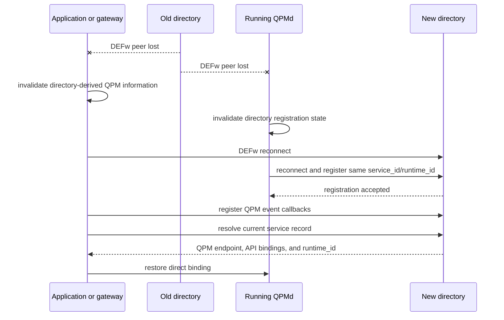
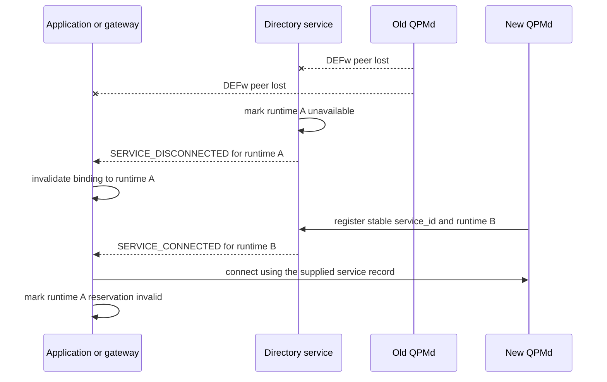

# QFw Service Lifecycle and Reconnection Model

**Status:** proposed design

## Purpose

QFw clients discover a QPMd through the DEFw directory service and then call
that QPMd directly. The directory connection and the direct QPM connection can
fail or restart independently.

This document defines the smallest recovery mechanism needed for directory and
QPMd restarts. DEFw owns transport health, callback delivery, and generic
connection handling. QFw provides the QPM-specific callback that interprets
those events.

## Supported Recovery Cases

The design handles these cases:

- A directory service restarts while QPMds and clients remain alive.
- A QPMd restarts while the directory and clients remain alive.
- A client loses its direct connection to a QPMd that remains alive.
- A service or client shuts down normally.

The same behavior applies to application-owned and site-owned services.
Ownership determines who starts and stops a process, not how it reconnects.

## Existing DEFw Mechanisms

The implementation extends mechanisms that DEFw already provides:

- C transport heartbeats and peer failure detection.
- Python `PEER_READY`, `PEER_LOST`, and `PEER_REMOVED` events.
- Automatic replacement of `defw.dirsvc` after a directory reconnects.
- `BaseEventAPI` registration and remote `put(event)` delivery.
- Directory records containing service, runtime, peer, and generation identity.
- Binding-aware connection through `connect_to_binding()`.

No second event transport or callback framework is required.

## Identities

| Identity | Owner | Lifetime | Use |
| --- | --- | --- | --- |
| `service_id` | Service deployment | Stable across QPMd restarts | Names one logical QPM service. |
| `runtime_id` | DEFw process | One process lifetime | Identifies one QPMd or directory incarnation. |
| `peer_handle` | DEFw transport | One callable transport binding | Identifies the connection affected by a transport event. |
| `generation` | Directory service | Retained record history within one directory process | Distinguishes records known to that directory. |

One QPMd process hosts one QPM service. A restarted QPMd keeps its configured
`service_id` and receives a new DEFw `runtime_id`.

Directory generations are held in memory and may reset after a directory
restart. A changed QPM `runtime_id`, rather than generation alone, proves that
the QPMd process restarted.

## Lifecycle Rules

1. The directory record is the source of the active QPM endpoint and API
   bindings.
2. Normal QPM calls use the direct QPM connection without a directory lookup.
3. DEFw notifications cause recovery; they do not route normal QPM calls.
4. A directory restart invalidates information obtained from that directory.
5. The client registers callbacks again and resolves fresh state after the
   directory reconnects.
6. A QPMd restart invalidates reservations held by the previous QPMd process.
7. A directory restart does not invalidate reservations held by a QPMd that
   remains alive.
8. A disconnect event affects a binding only when its `runtime_id` and
   `peer_handle` identify that binding.
9. DEFw does not automatically retry a state-changing RPC whose outcome is
   unknown.

## Event Contract

The directory publishes two generic service events:

| Event | Meaning |
| --- | --- |
| `SERVICE_CONNECTED` | A service registration is active and callable. |
| `SERVICE_DISCONNECTED` | The registered service is no longer callable. |

DEFw uses generic service names because the directory is not QPM-specific. A
QPM callback selects records whose `service_type` is `qfw.qpm`.

A connected event includes the active service record:

```yaml
event: SERVICE_CONNECTED
directory_runtime_id: directory-process-uuid
service_id: nwqsim
service_type: qfw.qpm
runtime_id: qpm-process-uuid
peer_handle: qpm-peer-handle
service_record:
  endpoint: {}
  api_bindings: []
  generation: 3
```

A disconnected event identifies the record that became unavailable:

```yaml
event: SERVICE_DISCONNECTED
directory_runtime_id: directory-process-uuid
service_id: nwqsim
service_type: qfw.qpm
runtime_id: qpm-process-uuid
peer_handle: qpm-peer-handle
reason: heartbeat-timeout
```

The directory process's DEFw `runtime_id` supplies
`directory_runtime_id`. A client ignores a queued callback from an older
directory after connecting to a replacement directory.

A replacement does not need its own event type. A disconnect for runtime A
followed by a connection for runtime B expresses replacement of the stable
`service_id`.

## Callback Registration

DEFw extends the directory API with the same callback pattern already used by
QPM completion events. The names below describe the required interface.

```python
registration_id = directory.register_event_notification(
    endpoint=me.my_endpoint(),
    event_type=SERVICE_CONNECTED,
    class_id=callback.class_id(),
    filters={"service_id": "nwqsim"},
)

directory.unregister_event_notification(registration_id)
```

A client registers separately for each event it needs. Registrations may use
an exact `service_id` or a `service_type` filter. QFw clients use the exact
service ID selected by their reservation whenever one is available.

The directory maintains callback lists indexed by event type. Each entry
contains only the client runtime identity, callback endpoint and class ID, and
the requested filters. The directory copies matching entries before invoking
them and does not hold its service-record lock during a remote call.

Callback dispatch is serialized in the order that the directory records
service transitions. This prevents two directory callbacks from being emitted
in reverse order. A client peer-loss event removes all callback entries owned
by that client.

## Callback Ownership

DEFw supplies `BaseEventAPI`, transports callback invocations, and stores the
directory's callback registrations. It does not interpret a callback payload
as a QPM event.

Each service family supplies its own callback implementation. QFw provides a
common QPM lifecycle callback in its public QPM client code. The natural
location in the present tree is `service-apis/api_qpm_common`, alongside
`QPMRemoteBase` and the shared QPM identity definitions.

The callback executes in the QPM client process. That process may be an
application or the QFw Slurm gateway. It does not execute in the QPMd being
monitored because a stopped QPMd cannot receive its own failure notification.

The QPM callback handles events as follows:

- A disconnect for the active runtime invalidates the direct QPM binding.
- A disconnect for an older runtime is ignored.
- A connection for the same runtime restores the direct binding and preserves
  the reservation.
- A connection for a new runtime replaces the direct binding and marks the old
  reservation invalid.
- A restored connection to the same runtime re-registers connection-scoped
  QPM callbacks, including completion events.

Backend-specific QPM implementations do not define separate lifecycle
callbacks. IQM, NWQSim, fakeIQM, TNQVM, and shim clients use the common QPM
callback.

## Responsibility Boundaries

### DEFw

DEFw owns behavior that applies to every service family:

- Heartbeat generation and timeout detection.
- Peer connection state and lifecycle events.
- Replacement of the directory proxy after a directory restart.
- Directory service registration and liveness records.
- Filtered directory callback registration and removal.
- Delivery of `SERVICE_CONNECTED` and `SERVICE_DISCONNECTED`.
- Cleanup of callbacks after a client disconnects.
- Generic connection establishment from a selected service record.
- Failure of pending RPCs when their peer disappears.

QFw consumes DEFw lifecycle state and does not run another heartbeat
mechanism.

### QFw QPM services

Common QPM service code owns behavior shared by every QPMd:

- Publishing the configured `service_id`, API bindings, and QPM metadata.
- Registering after the QPM controller and RPC listener become ready.
- Re-registering after connecting to a replacement directory.
- Preserving the process `runtime_id` across a directory reconnect.
- Starting with a new runtime ID and new in-memory reservation state after a
  QPMd process restart.
- Reporting QPM readiness and directory registration health.

### QFw QPM clients

Common QPM client code owns QPM-specific event handling:

- Creating and externally registering the QPM lifecycle callback.
- Registering it for the two directory events and the selected `service_id`.
- Invalidating or replacing the stored direct QPM proxy.
- Comparing QPM runtime identity with reservation ownership.
- Restoring completion-event registration after reconnecting to the same QPMd.
- Reporting when a replacement QPMd requires a new reservation.

Framework adapters use this common code rather than implementing their own
directory callbacks.

### QFw Slurm gateway

The gateway is a QPM client and uses the common QPM callback. Its durable
journal retains allocation and reservation records.

Before an admission operation, the gateway reads the current direct proxy from
its local QPM binding. This is an in-process operation. DEFw contacts the
directory only during initial resolution or recovery, after which the gateway
communicates directly with QPMd.

The gateway compares the active QPM `runtime_id` with the runtime stored in its
journal. A directory-generation difference with the same QPM runtime does not
invalidate a reservation.

## Initial Connection

The client uses this sequence when acquiring a QPM binding:

1. Connect to the directory service.
2. Create and externally register the common QPM callback.
3. Register that callback for connected and disconnected events for the
   selected service.
4. Resolve the current service record.
5. Connect directly to the QPM binding returned by the directory.

`BaseEventAPI` queues notifications that arrive while the initial lookup is in
progress. The QPM callback applies the resolved record and queued events under
one local binding lock. Duplicate connected or disconnected state is
idempotent.

## Directory Service Restart



The QPM `runtime_id` remains unchanged, so its reservations remain valid. The
client discards queued callbacks whose `directory_runtime_id` belongs to the
old directory.

## QPMd Restart



The client may connect to runtime B, but it cannot use a reservation issued by
runtime A. The launcher or scheduler acquires a new reservation through its
normal workflow.

## Direct Client Connection Loss

A client can lose its direct QPM connection while the QPMd remains connected
to the directory. DEFw reports the affected peer loss to the client. The QPM
callback invalidates only the matching binding, resolves the exact
`service_id`, and reconnects to the runtime reported by the directory.

If the runtime ID is unchanged, the reservation remains valid. A changed
runtime ID requires a new reservation.

## Event Ordering

Directory callback delivery is serialized, but direct peer events and
directory callbacks can still race. Runtime identity resolves that race.

For example, runtime A may disconnect and runtime B may connect before the
client processes both callbacks:

```yaml
- event: SERVICE_DISCONNECTED
  service_id: nwqsim
  runtime_id: qpm-A
- event: SERVICE_CONNECTED
  service_id: nwqsim
  runtime_id: qpm-B
```

If the connected event for runtime B is processed first, a later disconnect
for runtime A cannot invalidate B. The disconnect handler compares its
`runtime_id` and `peer_handle` with the active binding before changing state.

An event from an old `directory_runtime_id` is ignored after the directory
reconnects. This identity check removes the need for a separate revision
protocol.

## RPC Failure Rules

Connection recovery does not make every RPC safe to retry.

| Operation | Recovery behavior |
| --- | --- |
| Directory lookup | Reconnect and repeat the lookup. |
| QPM readiness or status query | Reconnect and repeat when the runtime ID is unchanged. |
| Callback registration | Register again after a directory or QPM reconnect. |
| Admission evaluation | Retry only when the evaluation contract is side-effect free. |
| Reserve, release, submit, or cancel | Report an unknown outcome unless request-ID idempotency makes repetition safe. |

## Service Health

DEFw reports transport and registration health. QFw reports whether a reachable
QPMd can accept and execute work.

A QPMd is available when:

- DEFw considers the QPM peer callable.
- Its directory record is active for its current runtime ID.
- The QPM controller and provider report ready.
- The service is not quiescing or shutting down.

A live process without an active directory registration is unavailable rather
than ready.

## Implementation Placement

| Work | Repository and location |
| --- | --- |
| Heartbeats, peer events, and pending RPC failure | Existing DEFw C transport and `python/infra/defw_workers.py` |
| Directory callback API and event-indexed callback lists | DEFw directory service and its public API |
| Callback transport | Existing DEFw `BaseEventAPI` |
| Callback cleanup and serialized delivery | DEFw directory implementation |
| QPM service registration recovery | QFw `services/util/qpm/startup.py` |
| QPM callback and binding policy | QFw `service-apis/api_qpm_common` |
| Framework integration | QFw common client code consumed by framework backends |
| Gateway integration | `qfw-slurm` using the public QFw callback and binding policy |

## Required Implementation

The work proceeds in dependency order. Each phase ends with a test gate and a
functional commit. A phase is complete only after every checkbox in that phase
has passed.

This is the first QFw release. Implementations may update their callers in the
same change and remove superseded code. They do not retain compatibility paths.

The following boundaries apply throughout the work:

- Reuse DEFw peer events and `BaseEventAPI`.
- Add only `SERVICE_CONNECTED` and `SERVICE_DISCONNECTED`.
- Keep heartbeat generation and failure detection in DEFw.
- Keep QPM event policy in QFw.
- Keep gateway journal policy in `qfw-slurm`.
- Do not add polling before normal QPM calls.
- Do not add durable directory state or a second event transport.

### Phase 0. Establish the baseline

- [x] Record the DEFw, QFw, and `qfw-slurm` commit IDs used for the work.
- [x] Run the existing focused test suites in all three repositories.
- [x] Reproduce the stale gateway binding after a directory or QPMd restart.
- [x] Save the failing command and error as the regression-test input.
- [x] Confirm that normal gateway-to-QPM calls are direct after resolution.

**Gate:** Existing tests pass, and the restart failure is reproducible without
changing service configuration.

### Phase 1. Define the DEFw directory event contract

Primary files are `python/service-apis/api_dirsvc/api_dirsvc.py`,
`python/services/svc_dirsvc/svc_dirsvc.py`, and
`tests/directory/test_directory_contract.py` in DEFw.

- [x] Add public `SERVICE_CONNECTED` and `SERVICE_DISCONNECTED` constants to
  the directory service API.
- [x] Define one payload builder or validator shared by both events.
- [x] Include `directory_runtime_id`, `service_id`, `service_type`,
  `runtime_id`, and `peer_handle` in both event payloads.
- [x] Include the active `service_record` in `SERVICE_CONNECTED`.
- [x] Include the disconnect reason in `SERVICE_DISCONNECTED`.
- [x] Populate `directory_runtime_id` from the directory process identity.
- [x] Populate service and peer identities from the directory's trusted
  record. Do not accept those identities from the subscriber.
- [x] Reject unsupported event types and filters at registration time.
- [x] Add unit tests for both payload forms and invalid registration input.

**Gate:** The public API exposes exactly two lifecycle events, and their tested
payloads match the Event Contract section.

### Phase 2. Add filtered DEFw callback delivery

The callback registry and transition handling belong in
`python/infra/defw_directory.py`. The public and remote methods remain in the
directory API and implementation named in Phase 1.

- [x] Add directory API methods to register and unregister a remote callback.
- [x] Use the existing endpoint and class-ID pattern from `BaseEventAPI`.
- [x] Return an opaque registration ID from registration.
- [x] Store the subscriber runtime identity with each registration.
- [x] Index registrations by event type.
- [x] Support exact `service_id` and `service_type` filters.
- [x] Emit `SERVICE_CONNECTED` after a service record becomes active and
  callable.
- [x] Emit `SERVICE_DISCONNECTED` when the active record is explicitly
  removed or its peer is lost.
- [x] Serialize lifecycle-event dispatch in directory transition order.
- [x] Copy matching callback entries before remote delivery.
- [x] Release the service-record lock before invoking a callback.
- [x] Remove all registrations owned by a client when its peer is lost.
- [x] Make unregistration idempotent for a registration already removed by
  peer cleanup.
- [x] Test service-ID filtering, service-type filtering, unregistration, and
  automatic subscriber cleanup.
- [x] Test that a slow callback does not hold the service-record lock.
- [x] Test ordered disconnect and reconnect delivery for one `service_id`.

**Gate:** A persistent test client receives only its selected events, and the
directory continues to answer queries while a callback is being delivered.

### Phase 3. Verify DEFw directory replacement behavior

Primary files are `python/infra/defw_workers.py`,
`python/infra/defw_peers.py`, and the DEFw peer-event tests.

- [x] Confirm that a directory peer loss clears the process-local
  `defw.dirsvc` proxy.
- [x] Confirm that `PEER_READY` installs a proxy for the replacement directory.
- [x] Confirm that the existing peer event exposes the replacement
  directory's runtime ID to registered local listeners.
- [x] Add a test that restarts the directory while a non-directory DEFw
  process remains alive.
- [x] Verify that the process receives a new directory proxy without a process
  restart.
- [x] Verify that an event carrying the old `directory_runtime_id` remains
  distinguishable after replacement.

**Gate:** A persistent DEFw process can connect to the replacement directory,
register a callback, and resolve a service through the new proxy.

### Phase 4. Add the common QFw QPM lifecycle binding

Primary code belongs in `service-apis/api_qpm_common`. Focused tests belong in
`tests/mock` and use the public binding contract rather than private state.

- [x] Place the lifecycle callback and managed QPM binding in the public
  `service-apis/api_qpm_common` package.
- [x] Keep one managed binding per selected `service_id` in a client process.
- [x] Store the directory runtime ID, QPM runtime ID, peer handle, generation,
  active service record, direct QPM proxies, and reservation-valid state.
- [x] Protect all reads and lifecycle updates to one binding with one lock.
- [x] Register the callback with DEFw before the initial directory query.
- [x] Register separately for connected and disconnected events using the
  exact selected `service_id`.
- [x] Observe directory loss and replacement through DEFw's existing
  `add_peer_event_listener()` and `remove_peer_event_listener()` functions.
- [x] On directory loss, clear the old directory callback registration and
  invalidate state derived from that directory runtime.
- [x] On directory replacement, wait for the new `defw.dirsvc` proxy through
  the existing DEFw directory accessor.
- [x] Register callbacks with the replacement directory before resolving the
  current QPM record.
- [x] Resolve the initial service record and create direct QPM API bindings
  through `connect_to_binding()`.
- [x] Ignore events from a replaced directory runtime.
- [x] Ignore a disconnect for a QPM runtime or peer that is not active.
- [x] Mark the direct binding unavailable when its active peer disconnects.
- [x] Restore the binding without invalidating its reservation when the same
  QPM runtime reconnects.
- [x] Replace the binding and invalidate the old reservation when a new QPM
  runtime registers under the same `service_id`.
- [x] Restore connection-scoped completion callback registration after a
  same-runtime reconnect.
- [x] Make repeated connected or disconnected events idempotent.
- [x] Unregister directory callbacks when the managed binding closes.
- [x] Add focused tests for initial lookup, same-runtime reconnect, QPM
  replacement, old-runtime disconnect, and old-directory events.
- [x] Add a concurrency test covering a QPM call racing with a lifecycle
  callback. The call must use one complete binding or fail as unavailable.

**Gate:** The common binding passes all lifecycle and race tests without a
directory lookup on its normal call path.

### Phase 5. Recover QPMd directory registration

Primary code is `services/util/qpm/startup.py`. Focused coverage belongs in
`tests/mock/test_qpm_startup.py`.

- [x] Extend the shared QPM startup path in
  `services/util/qpm/startup.py`.
- [x] Detect replacement of the process-local directory proxy through the
  existing DEFw peer lifecycle path.
- [x] Register the QPM service after its controller and listener report ready.
- [x] Register the same service record again after connecting to a replacement
  directory.
- [x] Preserve the QPM process `runtime_id` across directory reconnects.
- [x] Let a QPMd process restart create a new `runtime_id` and empty
  in-memory reservation state.
- [x] Prevent duplicate registration attempts for the same directory runtime.
- [x] Retry a failed registration only through the existing startup monitor.
  Do not add a second monitor or heartbeat.
- [x] Report process health and directory-registration health separately.
- [x] Exercise the shared path with IQM, NWQSim, fakeIQM, TNQVM, and shim
  QPMs. Do not add backend-specific reconnect handlers.
- [x] Test directory restart, delayed directory availability, duplicate-ready
  events, and QPM shutdown during registration.

**Gate:** Every packaged QPMd re-registers after a directory restart with the
same QPM runtime ID and no duplicate active service record.

### Phase 6. Adopt the binding in QFw clients

Primary files are `backends/qfw_qiskit/qpm_resolver.py` and the Qiskit backend
classes that retain QPM and completion-event bindings.

- [x] Update `QPMResolver` to create or return the common managed binding.
- [x] Keep the directory service as the source of service discovery.
- [x] Remove resolver-owned lifecycle state superseded by the common binding.
- [x] Update the Qiskit backend to read QPM APIs through that binding.
- [x] Route completion-event restoration through the common lifecycle code.
- [x] Return a clear unavailable error while a binding is disconnected.
- [x] Return a new-reservation-required error after the QPM runtime changes.
- [x] Verify that a directory generation change with the same QPM runtime
  preserves the reservation.
- [x] Run focused Qiskit job, resolver, completion callback, and reservation
  tests.

**Gate:** A Qiskit client survives a directory restart, preserves a
same-runtime reservation, and rejects a reservation owned by a restarted QPMd.

### Phase 7. Adopt the binding in qfw-slurm

Primary gateway files are `gateway/qfw_slurm_gateway/defw_client.py`,
`service.py`, and `journal.py` in `qfw-slurm`. Focused coverage belongs in
`tests/gateway/test_defw_client.py` and `test_service.py`.

- [x] Update the gateway's DEFw adapter to use the public QFw managed binding.
- [x] Maintain one managed binding for each QPM `service_id` selected by the
  gateway.
- [x] Remove the startup-only directory proxy and resolver state superseded by
  the managed bindings.
- [x] Register only for the service IDs the gateway has resolved.
- [x] Read the current direct proxy from the local binding before each
  admission operation.
- [x] Re-resolve through the replacement directory during recovery. Do not
  query the directory before every gateway operation.
- [x] Compare the binding's QPM `runtime_id` with the runtime ID stored in each
  durable journal reservation.
- [x] Preserve a journal reservation when only the directory generation
  changes.
- [x] Reject an old journal reservation after its QPM runtime changes.
- [x] Return a retryable unavailable result when no active QPM binding exists
  before an operation begins.
- [x] Record an unknown outcome when a state-changing RPC disconnects after
  transmission and before its response.
- [x] Do not retry reserve, release, submit, or cancel unless the operation has
  an idempotent request ID.
- [x] Keep journal reads and writes independent of directory callback locks.
- [x] Test directory restart, same-runtime QPM reconnect, QPM replacement,
  delayed old-runtime events, and stale journal reservations.
- [x] Test simultaneous gateway requests while a binding is invalidated and
  restored.

**Gate:** The gateway recovers without restarting, preserves reservations
across a directory restart, and refuses reservations from an old QPM runtime.

### Phase 8. Integrate and validate

- [x] Commit and test the DEFw changes before updating its QFw submodule
  pointer.
- [x] Build and install QFw against that exact DEFw commit.
- [x] Run the DEFw and QFw install-tree smoke tests.
- [x] Build and install `qfw-slurm` against the updated QFw installation.
- [x] Start one directory service, the Slurm gateway, and the site-owned QPMs.
- [x] Reserve and run a short NWQSim application through the gateway.
- [x] Restart only the directory service while keeping the QPMd and gateway
  alive.
- [x] Verify that the QPMd re-registers and the gateway resolves the same QPM
  runtime.
- [x] Verify that the existing reservation remains usable after directory
  recovery.
- [x] Restart the NWQSim QPMd and verify that its runtime ID changes.
- [x] Verify that the old reservation fails and a fresh reservation succeeds.
- [x] Submit concurrent gateway requests during one disconnect and reconnect
  cycle. Confirm that none use a mixed or stale binding.
- [x] Run the compatible QFw examples against the recovered NWQSim service.
- [x] Verify IQM registration recovery without submitting hardware work.
- [ ] Run one bounded real-IQM validation only when protected credentials and
  explicit hardware-test authorization are available.
- [x] Save the exact commits, commands, service identities, and test results in
  the validation report.

**Gate:** All acceptance criteria below pass in the installed Slurm cluster,
and no service process requires a manual restart after directory recovery.

### Validation Report

Validation used the `release/v0.1` branches with these lifecycle commits:

| Repository | Baseline | Validated head |
| --- | --- | --- |
| DEFw | `d775aa1` | `eb3621d` |
| QFw | `0e228aa` | `d642678` |
| qfw-slurm | `8aa3088` | `0c3694b` |

The original failure was reproduced through Slurm as a gateway directory
query against a stale DEFw peer. The reserve path failed with
`RC_RPC_FAIL` from `QPMResolver._query_directory()`. That error is the
regression input covered by the directory replacement and current-directory
binding tests.

The following automated suites passed:

- QFw and nested DEFw CTest: 16 of 16 tests.
- QFw lifecycle, startup, resolver, backend, job, lookup, and reservation
  tests: 75 passed and one intentionally skipped.
- qfw-slurm gateway tests: 62 passed and one intentionally skipped.
- qfw-slurm native CTest: eight passed and one environment-dependent system
  test intentionally skipped.

Installed-cluster recovery validation produced these results:

- Slurm job 65 retained its reservation while only the directory service was
  restarted. The NWQSim and IQM QPMds re-registered without changing runtime
  identity, the gateway recovered, and the application completed.
- Slurm job 68 retained an old NWQSim reservation while that QPMd was
  restarted. The runtime ID changed from
  `df5237b5-1ffd-42bc-b026-b654105bdcc1` to
  `43850292-331a-4c0c-bfce-463215234a2f`; use of the old reservation failed
  and its journal state became `stale-runtime`.
- Slurm job 69 acquired a fresh reservation for the replacement runtime and
  completed successfully.
- After a directory outage longer than the previous retry interval, Slurm
  jobs 79 through 82 ran concurrently on four classical nodes. All four used
  runtime `9a28524b-2329-4163-8c80-59ee43f45143`, completed successfully,
  and released reservation IDs 29 through 32.
- Slurm job 85 ran the recovered NWQSim service through qiskit-simple,
  GHZ with Qiskit, GHZ with PennyLane, PennyLane, QAOA, Qiskit VQE, and
  SupermarQ. All seven examples passed.
- IQM registration recovery was verified without submitting hardware work.

The bounded real-IQM item remains unchecked because this lifecycle change did
not receive explicit authorization to submit another hardware job. No
protected credential file was changed.

## Acceptance Criteria

1. Restarting the directory causes clients to invalidate directory-derived
   data, reconnect, register callbacks, and resolve fresh records.
2. Every running QPMd re-registers after the directory restarts without
   changing its runtime ID.
3. Restarting a QPMd produces a disconnect for the old runtime and a connection
   for the new runtime.
4. A delayed old-runtime disconnect cannot invalidate the replacement QPMd.
5. A same-runtime client reconnection preserves the reservation and restores
   completion callbacks.
6. A changed QPM runtime causes old reservation use to fail.
7. Normal QPM calls remain direct and do not query the directory first.
8. Callback filtering delivers events only to clients that registered interest
   in the affected service.

## Non-Goals

This design does not add a new event framework, a catalog revision protocol, or
durable directory state. It does not make arbitrary QPM RPCs exactly once,
restore reservation state after a QPMd restart, or provide atomic scheduling
across Slurm and QPMd.
