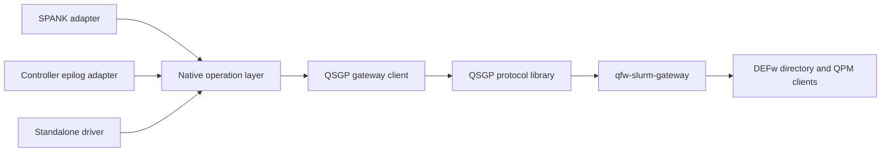
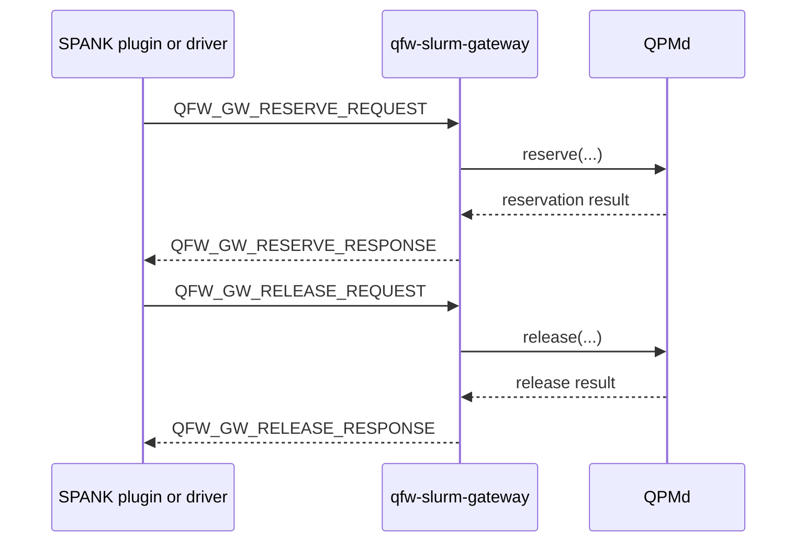
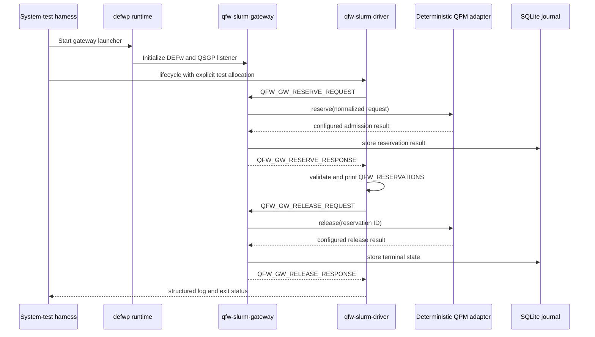

# Slurm Plugin Driver Refactor Detailed Design

**Status:** draft

## Table of Contents

- [Purpose and Scope](#purpose-and-scope)
- [Existing Code Boundary](#existing-code-boundary)
- [Target Module Boundaries](#target-module-boundaries)
- [Synchronous Gateway Operations](#synchronous-gateway-operations)
- [Native Client Interface](#native-client-interface)
- [Shared Response Interpretation](#shared-response-interpretation)
- [SPANK Adapter](#spank-adapter)
- [Controller Epilog Adapter](#controller-epilog-adapter)
- [Standalone Driver](#standalone-driver)
- [Driver Commands and Output](#driver-commands-and-output)
- [Gateway Test Mode](#gateway-test-mode)
- [System Test Design](#system-test-design)
- [Failure and Security Behavior](#failure-and-security-behavior)
- [Build and Packaging](#build-and-packaging)
- [Implementation Order](#implementation-order)
  - [First-Release Compatibility Policy](#first-release-compatibility-policy)
  - [Step 0: Establish the Baseline](#step-0-establish-the-baseline)
  - [Step 1: Correct Native Source Ownership](#step-1-correct-native-source-ownership)
  - [Step 2: Introduce the Gateway Client Interface](#step-2-introduce-the-gateway-client-interface)
  - [Step 3: Extract Shared Operation Processing](#step-3-extract-shared-operation-processing)
  - [Step 4: Migrate the SPANK Adapter](#step-4-migrate-the-spank-adapter)
  - [Step 5: Migrate the Controller Epilog](#step-5-migrate-the-controller-epilog)
  - [Step 6: Add the Standalone Driver](#step-6-add-the-standalone-driver)
  - [Step 7: Add Deterministic Gateway Test Support](#step-7-add-deterministic-gateway-test-support)
  - [Step 8: Add the Driver-to-Gateway System Test](#step-8-add-the-driver-to-gateway-system-test)
  - [Step 9: Validate a Real DEFw and NWQSim Path](#step-9-validate-a-real-defw-and-nwqsim-path)
  - [Step 10: Validate SPANK Adapter Parity](#step-10-validate-spank-adapter-parity)
  - [Step 11: Complete Packaging and Documentation](#step-11-complete-packaging-and-documentation)
- [Acceptance Criteria](#acceptance-criteria)

**Status:** draft

## Purpose and Scope

This refactor makes the Slurm integration's gateway operations reusable
outside a SPANK callback. The SPANK plugin, controller epilog, and a new
standalone diagnostic driver will share one native client and lifecycle
implementation. Each frontend will retain only the behavior owned by its
runtime environment.

The standalone driver provides a visible and repeatable system-test path. It
constructs the same typed requests, calls the same synchronous gateway APIs,
and applies the same response validation as the deployed plugin. It reports
what the plugin would do instead of requiring a fabricated `spank_t` or
starting an application task.

The refactor retains the intended synchronous QSGP version 1 operations,
gateway journal role, QPM admission behavior, and Slurm allocation lifecycle.
It introduces no Slurm dependency into the QSGP or native operation libraries.
The implementation sequence allows an existing pre-release detail to be
corrected in place when that produces a cleaner final contract.

**Status:** draft

## Existing Code Boundary

The repository already separates wire processing from Slurm. The `qsgp`
library owns bounded encoding, decoding, TCP I/O, deadlines, and MUNGE. The
`qfw_slurm_native` library owns configuration parsing, option parsing, request
construction, environment formatting, and the synchronous gateway exchange.
Neither library links to libslurm.

The remaining coupling is above that boundary. `spank_quantum.c` reads trusted
Slurm metadata, constructs the reservation request, interprets admission
results, formats `QFW_RESERVATIONS`, and selects the callback result. The
controller epilog independently constructs release requests and interprets
release results. A diagnostic driver built directly on the present API would
need to duplicate some of those decisions.

The source layout also obscures ownership because reusable option,
configuration, transaction, and environment sources reside under
`src/plugin/` even though they are compiled into the Slurm-independent native
library. The refactor moves reusable code under a native client or lifecycle
directory. Only code that includes Slurm headers remains under `src/plugin/`
and `src/epilog/`.

**Status:** draft

## Target Module Boundaries

The target dependency direction is shown below.



The modules own these responsibilities.

| Module | Responsibilities | Forbidden dependencies |
| --- | --- | --- |
| QSGP protocol | Wire types, encoding, decoding, framing, deadlines, MUNGE | Slurm, DEFw, Python |
| QSGP gateway client | Synchronous request and response exchange, correlation validation, gateway identity validation | SPANK callbacks, libslurm, DEFw |
| Native operation layer | Request construction, response validation, canonical reservation formatting, release-result classification | `spank_t`, Slurm logging, environment mutation |
| SPANK adapter | Read trusted Slurm state, register options, call the operation layer, update the job environment, allow or deny launch | Wire encoding details, gateway journal logic |
| Controller epilog adapter | Read authoritative completion identity, call shared release, emit controller diagnostics | Wire encoding details, QPM calls |
| Standalone driver | Parse explicit diagnostic inputs, call the operation layer, print structured results | SPANK APIs, fabricated Slurm handles |
| Gateway | Authenticate and verify requests, journal operations, resolve QPMs through DEFw, call QPM admission APIs | SPANK APIs |

The SPANK plugin and standalone driver consume the same public native headers.
No driver-only branch is added to the production plugin.

**Status:** draft

## Synchronous Gateway Operations

Reserve and release remain synchronous QSGP operations. A response is returned
on the same authenticated TCP connection as its request. There is no separate
request that fetches a reserve or release response.



The gateway journals requests and results for idempotency and recovery. If a
caller loses a response, it repeats the same operation with the same request
identity. The gateway returns the stored result when the request fingerprint
matches. Journal storage does not turn the protocol into an asynchronous
submit-and-poll interface.

**Status:** draft

## Native Client Interface

The public native client exposes one typed function for each QSGP operation.
The operation name identifies the request and expected normal response. A
bounded error output carries local client detail or a decoded common gateway
error response.

```c
int qfw_gateway_reserve(
    const struct qfw_gateway_client *client,
    const struct qsgp_reserve_request *request,
    struct qsgp_reserve_response *response,
    struct qfw_gateway_call_error *error);

int qfw_gateway_release(
    const struct qfw_gateway_client *client,
    const struct qsgp_release_request *request,
    struct qsgp_release_response *response,
    struct qfw_gateway_call_error *error);
```

The client object contains validated endpoint configuration, timeouts, message
limits, and the expected MUNGE identity. Initialization and destruction are
explicit. The client does not contain Slurm handles or application state.

Each function encodes the request, creates a MUNGE credential, connects to the
gateway, sends one frame, waits within one absolute operation deadline,
authenticates the response, validates correlation and message type, decodes the
typed response, and closes the connection. A zero return means that the normal
typed response was decoded. Admission acceptance remains a field in the reserve
response rather than being represented by the C return value.

QSGP permits a common error response in place of a normal operation response.
A nonzero return leaves the normal response unusable and fills the error output
when bounded detail is available. The error identifies its local, transport,
protocol, authentication, or remote gateway source. A remote gateway error
preserves its code and diagnostic without becoming an admission rejection. The
API remains reentrant and uses no process-global or client-global `last_error`
state.

**Status:** draft

## Shared Response Interpretation

Response interpretation belongs to the native operation layer so every
frontend applies the same rules. Reserve processing checks transport and
protocol status, distinguishes a gateway error from an admission decision,
requires an accepted top-level decision, validates every accepted service
result, rejects missing or duplicate service IDs, requires nonzero reservation
IDs, and emits canonical `QFW_RESERVATIONS` JSON ordered by service ID.

Release processing validates the response request identity and classifies each
service result as terminal or unresolved. It visits every result even when an
earlier result reports a failure. The operation result contains bounded
diagnostics that the frontend can log.

A neutral result structure carries both machine-readable state and formatted
output. Conceptually, reserve returns this information.

```c
struct qfw_reserve_operation_result {
    enum qfw_operation_state state;
    struct qsgp_reserve_response response;
    struct qsgp_error_response gateway_error;
    char reservations_json[QFW_RESERVATIONS_ENV_SIZE];
};
```

The exact structure may use a tagged union to avoid storing both response
forms. It contains no `spank_t`, Slurm return code, logger callback, or direct
environment mutation. The SPANK adapter and driver consume the same validated
result.

**Status:** draft

## SPANK Adapter

The SPANK adapter remains a thin Slurm integration. It registers the command
options, obtains job ID, UID, GID, allocation epoch, walltime, cluster name,
and heterogeneous-allocation metadata from trusted Slurm interfaces. It maps
that metadata into the neutral allocation context used by the operation layer.

On reserve acceptance, the adapter writes the already validated JSON through
`spank_setenv()` as `QFW_RESERVATIONS`. A transport failure, gateway error,
delayed decision, rejected decision, or malformed accepted result marks the
launch as failed. The callback sequence then returns the Slurm status needed
to deny task launch without marking a healthy node as failed.

The adapter does not encode QSGP frames, inspect raw TLVs, duplicate service
result validation, or format reservation JSON. It converts shared operation
outcomes into Slurm logging, environment updates, and callback return values.

**Status:** draft

## Controller Epilog Adapter

The controller epilog obtains the completed allocation's canonical identity
from Slurm and constructs the neutral release context. It calls the same shared
release operation used by the driver.

The epilog logs every unresolved service result and returns according to the
existing controller-cleanup policy. It does not reimplement QSGP exchange,
response correlation, or per-result classification. Release failures remain
in the gateway journal for operator retry. No Slurm job structure needs to be
updated because allocation termination is already in progress.

**Status:** draft

## Standalone Driver

The new `qfw-slurm-driver` is a native executable linked to the same operation
and QSGP client libraries as the plugin. It does not link to libslurm and does
not load `spank_quantum.so`. Command-line arguments supply the allocation and
workload values that Slurm normally provides to the plugin.

The driver exists for diagnostics and system testing. It shows the request,
transport result, gateway response, normalized admission outcome, service
results, and the environment value that the plugin would install. For release,
it shows every terminal and unresolved reservation result.

The driver never claims to validate SPANK callback placement, option
propagation between Slurm contexts, or `spank_setenv()`. Those behaviors still
require an actual `salloc`, `sbatch`, or `srun` test. The driver validates the
shared request-to-gateway path without a fabricated `spank_t`.

**Status:** draft

## Driver Commands and Output

The driver provides three commands.

| Command | Behavior |
| --- | --- |
| `reserve` | Build and send one reserve request, validate its response, print the result, and exit without releasing it. |
| `release` | Build and send one release request for the allocation identity, print all release results, and exit. |
| `lifecycle` | Send reserve, display the result, optionally wait at a controlled hold point, send release, and display the final result. |

A representative invocation is shown below.

```bash
qfw-slurm-driver lifecycle \
    --config /etc/qfw-slurm/plugin.conf \
    --cluster qfw-slurm \
    --job-id 123 \
    --uid 1001 \
    --gid 1001 \
    --allocation-epoch 1788000000 \
    --walltime-seconds 900 \
    --qpu nwqsim \
    --workload-kind quantum \
    --circ-count 2 \
    --max-qubits 5 \
    --max-depth 100 \
    --max-shots 1024
```

Human-readable output is the default. `--json` emits one bounded record per
state transition for automated tests. Successful reserve output includes a
copyable line such as the following.

```text
export QFW_RESERVATIONS='[["nwqsim-site","41"]]'
```

Exit status zero means the requested command reached its expected terminal
state. Distinct nonzero statuses identify command validation, transport,
authentication, gateway, admission, response-validation, and release failures.
The driver never prints MUNGE credentials, provider credentials, or arbitrary
Python exceptions.

**Status:** draft

## Gateway Test Mode

Two gateway configurations support complementary system tests. Production
verification remains the default. In that mode, the driver supplies a real
active Slurm job identity and the gateway verifies it through `slurmctld`
before calling QPMd. This tests the native path while bypassing only the SPANK
callback host.

A deterministic test configuration may select a test-only verifier and QPM
adapter. The gateway still starts through `defwp`, initializes its DEFw
runtime, accepts MUNGE-protected QSGP traffic, exercises its server and journal,
and returns fixed accepted, delayed, rejected, gateway-error, and release
results. The selected response is controlled by protected test configuration,
not by untrusted request fields.

Test mode is unavailable in the installed production gateway configuration.
Enabling it requires a build-time test option or a separately installed test
entry point, a configuration value that production parsing rejects, and an
explicit loopback or isolated-test listener. Startup logs identify the active
verifier and adapter. The systemd production unit cannot enable the test
adapter through an environment variable inherited from a user shell.

**Status:** draft

## System Test Design

The first system test exercises the complete native operation path without a
SPANK host. Its topology is shown below.



The deterministic gateway suite covers accepted reserve and release, delayed
and rejected reserve, QPM operation failure, malformed QPM result, QPM timeout,
repeated reserve idempotency, lost-response retry, and an unresolved release
followed by retry. The gateway converts malformed QPM results into normal QSGP
gateway errors. It never emits a deliberately malformed QSGP frame. Protocol
faults such as a wrong response type or correlation ID remain client-library
tests against a dedicated fault server.

A second system test starts the gateway through `defwp`, uses a real active
Slurm job for verification, resolves a long-running NWQSim QPM through the
directory service, and runs the driver lifecycle command. This proves the
complete path through DEFw and QPMd without loading SPANK.

A final integration test loads `spank_quantum.so` through Slurm and compares
its exported `QFW_RESERVATIONS` with driver output for the same allocation and
stored reservation set. It also confirms that Slurm denies launch on gateway
and admission failures. This test covers the thin adapter that the standalone
driver cannot exercise.

**Status:** draft

## Failure and Security Behavior

The driver uses the same root-owned endpoint and resource mapping as the
plugin. File ownership and mode validation remain identical. MUNGE authenticates
every request and response. The gateway applies its configured identity and
job-verification policy regardless of whether the caller is the plugin or
driver.

Explicit driver metadata is diagnostic input, not trusted production identity.
A production-configured gateway accepts it only when authoritative Slurm state
confirms the cluster, job, UID, GID, allocation state, and requested resources.
The deterministic adapter is confined to the isolated test configuration.

All calls use one absolute deadline. A timeout returns an unknown transport
outcome and preserves the stable request identity for retry. The driver reports
that state distinctly from admission rejection. Structured output bounds every
string and redacts MUNGE payloads, provider secrets, QPU credentials, and
application data.

**Status:** draft

## Build and Packaging

The build produces separate native targets for the protocol library, gateway
client and operation library, SPANK module, controller epilog, and standalone
driver. Building the driver and native tests requires MUNGE but does not require
Slurm headers or libslurm.

```bash
cmake -S . -B build-driver \
    -DQFW_SLURM_BUILD_PLUGIN=OFF \
    -DQFW_SLURM_BUILD_DRIVER=ON
cmake --build build-driver
```

The installed driver belongs in the normal binary directory. The protocol and
operation libraries may remain private static libraries. Public headers needed
by the repository's frontends live under an internal include namespace and are
not presented as a stable application API. Production packages may omit the
deterministic gateway adapter while retaining the driver for operations against
a real gateway.

**Status:** draft

## Implementation Order

The refactor is divided into ordered gates. Each step begins only after the
previous step passes its stated checks. Source movement, API introduction,
adapter migration, and new behavior remain separate so a failure can be tied
to one change.

All implementation changes belong to the `qfw-slurm` repository. Cluster
deployment is a validation activity unless a separate change authorizes edits
to the Slurm-cluster repository. QFw and DEFw provide the installed runtime
used by the gateway and are not modified by this refactor.

Each step is one functional commit unless its section explicitly identifies a
smaller boundary. A correction found before publication is folded into the
commit that introduced the affected behavior. Intermediate adapters may keep a
commit buildable while callers move, but no superseded API or path remains in
the final commit range.

**Status:** draft

### First-Release Compatibility Policy

This work targets the first public qfw-slurm release. There is no released
plugin ABI, native client API, QSGP deployment, configuration format, driver
interface, or gateway journal schema that requires backward compatibility. The
implementation defines one final supported contract.

Superseded pre-release code is removed when its callers migrate. The final tree
does not retain compatibility wrappers, deprecated aliases, duplicate command
paths, fallback configuration names, dual protocol decoders, copy-then-delete
installation logic, or tests whose only purpose is preserving an abandoned
interface. Development journals may be recreated rather than migrated from a
pre-release schema.

QSGP version 1 remains the design target, but its present implementation is not
a compatibility constraint. If the refactor exposes a protocol defect or an
unnecessary field, version 1 is corrected in place before release. The C and
Python implementations, field registry, golden vectors, tests, and design
documents change together. The code does not introduce a version 2 message or
an old-version fallback merely to preserve an unreleased behavior.

The baseline tests protect intended behavior and detect accidental regression.
They do not grant compatibility status to the current source layout or API. A
temporary bridge may exist within the local implementation sequence so each
commit builds, but the bridge is removed in the same unpublished series after
the final caller migrates.

**Status:** draft

### Step 0: Establish the Baseline

Capture a known-good baseline before moving code. Record the qfw-slurm commit,
compiler, CMake version, Slurm version, MUNGE version, Python version, and test
commands used by the development environment. Save the existing QSGP golden
vectors and C/Python interoperability fixtures as comparison evidence. They may
change deliberately under the first-release policy, but never accidentally.

Run both supported build shapes. The full build includes the plugin and epilog.
The native-only build sets `QFW_SLURM_BUILD_PLUGIN=OFF` and proves that reusable
code does not require Slurm headers or libslurm. Run CTest and the gateway
Python suite from clean build directories.

Inventory every function in `qfw_slurm_native.h` and record its callers. Mark
which functions belong to configuration, option parsing, request construction,
wire exchange, response validation, or Slurm adaptation. Search reusable
sources for `spank_`, `slurm_`, and Slurm headers. Any match must be explained
or moved behind the adapter boundary.

**Exit gate**

- Both build shapes succeed.
- Existing C, protocol-interoperability, and gateway tests pass.
- No unplanned source or wire behavior has changed.
- The baseline results are saved with the implementation notes.

This step creates no implementation commit unless the baseline exposes a
separate pre-existing defect that must be resolved first.

**Status:** draft

### Step 1: Correct Native Source Ownership

Move reusable sources from `src/plugin/` into an ownership-neutral native
directory. Configuration parsing, quantum-option parsing, request construction,
and reservation JSON formatting are reusable. `spank_quantum.c` remains under
`src/plugin/` because it owns callbacks and `spank_t`. Slurm job inspection
remains in the adapter as well.

Split the CMake targets by dependency. `qsgp` continues to own protocol and
MUNGE code. A native client target owns gateway configuration and synchronous
exchange. A native operation target owns workload parsing, neutral request
construction, response checks, and formatting. Only the SPANK module and
controller epilog link libslurm.

Update includes and unit-test target links without renaming public functions or
changing their behavior. Do not combine this move with the new client object,
new driver, or gateway changes.

**Focused checks**

- Build with the plugin enabled and disabled.
- Run the existing native tests before adding new assertions.
- Use `nm` or linker output to confirm that native targets contain no unresolved
  Slurm symbols.
- Search the native directories for Slurm headers and callback names.

**Exit gate and commit**

The existing plugin, epilog, protocol tests, and gateway tests behave exactly
as they did at the baseline. Commit the ownership-only change as the native
source-layout refactor.

**Status:** draft

### Step 2: Introduce the Gateway Client Interface

Introduce `struct qfw_gateway_client` as the validated connection contract. A
constructor copies endpoint, timeout, message-size, and expected MUNGE identity
settings from the protected configuration. Destruction releases client-owned
resources. The object contains no Slurm handle, job metadata, reservation state,
or process-global error storage.

Implement one synchronous client function for reserve and one for release. The
core parameters remain the client, typed request, and typed normal response. A
fourth bounded error output is required because QSGP can return
`QFW_GW_ERROR_RESPONSE` instead of the normal operation response. This output
preserves the gateway error code and diagnostic while keeping gateway errors
separate from admission decisions.

```c
int qfw_gateway_reserve(
    const struct qfw_gateway_client *client,
    const struct qsgp_reserve_request *request,
    struct qsgp_reserve_response *response,
    struct qfw_gateway_call_error *error);

int qfw_gateway_release(
    const struct qfw_gateway_client *client,
    const struct qsgp_release_request *request,
    struct qsgp_release_response *response,
    struct qfw_gateway_call_error *error);
```

The return status identifies local validation, deadline, socket, MUNGE, framing,
authentication, correlation, response-type, and remote gateway failures. A zero
return means that the normal typed response is valid. A nonzero return leaves
the normal response unusable and fills the error output when detail exists.
The functions use one absolute deadline across connect, send, receive, MUNGE,
and decode.

Use the existing QSGP message codes and field model unless this step identifies
a defect in the final contract. Any deliberate wire correction updates the C
and Python implementations, registry, golden vectors, and tests together. Do
not add a legacy decoder or a new protocol version for unreleased behavior.
Remove the old generic result union after every caller migrates.

**Focused checks**

- Cover successful reserve and release exchanges with a local QSGP test server.
- Cover each local failure class and a decoded gateway error response.
- Verify wrong MUNGE identity, correlation ID, and response type failures.
- Verify timeout behavior and complete cleanup of sockets and allocated frames.
- Run the C/Python golden-vector interoperability suite against the final wire.

**Exit gate and commit**

The typed APIs pass without Slurm libraries, preserve structured gateway errors,
and define one final QSGP version 1 wire contract. Commit the client API and its
focused tests.

**Status:** draft

### Step 3: Extract Shared Operation Processing

Define neutral allocation and operation structures that contain only values
needed to build QSGP requests. The allocation context carries cluster name,
canonical job ID, allocation epoch, UID, GID, finite walltime, and optional
heterogeneous metadata. Quantum options and protected resource mappings remain
separate inputs.

Add a reserve operation that validates its inputs, derives the stable request
ID, builds the typed request, calls `qfw_gateway_reserve()`, validates the
normal response, and generates canonical `QFW_RESERVATIONS` JSON. Add a release
operation that derives the release request identity, calls
`qfw_gateway_release()`, validates correlation, and classifies every per-service
release result.

The result types expose machine-readable state, the decoded QSGP response or
gateway error, bounded diagnostics, and formatted reservation JSON. They do not
perform logging, mutate an environment, return Slurm status codes, or terminate
a process. Both plugin adapters and the standalone driver consume these result
types.

Reserve validation requires the expected request ID, an accepted top-level
decision, a complete nonempty service set, accepted per-service decisions,
unique nonempty service IDs, and nonzero reservation IDs. Release validation
visits every result and reports all unresolved entries.

**Focused checks**

- Test stable request IDs at zero, maximum, heterogeneous, and ordinary values.
- Test accepted, delayed, rejected, and gateway-error reserve outcomes.
- Reject partial, duplicate, missing-ID, zero-ID, and mismatched responses.
- Verify deterministic service ordering and the complete `uint64_t` decimal
  range in JSON.
- Test mixed terminal and unresolved release results without early exit.

**Exit gate and commit**

No frontend duplicates admission checks, reservation formatting, or release
classification. Commit the operation layer and its unit tests.

**Status:** draft

### Step 4: Migrate the SPANK Adapter

Refactor `spank_quantum.c` into a Slurm-only adapter. Preserve option
registration and callback placement. The adapter reads trusted job ID, UID,
GID, cluster, submit epoch, finite walltime, and heterogeneous metadata through
SPANK and libslurm. It converts those values into the neutral allocation
context and invokes the shared reserve operation.

An accepted operation causes the adapter to pass the preformatted value to
`spank_setenv(spank, "QFW_RESERVATIONS", value, 1)`. A local client failure,
gateway error, delayed decision, rejected decision, malformed response, or
environment failure enters the existing deferred launch-failure path.
`slurm_spank_task_init()` then denies task launch.

Remove response parsing, raw QSGP exchange, service-result validation, and JSON
construction from the callback source. Slurm logs translate the shared result
without exposing credentials or raw frames.

**Focused checks**

- Use adapter-level mocks only for SPANK item retrieval, environment updates,
  and Slurm job lookup.
- Verify the allocation context produced from ordinary and heterogeneous jobs.
- Verify one environment write on acceptance and none on every failure path.
- Verify that plugin callbacks call the shared operation exactly once.
- Build against the target Slurm headers with warnings treated as errors.

**Exit gate and commit**

The plugin contains only Slurm adaptation and produces the same successful and
failed launch behavior. Commit the SPANK migration and adapter tests.

**Status:** draft

### Step 5: Migrate the Controller Epilog

Refactor `qfw-slurm-epilog` to collect only the cluster name and canonical
completed allocation ID through libslurm. It builds the neutral release context
and calls the shared release operation.

The adapter logs each unresolved service with its service ID, reservation ID,
state, error code, and bounded diagnostic. It preserves the controller policy
of allowing Slurm cleanup to finish after recording an unsuccessful QPM
release. The gateway journal retains unresolved rows for administrative retry.

Remove socket exchange, response-type checks, correlation checks, and release
classification from the epilog source. Keep job canonicalization and Slurm
logging in the adapter. Once the epilog is the final migrated caller, delete the
old exchange API, generic result union, compatibility declarations, and tests
that exercise only that superseded path.

**Focused checks**

- Verify ordinary and heterogeneous job canonicalization.
- Verify that mixed release results log every unresolved item.
- Verify gateway-unavailable and malformed-response diagnostics.
- Verify the documented controller exit policy for every result class.
- Confirm that the final native symbols expose only the selected client and
  operation APIs.

**Exit gate and commit**

The epilog contains only Slurm metadata and policy translation while using the
same release operation as the future driver. No superseded client API remains.
Commit the epilog migration, old-path removal, and focused tests.

**Status:** draft

### Step 6: Add the Standalone Driver

Add `qfw-slurm-driver` as a native executable that links the client and
operation targets but not libslurm. Implement `reserve`, `release`, and
`lifecycle` subcommands. Reuse the production plugin configuration parser and
quantum-option parser.

The driver accepts explicit cluster, job, UID, GID, allocation epoch, walltime,
heterogeneous metadata, resource names, and workload bounds. Required fields
match the values normally obtained from Slurm. The driver must not invent
default job identity. Production gateway verification will reject values that
do not describe an active job.

`reserve` prints the request summary, operation status, decoded decision, each
service result, and the exact export line. `release` prints every release
result. `lifecycle` reserves, optionally waits at a signal-safe hold point, and
releases from one process. SIGINT and SIGTERM trigger one bounded release
attempt after an accepted reserve.

Add `--json` for automated tests. JSON records use a versioned schema and one
record per transition. Human and JSON output exclude MUNGE credentials, QPU
credentials, raw frames, and arbitrary gateway exceptions. Define stable exit
codes for argument, transport, authentication, gateway, admission, response,
and release failures.

**Focused checks**

- Test every subcommand and required-argument combination.
- Compare driver-built requests byte-for-byte with operation-layer fixtures.
- Verify human output, JSON schema, export quoting, and exit codes.
- Verify signal cleanup and the no-release path after failed reserve.
- Build and run the driver with plugin construction disabled.

**Exit gate and commit**

The driver exercises production operation code without Slurm symbols or a
fabricated `spank_t`. Commit the executable, CLI tests, and man page or command
reference together.

**Status:** draft

### Step 7: Add Deterministic Gateway Test Support

Create explicit test seams at the gateway's existing verifier and QPM adapter
boundaries. The deterministic verifier accepts only identities provided by the
test harness. The deterministic QPM adapter returns configured accepted,
delayed, rejected, QPM-operation-failure, malformed-QPM-result, timeout, and
release outcomes. The gateway maps these outcomes through its production result
validation. It never emits a deliberately malformed QSGP response.

Place both implementations in test-only package paths. A dedicated test entry
point or build option registers them. The production gateway parser rejects
their configuration names, and the production systemd unit cannot select them
through ambient environment variables. Bind the test listener to loopback or an
isolated container network and use a temporary SQLite journal. The test adapter
never reads production device-access or credential files.

The gateway still starts through `qfw-slurm-gateway-launch` and `defwp`. It
initializes the DEFw runtime before accepting QSGP connections. This preserves
the deployed process shape even when deterministic responses avoid a real QPM.

**Focused checks**

- Prove that production configuration rejects both test implementations.
- Prove that request fields cannot select a deterministic outcome.
- Test every configured deterministic response through the gateway service.
- Verify malformed QPM output becomes a structured gateway error.
- Verify startup logs identify test mode and contain no secrets.
- Verify temporary journals and listeners are removed during test cleanup.

**Exit gate and commit**

Deterministic behavior is available only to the isolated test harness and the
production gateway path remains fail-closed. Commit the test adapters, guards,
and gateway tests.

**Status:** draft

### Step 8: Add the Driver-to-Gateway System Test

Add a system-test harness that creates an isolated working directory, starts
MUNGE test support when the environment requires it, writes protected plugin
and gateway test configuration, starts the gateway through `defwp`, and waits
for explicit readiness. The driver runs as a separate process and communicates
only through the QSGP listener.

Run a complete accepted lifecycle and verify the reserve request, stored journal
state, driver export output, release request, terminal journal state, and
process exit codes. Add independent cases for delayed and rejected admission,
QPM operation failure, malformed QPM result, QPM deadline expiry, lost-response
retry, duplicate request replay, and unresolved release followed by retry. Use
the Step 2 fault server, not the production gateway, for malformed QSGP frames,
wrong response types, and correlation mismatches.

The harness installs cleanup traps before starting services. Cleanup stops the
driver, gateway, and DEFw process, closes the listener, and removes only its
temporary directory. A failed assertion still performs cleanup. Each case has a
bounded timeout so CI cannot hang.

**Exit gate and commit**

The driver-to-gateway path passes under `defwp`, exercises the SQLite journal,
and reports actionable logs for every gateway and QPM failure class. Commit the
harness and system cases. Do not claim SPANK coverage from this suite.

**Status:** draft

### Step 9: Validate a Real DEFw and NWQSim Path

Deploy the refactored gateway and driver into the Slurm development container
without enabling the SPANK plugin for this test. Start the site directory
service and one long-running NWQSim QPM. Confirm that the QPM registration has
the expected stable service ID and a live runtime identity.

Create a real bounded Slurm allocation to give the production gateway verifier
a valid job record. Run the driver with the allocation's exact cluster, job ID,
UID, GID, submit epoch, walltime, service mapping, and workload envelope. The
request must pass gateway Slurm verification, directory resolution, QPM
reservation, qhw-admission, journal storage, QPM release, and journal
termination.

Record the QFw, DEFw, qfw-slurm, and cluster commits; service runtime ID and
generation; driver JSON; gateway log; QPM log; reservation ID; and cleanup
status. Verify that no provider credential or MUNGE payload appears in the
artifacts.

**Exit gate**

One driver lifecycle reaches the real directory service and NWQSim QPM, then
leaves no active reservation or leaked process. Fixes stay within qfw-slurm and
are folded into the commit that introduced the defect. Cluster source changes
require separate authorization.

**Status:** draft

### Step 10: Validate SPANK Adapter Parity

Enable the built SPANK module and controller epilog in the development cluster.
Use one active allocation and one service set to compare the thin adapter with
the driver without creating two reservations.

Run `qfw-slurm-driver reserve` for the active allocation. Then start a managed
`srun` step with the same `--qpu` selection and the retrieval form that omits
the workload envelope. The plugin sends the idempotent reserve operation,
receives the existing tuple set, and exports `QFW_RESERVATIONS`. Compare that
value byte-for-byte with the driver's export output. Verify that QPMd allocated
the service only once.

End the allocation and confirm that the controller epilog calls the shared
release operation, the gateway marks every row terminal, and QPMd observes one
release. Repeat focused cases for gateway unavailability, admission rejection,
and malformed accepted results to prove that the adapter denies task launch.

**Exit gate**

Driver and plugin produce the same canonical tuple set from the same shared
operation code. Slurm-specific environment mutation, launch denial, and
controller cleanup pass under real callbacks.

**Status:** draft

### Step 11: Complete Packaging and Documentation

Install `qfw-slurm-driver` with the native artifacts and keep its reusable
libraries private unless another repository contract requires them. Verify that
the driver-only package does not depend on libslurm and that the plugin package
is built against the target Slurm ABI. Production packages exclude
deterministic gateway adapters.

Update the repository README, command reference or man page, sample test
configuration, and operator recovery instructions. Document the distinction
between driver system testing and SPANK integration testing. Include exact
commands for deterministic lifecycle, real active-job lifecycle, journal
inspection, unresolved-release retry, and final Slurm validation. Document only
the final commands, configuration names, APIs, and installed layout.

Run the full release build with warnings as errors, native-only build, CTest,
Python gateway tests, deterministic system suite, real NWQSim lifecycle, and
SPANK parity suite. Inspect installed files and runtime dependencies. Run a
final search that confirms Slurm symbols appear only in plugin and epilog
adapters. Search for `deprecated`, `legacy`, `compat`, retired symbol names,
and old configuration keys. Remove every pre-release compatibility path rather
than documenting it.

**Exit gate and commit**

Every acceptance criterion is supported by a recorded test result. Commit
packaging and documentation, then review the complete commit range for wire
changes, duplicated lifecycle logic, compatibility residue, test-only
production paths, leaked credentials, and out-of-scope repository
modifications.

**Status:** draft

## Acceptance Criteria

The refactor is complete when all conditions below hold.

- QSGP, the gateway client, the operation layer, and driver build without Slurm
  headers or libslurm.
- The SPANK module and controller epilog contain only Slurm-specific metadata,
  logging, environment, and callback behavior.
- The plugin, epilog, and driver call the same typed reserve and release APIs.
- Shared code validates gateway errors, admission outcomes, service results,
  reservation IDs, response correlation, and release states.
- The driver prints the exact `QFW_RESERVATIONS` value that the plugin would
  export.
- The deterministic system suite runs the gateway through `defwp` and covers
  successful and failed reserve and release paths.
- A real NWQSim driver lifecycle reaches the directory service and QPMd.
- A Slurm integration test proves that the thin SPANK adapter exports the same
  accepted tuple set and denies the same failed request.
- Test-only verification and QPM adapters cannot be selected by the production
  gateway unit or untrusted request input.
- No test fabricates `spank_t`, duplicates QSGP encoding, or adds a second
  implementation of reservation decision rules.
- The final source, configuration, installation, tests, and documentation expose
  one supported first-release workflow with no deprecated or compatibility
  path retained for pre-release behavior.

**Status:** draft
