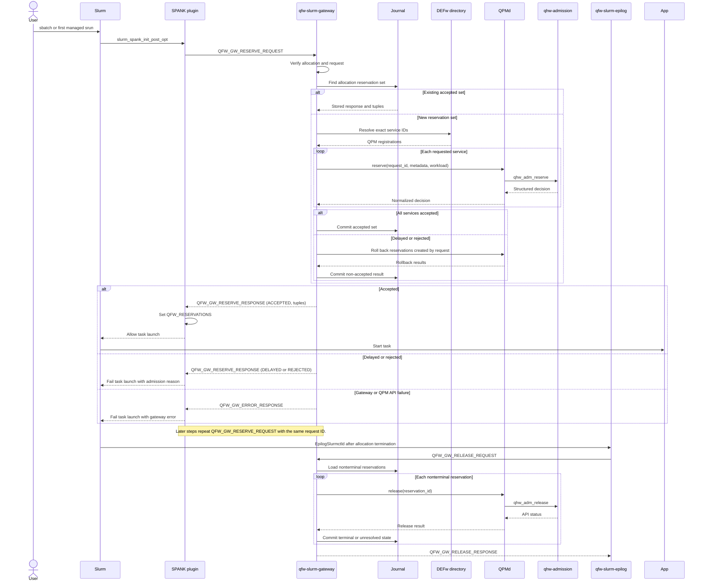

# Slurm Quantum Plugin Detailed Design

**Status:** draft

## Table of Contents

- [Design Scope and Dependency Direction](#design-scope-and-dependency-direction)
- [Repository and Package Layout](#repository-and-package-layout)
- [Site Configuration](#site-configuration)
- [Plugin Internal State](#plugin-internal-state)
- [Option Registration and Validation](#option-registration-and-validation)
- [SPANK Lifecycle](#spank-lifecycle)
- [Reservation Transaction](#reservation-transaction)
- [Gateway Process Model](#gateway-process-model)
- [Directory and QPM Binding](#directory-and-qpm-binding)
- [QPM Request Translation](#qpm-request-translation)
- [QSGP Protocol Specification](#qsgp-protocol-specification)
  - [Logical Operations and Response Contracts](#logical-operations-and-response-contracts)
  - [Request and Response Data Transfer](#request-and-response-data-transfer)
  - [Reservation Response Mapping](#reservation-response-mapping)
  - [Allocation and Reservation Sequence](#allocation-and-reservation-sequence)
  - [QSGP Wire Encoding](#qsgp-wire-encoding)
  - [QSGP Field Registry](#qsgp-field-registry)
  - [MUNGE and TCP Envelope](#munge-and-tcp-envelope)
  - [Synchronous Client Operation](#synchronous-client-operation)
- [Gateway Journal and Idempotency](#gateway-journal-and-idempotency)
- [Job Verification and Authorization Boundary](#job-verification-and-authorization-boundary)
- [Release and Failure Recovery](#release-and-failure-recovery)
- [Heterogeneous and Concurrent Allocations](#heterogeneous-and-concurrent-allocations)
- [Logging and Operational Status](#logging-and-operational-status)
- [Build, Deployment, and Upgrade](#build-deployment-and-upgrade)
- [Slurm Cluster Development Readiness](#slurm-cluster-development-readiness)
- [Validation Design](#validation-design)
- [Requirements Traceability](#requirements-traceability)

**Status:** draft

## Design Scope and Dependency Direction

This design implements the Slurm quantum lifecycle through three cooperating
roles. A native SPANK plugin owns Slurm callbacks, option processing,
reservation transaction order, and job environment updates. A controller-level
`qfw-slurm-epilog` helper owns once-per-allocation cleanup through
`EpilogSlurmctld`. A persistent gateway owns the temporary C-to-Python
boundary. The plugin and epilog helper speak a small native protocol to the
gateway, which uses existing DEFw bindings to call the directory service and
QPMd.

That native interface is the Quantum Scheduler Gateway Protocol (QSGP). QSGP
is independent of DEFw RPC and carries only scheduler lifecycle requests and
their normalized results.

The dependency direction is:

```text
Slurm step lifecycle
    -> native SPANK plugin
        -> QSGP client

Slurm allocation completion
    -> qfw-slurm-epilog
        -> QSGP client

QSGP client
    -> qfw-slurm-gateway
        -> DEFw directory client
        -> QPM admission-control client
            -> qhw-admission
```

QFw does not import or build the Slurm integration. The plugin repository
consumes an installed QFw environment only for the gateway. The Slurm-cluster
repository installs and configures released artifacts but contains no plugin
implementation.

The command-line interface uses provider-neutral quantum terms. The QFw
adapter is selected by gateway deployment configuration rather than by
QFw-specific workload option names.

**Requirements:**
- SLPARCH-001
- SLPARCH-002
- SLPARCH-003
- SLPARCH-004
- SLPARCH-007

**Status:** draft

## Repository and Package Layout

The separate OpenQSE repository uses the following ownership layout:

```text
qfw-slurm/
  CMakeLists.txt
  include/qsgp/
    qsgp_protocol.h
    qsgp_types.h
  src/plugin/
    spank_quantum.c
    options.c
    plugin_config.c
    reservation_transaction.c
    environment.c
  src/epilog/
    qfw_slurm_epilog.c
  src/protocol/
    qsgp_encode.c
    qsgp_decode.c
    qsgp_io.c
    qsgp_munge.c
  gateway/qfw_slurm_gateway/
    __main__.py
    server.py
    protocol.py
    authentication.py
    slurm_verifier.py
    defw_client.py
    journal.py
  config/
    plugin.conf.example
    gateway.yaml.example
  systemd/
    qfw-slurm-gateway.service.in
  tests/
    unit/
    protocol/
    gateway/
    slurm/
```

The C protocol library is private to this repository during the gateway
phase. It is shared by the SPANK plugin and controller epilog helper, but it is
not installed as a general QFw client API. The gateway Python package is
installed into the site QFw virtual environment or into a dedicated service
environment containing compatible QFw and DEFw packages.

The build produces `spank_quantum.so`, `qfw-slurm-epilog`, protocol unit tests,
and gateway package artifacts. Building the native artifacts requires Slurm
headers and libmunge. It does not require Python headers or QFw source.

**Requirements:**
- SLPARCH-001
- SLPARCH-002
- SLPARCH-003
- SLPVAL-008

**Status:** draft

## Site Configuration

The plugin reads `/etc/qfw-slurm/plugin.conf`. The file is root-owned and not
writable by application users. It contains no provider credential.

```ini
[gateway]
host=slurmctld
port=18095
connect_timeout_ms=5000
request_timeout_ms=120000
max_credential_bytes=65536
expected_munge_uid=qfw-slurm

[resource "ornl-iqm-20q"]
service_id=iqm-ornl-20q

[resource "nwqsim"]
service_id=nwqsim-site
```

The gateway reads `/etc/qfw-slurm/gateway.yaml`. It selects the listening
address, QFw activation environment, site configuration, protected journal,
accepted plugin identities, Slurm verifier, and protocol limits.

```yaml
listen:
  host: 0.0.0.0
  port: 18095
  max-credential-bytes: 65536
  request-timeout-seconds: 120
authentication:
  mechanism: munge
  accepted-uids: [0]
  expected-plugin-name: spank_quantum
slurm:
  cluster-name: qfw-cluster
  verifier: scontrol-json
qfw:
  activation: /opt/openqse/qfw/bin/qfw-activate
  venv: /opt/openqse/qfw-venv
  site-config: /etc/openqse/qfw/site.yaml
journal:
  path: /var/lib/qfw-slurm-gateway/reservations.sqlite3
```

The plugin mapping is authoritative for converting `--qpu` into an exact
service ID. The gateway verifies that registration but does not perform
compatible-service selection. Changes to endpoint addresses, service runtime
identities, and generations remain directory-service concerns.

**Requirements:**
- SLPADM-001
- SLPADM-002
- SLPSEC-003
- SLPSEC-005
- SLPFAIL-001

**Status:** draft

## Plugin Internal State

Each loaded plugin instance holds only process-local parsing and request state:

```c
struct quantum_options {
    bool active;
    char *qpu_names;
    enum workload_kind workload_kind;
    uint64_t circuit_count;
    uint32_t max_qubits;
    uint64_t max_depth;
    uint64_t max_shots;
    uint64_t max_one_q_gates;
    uint64_t max_two_q_gates;
    uint64_t max_measurements;
    uint32_t present_fields;
};

struct plugin_context {
    struct quantum_options options;
    struct plugin_config config;
    struct reservation_vector accepted;
    char deferred_error[4096];
    bool launch_failed;
};
```

The code does not assume that this state survives between SPANK contexts.
Allocator, remote, and job-script callbacks may execute in different address
spaces. The gateway journal supplies cross-context correlation. No provider
token or QPU credential enters plugin memory.

Every allocation is identified by the configured Slurm cluster name and its
canonical job ID. A heterogeneous component carries its component job ID and
component index as additional diagnostics. The leader job ID remains the
allocation key so one service cannot be reserved independently by two
components of the same application.

**Requirements:**
- SLPARCH-005
- SLPARCH-008
- SLPLIFE-008
- SLPLIFE-009
- SLPSEC-006

**Status:** draft

## Option Registration and Validation

`slurm_spank_init()` registers every option in allocator, local, and remote
contexts. The same table is used by `salloc`, `sbatch`, `srun`, and
`slurmstepd`.

| Option | Parser | Validation |
| --- | --- | --- |
| `--qpu` | Resource-name list | Every name is nonempty, unique, length-bounded, and present in root-owned configuration. |
| `--workload-kind` | Enumeration | Exactly `quantum` or `hybrid`. |
| `--circ-count` | Unsigned decimal | Present, nonzero, and representable as `uint64_t`. |
| `--max-qubits` | Unsigned decimal | Present, nonzero, and representable as `uint32_t`. |
| `--max-depth` | Unsigned decimal | Present, nonzero, and representable as `uint64_t`. |
| `--max-shots` | Unsigned decimal | Present, nonzero, and representable as `uint64_t`. |
| `--max-one-q-gates` | Unsigned decimal | Optional and representable as `uint64_t`; zero is valid. |
| `--max-two-q-gates` | Unsigned decimal | Optional and representable as `uint64_t`; zero is valid. |
| `--max-measurements` | Unsigned decimal | Optional and representable as `uint64_t`; zero is valid. |

Parsing uses checked conversion rather than `atoi()`. Leading signs,
whitespace, non-decimal text, empty values, and overflow fail validation.
Identical values received through an environment source and command line are
accepted. Conflicting duplicates fail rather than using option order as an
implicit precedence rule.

The first interface describes one conservative circuit envelope. If `--qpu`
names several services, the same envelope applies to each service. A future
interface may add separately identified envelopes without changing the QSGP
header.

The plugin derives walltime from Slurm's job record. It translates finite
minutes into nanoseconds with checked arithmetic. An unlimited time limit is
rejected for a managed QPU request unless site configuration defines a finite
cap.

**Requirements:**
- SLPCLI-001
- SLPCLI-002
- SLPCLI-003
- SLPCLI-004
- SLPCLI-005
- SLPCLI-006
- SLPCLI-007
- SLPCLI-008
- SLPCLI-009
- SLPCLI-011

**Status:** draft

## SPANK Lifecycle

The plugin uses the following callbacks:

| Callback and context | Behavior |
| --- | --- |
| `slurm_spank_init`, all applicable contexts | Load immutable plugin configuration and register options. No gateway call occurs. |
| Option callback, local or allocator | Parse and validate user values before Slurm accepts the command. |
| Option callback, remote | Reconstruct the same validated option state received from Slurm. |
| `slurm_spank_init_post_opt`, remote | Send `QFW_GW_RESERVE_REQUEST`, decode its synchronous response, and set `QFW_RESERVATIONS` after acceptance. |
| `slurm_spank_task_init`, remote | Return `SLURM_ERROR` when acquisition failed, preventing task execution without treating a healthy node as failed. |
| `slurm_spank_exit`, local or remote | Free process-local buffers only. It never releases allocation reservations. |
| `slurm_spank_job_epilog`, job-script context | Free node-local state and emit diagnostics only. It never releases allocation reservations because this callback is not allocation-global. |
| `slurm_spank_slurmd_exit`, slurmd context | Release daemon-local configuration and protocol resources only. |

For `sbatch`, remote initialization occurs before the batch task executes. The
interactive `salloc` path uses lazy acquisition. Creating the allocation does
not reserve QPM capacity. The first managed `srun` sends
`QFW_GW_RESERVE_REQUEST` and acquires the reservation before its task starts.
Subsequent managed steps send the same operation for the canonical allocation
and service set and receive the existing tuples.

A later `srun` may omit the original workload envelope after Slurm has already
propagated and validated it for the allocation. The reserve request still
carries the canonical allocation identity and service set. The gateway returns
the stored tuple set when it exists. It returns a structured error when no set
exists and the request lacks the fields needed to create one. Version 1 has no
separate list operation.

Allocation cleanup is controller-owned. Slurmctld invokes
`qfw-slurm-epilog` through `EpilogSlurmctld` after the complete allocation is
terminal. The helper sends `QFW_GW_RELEASE_REQUEST` for the canonical allocation
key. Node-local SPANK epilogs never release QPM capacity, so an early node
completion in a multinode job cannot terminate a reservation still used
elsewhere in the allocation.

**Requirements:**
- SLPLIFE-001
- SLPLIFE-002
- SLPLIFE-003
- SLPLIFE-004
- SLPLIFE-008
- SLPFAIL-003

**Status:** draft

## Reservation Transaction

Remote initialization builds the ordered list of exact service IDs from the
root-owned resource mapping. It then executes one allocation-level transaction:

```text
request_id = stable_uint64_id(cluster, job, allocation_epoch, RESERVE)
response = qfw_gw_reserve(job, requested_services, workload, request_id)
if response.type == QFW_GW_ERROR_RESPONSE:
    defer task-launch failure using response.gateway_error
    return
if response.decision != QFW_GW_ADMISSION_ACCEPTED:
    defer task-launch failure using response.reason_code and diagnostic
    return

QFW_RESERVATIONS = canonical_json(response.reservation_tuples)
spank_setenv(QFW_RESERVATIONS)
```

The gateway owns set atomicity, deterministic service ordering, and rollback of
QPM reservations created while processing the request. The plugin receives the
complete accepted tuple set or a structured non-accepted response. It never
receives a partially accepted set as success. Every SPANK process derives the
same nonzero `uint64` request ID, so later steps and transport retries use the
same canonical request identity.

The gateway passes that request ID through to qhw-admission for each resolved
QPM service. The QSGP transport correlation ID remains separate and may change
for each network attempt.

The environment value is a compact JSON list of two-element arrays ordered by
service ID. Service IDs are JSON strings. Reservation IDs are decimal strings
so their `uint64_t` range does not lose precision in JSON consumers.

```bash
QFW_RESERVATIONS='[["iqm-ornl-20q","41"],["nwqsim-site","17"]]'
```

The plugin writes the environment through `spank_setenv()` in remote context.
It does not create a reservation file or expose gateway journal paths to the
application.

**Requirements:**
- SLPLIFE-005
- SLPLIFE-006
- SLPLIFE-007
- SLPLIFE-009
- SLPLIFE-010
- SLPADM-007
- SLPADM-008

**Status:** draft

## Gateway Process Model

`qfw-slurm-gateway` is a persistent service managed by systemd or an
equivalent site service manager. It runs under a dedicated account, has a
locked-down state directory, and can read the QFw site connection record. QPU
provider credentials remain readable only by QPMd.

Startup performs these steps:

1. Validate gateway configuration and protected-path permissions.
2. Open and migrate the SQLite journal under an exclusive schema lock.
3. Activate the configured QFw environment.
4. Initialize one DEFw runtime.
5. Connect to the configured DEFw directory service and verify readiness.
6. Bind the TCP listener only after journal and DEFw initialization succeed.
7. Notify the service manager that the gateway is ready.

The gateway joins DEFw as a client process. It does not advertise itself as a
QPM and does not put its native listener into the DEFw directory. The plugin
learns the gateway endpoint only from root-owned plugin configuration.

The server uses an asynchronous TCP accept loop. Decoding and authentication
remain in the event-loop task. Blocking DEFw calls execute in a bounded worker
pool. Per-reservation-key locks prevent duplicate QPM calls, while different
jobs can progress concurrently.

Shutdown stops accepting connections, waits for bounded in-flight handlers,
flushes the journal, disconnects DEFw, and exits. It does not release active
reservations merely because the gateway service is restarting.

**Requirements:**
- SLPGW-001
- SLPGW-005
- SLPGW-008
- SLPGW-009
- SLPARCH-006

**Status:** draft

## Directory and QPM Binding

The gateway adapter maintains a resolver bound to the configured directory
service. A reserve operation includes one exact `service_id`. Resolution uses
that identifier and the QPM admission-control API category. Provider,
capability, and device-type searches are not used as fallback selection.

An exact lookup must produce one live registration. No result, multiple
results, an expired generation, a missing admission binding, or failed QPM
readiness returns a structured gateway error. The resolver never substitutes
a service with matching capabilities.

The gateway records the resolved QPM runtime ID and directory generation with
an accepted tuple. A later release resolves the same service ID again. If the
runtime ID or generation changed, the previous QPM reservation is treated as
invalidated by restart. The gateway records a terminal stale-runtime result
and does not send the old reservation ID to the new incarnation.

Directory reconnect uses bounded exponential backoff between requests. A
request does not wait beyond its protocol deadline. Reconnect does not change
the requested service ID or erase journaled tuples.

**Requirements:**
- SLPADM-002
- SLPADM-003
- SLPADM-004
- SLPGW-001
- SLPGW-002
- SLPFAIL-005

**Status:** draft

## QPM Request Translation

After resolving the exact QPM, the gateway constructs the existing QPM
reservation request. Trusted values and user-declared workload values remain
separate during construction.

| QPM request value | Source |
| --- | --- |
| `request_id` | QSGP `uint64` request ID |
| `owner.user` | Username resolved from the verified Slurm UID |
| `job_id` | Canonical Slurm job ID |
| `allocation_id` | Cluster name and canonical job ID |
| `scope_id` | Site mapping of Slurm account and QoS |
| `target_device_id` | QPM service and site manifest configuration |
| `workload_kind` | Validated plugin option |
| `walltime_ns` | Checked conversion of Slurm time limit |
| `ttl_ns` | Site policy bounded by allocation walltime plus cleanup grace |
| `task_class.count` | Declared circuit count |
| `task_class.qubit_count` | Declared maximum qubits |
| `task_class.depth` | Declared maximum depth |
| `task_class.shots` | Declared maximum shots |
| Gate and measurement counts | Corresponding optional maximum options |

QPMd assigns the reservation ID, checks user and device entitlement, binds
credentials, and calls qhw-admission. The gateway forwards none of the test
driver's credential hints, arbitrary parameter JSON, or user-selected scope
overrides.

A completed QPM call yields one of the three qhw-admission decisions. Accepted
requires a nonzero reservation ID. Delayed carries retry guidance when QPM
provides it. Rejected covers entitlement, credential, policy, and capacity
refusals. The gateway maps these values into `QFW_GW_RESERVE_RESPONSE`.

RPC, directory, malformed-result, qhw-admission API, and internal gateway
failures return `QFW_GW_ERROR_RESPONSE`. They do not add an `ERROR` value to
the admission decision enumeration. The gateway copies only bounded
diagnostics and never serializes Python exceptions, tracebacks, credentials,
or arbitrary result objects into QSGP.

**Requirements:**
- SLPCLI-010
- SLPADM-005
- SLPADM-006
- SLPADM-007
- SLPGW-003
- SLPGW-004
- SLPGW-009

**Status:** draft

## QSGP Protocol Specification

QSGP is the narrow allocation-lifecycle contract between the native Slurm
integration and `qfw-slurm-gateway`. The native side includes the SPANK plugin
for step startup and the controller epilog helper for allocation cleanup. The
gateway is the only QSGP component that imports DEFw or translates requests to
QPM admission-control calls.

Version 1 contains only the two state-changing operations used by the Slurm
lifecycle. `QFW_GW_RESERVE` acquires or returns an allocation's reservation
set. `QFW_GW_RELEASE` releases that set after allocation completion. A common
`QFW_GW_ERROR_RESPONSE` reports failures that prevented either operation from
producing its normal response.

QSGP carries scheduler lifecycle metadata and normalized admission results. It
does not carry provider credentials, circuit payloads, provider job results,
Python objects, arbitrary DEFw calls, or general QFw service traffic.

The protocol defines required, optional, and forbidden fields for each message.
Enumeration values, bounds, version rules, and golden vectors are part of the
versioned contract.

**Requirements:**
- SLPARCH-004
- SLPPROTO-001
- SLPPROTO-002
- SLPPROTO-003
- SLPPROTO-012

**Status:** draft

### Logical Operations and Response Contracts

Version 1 exposes these messages:

| Request | Caller and purpose | Normal response |
| --- | --- | --- |
| `QFW_GW_RESERVE_REQUEST` | Remote SPANK initialization acquires or retrieves the atomic ordered reservation set for one allocation. | `QFW_GW_RESERVE_RESPONSE` carries an `ACCEPTED`, `DELAYED`, or `REJECTED` admission decision and the applicable per-service results. |
| `QFW_GW_RELEASE_REQUEST` | The controller epilog helper releases every nonterminal reservation after allocation completion. | `QFW_GW_RELEASE_RESPONSE` reports every terminal and unresolved reservation. |

`QFW_GW_ERROR_RESPONSE` is the common failure response. It is returned when the
gateway cannot produce the normal operation response because of a parseable
protocol error, authorization failure, directory failure, QPM RPC failure,
qhw-admission API error, timeout, or internal failure. Admission outcomes and
gateway errors use separate enumerations. `ERROR` is not an admission decision.

Every authenticated, well-formed request receives one response on the same TCP
connection with the same transport correlation ID. QSGP has no unsolicited
server messages. Authentication or framing failures that prevent safe parsing
of the correlation ID close the connection without an application response.

Both state-changing requests carry a nonzero `uint64` request ID in network
byte order. Every native process derives the same value from the verified
cluster name, canonical allocation ID, allocation epoch, and operation domain.
The reserve value is passed to QPM as the qhw-admission `request_id`. The gateway
keys idempotency by authenticated sender, operation, and request ID and stores a
canonical request fingerprint. The same key and fingerprint return the stored
response. Reusing the key with different fields returns
`QFW_GW_ERROR_REQUEST_CONFLICT`. The transport correlation ID identifies one
network exchange and may change on retry.

`QFW_GW_RESERVE` is atomic at the QSGP boundary. It returns `ACCEPTED` only
after every requested service has an active reservation. A rejected or delayed
service causes rollback of reservations created by that request before the
normal non-accepted response is returned. The plugin never receives a partial
set as an accepted result.

A later step uses `QFW_GW_RESERVE_REQUEST` again. The allocation identity and
canonical service set select the existing journal rows, so the same operation
returns the complete stored tuple set without creating another QPM reservation.
There is no list-reservations or request-result message in version 1.

`QFW_GW_RELEASE` is exhaustive. The gateway attempts every nonterminal tuple
and reports all terminal and unresolved items in one response.

**Requirements:**
- SLPPROTO-004
- SLPPROTO-006
- SLPPROTO-007
- SLPPROTO-009
- SLPGW-003
- SLPGW-004
- SLPFAIL-002

**Status:** draft

### Request and Response Data Transfer

QSGP transfers one typed request and one typed response per TCP connection.
The native caller and gateway exchange only bounded primitive fields and nested
QSGP records. Provider credentials, Python serialization, and native QPM
objects remain inside the gateway boundary.

```text
SPANK plugin or controller epilog
    -> construct typed native request
    -> encode fixed QSGP header and TLV payload
    -> MUNGE-encode the complete QSGP frame
    -> send uint32 credential length plus credential bytes over TCP
    -> gateway validates length, MUNGE identity, frame, and fields
    -> gateway maps trusted and declared values into a typed internal request
    -> DEFw directory lookup and QPM admission operation
    -> gateway maps the QPM result into a typed QSGP response
    -> MUNGE-encode and return the response on the same TCP connection
    -> native caller validates gateway identity, correlation, and response type
    -> decode the response into a bounded native C result
    -> close the connection
```

MUNGE authenticates the native daemon identity and protects the credential in
the cluster trust domain. The gateway separately verifies the cluster,
allocation, job UID and GID, job state, account or QoS mapping, and requested
QPU resources against authoritative Slurm state. User-declared workload bounds
remain labeled as declarations when the gateway constructs QPM requests.

The outer MUNGE credential limit and inner decoded QSGP frame limit are separate
configuration values. Both endpoints reject an oversized length before
allocating or decoding its content. One absolute operation deadline covers
connect, framing, MUNGE processing, request handling, response transfer, and
decode. A connection carries no ambient session state. Request state lives in
the protected gateway journal and is recovered by retrying the same operation
with the same `uint64` request ID.

**Requirements:**
- SLPPROTO-002
- SLPPROTO-003
- SLPPROTO-008
- SLPSEC-001
- SLPSEC-002
- SLPSEC-003

**Status:** draft

### Reservation Response Mapping

QPM reserve returns a structured qhw-admission decision. The gateway maps the
fields needed by the Slurm lifecycle into each service result. It does not
reduce the decision to a Boolean.

| QSGP field | QPM or gateway source | Presence and use |
| --- | --- | --- |
| `request_id` | qhw-admission `decision.request_id` | Required. It equals the `uint64` ID from `QFW_GW_RESERVE_REQUEST`. |
| `service_id` | Gateway directory resolution context | Required. It identifies the QPM service associated with the result. |
| `decision` | qhw-admission `decision.decision` | Required. Values are `ACCEPTED`, `DELAYED`, and `REJECTED`. |
| `reservation_id` | qhw-admission `decision.reservation_id` | Required and nonzero for an accepted result. Forbidden for delayed and rejected results. |
| `reason_code` | qhw-admission `decision.reason_code` | Required. The numeric qhw-admission reason is authoritative. |
| `retry_after_ns` | qhw-admission `decision.retry_after_ns` | Optional for a delayed result and omitted when zero. |
| `estimated_start_ns` | qhw-admission `decision.estimated_start_ns` | Optional scheduling diagnostic and omitted when unavailable. |
| `estimated_finish_ns` | qhw-admission `decision.estimated_finish_ns` | Optional scheduling diagnostic and omitted when unavailable. |
| `diagnostic` | Bounded copy of qhw-admission `decision.message` | Optional human-readable detail. It never replaces `reason_code`. |

The gateway omits qhw-admission policy internals that the plugin does not use.
These include credits required, rate required, available capacity, granted
capacity, quantum budget, compliance action, confidence, scope ID, and arbitrary
metadata. The QPM adapter must preserve every mapped field above when it
normalizes the native decision.

The top-level reserve decision is `ACCEPTED` only when every service result is
accepted. It is `REJECTED` when any service is rejected. Otherwise it is
`DELAYED` when at least one service is delayed. An accepted response contains
the complete ordered service and reservation tuple set. A delayed or rejected
response contains the decisive normalized service result and no exportable
reservation tuple set.

A nonzero qhw-admission API return code does not produce a decision record. QPM
propagates that condition as an operation failure, and the gateway returns
`QFW_GW_ERROR_RESPONSE` with a gateway error code and bounded diagnostic. This
keeps gateway failures separate from valid qhw-admission rejection or delay.

QPM release returns an API status rather than a qhw-admission decision.
`QFW_GW_RELEASE_RESPONSE` therefore reports the gateway journal's per-service
terminal state. A release API failure is an unresolved item with a gateway
error code; it is not represented as a rejected admission decision.

**Requirements:**
- SLPGW-003
- SLPGW-004
- SLPPROTO-004
- SLPPROTO-006
- SLPPROTO-007
- SLPPROTO-009

**Status:** draft

### Allocation and Reservation Sequence

The sequence begins at the first managed job step. Each QSGP request receives
its response on the same authenticated TCP connection.



**Requirements:**
- SLPLIFE-001
- SLPLIFE-002
- SLPLIFE-004
- SLPLIFE-005
- SLPLIFE-006
- SLPLIFE-007
- SLPGW-003
- SLPGW-004
- SLPGW-005
- SLPPROTO-002
- SLPPROTO-004
- SLPPROTO-008
- SLPFAIL-002

**Status:** draft

### QSGP Wire Encoding

The C encoder writes every field explicitly. It does not transmit a native C
structure with `send(fd, &header, sizeof(header), ...)`. This keeps the gateway
portable across supported Linux distributions and host architectures.

The 32-byte fixed header has these offsets:

```text
0x00  magic[4]          "QSGP"
0x04  major_version     uint16, network order
0x06  minor_version     uint16, network order
0x08  message_type      uint16, network order
0x0a  flags             uint16, network order
0x0c  header_size       uint32, network order
0x10  correlation_id    uint64, network order
0x18  payload_size      uint32, network order
0x1c  reserved          uint32, network order, zero
```

Operation codes reserve the high bit for responses. Version 1 assigns only the
messages used by the Slurm reservation lifecycle.

| Code | Message |
| ---: | --- |
| `0x0001` | `QFW_GW_RESERVE_REQUEST` |
| `0x0002` | `QFW_GW_RELEASE_REQUEST` |
| `0x8001` | `QFW_GW_RESERVE_RESPONSE` |
| `0x8002` | `QFW_GW_RELEASE_RESPONSE` |
| `0x8fff` | `QFW_GW_ERROR_RESPONSE` |

Each TLV uses this header:

```text
type       uint16, network order
flags      uint16, network order
length     uint32, network order
value      exactly length bytes
padding    zero to the next four-byte boundary
```

Flag bit zero means that the receiver must understand the TLV. Other flag bits
are zero in version 1. Decoders check the remaining payload before every read,
use checked addition for padding, validate fixed numeric lengths, and require
all padding bytes to be zero.

**Requirements:**
- SLPPROTO-001
- SLPPROTO-004
- SLPPROTO-005
- SLPPROTO-006
- SLPPROTO-008
- SLPPROTO-011
- SLPPROTO-012

**Status:** draft

### QSGP Field Registry

Version 1 reserves the following common TLV identifiers. The operation matrix
defines the required, optional, and forbidden fields for each message.

| ID | Name | Encoding |
| ---: | --- | --- |
| `0x0001` | Cluster name | UTF-8 string |
| `0x0002` | Canonical job ID | `uint64` |
| `0x0003` | Heterogeneous job ID | `uint64` |
| `0x0004` | Heterogeneous component | `uint32` |
| `0x0005` | Job UID | `uint32` |
| `0x0006` | Job GID | `uint32` |
| `0x0007` | Service ID | UTF-8 string |
| `0x0008` | Workload kind | `uint32` enumeration |
| `0x0009` | Walltime nanoseconds | `uint64` |
| `0x000a` | Circuit count | `uint64` |
| `0x000b` | Maximum qubits | `uint32` |
| `0x000c` | Maximum depth | `uint64` |
| `0x000d` | Maximum shots | `uint64` |
| `0x000e` | Maximum one-qubit gates | `uint64` |
| `0x000f` | Maximum two-qubit gates | `uint64` |
| `0x0010` | Maximum measurements | `uint64` |
| `0x0011` | Reservation ID | `uint64` |
| `0x0012` | Release reason | `uint32` enumeration |
| `0x0013` | Admission decision | `uint32` enumeration |
| `0x0014` | qhw-admission reason code | `uint64` |
| `0x0015` | Retry delay nanoseconds | `uint64` |
| `0x0016` | Diagnostic | UTF-8 string, maximum 4096 bytes |
| `0x0017` | QPM runtime ID | UTF-8 string |
| `0x0018` | QPM generation | `uint64` |
| `0x0019` | Reservation state | `uint32` enumeration |
| `0x001a` | Request ID | `uint64` |
| `0x001b` | Service request record | Nested TLV container |
| `0x001c` | Estimated start nanoseconds | `uint64` |
| `0x001d` | Estimated finish nanoseconds | `uint64` |
| `0x001e` | Gateway error code | `uint32` enumeration |
| `0x001f` | Service result record | Nested TLV container |
| `0x0020` | Release result record | Nested TLV container |

`QFW_GW_RESERVE_REQUEST` requires one request ID and repeats service-request
containers. A create request includes the workload envelope. A retrieve request
may omit that envelope only when matching allocation and service rows already
exist.

`QFW_GW_RESERVE_RESPONSE` requires the same request ID and an admission
decision. It repeats service-result containers. An accepted service result
contains service ID and reservation ID. Delayed and rejected results contain
the qhw-admission reason and may contain retry and estimate fields.

Admission decisions use `1=ACCEPTED`, `2=DELAYED`, and `3=REJECTED`. Gateway
errors use a separate registry and appear only in `QFW_GW_ERROR_RESPONSE`.
`QFW_GW_RELEASE_RESPONSE` repeats release-result containers and distinguishes
released, already terminal, not found, stale runtime, authorization failure,
QPM failure, and gateway failure. Nested depth is limited to one in version 1.

**Requirements:**
- SLPPROTO-004
- SLPPROTO-006
- SLPPROTO-007
- SLPPROTO-009
- SLPPROTO-010
- SLPPROTO-012

**Status:** draft

### MUNGE and TCP Envelope

The native client encodes the complete QSGP frame as the payload of a MUNGE
credential. It then connects to the configured gateway and sends:

```text
credential_length  uint32, network order
credential_bytes   credential_length bytes, no trailing nul
```

The gateway reads exactly four bytes, validates the outer credential-size
bound before allocation, reads the complete credential, decodes it with MUNGE,
validates its age and origin UID, and then validates the independent decoded
QSGP frame-size bound. The response follows the same format and is
MUNGE-encoded by the gateway service identity. The native client validates that
identity before parsing the response. The encoded-credential limit is larger
than the decoded-frame limit because MUNGE encoding adds metadata and expansion.

MUNGE supplies message authentication and confidentiality inside the cluster
trust domain. Logical idempotency is independent of MUNGE credential replay
detection. The gateway keys its bounded logical-request cache by authenticated
sender identity and the stable QSGP request ID. It stores a canonical decoded
request fingerprint with the request state and normalized response. Reusing a
request ID with the same fingerprint returns the stored or in-progress result;
reusing it with different fields returns a conflict error.

The listener accepts only the QSGP protocol. It does not expose HTTP, pickle,
YAML, Python object serialization, or DEFw framing.

**Requirements:**
- SLPPROTO-002
- SLPPROTO-003
- SLPSEC-001
- SLPSEC-002
- SLPSEC-003
- SLPPROTO-011

**Status:** draft

### Synchronous Client Operation

Each native operation uses a new nonblocking socket with blocking semantics
implemented through `poll()`. The client applies one absolute deadline across
address resolution, connect, send, receive, authentication, and decode.

```text
encode typed request as QSGP frame
    -> munge_encode(frame)
    -> connect with deadline
    -> write_all(length + credential)
    -> read_exact(response length)
    -> read_exact(response credential)
    -> munge_decode(response)
    -> validate QSGP header and correlation
    -> decode typed response
    -> close socket
```

`write_all()` and `read_exact()` handle `EINTR`, short operations, peer close,
and deadline expiry. They never retry a partial transaction on a new socket.
The operation layer retries the complete request with the same `uint64` request
ID and canonical fields when policy permits. A correlation ID identifies one
transport exchange and may change on retry.

The caller receives the result directly on its calling stack. There is no
background thread, callback, file polling, or result-query operation. A timeout
after the request may have reached the gateway produces an unknown transport
outcome. The caller opens a new connection and resends the same
`QFW_GW_RESERVE_REQUEST` or `QFW_GW_RELEASE_REQUEST`. The gateway returns the
stored normal response when processing already completed, waits within the
operation deadline when the request remains in progress, or returns a bounded
gateway error.

**Requirements:**
- SLPGW-004
- SLPPROTO-002
- SLPPROTO-008
- SLPFAIL-001
- SLPFAIL-002

**Status:** draft

## Gateway Journal and Idempotency

SQLite stores one row per allocation and service. The database and its parent
directory are readable only by the gateway account.

```text
reservation_journal
  cluster_name             TEXT
  canonical_job_id         INTEGER-as-decimal-text
  service_id               TEXT
  reserve_request_id       INTEGER-as-decimal-text
  request_fingerprint      BLOB
  state                    TEXT
  reservation_id           INTEGER-as-decimal-text nullable
  qpm_runtime_id            TEXT nullable
  qpm_generation            INTEGER-as-decimal-text nullable
  decision                 TEXT
  reason_code              INTEGER-as-decimal-text nullable
  created_at_ns             INTEGER-as-decimal-text
  updated_at_ns             INTEGER-as-decimal-text
  PRIMARY KEY(cluster_name, canonical_job_id, service_id)
```

Unsigned 64-bit values use validated decimal text because SQLite signed
integers do not cover the complete `uint64_t` range.

Reserve processing acquires a per-allocation lock and starts with a journal
lookup. Accepted rows for the same canonical service set return their complete
tuple set. A create request with different service or workload fields for
existing rows returns a conflict. A pending row is completed by its existing
owner or waited on within the request deadline.

The gateway also stores the normalized operation response by authenticated
sender, operation, and `uint64` request ID. A retry with the same canonical
fingerprint returns that response. A different fingerprint for the same key
returns `QFW_GW_ERROR_REQUEST_CONFLICT`.

Before calling QPMd, the gateway commits a pending row. After acceptance it
commits the reservation ID, runtime ID, generation, normalized decision, and
accepted state before sending the response. If the accepted update cannot be
committed, the gateway attempts an immediate QPM release and returns
`QFW_GW_ERROR_RESPONSE` without acknowledging the tuple.

Release validates that each tuple belongs to the requesting allocation. A
successful or already-terminal QPM result advances the journal to a terminal
state. Rows and stored operation responses remain for a configurable audit and
retry interval. The journal does not hold capacity or reconstruct QPM state.

**Requirements:**
- SLPARCH-008
- SLPGW-005
- SLPGW-006
- SLPGW-007
- SLPGW-008
- SLPFAIL-002
- SLPFAIL-004

**Status:** draft

## Job Verification and Authorization Boundary

MUNGE authenticates the process sending QSGP. The gateway accepts lifecycle
requests only from configured privileged identities used by Slurm daemons.
The job UID carried inside the request is still verified against Slurm state.

The initial verifier runs a bounded `scontrol --json show job <job-id>` command
under the gateway service account. It checks:

- The cluster and canonical job exist.
- The job UID equals the QSGP job UID.
- The job is starting, running, completing, or otherwise valid for the
  requested operation.
- The QPU resource name and heterogeneous component agree with allocated job
  data when Slurm exposes them.
- A release refers to the same job identity recorded at reserve time.

The verifier is a narrow interface so a site can replace the command adapter
with Slurm REST or a native Slurm binding. A verifier failure is fail-closed.

QFw v0.1 trusts the verified Slurm identity supplied through this path when
QPMd evaluates user entitlement. Application authentication to later QPM APIs
is a separate design. The gateway never reads `qpu-users.json` and never
handles provider API keys.

**Requirements:**
- SLPSEC-001
- SLPSEC-002
- SLPSEC-003
- SLPSEC-004
- SLPSEC-005
- SLPGW-009

**Status:** draft

## Release and Failure Recovery

The controller-level `qfw-slurm-epilog` helper sends
`QFW_GW_RELEASE_REQUEST` using the canonical allocation key and a stable
nonzero `uint64` request ID after Slurm marks the complete allocation terminal.
The gateway finds every nonterminal reservation, attempts each release, and
returns `QFW_GW_RELEASE_RESPONSE` with a per-reservation result. A release
failure does not stop later releases. Repeated controller epilog or operator
invocations return the stored response and terminal rows without causing a
second QPM state transition. Node-local SPANK epilogs never send a release.

The controller helper logs unresolved releases and returns success after it
attempts the allocation-level operation. Capacity safety comes from QPM
reservation TTL, explicit operator retry, and the durable gateway journal
rather than from treating a healthy compute node as failed.

The gateway provides an administrative command that lists nonterminal journal
rows and resubmits `QFW_GW_RELEASE_REQUEST`. This command invokes the same
handler as the controller helper. The gateway does not run an autonomous reaper
that decides a Slurm job has ended.

Failure mapping follows these rules:

| Failure | Integration behavior | Journal behavior |
| --- | --- | --- |
| Local option error | Reject command before launch. | No row. |
| Gateway unavailable before reserve | Fail task launch. | No new acknowledged row. |
| Reserve timeout | Retry `QFW_GW_RESERVE_REQUEST` with the same request ID and canonical fields. Fail with an unknown transport outcome if the deadline remains unresolved. | The stored response remains available to the same retry. |
| QPM delayed or rejected | Return `QFW_GW_RESERVE_RESPONSE` with the normalized admission decision after rollback. | Store the decision and per-service reconciliation state. |
| qhw-admission API or gateway failure | Return `QFW_GW_ERROR_RESPONSE`; do not manufacture an admission decision. | Preserve pending or reconciliation state for retry. |
| Early node completion | Perform no release from the node-local epilog. | Allocation rows remain active. |
| QPM restart | Fail old tuple as stale. | Mark stale runtime. |
| Release timeout | Retry `QFW_GW_RELEASE_REQUEST` with the same request ID and report unresolved items. | Nonterminal rows remain. |
| Gateway restart | Reconnect and retry the same operation. | Recover rows and stored responses from SQLite. |

**Requirements:**
- SLPLIFE-004
- SLPLIFE-006
- SLPLIFE-007
- SLPFAIL-002
- SLPFAIL-003
- SLPFAIL-004
- SLPFAIL-005

**Status:** draft

## Heterogeneous and Concurrent Allocations

Heterogeneous components can invoke remote initialization independently. The
plugin normalizes each component to the leader's canonical job ID and carries
the component identifier for validation and diagnostics. The gateway's
allocation-and-service uniqueness key prevents the same QPM service from being
reserved twice by two components.

If a component requests a different QPU service, its reservation joins the
same allocation tuple set. Every managed application step sends
`QFW_GW_RESERVE_REQUEST` and receives the complete stored set in its accepted
response. The gateway orders tuples lexically by service ID for stable
environment generation.

Concurrent jobs use different canonical job IDs and therefore independent
locks and journal rows. The bounded worker pool prevents an unavailable QPM or
directory connection from consuming unlimited gateway threads. Per-key
serialization prevents reserve and release races for one job and service.

**Requirements:**
- SLPLIFE-002
- SLPLIFE-008
- SLPLIFE-009
- SLPGW-005
- SLPVAL-004

**Status:** draft

## Logging and Operational Status

The plugin uses Slurm logging and includes the plugin version, protocol
version, cluster, job ID, component, service ID, operation, request ID,
correlation ID, decision or gateway error code, reason code, and duration.
User-visible errors remain bounded and actionable.

The gateway emits structured records with the same correlation fields plus
directory generation and journal transition. It records no MUNGE credential,
provider credential, device-access content, user circuit, or QPM result
payload.

Gateway readiness is an administrative service check rather than a QSGP
message. The service manager asserts readiness after the journal, DEFw
initialization, directory connectivity, and configured QPM resolution checks
pass. A protected local status command reports the same checks and can inspect
nonterminal journal rows. Application users do not receive status or journal
access.

**Requirements:**
- SLPPROTO-007
- SLPPROTO-010
- SLPSEC-006
- SLPFAIL-004

**Status:** draft

## Build, Deployment, and Upgrade

The plugin is built separately for each supported Slurm ABI. The development
cluster uses Slurm 25.05, so its image builds the native artifacts against that
release and libmunge. `spank_quantum.so` is installed in the site Slurm plugin
directory on slurmctld, allocation-command hosts, and every compute node.
`qfw-slurm-epilog` is installed on slurmctld. Slurm major-version changes
require rebuilding both native artifacts.

A shared, root-owned `plugstack.conf` marks the plugin required and passes only
the root-owned configuration path:

```text
required /usr/lib64/slurm/spank_quantum.so \
    config=/etc/qfw-slurm/plugin.conf
```

The cluster either uses Slurm's default plugstack path or sets
`PlugStackConfig=/etc/slurm/plugstack.conf` explicitly. Slurmctld also sets
`EpilogSlurmctld` to the installed controller helper.

The gateway is installed as an independent service. Its unit selects the QFw
installation and virtual environment before executing the gateway module. The
service starts after MUNGE and the site DEFw directory service are available.
In the Docker development cluster it runs as a dedicated Compose service, not
as an unmanaged background process inside slurmctld.

Plugin and gateway releases declare the QSGP major and supported minor range.
A rolling upgrade begins with a gateway that accepts both old and new minor
versions, followed by plugin and epilog-helper replacement. A parseable major
version mismatch returns `QFW_GW_ERROR_UNSUPPORTED_VERSION` without invoking
QPM.

The QFw Slurm Docker cluster builds and installs the native and gateway
artifacts, provisions MUNGE trust and root-owned configuration, starts the
gateway, and enables the plugstack and controller epilog entries. The official
QFw installation remains independently replaceable through its normal prefix
and virtual-environment mechanism.

**Requirements:**
- SLPARCH-001
- SLPPROTO-012
- SLPSEC-005
- SLPVAL-008

**Status:** draft

## Slurm Cluster Development Readiness

The development-cluster review on 2026-08-31 established the following
baseline. This table records environment readiness, not implementation status
inside the future `qfw-slurm` repository.

| Area | Status | Development implication |
| --- | --- | --- |
| MUNGE packages and daemon | Ready | `munge`, `munge-devel`, and `munged` are present on the controller and checked compute nodes. |
| Shared MUNGE trust | Ready | Controller and compute nodes share a key, and cross-node credentials preserve the test-user UID and GID. |
| Test users | Ready locally | `user-a`, `user-b`, and `user-c` have consistent identities, shared homes, and Slurm associations. |
| Source reproducibility | Blocked | The cluster branch is two commits ahead of upstream; those commits must be published before a fresh upstream build can reproduce user provisioning. |
| Whole-node isolation | Blocked | `select/cons_tres` with `CR_CPU_Memory` and `OverSubscribe=NO` makes allocated CPUs exclusive but still permits another job on unused CPUs. |
| Container resource model | Blocked | Docker limits the compute containers to four CPUs, `slurm.conf` advertises eight, and `slurmd -C` observes twenty host CPUs. |
| Native integration | Missing | `spank_quantum.so` and `qfw-slurm-epilog` are not built or installed. The existing IBM `spank_qrmi.so` is unrelated. |
| Slurm integration configuration | Missing | `plugstack.conf`, `PlugStackConfig`, `EpilogSlurmctld`, and `/etc/qfw-slurm/plugin.conf` are not provisioned. |
| QSGP gateway | Missing | No service identity, Compose service, gateway configuration, listener, or persistent journal exists. |

The cluster retains `SelectType=select/cons_tres` and
`SelectTypeParameters=CR_CPU_Memory`. Whole-node isolation is enabled on every
partition used by the integration with the partition value
`OverSubscribe=EXCLUSIVE`:

```text
PartitionName=normal  ... OverSubscribe=EXCLUSIVE
PartitionName=quantum ... OverSubscribe=EXCLUSIVE
```

`OverSubscribe=NO` prevents sharing of an allocated consumable resource, not
sharing of unused CPUs on the same node. `Exclusive=NODE` is not the partition
setting for this Slurm configuration. The applicable Slurm references are the
[partition configuration](https://slurm.schedmd.com/slurm.conf.html) and
[consumable-resource sharing](https://slurm.schedmd.com/cons_tres_share.html)
documentation. Switching to `select/linear` is unnecessary.

The Compose CPU limit or cpuset, the node `CPUs` and memory values in
`slurm.conf`, and the resources reported inside each container by `slurmd -C`
must describe the same resources before isolation and concurrency tests are
credible. The Compose definition is the deployment source of truth, and the
Slurm node configuration is derived from those assigned limits.

The gateway runs as an internal-only dedicated Compose service with a stable
`qfw-slurm` UID and GID, the official QFw installation, the directory-service
connection record, `/etc/qfw-slurm/gateway.yaml`, a persistent
`/var/lib/qfw-slurm-gateway` volume, the shared MUNGE key material, a local
`munged` socket, and the QSGP listener. The default development listener is
TCP port 18095 on the internal cluster network. Provider credentials remain
outside the gateway.

Development can start when all of these gates pass:

1. Publish the two cluster commits needed by fresh builds.
2. Align Compose and Slurm CPU and memory descriptions.
3. Configure relevant partitions with `OverSubscribe=EXCLUSIVE` and prove that two jobs cannot share a node.
4. Build against the cluster's Slurm 25.05 headers and libmunge.
5. Install the plugin on slurmctld, allocation-command hosts, and every compute node; install the controller epilog helper on slurmctld.
6. Provision root-owned plugstack, plugin, controller-epilog, and gateway configuration.
7. Start the gateway service with persistent journal and MUNGE access.
8. Run local MUNGE checks on every node and at least one cross-container encode/decode.
9. Verify plugin loading and run the administrative readiness check for journal access, directory connectivity, and exact resolution of every configured QPM service ID.

Existing MUNGE and test-user provisioning should be preserved rather than
reimplemented. The remaining work is isolation, resource consistency, native
artifact implementation and packaging, Slurm configuration, gateway
deployment, and reproducible publication of the current cluster changes.

**Requirements:**
- SLPARCH-001
- SLPARCH-002
- SLPARCH-006
- SLPSEC-001
- SLPSEC-005
- SLPVAL-008

**Status:** draft

## Validation Design

The C unit suite invokes option callbacks with valid, missing, repeated,
conflicting, zero, boundary, overflow, and malformed values. Protocol tests
share golden vectors between the C encoder and Python decoder. They verify the
`uint64` request ID, formal message codes, qhw-admission decision mapping, and
the separation between admission decisions and gateway errors. Fuzz targets
exercise the frame and TLV decoders with authentication disabled only inside
the test harness.

Gateway tests provide fake directory and QPM bindings. They cover accepted,
delayed, rejected, QPM API error, malformed request, timeout, generation
change, concurrent reserve, partial rollback support, journal-write failure,
restart, idempotent reserve retrieval, and release paths. A lost response test
retries the same request ID and proves that no result-query operation is needed.

The Docker Slurm suite runs these scenarios as `user-a`, `user-b`, and
`user-c`:

1. `sbatch` acquires one NWQSim reservation, exports it, runs a QFw example,
   and releases it through the controller epilog helper.
2. `salloc` proves that no QPM reservation exists before the first managed
   `srun`, then runs two sequential `srun` steps against one reservation and
   proves that the reservation remains active between steps.
3. A multinode job completes one node while work remains on another and proves
   that node-local SPANK epilogs do not release the allocation reservation.
   The controller epilog releases it only after the complete allocation is
   terminal.
4. A heterogeneous allocation obtains the same tuple set in each application
   component without duplicate reservation.
5. A two-service request forces the second reserve to fail and confirms that
   the gateway releases the first before returning a non-accepted response.
6. Concurrent users reserve the same long-running QPM under separate job IDs
   without seeing each other's journal state.
7. Gateway restart between reserve and release preserves explicit cleanup.
8. NWQSim and fakeIQM pass before a bounded real-IQM chemistry job is enabled.

Cluster preflight tests also prove that two jobs cannot share a node, Compose
resource limits agree with `slurm.conf` and `slurmd -C`, MUNGE credentials
decode locally and across containers, and the required plugin loads in every
SPANK context. The administrative readiness check must confirm journal access,
directory connectivity, and exact resolution of every configured QPM service
ID. Tests also verify filesystem permissions, log redaction, invalid MUNGE
credentials, replay handling, response-correlation mismatches, and gateway
timeouts.

**Requirements:**
- SLPVAL-001
- SLPVAL-002
- SLPVAL-003
- SLPVAL-004
- SLPVAL-005
- SLPVAL-006
- SLPVAL-007
- SLPVAL-008

**Status:** draft

## Requirements Traceability

| Requirement group | Design sections |
| --- | --- |
| `SLPARCH-*` | DES-001, DES-002, DES-004, DES-008, DES-015, DES-020, DES-023, DES-024 |
| `SLPCLI-*` | DES-005, DES-010 |
| `SLPADM-*` | DES-003, DES-007, DES-009, DES-010 |
| `SLPLIFE-*` | DES-004, DES-006, DES-007, DES-017, DES-018, DES-029 |
| `SLPPROTO-*` | DES-011, DES-012, DES-013, DES-014, DES-019, DES-020, DES-024, DES-025, DES-026, DES-028, DES-029 |
| `SLPGW-*` | DES-008, DES-009, DES-010, DES-014, DES-015, DES-016, DES-018, DES-025, DES-028, DES-029 |
| `SLPSEC-*` | DES-003, DES-004, DES-013, DES-016, DES-019, DES-020, DES-023, DES-026 |
| `SLPFAIL-*` | DES-003, DES-009, DES-014, DES-015, DES-017, DES-025, DES-029 |
| `SLPVAL-*` | DES-002, DES-018, DES-020, DES-021, DES-023 |

Every implementation unit and test plan derived from this design should cite
the individual requirement IDs it covers. Group traceability in this section
is an index rather than a replacement for record-level links.

**Status:** draft
