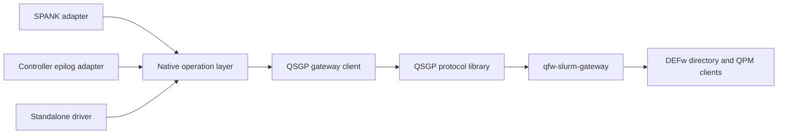
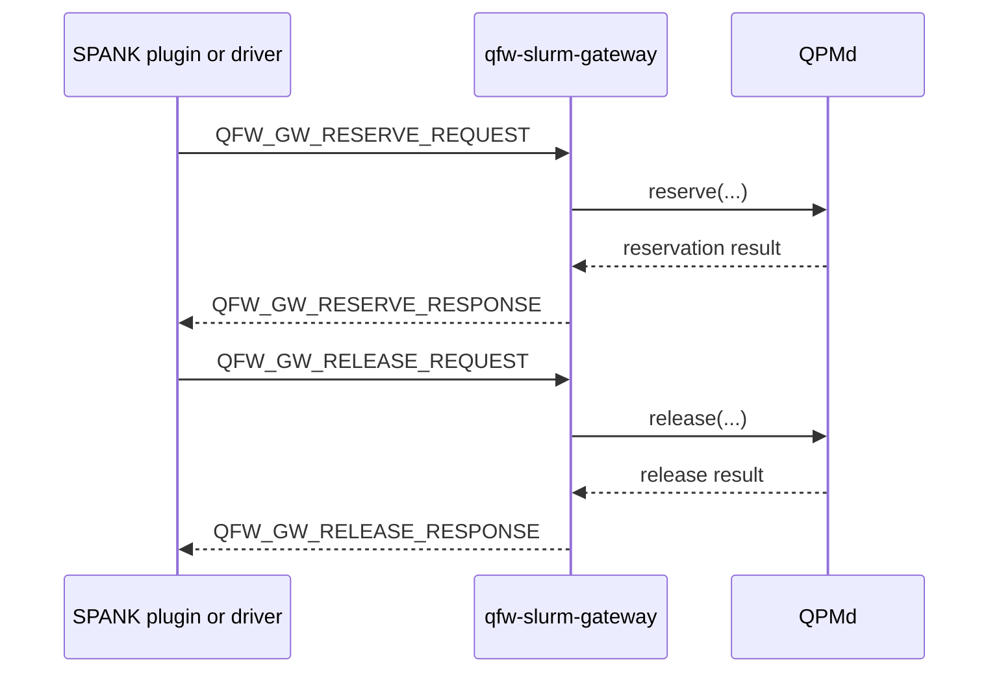
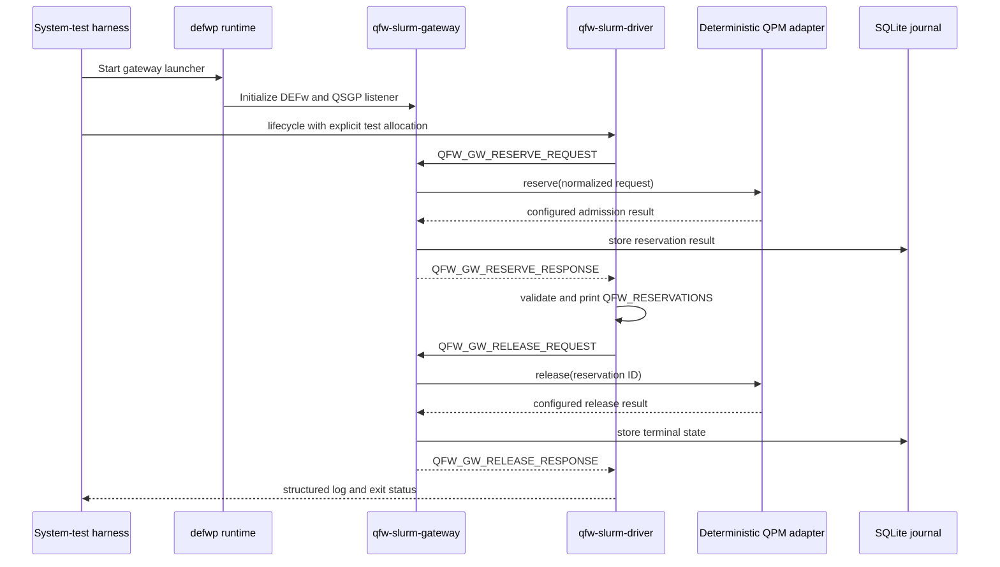

# Slurm Plugin Driver Refactor Detailed Design

**Status:** draft

## Table of Contents

- [Purpose and Scope](#purpose-and-scope)
- [Existing Code Boundary](#existing-code-boundary)
- [Target Module Boundaries](#target-module-boundaries)
- [Synchronous Gateway Operations](#synchronous-gateway-operations)
- [Native Client Interface](#native-client-interface)
- [Shared Response Interpretation](#shared-response-interpretation)
- [SPANK Adapter](#spank-adapter)
- [Controller Epilog Adapter](#controller-epilog-adapter)
- [Standalone Driver](#standalone-driver)
- [Driver Commands and Output](#driver-commands-and-output)
- [Gateway Test Mode](#gateway-test-mode)
- [System Test Design](#system-test-design)
- [Failure and Security Behavior](#failure-and-security-behavior)
- [Build and Packaging](#build-and-packaging)
- [Implementation Order](#implementation-order)
- [Acceptance Criteria](#acceptance-criteria)

**Status:** draft

## Purpose and Scope

This refactor makes the Slurm integration's gateway operations reusable
outside a SPANK callback. The SPANK plugin, controller epilog, and a new
standalone diagnostic driver will share one native client and lifecycle
implementation. Each frontend will retain only the behavior owned by its
runtime environment.

The standalone driver provides a visible and repeatable system-test path. It
constructs the same typed requests, calls the same synchronous gateway APIs,
and applies the same response validation as the deployed plugin. It reports
what the plugin would do instead of requiring a fabricated `spank_t` or
starting an application task.

The refactor does not change QSGP version 1, gateway journal semantics, QPM
admission behavior, or the Slurm allocation lifecycle. It introduces no Slurm
dependency into the QSGP or native operation libraries.

**Status:** draft

## Existing Code Boundary

The repository already separates wire processing from Slurm. The `qsgp`
library owns bounded encoding, decoding, TCP I/O, deadlines, and MUNGE. The
`qfw_slurm_native` library owns configuration parsing, option parsing, request
construction, environment formatting, and the synchronous gateway exchange.
Neither library links to libslurm.

The remaining coupling is above that boundary. `spank_quantum.c` reads trusted
Slurm metadata, constructs the reservation request, interprets admission
results, formats `QFW_RESERVATIONS`, and selects the callback result. The
controller epilog independently constructs release requests and interprets
release results. A diagnostic driver built directly on the present API would
need to duplicate some of those decisions.

The source layout also obscures ownership because reusable option,
configuration, transaction, and environment sources reside under
`src/plugin/` even though they are compiled into the Slurm-independent native
library. The refactor moves reusable code under a native client or lifecycle
directory. Only code that includes Slurm headers remains under `src/plugin/`
and `src/epilog/`.

**Status:** draft

## Target Module Boundaries

The target dependency direction is shown below.



The modules own these responsibilities.

| Module | Responsibilities | Forbidden dependencies |
| --- | --- | --- |
| QSGP protocol | Wire types, encoding, decoding, framing, deadlines, MUNGE | Slurm, DEFw, Python |
| QSGP gateway client | Synchronous request and response exchange, correlation validation, gateway identity validation | SPANK callbacks, libslurm, DEFw |
| Native operation layer | Request construction, response validation, canonical reservation formatting, release-result classification | `spank_t`, Slurm logging, environment mutation |
| SPANK adapter | Read trusted Slurm state, register options, call the operation layer, update the job environment, allow or deny launch | Wire encoding details, gateway journal logic |
| Controller epilog adapter | Read authoritative completion identity, call shared release, emit controller diagnostics | Wire encoding details, QPM calls |
| Standalone driver | Parse explicit diagnostic inputs, call the operation layer, print structured results | SPANK APIs, fabricated Slurm handles |
| Gateway | Authenticate and verify requests, journal operations, resolve QPMs through DEFw, call QPM admission APIs | SPANK APIs |

The SPANK plugin and standalone driver consume the same public native headers.
No driver-only branch is added to the production plugin.

**Status:** draft

## Synchronous Gateway Operations

Reserve and release remain synchronous QSGP operations. A response is returned
on the same authenticated TCP connection as its request. There is no separate
request that fetches a reserve or release response.



The gateway journals requests and results for idempotency and recovery. If a
caller loses a response, it repeats the same operation with the same request
identity. The gateway returns the stored result when the request fingerprint
matches. Journal storage does not turn the protocol into an asynchronous
submit-and-poll interface.

**Status:** draft

## Native Client Interface

The public native client exposes one typed function for each QSGP operation.
The operation name identifies the request and expected normal response.

```c
int qfw_gateway_reserve(
    const struct qfw_gateway_client *client,
    const struct qsgp_reserve_request *request,
    struct qsgp_reserve_response *response);

int qfw_gateway_release(
    const struct qfw_gateway_client *client,
    const struct qsgp_release_request *request,
    struct qsgp_release_response *response);
```

The client object contains validated endpoint configuration, timeouts, message
limits, and the expected MUNGE identity. Initialization and destruction are
explicit. The client does not contain Slurm handles or application state.

Each function encodes the request, creates a MUNGE credential, connects to the
gateway, sends one frame, waits within one absolute operation deadline,
authenticates the response, validates correlation and message type, decodes the
typed response, and closes the connection. A successful return means that the
normal typed response was decoded. Admission acceptance remains a field in the
reserve response rather than being represented by the C return value.

QSGP permits a common error response in place of a normal operation response.
The implementation therefore also returns a bounded structured client error.
The final C prototype may add an error output parameter or use a tagged
operation result. It must preserve the gateway error code and diagnostic
without converting the error into an admission rejection. The API must remain
reentrant and may not rely on process-global or client-global `last_error`
state.

**Status:** draft

## Shared Response Interpretation

Response interpretation belongs to the native operation layer so every
frontend applies the same rules. Reserve processing checks transport and
protocol status, distinguishes a gateway error from an admission decision,
requires an accepted top-level decision, validates every accepted service
result, rejects missing or duplicate service IDs, requires nonzero reservation
IDs, and emits canonical `QFW_RESERVATIONS` JSON ordered by service ID.

Release processing validates the response request identity and classifies each
service result as terminal or unresolved. It visits every result even when an
earlier result reports a failure. The operation result contains bounded
diagnostics that the frontend can log.

A neutral result structure carries both machine-readable state and formatted
output. Conceptually, reserve returns this information.

```c
struct qfw_reserve_operation_result {
    enum qfw_operation_state state;
    struct qsgp_reserve_response response;
    struct qsgp_error_response gateway_error;
    char reservations_json[QFW_RESERVATIONS_ENV_SIZE];
};
```

The exact structure may use a tagged union to avoid storing both response
forms. It contains no `spank_t`, Slurm return code, logger callback, or direct
environment mutation. The SPANK adapter and driver consume the same validated
result.

**Status:** draft

## SPANK Adapter

The SPANK adapter remains a thin Slurm integration. It registers the command
options, obtains job ID, UID, GID, allocation epoch, walltime, cluster name,
and heterogeneous-allocation metadata from trusted Slurm interfaces. It maps
that metadata into the neutral allocation context used by the operation layer.

On reserve acceptance, the adapter writes the already validated JSON through
`spank_setenv()` as `QFW_RESERVATIONS`. A transport failure, gateway error,
delayed decision, rejected decision, or malformed accepted result marks the
launch as failed. The callback sequence then returns the Slurm status needed
to deny task launch without marking a healthy node as failed.

The adapter does not encode QSGP frames, inspect raw TLVs, duplicate service
result validation, or format reservation JSON. It converts shared operation
outcomes into Slurm logging, environment updates, and callback return values.

**Status:** draft

## Controller Epilog Adapter

The controller epilog obtains the completed allocation's canonical identity
from Slurm and constructs the neutral release context. It calls the same shared
release operation used by the driver.

The epilog logs every unresolved service result and returns according to the
existing controller-cleanup policy. It does not reimplement QSGP exchange,
response correlation, or per-result classification. Release failures remain
in the gateway journal for operator retry. No Slurm job structure needs to be
updated because allocation termination is already in progress.

**Status:** draft

## Standalone Driver

The new `qfw-slurm-driver` is a native executable linked to the same operation
and QSGP client libraries as the plugin. It does not link to libslurm and does
not load `spank_quantum.so`. Command-line arguments supply the allocation and
workload values that Slurm normally provides to the plugin.

The driver exists for diagnostics and system testing. It shows the request,
transport result, gateway response, normalized admission outcome, service
results, and the environment value that the plugin would install. For release,
it shows every terminal and unresolved reservation result.

The driver never claims to validate SPANK callback placement, option
propagation between Slurm contexts, or `spank_setenv()`. Those behaviors still
require an actual `salloc`, `sbatch`, or `srun` test. The driver validates the
shared request-to-gateway path without a fabricated `spank_t`.

**Status:** draft

## Driver Commands and Output

The driver provides three commands.

| Command | Behavior |
| --- | --- |
| `reserve` | Build and send one reserve request, validate its response, print the result, and exit without releasing it. |
| `release` | Build and send one release request for the allocation identity, print all release results, and exit. |
| `lifecycle` | Send reserve, display the result, optionally wait at a controlled hold point, send release, and display the final result. |

A representative invocation is shown below.

```bash
qfw-slurm-driver lifecycle \
    --config /etc/qfw-slurm/plugin.conf \
    --cluster qfw-slurm \
    --job-id 123 \
    --uid 1001 \
    --gid 1001 \
    --allocation-epoch 1788000000 \
    --walltime-seconds 900 \
    --qpu nwqsim \
    --workload-kind quantum \
    --circ-count 2 \
    --max-qubits 5 \
    --max-depth 100 \
    --max-shots 1024
```

Human-readable output is the default. `--json` emits one bounded record per
state transition for automated tests. Successful reserve output includes a
copyable line such as the following.

```text
export QFW_RESERVATIONS='[["nwqsim-site","41"]]'
```

Exit status zero means the requested command reached its expected terminal
state. Distinct nonzero statuses identify command validation, transport,
authentication, gateway, admission, response-validation, and release failures.
The driver never prints MUNGE credentials, provider credentials, or arbitrary
Python exceptions.

**Status:** draft

## Gateway Test Mode

Two gateway configurations support complementary system tests. Production
verification remains the default. In that mode, the driver supplies a real
active Slurm job identity and the gateway verifies it through `slurmctld`
before calling QPMd. This tests the native path while bypassing only the SPANK
callback host.

A deterministic test configuration may select a test-only verifier and QPM
adapter. The gateway still starts through `defwp`, initializes its DEFw
runtime, accepts MUNGE-protected QSGP traffic, exercises its server and journal,
and returns fixed accepted, delayed, rejected, gateway-error, and release
results. The selected response is controlled by protected test configuration,
not by untrusted request fields.

Test mode is unavailable in the installed production gateway configuration.
Enabling it requires a build-time test option or a separately installed test
entry point, a configuration value that production parsing rejects, and an
explicit loopback or isolated-test listener. Startup logs identify the active
verifier and adapter. The systemd production unit cannot enable the test
adapter through an environment variable inherited from a user shell.

**Status:** draft

## System Test Design

The first system test exercises the complete native operation path without a
SPANK host. Its topology is shown below.



The deterministic suite covers accepted reserve and release, delayed reserve,
rejected reserve, gateway error, malformed accepted result, timeout, response
correlation mismatch, repeated reserve idempotency, lost-response retry, and an
unresolved release followed by retry. Each test inspects driver JSON and the
protected gateway log.

A second system test starts the gateway through `defwp`, uses a real active
Slurm job for verification, resolves a long-running NWQSim QPM through the
directory service, and runs the driver lifecycle command. This proves the
complete path through DEFw and QPMd without loading SPANK.

A final integration test loads `spank_quantum.so` through Slurm and compares
its exported `QFW_RESERVATIONS` with driver output for equivalent inputs. It
also confirms that Slurm denies launch on the same gateway and admission
failures. This test covers the thin adapter that the standalone driver cannot
exercise.

**Status:** draft

## Failure and Security Behavior

The driver uses the same root-owned endpoint and resource mapping as the
plugin. File ownership and mode validation remain identical. MUNGE authenticates
every request and response. The gateway applies its configured identity and
job-verification policy regardless of whether the caller is the plugin or
driver.

Explicit driver metadata is diagnostic input, not trusted production identity.
A production-configured gateway accepts it only when authoritative Slurm state
confirms the cluster, job, UID, GID, allocation state, and requested resources.
The deterministic adapter is confined to the isolated test configuration.

All calls use one absolute deadline. A timeout returns an unknown transport
outcome and preserves the stable request identity for retry. The driver reports
that state distinctly from admission rejection. Structured output bounds every
string and redacts MUNGE payloads, provider secrets, QPU credentials, and
application data.

**Status:** draft

## Build and Packaging

The build produces separate native targets for the protocol library, gateway
client and operation library, SPANK module, controller epilog, and standalone
driver. Building the driver and native tests requires MUNGE but does not require
Slurm headers or libslurm.

```bash
cmake -S . -B build-driver \
    -DQFW_SLURM_BUILD_PLUGIN=OFF \
    -DQFW_SLURM_BUILD_DRIVER=ON
cmake --build build-driver
```

The installed driver belongs in the normal binary directory. The protocol and
operation libraries may remain private static libraries. Public headers needed
by the repository's frontends live under an internal include namespace and are
not presented as a stable application API. Production packages may omit the
deterministic gateway adapter while retaining the driver for operations against
a real gateway.

**Status:** draft

## Implementation Order

Implementation proceeds in independently testable units.

1. Move Slurm-independent sources out of `src/plugin/` without changing
   behavior. Prove that the native library builds with plugin construction
   disabled.
2. Introduce the gateway client object and typed reserve and release APIs.
   Preserve QSGP wire compatibility with existing golden vectors.
3. Extract shared reserve and release response interpretation. Move canonical
   JSON formatting and result classification into the operation layer.
4. Reduce the SPANK callback and controller epilog to adapters over the shared
   operations. Run existing native and gateway tests.
5. Add `qfw-slurm-driver` with reserve, release, lifecycle, human-readable, and
   JSON output.
6. Add the deterministic gateway test adapter and isolated configuration guard.
7. Add the driver-to-gateway system suite under `defwp`.
8. Run a real NWQSim driver lifecycle and then the final SPANK comparison test
   in the Slurm development cluster.

A functional commit contains each unit and its focused tests. Corrections found
during implementation are folded into the commit that introduced the affected
functionality before publication.

**Status:** draft

## Acceptance Criteria

The refactor is complete when all conditions below hold.

- QSGP, the gateway client, the operation layer, and driver build without Slurm
  headers or libslurm.
- The SPANK module and controller epilog contain only Slurm-specific metadata,
  logging, environment, and callback behavior.
- The plugin, epilog, and driver call the same typed reserve and release APIs.
- Shared code validates gateway errors, admission outcomes, service results,
  reservation IDs, response correlation, and release states.
- The driver prints the exact `QFW_RESERVATIONS` value that the plugin would
  export.
- The deterministic system suite runs the gateway through `defwp` and covers
  successful and failed reserve and release paths.
- A real NWQSim driver lifecycle reaches the directory service and QPMd.
- A Slurm integration test proves that the thin SPANK adapter exports the same
  accepted tuple set and denies the same failed request.
- Test-only verification and QPM adapters cannot be selected by the production
  gateway unit or untrusted request input.
- No test fabricates `spank_t`, duplicates QSGP encoding, or adds a second
  implementation of reservation decision rules.

**Status:** draft
