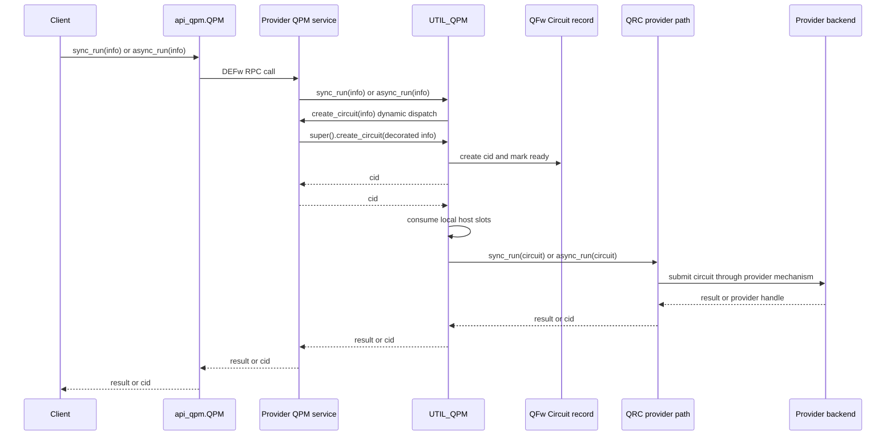
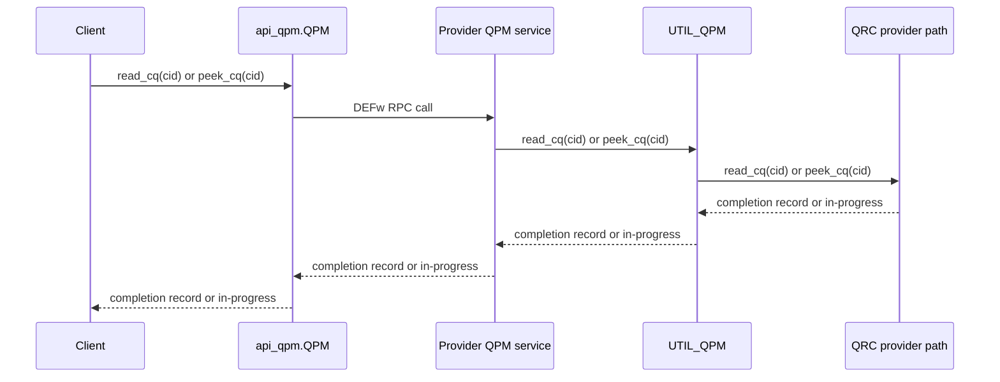
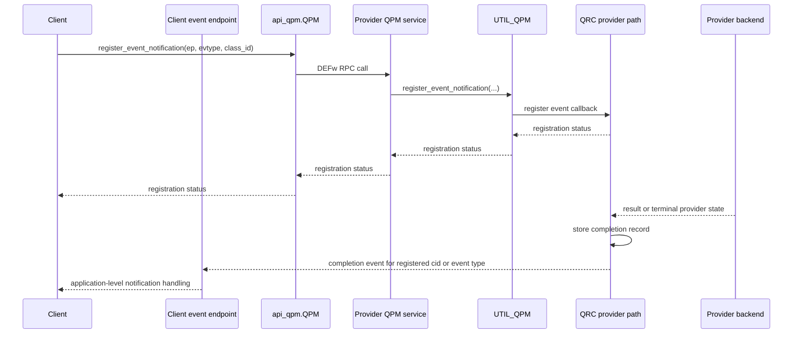
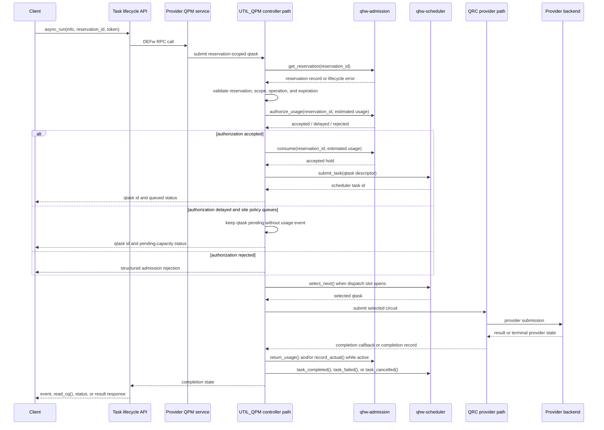
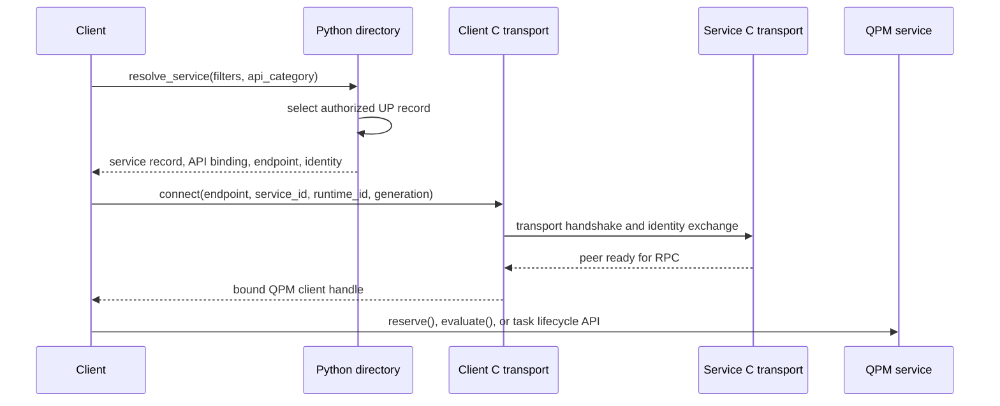
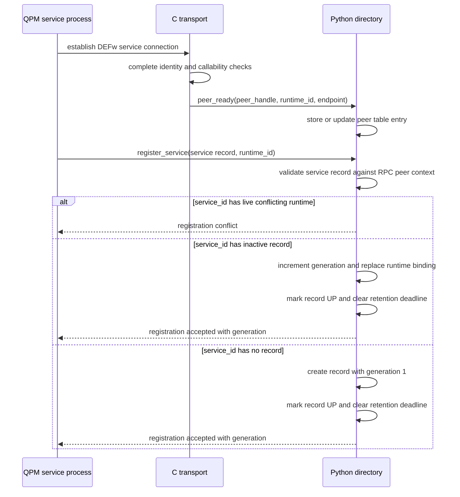
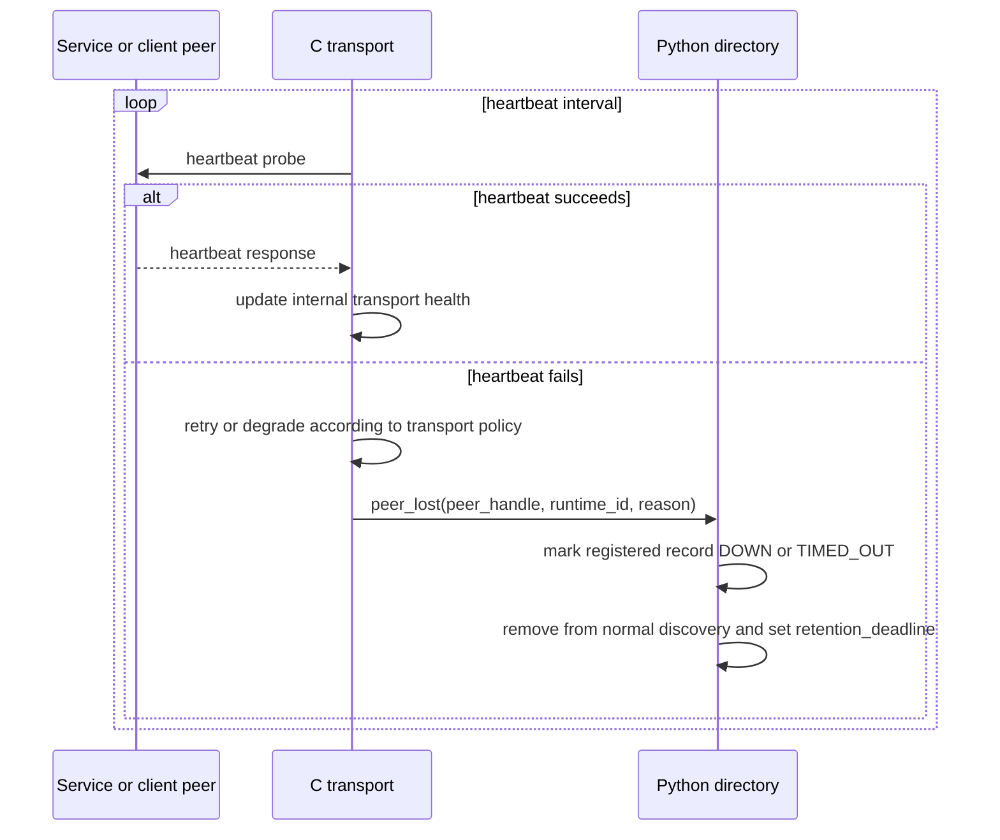
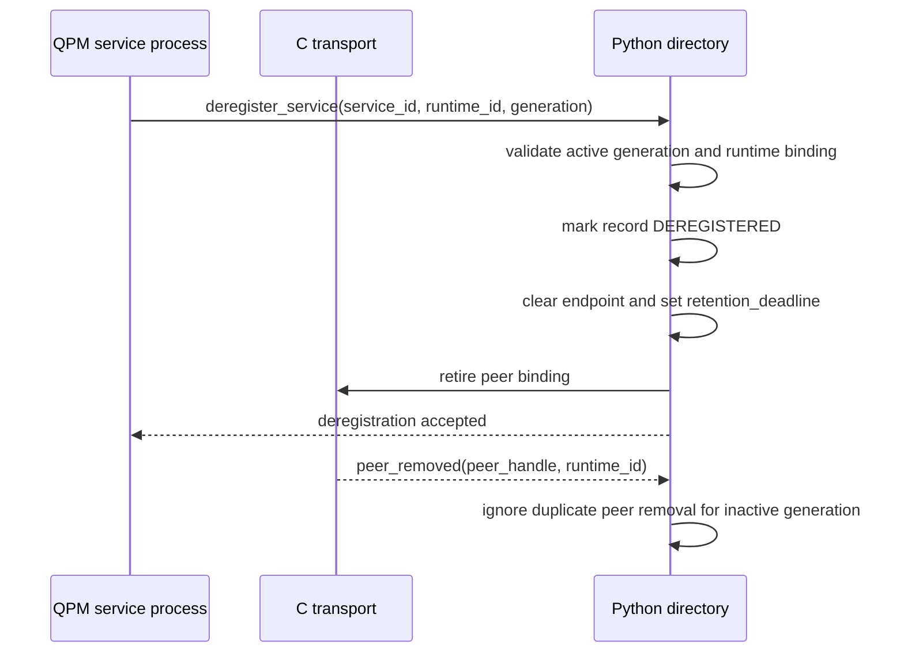

# Detailed Design

## Table Of Contents

- [Purpose](#purpose)
- [Design Context](#design-context)
- [Build And Installation Model](#build-and-installation-model)
- [Managed Resource Model](#managed-resource-model)
- [QFw Controller Architecture](#qfw-controller-architecture)
- [Requirement Design Notes](#requirement-design-notes)

<details open>
<summary><strong>Purpose</strong></summary>

## Purpose

This document records implementation-oriented design notes for
`docs/requirements.md`. Each requirement has a matching collapsible subsection
identified by the same requirement ID.

</details>

<details open>
<summary><strong>Design Context</strong></summary>

## Design Context

The QFw client path discovers QPM through DEFw-dirsvc. The Qiskit lookup path
asks DEFw-dirsvc for QPM binding metadata, then calls
`defw.connect_to_binding()` to create the selected QPM client binding. DEFw
directory lookup does not perform capacity accounting or call the QPM
`reserve()` callback.

The current execution flow is:

```text
client
  -> api_qpm.sync_run()/async_run()
  -> QPM service method
  -> UTIL_QPM creates Circuit
  -> QPM/QRC execution path
  -> provider client or frontend
  -> QRC completion queue or event callback
```

The target design separates these concerns. DEFw-dirsvc owns registered-service
discovery, while QPM owns the active reservation flow and uses qhw-admission as
the authoritative reservation store. Long-running QPM services remain
DEFw-wrapped RPC services and register with a site-scoped DEFw-dirsvc rather
than with an allocation-local directory service.

Relevant implementation points:

- `backends/qfw_qiskit/qfw_lookup_service.py` discovers QPM by resolving
  binding records through DEFw-dirsvc.
- `DEFw/python/infra/defw.py` implements `connect_to_binding()` by connecting
  to the selected endpoint and constructing the requested service API wrapper.
- `DEFw/python/services/svc_dirsvc/svc_dirsvc.py` implements registration,
  deregistration, directory queries, binding resolution, and generation checks.
- `services/util/qpm/util_qpm.py` currently owns QPM execution submission,
  local host-slot accounting, completion queues, and event registration.
- Provider-specific QPM services derive from `UTIL_QPM`, set metadata, and
  delegate hardware operations to a provider-specific QRC object.
- QRC owns the current provider execution mechanics, including asynchronous
  Python workers, provider calls, completion records, and callback delivery.
- `backends/qfw_qiskit/qfw_simulator.py` currently keeps only `shots`, `seed`,
  and `seed_simulator` when constructing a `QFwJob`.
- `backends/qfw_qiskit/qfw_job.py` currently calls `qpm.async_run(info)`
  without reservation context.
- `backends/qfw_qiskit/qfw_sampler.py` exposes `Options.run_options`, while
  `backends/qfw_qiskit/qfw_estimator.py` has no equivalent backend pass-through
  option.

</details>

<details open>
<summary><strong>Build And Installation Model</strong></summary>

## Build And Installation Model

DEFw should use CMake as its authoritative build and installation system.
SCons is removed after CMake produces equivalent C, SWIG, Python extension,
test, and install artifacts. The migration is behavior-neutral. Transport,
directory, and C/Python interface refactors start after the CMake baseline can
build and install the existing DEFw behavior.

The build should support normal out-of-source CMake workflows:

```text
cmake -S DEFw -B build/defw -DCMAKE_INSTALL_PREFIX=<prefix>
cmake --build build/defw
ctest --test-dir build/defw
cmake --install build/defw
```

A conventional source layout gives CMake stable ownership boundaries:

```text
DEFw/
  CMakeLists.txt
  cmake/
    DEFwConfig.cmake.in
    modules/
  include/defw/
  src/
  swig/
    defw.i
    typemaps/
      compat_charpp.i
      compat_charppp.i
      owned_string.i
      owned_string_list_counted.i
      opaque_handle.i
  python/defw/
  tests/
```

Generated SWIG files belong in the build tree. The source tree should contain
the canonical `.i`, typemap, C, header, and Python sources, while generated C
wrappers, generated Python proxy files, object files, and staging artifacts
stay under the CMake binary directory.

Installation should make DEFw usable without running from the source tree. A
standard install prefix should contain:

```text
<prefix>/include/defw/...
<prefix>/lib/libdefw.so
<prefix>/lib/cmake/DEFw/DEFwConfig.cmake
<prefix>/lib/cmake/DEFw/DEFwTargets.cmake
<prefix>/lib/pythonX.Y/site-packages/defw/_defw.so
<prefix>/lib/pythonX.Y/site-packages/defw/*.py
<prefix>/share/defw/swig/typemaps/*.i
```

C clients use `find_package(DEFw CONFIG REQUIRED)` and link the exported
`DEFw::defw` target. QFw and other Python clients use the installed Python
package with `import defw`. The CMake package should publish include
directories, library targets, runtime search path behavior, Python extension
install location, and the installed SWIG typemap directory for optional
downstream wrappers.

The SWIG cleanup should preserve current DEFw Python API behavior unless an
individual wrapper is explicitly migrated with tests. Existing broad typemaps
remain available as compatibility includes for the current API surface, but new
or refactored interfaces should opt in to narrower typemaps. This lets DEFw
wrap external libraries, such as libfabric, without forcing every interface to
inherit DEFw-specific pointer semantics by default.

The target typemap set should separate compatibility from new contracts:

| Typemap include | Purpose |
| --- | --- |
| `compat_charpp.i` | Preserve existing `char **` output behavior for audited current DEFw APIs. |
| `compat_charppp.i` | Preserve existing `char ***` pointer-return behavior until each API is migrated. |
| `owned_string.i` | Convert malloc/calloc-owned `char **` output to a Python string and free the transferred buffer. A NULL output means allocation failure and raises a Python memory/allocation exception. |
| `owned_string_list_counted.i` | Convert counted `char ***out, size_t *count` output to `list[str]`, then free each transferred string and the transferred array. |
| `opaque_handle.i` | Expose typed opaque handles without enabling arbitrary global `void *` conversion. |

New string-list APIs should prefer an explicit count, such as
`char ***out, size_t *count`, over an uncounted `char ***`. The counted typemap
returns a Python list of strings and owns cleanup for malloc/calloc-transferred
memory. Existing uncounted `char ***` wrappers should keep their current return
shape until a targeted migration changes that API and adds tests.

The commented global `void *` typemap should be removed rather than carried as
dead code. Peer handles and future libfabric handles should use typed opaque
handle wrappers or library-specific SWIG modules. That keeps external-library
wrapping possible while preventing accidental conversion of unrelated raw
pointers.

CMake validation should include build-tree imports and install-tree imports.
Tests should cover generated SWIG outputs, installed Python package imports,
exported CMake targets, runtime search paths, string output typemaps, counted
string-list typemaps, compatibility typemaps used by current wrappers, NULL
allocation-failure handling, and typed opaque-handle round trips.

</details>

<details open>
<summary><strong>Managed Resource Model</strong></summary>

## Managed Resource Model

The target resource boundary is a managed quantum resource, not direct hardware
access. Direct hardware access is the provider-facing boundary below the
managed resource. The managed resource boundary adds policy, admission,
scheduling, accounting, telemetry, and lifecycle semantics before work reaches
the provider queue.

`qhw-admission` evaluates whether a quantum job or hybrid job can enter the
active pool for a managed device. It owns device profiles, estimator plugins,
admission policies, reservations, capacity accounting, usage records, and
compliance state.

`qhw-scheduler` orders accepted qtasks for one QPU execution target. It owns
task queue state, scheduler policy plugins, task lifecycle state, slicing, and
selection of the next qtask to occupy the QPU.

Neither library owns the hosting framework's remote API, service registration,
provider connection setup, provider submission, result transport, event
notification, or shutdown. Those responsibilities remain in the active managed
resource implementation that hosts the libraries.

In this QFw design, the public resource API is the QFw QPM service API exposed
through DEFw. That API includes reservation-scoped task submission, task status,
cancellation, result retrieval, and related metadata operations. The QPM API is
the scheduled path: it invokes admission, inserts admitted qtasks into the
scheduler, and enforces lifecycle and policy before work can reach a backend.

QRMI and QDMI fit below or alongside the QPM boundary depending on deployment.
When QRMI or QDMI is used as a lower device adapter behind QPM, QPM presents the
unified client-facing interface and calls the adapter only after scheduler
selection. When a deployment exposes QRMI or QDMI directly as the managed
resource interface, its public submit operation should provide the same
admission and scheduling semantics before provider submission. The desired
convergence point is a common QRMI/QDMI managed-resource contract, so clients do
not need to care which library sits underneath QPM or a future equivalent
resource service.

Conceptually, the stack becomes:

```text
application / SDK / runtime
  -> QFw QPM service API
  -> qhw-admission
  -> qhw-scheduler
  -> QRMI, QDMI, QRC, or native device adapter
  -> provider queue
  -> quantum device
```

The lower device adapter can be QRMI, QDMI, QPM/QRC provider code, or a native
vendor API. The admission and scheduler libraries remain independent of that
choice. They operate on resource envelopes, qtask descriptors, estimates, and
lifecycle events.

A managed-resource standard should define observable behavior and data
contracts rather than require one implementation library. `qhw-admission` and
`qhw-scheduler` can serve as reference infrastructure for those contracts, and
other implementations can satisfy the same semantics with their own logic.

Managed-resource API categories are:

| Category | Primary consumers | Standardization role |
| --- | --- | --- |
| Execution | Applications, runtimes, SDK adapters | Defines submit, synchronous execution, asynchronous execution, cancellation, status, result, metadata, and event behavior for managed quantum tasks. Scheduling is implicit in this lifecycle. |
| Admission control | Workflow managers, load managers, resource managers, site services | Defines evaluate, reserve, renew, release, cancel, inspect, and decision-reporting operations for capacity requests. |
| Scheduler control | Site operators, administrators, site automation | Defines scheduling policy, queue-control, drain, pause, and dispatch-tuning operations for a device. |
| Telemetry and discovery | Applications, workflow managers, operators, monitoring services, admission policy | Defines device, job, reservation, queue, calibration, timing, capacity, and provenance data. |

Telemetry and discovery are one top-level API category because they are read
and query surfaces. Access can still be partitioned inside that category by
the later authentication feature rather than splitting telemetry into unrelated
top-level categories.

| Access class | Typical data | Primary consumers |
| --- | --- | --- |
| Basic discovery | Device identity, supported capabilities, public topology, and public metadata. | Applications, runtimes, SDK adapters. |
| Caller-owned state | Job, task, reservation, event, and result data owned by the caller or workflow. | Submitting users, applications, workflow managers. |
| Manager aggregate state | Aggregate queue depth, capacity summaries, reservation summaries, and workload-level wait estimates. | Workflow managers, load managers, site automation. |
| Operator telemetry | Policy state, scheduler internals, cross-user views, audit records, and detailed operational health. | Site operators, administrators, monitoring services. |

Lifecycle semantics should be defined before API names or bindings.
qhw-admission uses decision kinds for request outcomes and reservation states
for committed reservations. Request outcomes are accepted, delayed, and
rejected. The concrete reservation states are
`QHW_ADM_RESERVATION_PENDING`, `QHW_ADM_RESERVATION_ACTIVE`,
`QHW_ADM_RESERVATION_RELEASED`, `QHW_ADM_RESERVATION_EXPIRED`, and
`QHW_ADM_RESERVATION_CANCELLED`. Renew is an operation that extends an active
reservation. Over-limit is reported through reason, usage, and compliance data
rather than a reservation state.

The managed qtask lifecycle covers pending for capacity, queued, selected,
submitted to the provider, running, completed, failed, cancelled, and timed
out. qhw-scheduler provides the concrete scheduler states
`QHW_SCHED_TASK_QUEUED`, `QHW_SCHED_TASK_ASSIGNED`,
`QHW_SCHED_TASK_RUNNING`, `QHW_SCHED_TASK_COMPLETED`,
`QHW_SCHED_TASK_FAILED`, `QHW_SCHED_TASK_CANCELLED`, and
`QHW_SCHED_TASK_WAITING`. QPM adds pending-capacity, submitted-provider, and
timed-out overlays where those concepts live outside qhw-scheduler.

</details>

<details open>
<summary><strong>QFw Controller Architecture</strong></summary>

## QFw Controller Architecture

### Current QPM Structure

QFw exposes quantum execution through QPM services. Each QPM service implements
the QPM service API and advertises a QPM type and capability set through its
`query()` method. A deployment that enables TNQVM, NWQSIM, IQM, QB, and the
QRMI/QDMI shim has separate QPM services for those resources. One QPM service
does not multiplex all QPM categories.

The current service modules follow this pattern:

| Service module | QPM type and role | Shared base |
| --- | --- | --- |
| `services/svc_tnqvm_qpm` | TNQVM tensor-network simulator QPM. | `UTIL_QPM` with a TNQVM QRC. |
| `services/svc_nwqsim_qpm` | NWQSIM state-vector simulator QPM. | `UTIL_QPM` with an NWQSIM QRC. |
| `services/svc_qb_qpm` | Quantum Brilliance simulator QPM with managed vQPU startup. | `UTIL_QPM` with a QB QRC and QB-specific run preparation. |
| `services/svc_iqm_qpm` | Native IQM hardware QPM. | `UTIL_QPM` with an IQM QRC. |
| `services/svc_lib_qpm` | QRMI/QDMI shim QPM. | `UTIL_QPM` with a QRC front end that routes calls to QRMI or QDMI drivers. |

`UTIL_QPM` owns the common QPM execution path. It creates circuit records,
tracks local host-slot availability, queues circuits that cannot obtain local
slots, delegates selected work to QRC, reads or peeks completion queues,
registers event callbacks, and handles QPM shutdown. Provider-specific QPM
classes choose the QRC implementation, advertise type and capability metadata,
and add provider-specific circuit metadata.

The current `service-apis/api_qpm/api_qpm.py` class combines task lifecycle,
telemetry, event, readiness, and shutdown operations in one remote API surface.
The separation into execution, admission control, admission policy
configuration, scheduler control, and telemetry APIs is a service API design
change. It should not create separate execution paths inside each QPM service.

### Current Execution Flow

The current execution path sends client work directly from QPM into QRC after
local host-slot checks. DEFw-dirsvc may be used to discover the service and
construct the client binding, but it does not participate in execution after
the client is bound to the QPM service.

#### Execution Submission Flow



Synchronous execution blocks in the provider path until a result is available.
Asynchronous execution returns a circuit ID after QRC accepts the work. The
client can then observe completion through a completion-queue read or through
event notification.

#### Completion Queue Read Flow

Completion-queue reads are a polling path. `peek_cq()` observes a visible
completion record without removing it, while `read_cq()` returns and consumes
the completion record when one is available.



#### Event Notification Flow

Event notification is the preferred path for asynchronous completion when the
client can expose a callback endpoint. The client registers interest before or
after submission, and QRC publishes the terminal result notification when the
provider path completes.



Local out-of-resource handling happens in `UTIL_QPM` before provider
submission. The notification path avoids unbounded polling while preserving
completion-queue reads as a fallback and recovery mechanism.

### Admission And Scheduler Integration

The admission and scheduler libraries should be integrated once in the common
QPM utility layer. Each QPM service continues to be a separate DEFw service
with its own QRC and provider-specific behavior, but the common
reservation-scoped path is inherited from `UTIL_QPM`.

`UTIL_QPM` should gain an internal controller that composes the Python bindings
for `qhw-admission` and `qhw-scheduler`. The controller is service-local in
the current QPM layout, where a QPM service usually owns one managed execution
target. The controller contract is still target-scoped. A service that manages
several QPUs owns separate admission and scheduler state for each target. A
future QPU control service can preserve the same controller contract if a
deployment centralizes policy for several QPM service instances.

DEFw remote proxy objects and service-side API adapter objects are separate
from the controller. Client proxies are per-caller handles. Service-side API
objects may be per connection or shared through DEFw singleton policy, but
they delegate reservation, scheduler, provider, task, and capacity operations
to the target-scoped controller. This keeps long-running QPM state stable when
clients disconnect, reconnect, or bind through different API surfaces.

The internal QFw controller owns:

- one `qhw_adm_t` admission context per managed QPU or execution target
- one `qhw_sched_t` scheduler instance per managed QPU or execution target
- device-profile registration for each managed QPU
- reservation-to-job and reservation-to-user mappings
- qtask-to-circuit mappings
- capacity snapshot generation for admission
- control-plane request handling for qhw-admission and qhw-scheduler
- usage authorization and accounting
- dispatch of selected qtasks to the QRC provider path
- completion handling back into scheduler and admission state

Each controller instance creates both library contexts with explicit threading
attributes. The default QPM service configuration uses
`QHW_ADM_THREAD_SAFE` for qhw-admission and `QHW_SCHED_THREAD_SAFE` for
qhw-scheduler because DEFw RPC handlers, dispatcher threads, timeout handling,
and QRC completion callbacks can touch the same target state. The Python
qhw-admission wrapper defaults to caller-serialized `THREAD_USER`, so QPM must
override that default during context construction.

A deployment may select `QHW_ADM_THREAD_USER` and `QHW_SCHED_THREAD_USER` only
when the QPM controller runs all calls for that execution target through one
serialized event loop or one controller lock. The selected mode must be recorded
in controller telemetry. Even in thread-safe library mode, QPM uses its own
target controller lock around compound transitions that update QPM mappings,
qhw-admission usage, and qhw-scheduler state together. The library locks
protect each context internally; they do not make a multi-library transition
atomic.

Provider calls are outside the controller lock. QPM records the dispatch state,
releases the lock, calls QRC or the provider adapter, and then re-enters the
controller on completion, failure, timeout, or cancellation. This avoids
blocking admission and status calls behind long provider operations while
preserving ordered lifecycle updates.

The controller does not become the source of truth for library configuration.
`qhw-admission` maintains device profiles, admission policy, estimator
configuration, reservation state, and usage records. `qhw-scheduler` maintains
scheduler policy, scheduler options, task queue state, and selection state. QPM
validates authorized control-plane requests, invokes the library APIs, and
returns or records configuration versions where audit and telemetry require
them.

QPM continues to own the DEFw-visible API. QRC continues to own provider
submission, result construction, completion queues, and event notification.

The scheduled execution path becomes:



The `sync_run()` path uses the same controller path and blocks according to the
task lifecycle API contract. It should not bypass admission authorization or
scheduler selection.

QRC should receive work only after scheduler selection. The provider queue can
still hold a bounded number of selected qtasks when a backend benefits from
prefetching, but provider queue depth is a scheduler-control setting rather
than an accidental side effect of asynchronous QRC dispatch.

The qhw-admission call sequence uses `qhw_adm_usage_t.task_id` as the stable
key for estimated usage operations. QPM fills that field with the QPM qtask ID
and stores the matching QFw circuit ID and scheduler task ID, once available,
in its runtime mapping. The same estimated usage payload is used for dry-run
authorization and commit.

`authorize_usage()` is the retryable capacity probe. It does not create a
usage event, so QPM may repeat it for a pending qtask with the same nonzero
task ID and identical usage data as capacity changes. A qtask enters the
QPM pending-capacity queue only after `authorize_usage()` returns delayed and
site policy chooses queueing.

`consume()` is the one-way commit that creates the estimated hold. For a
nonzero task ID, qhw-admission stores the consume decision under that key and
returns the stored decision on repeated calls with identical usage. QPM
therefore calls `consume()` only after an accepted authorization decision and
only when it is ready to submit the qtask to qhw-scheduler. A delayed or
rejected `consume()` result is a commit failure for that qtask rather than a
retryable pending-capacity state. QPM must not retry `consume()` with the same
qtask ID, and it must not switch to a different qtask ID for the same logical
qtask to bypass admission idempotency.

If a consumed qtask is cancelled before provider execution, fails before
execution, or uses less than the charged estimate, QPM calls `return_usage()`
once for the unused amount. After provider completion, QPM calls
`record_actual()` with `qhw_adm_actual_usage_t` before publishing the terminal
result. Repeating a usage operation with the same nonzero task ID must use
identical usage data so qhw-admission can apply its duplicate-usage rules.

Reservation lifecycle events use the same active-state accounting rule.
qhw-admission usage APIs find an active reservation before accepting
`consume()`, `return_usage()`, or `record_actual()`. QPM therefore treats
release, cancel, and expiration as controller close requests rather than as
immediate terminal-state calls into qhw-admission.

The close protocol has a fixed order. QPM marks the reservation closing in its
runtime map, rejects new resource-affecting work for that reservation, removes
pending-capacity entries that never obtained a hold, and stops retries. It then
drains, cancels, fails, or reconciles held qtasks according to the close reason
and site policy. For every held qtask, QPM calls `return_usage()` for unused
estimated capacity and `record_actual()` for known measured usage while
`get_reservation()` still reports `QHW_ADM_RESERVATION_ACTIVE`. Only after all
held qtasks have final accounting does QPM call `qhw_adm_release()` or
`qhw_adm_cancel()`.

TTL expiration follows a reservation sweep with the same ordering. The sweep
collects active reservations whose `expires_at_ns` is at or before the
controller time, closes each expired reservation's local work while the
reservation remains active, and then invokes `qhw_adm_expire(now)` only after
every expired reservation in the sweep has no unreconciled held qtasks. A
request path that finds an active but expired reservation starts this close
protocol and returns an expired-reservation status. It does not call
`qhw_adm_expire()` before usage reconciliation.

If QPM discovers unreconciled held work after a reservation is already
`RELEASED`, `CANCELLED`, or `EXPIRED`, current qhw-admission cannot accept
normal final accounting for that work. QPM reports a reconciliation fault and
operator-visible audit record. A future qhw-admission extension may add
terminal-state final-accounting APIs, but this design works with the existing
active-only usage contract.

Managed task status is a QPM-facing view over QPM pending state,
qhw-scheduler task state, dispatcher state, and provider state:

| QPM status | Concrete scheduler state or owner | Required transition |
| --- | --- | --- |
| `PENDING_CAPACITY` | QPM pending queue; no scheduler task exists. | Entered after `authorize_usage()` returns delayed and site policy queues the qtask without calling `consume()`. |
| `QUEUED` | `QHW_SCHED_TASK_QUEUED`. | Entered after accepted `consume()` and successful `qhw_sched_submit_task()`. |
| `WAITING` | `QHW_SCHED_TASK_WAITING`. | Used for a sliced parent while child qtasks are queued or running. |
| `SELECTED` | `QHW_SCHED_TASK_ASSIGNED`. | Entered after `qhw_sched_select_next()` returns the assignment. |
| `SUBMITTED` | QPM dispatcher overlay on `ASSIGNED`. | Entered after QPM hands selected work to QRC or the provider adapter. |
| `RUNNING` | `QHW_SCHED_TASK_RUNNING`. | Entered after QPM calls `qhw_sched_task_started()` when provider execution starts or provider acceptance is the first observable running point. |
| `COMPLETED` | `QHW_SCHED_TASK_COMPLETED`. | Entered through `qhw_sched_task_completed()` before final result publication. |
| `FAILED` | `QHW_SCHED_TASK_FAILED`. | Entered through `qhw_sched_task_failed()` for scheduler, dispatcher, provider, or reconciliation failure. |
| `CANCELLED` | `QHW_SCHED_TASK_CANCELLED` or QPM pending cancellation. | Entered through `qhw_sched_task_cancelled()` when a scheduler task exists, or by removing a pending-capacity entry before scheduler insertion. |
| `TIMED_OUT` | QPM response overlay. | Returned when a synchronous waiter expires while the underlying qtask remains in its current non-terminal state. |

`SUBMITTED` and `TIMED_OUT` are not qhw-scheduler states. They are stable QPM
API states derived from dispatcher and waiter context. A provider that does not
distinguish accepted and running work may move directly from `ASSIGNED` to
`RUNNING` when the provider accepts the submission.

### DEFw Directory And Identity Model

DEFw-dirsvc is the directory service for QFw-managed and long-running services.
It owns registration, deregistration, service discovery, endpoint resolution,
and service liveness state. It does not own QPM admission, QPM capacity
accounting, QPM scheduling, or provider queue admission.

The directory returns service records, selected API bindings, and live
endpoints. A client then binds to the selected QPM service and calls the
selected QPM API surface. A workflow manager, load manager, launcher
integration, or site service uses the QPM admission API to create reservations.
Applications and runtimes use execution APIs with the returned reservation ID
and opaque token placeholder.

The transport layer and the directory layer need separate identities:

| Identity | Owner | Stability | Purpose |
| --- | --- | --- | --- |
| `service_id` | Python directory and service registration | Stable across service restarts | Identifies the logical service or client registration. |
| `runtime_id` | Service process | Stable for one process lifetime | Identifies one running instance of a logical service. |
| `peer_handle` | C transport abstraction exposed to Python | Stable while C considers a peer callable | Lets Python associate registration and liveness with an opaque transport peer. |
| `generation` | Python directory | Increments when a new runtime registers for a known `service_id` | Separates stale endpoints from the active runtime. |

`service_id` should come from deployment configuration or another stable
registration source. A generated `service_id` is acceptable only for ephemeral
services that do not need restart continuity. Services should register with a
stable `service_id`, service type, concrete API bindings, selector metadata,
and endpoint metadata.

C manages connection state, sockets, heartbeat transmission, heartbeat failure
detection, connection block UUIDs, and low-level connection events. It exports
an opaque peer lifecycle abstraction to Python. Socket stages, channel pairing,
heartbeat details, and future libfabric endpoint mechanics remain behind that
abstraction.

Python should own the service and client directory. It maps each logical
`service_id` to the active `runtime_id`, active `peer_handle`, service record,
registration kind, and liveness state. Directory records use lifecycle states
that are meaningful above the transport layer:

| State | Meaning |
| --- | --- |
| `UP` | The service is registered and has a live connection. |
| `DOWN` | The service record is known, but the active connection is unavailable. |
| `TIMED_OUT` | Heartbeat or transport failure exceeded the configured timeout. |
| `DEREGISTERED` | The service explicitly removed its registration. |

Heartbeat failure is a transport event. C detects it and reports only the
affected peer and protocol-neutral reason to Python. Python updates the
directory record and stops returning that endpoint for normal discovery.
Operator queries can still show the inactive service record until the retention
window expires. If the same `service_id` registers again with a new
`runtime_id`, the directory increments the generation, marks the record `UP`,
and treats older endpoints as stale.

Python does not refresh transport state by polling sockets, reloading C
connection lists, or reconstructing heartbeat state. The Python peer or agent
table is updated by C peer lifecycle events and by C-produced outbound connect
results. Service and client semantics enter Python through explicit
registration and deregistration RPCs.

Purging is a retention action rather than a lifecycle state. Once retention
expires, the directory deletes the inactive record from its database.
A separate audit log may record that deletion, but service discovery and
operator directory queries no longer return the purged record.

The legacy combined discovery and service-activation behavior is replaced by
separate directory, transport, and QPM operations. The directory owns service
registration, service lifecycle, service-record lookup, selected API binding
resolution, and endpoint resolution. The transport layer owns connection
establishment and heartbeat events. The QPM service owns admission reservation,
scheduler insertion, task lifecycle, and provider dispatch.

The control flow should use these steps:

1. A service process establishes a DEFw transport connection.
2. C completes the transport identity and callability checks, then reports an
   opaque ready peer to Python.
3. The service registers its stable `service_id`, runtime identity, endpoint,
   API bindings, service type, and selector metadata.
4. The Python directory creates or updates the service record, assigns a
   generation, and marks the service `UP`.
5. A client resolves a QPM endpoint and concrete API binding from the
   directory using service and selector filters.
6. The client binds to the selected endpoint through the DEFw transport.
7. The client calls the QPM admission API to evaluate or create a reservation.
8. Task lifecycle calls use the QPM service directly after reservation
   authorization. DEFw-dirsvc does not perform QPM capacity accounting.

#### Connection Establishment Flow

Connection establishment creates a transport binding. It does not register the
service and does not reserve QPM capacity.



The resolve response carries enough identity for the client side to reject
stale bindings. A later directory generation supersedes any endpoint returned
for an older generation.

#### Peer Lifecycle Events

The Python-visible transport contract is a peer lifecycle abstraction. C keeps
the socket, channel, heartbeat, connection-block, and future libfabric endpoint
details inside the transport layer. Python receives only the information needed
to associate an RPC-capable peer with registration records and to remove that
peer when C declares it no longer callable.

A service becomes discoverable only after `register_service()` binds a stable
`service_id`, runtime identity, generation, service record, API bindings, and
live peer handle. Accepted sockets, outbound connect starts, control-channel
setup, RPC-channel setup, heartbeat success, socket close, and reference-count
cleanup are C transport details. They are not Python directory events.

The C/Python callback boundary separates message delivery from peer lifecycle
state. Request, response, and event callbacks deliver DEFw RPC payloads to
Python. The active-connect completion callback satisfies the Python
`WR_CONNECT` waiter for an outbound connection attempt and returns a ready peer
handle or a structured failure. A separate peer lifecycle callback updates the
Python peer or agent table.

The Python event path uses one serialized handler:

```text
C peer lifecycle event
  -> defw_workers.put_peer_event(event)
  -> worker thread serializes event handling
  -> defw.peers.apply_event(event)
  -> directory transition function consumes events for registered records
  -> discovery cache changes only through directory records
```

The peer event payload is intentionally small:

| Field | Meaning |
| --- | --- |
| `event_type` | `PEER_READY`, optional `PEER_DEGRADED`, `PEER_LOST`, or `PEER_REMOVED`. |
| `peer_handle` | Opaque handle assigned by C for the callable peer. |
| `remote_runtime_id` | Remote runtime UUID when the transport identity is known. |
| `is_self` | True when the remote runtime identity matches the local runtime identity. |
| `transport_context` | Protocol-neutral launch or endpoint metadata, such as launcher metadata, endpoint identity, or a site-configured peer handle. |
| Endpoint metadata | Address, listen port, node name, hostname, and PID when C can report them without exposing protocol internals. |
| `reason` | Machine-readable reason for degraded, lost, removed, or failed connect state. |
| `timestamp` | Observation time for ordering, liveness, and audit. |

Python handles these events as inputs to two distinct data structures:

| C peer event | Python peer or agent table action | Directory effect |
| --- | --- | --- |
| `PEER_READY` | Insert or update the peer handle, runtime identity, endpoint metadata, and transport context. | No discovery change until an entity registers. A registered service with matching runtime and generation may become `UP`. |
| `PEER_DEGRADED` | Store the warning reason and observation time for diagnostics. | Discovery policy may keep the registered service `UP` or remove it from normal discovery while C continues recovery. |
| `PEER_LOST` | Mark the peer not callable and store the loss reason. Reasons can include heartbeat timeout, socket failure, socket close, handshake failure, or transport shutdown. | Mark the associated registered service `DOWN` or `TIMED_OUT`, remove it from normal discovery, and start inactive-record retention. |
| `PEER_REMOVED` | Remove or tombstone the peer table entry after C cleanup. | Delete inactive directory records only when directory retention expires. Peer removal is not a service lifecycle state. |

Python never derives peer liveness by refreshing C transport state. A
C-provided snapshot may be used during startup recovery or tests, but it is a
resynchronization from the C source of truth rather than a polling path.

##### Heartbeat Policy

Heartbeat behavior is a policy on each C connection record rather than an
implicit consequence of the old service, client, active-service, and
active-client lists. The policy is evaluated after the transport learns enough
identity to classify the connection.

Each connection record stores the selected heartbeat mode, the last heartbeat
transmit time, the last heartbeat receive time, and the last control-channel
activity time. It also stores whether the connection is local loopback. A
loopback connection is one whose remote runtime identity matches the local
runtime identity. Resmgr self-registration uses this path.

Remote directory-service connections are ordinary remote peers for heartbeat
purposes. A service should detect loss of its dirsvc connection, and the
dirsvc should detect loss of remote services and clients. The `peer_role` field
does not disable heartbeat by itself.

Local loopback records use `heartbeat_mode = NONE`. They do not enter the
remote heartbeat send path or the remote heartbeat timeout path. C may still
report peer readiness or peer loss for loopback callability, but Python does
not see socket or channel events for that path.

Accepted sockets that have not completed session identity exchange use a
handshake timeout rather than a heartbeat timeout. If the peer never
identifies itself, C closes the transport state and may complete the outbound
connect request with a structured failure. Python does not create a peer table
entry for an unidentified socket. Once identity is known, every non-self live
control channel uses the configured remote heartbeat policy, independent of
connection direction or peer role.

Heartbeat send failures, heartbeat receive failures, heartbeat timeouts, socket
failures, socket close, connection death, and reference-count cleanup remain
separate transport outcomes. They may happen near each other, but each outcome
is folded into the smallest Python-visible peer lifecycle change needed for
directory behavior. Heartbeat success remains internal to C unless a telemetry
API explicitly requests aggregated transport health.

Python ignores peer events that reference an older runtime identity, peer
handle, or directory generation after a newer runtime has become active for the
same `service_id`. This rule prevents late loss events from taking down a
restarted service.

#### Service Registration Flow

Registration is the point where a ready peer becomes a directory record that
can be returned to clients.

The directory stores one service record per logical service generation. The
record is intentionally small. It contains the data DEFw needs for service
selection, concrete RPC binding, peer validation, and lifecycle management.
Service-specific details that are not needed for selection remain inside the
service implementation or behind one of the service APIs.

```yaml
service_id: qpm-iqm-ornl
service_type: qfw.qpm
runtime_id: 6a3ef0b2-...
generation: 1
transport_binding:
  peer_handle: opaque-c-peer-handle
endpoint:
  address: qpm-host.example.org
  listen_port: 8095
  node_name: qpm_iqm
  hostname: qpm-host.example.org
  pid: 12345
api_bindings:
  - binding_name: execution
    client_module: api_qpm_execution
    client_class: QPMExecution
    service_module: svc_iqm_qpm.svc_qpm
    service_class: QPM
    version: 1
  - binding_name: telemetry
    client_module: api_qpm_telemetry
    client_class: QPMTelemetry
    service_module: svc_iqm_qpm.svc_qpm
    service_class: QPM
    version: 1
selector:
  name: IQM-20q
  aliases:
    - ornl-iqm-20q
  resources:
    - IQM-20q
```

The `transport_binding` is attached by the directory from the DEFw RPC peer
context. It is not service-provided metadata and it is not a discovery
selector. Python treats the handle as opaque and updates its callability only
from C peer lifecycle events.

The `service_type` field is a generic service-family identifier. QFw can use
`qfw.qpm` for QPM services, but DEFw treats the value as an opaque selector.

Each `api_bindings` entry identifies a real DEFw RPC binding. The client module
and class name identify the `BaseRemote` proxy class used by the caller. The
service module and class name identify the server-side class that receives the
RPC. DEFw does not interpret `execution`, `telemetry`, or any other binding
name as a managed-resource category. Those names are ordinary binding selectors
chosen by the service family.

The binding record replaces the legacy implicit DEFw convention where the
service name, client API class, and service-side class all share one name. A
binding may route several client API classes to the same service-side class
when that class implements the methods for each surface. It may also route to
separate service-side adapter classes when a service family chooses that
layout. Both forms are DEFw RPC bindings. QFw decides which binding to request;
DEFw only constructs the selected proxy and routes calls to the selected
module, class, and method.

The `selector` block describes logical targets exposed for selection. The
values should be user-facing resources or service targets, such as `IQM-20q`,
`NWQSIM`, `TNQVM`, or `IBM-156q`. Internal routing libraries and provider SDK
choices, such as QRMI or QDMI when they are only implementation paths, stay out
of normal discovery selectors. A service that can execute against several
logical targets lists each target in `selector.resources`.

Directory lookup returns a selected service record and a selected API binding.
The service remains the lifecycle unit. Multiple API bindings on the same
service share one `service_id`, endpoint, generation, liveness state, and
registration lifecycle.



Concurrent live registrations for the same `service_id` should be rejected
unless a deployment explicitly enables a controlled takeover policy. Restart of
an inactive service uses the same `service_id` with a new `runtime_id` and a
new generation.

#### DEFw Registration Infrastructure Changes

DEFw registration should support one logical service advertising multiple API
bindings. The directory stores the binding records and uses them during lookup,
but the RPC layer keeps its existing responsibility: it imports a module,
instantiates or reuses a class, and invokes the requested method. If the
selected class or method is missing, normal DEFw remote exception handling
returns the failure to the caller.

The existing single-class assumption in the connection helper should be
replaced by binding-aware construction. A caller resolves a service by service
filters and requested binding filters, then creates the client proxy from the
selected binding's `client_module` and `client_class`. The proxy sends RPCs to
the selected binding's `service_module` and `service_class`.

The old connection helper constructed the proxy by looking up
`service_apis[service_name]` and then instantiating a class with the same name
as `service_name`. `BaseRemote` then sends `type(self).__name__` as the remote
service class during `instantiate_class` and `method_call` RPCs. The
binding-aware path keeps that convention as a compatibility fallback, but it
adds an explicit RPC target override.

The binding-aware construction path is:

```text
QFw resolver
  -> resolve service filters and requested binding filters
  -> receive selected service record and selected API binding
  -> connect to the selected endpoint
  -> import selected binding.client_module
  -> instantiate selected binding.client_class as the local BaseRemote proxy
  -> pass selected binding.service_module and service_class as the RPC target
```

A generic helper can expose this as `connect_to_binding(resolved_binding)`.
The helper should pass the selected service record, endpoint, generation,
remote module, and remote class into the proxy constructor. `BaseRemote`
should use the remote module and remote class for `instantiate_class`,
`method_call`, and `destroy_class` when they are provided. When no override is
present, `BaseRemote` keeps the existing behavior based on the proxy module and
class name.

Client code then asks for the desired surface directly:

```python
resolver = QPMResolver.from_environment()

qpm = resolver.connect(
    service_type="qfw.qpm",
    selector_resource="IQM-20q",
    binding_name="execution",
)

telemetry = resolver.connect(
    service_type="qfw.qpm",
    selector_resource="IQM-20q",
    binding_name="telemetry",
)
```

QFw API categories are implemented above DEFw by selecting different API
bindings. For example, the QFw resolver can map its execution category to the
`execution` binding and its telemetry category to the `telemetry` binding.
DEFw does not need category-specific rules, authorization behavior, or QPM
knowledge to route those calls.

#### Heartbeat And Liveness Flow

C owns heartbeat probes and connection-level failure detection. Python owns the
service lifecycle state derived from peer lifecycle events.



Python should ignore peer loss events that reference an older generation after
a newer runtime has registered for the same `service_id`.
Normal discovery omits `DOWN`, `TIMED_OUT`, and `DEREGISTERED` records.
Operator queries may include inactive records until the retention deadline.

#### Service Deregistration Flow

Deregistration removes the service from normal discovery while preserving the
inactive record for operator visibility during the configured retention period.



After the retention deadline, a directory purge deletes the inactive record
from the service database. Purge activity may remain in an audit log, but the
record is no longer part of service discovery or operator directory queries.

#### Directory Service Scope And Resolver Policy

QFw discovery should use directory services in every normal operation mode.
Allocation-local services and long-running site services differ in where the
directory service runs, not in the client discovery contract.

`setup/qfw_services.yaml` remains the allocation launch manifest. It tells QFw
setup which services to start inside a job allocation, where to start them,
which DEFw modules to load, and which environment values to provide to the
service processes. Those allocation-managed services register with the
allocation-local DEFw-dirsvc after startup.

Long-running QPM services are site infrastructure. They are not launched from
`qfw_services.yaml` for each allocation. Instead, they register with one or
more site-scoped DEFw-dirsvc instances managed by the site, partition, node
group, or service group. A single site-scoped directory service should front
many long-running services when possible. Running one directory service per QPM
would move endpoint selection back into the client and lose the benefit of a
directory.

The SLURM plugin, resource manager, prolog, or equivalent site launcher
reads privileged site configuration and injects allocation-scoped directory
service information into the job environment. The injected data identifies the
DEFw-dirsvc endpoints the allocation may use and carries any policy context
needed to connect to them. The privileged site configuration can live
outside the user's writable tree, such as under `/etc/qfw`, while the
allocation receives a filtered path or materialized copy in its run directory.

An allocation may have several directory services in scope at the same time:

| Scope | Lifecycle | Typical contents |
| --- | --- | --- |
| `allocation-local` | Started and stopped with the job allocation. | Simulators, smoke-test services, development QPMs, and per-job services launched from `qfw_services.yaml`. |
| `site` | Long-running site infrastructure. | Hardware QPMs, shared simulators, and production services registered outside the allocation. |

The QFw resolver uses one discovery model for both scopes:

```text
QFw resolver
  -> read configured directory-service endpoints and policy
  -> query enabled DEFw-dirsvc instances
  -> collect service records and selected API bindings
  -> filter by service type, selector, API binding, caller policy, and mode
  -> return a selected binding or a structured ambiguity/error outcome
```

Each returned record should be annotated with its directory scope and directory
identity. The resolver may query directories in configured order or query them
all and then apply a deterministic selection policy. The policy should define
scope preference, tie-breakers, and ambiguity handling. A resolver must not
silently replace a requested hardware service with a simulator just because the
hardware is busy. Hardware admission delay, rejection, or queue pressure is an
admission and scheduler outcome. Fallback to an allocation-local simulator is a
workflow, caller, or site-policy decision that should be explicit.

The minimal resolver implementation supports multiple directory endpoints,
ordered lookup, filtering by service record and API binding, scope annotation,
deterministic tie-breaking, and structured ambiguity errors. A later QFw
internal scheduler can use the same multi-directory candidate set to choose
among endpoints based on load, admission estimates, scheduler state, or policy.
That scheduler is a higher-level selection component rather than the baseline
resolver behavior.

Direct configured QPM endpoint resolution remains useful for diagnostics and
controlled fallback. It should not be the primary long-running service model.
The primary model is that long-running QPMs register with a site-scoped
DEFw-dirsvc, and clients discover them through the same directory-service
contract used for allocation-local services.

### QPM Override Handling

The common admission and scheduler path must remain in `UTIL_QPM` so every QPM
service picks it up. Provider-specific QPMs can still customize circuit
preparation, metadata, and shutdown, but execution overrides must call utility
methods that enforce reservation verification, capacity holds, scheduler
insertion, dispatch, completion accounting, and cancellation.

The design keeps the existing inheritance structure where each provider QPM
subclasses `UTIL_QPM`. The change is the execution customization boundary.
`UTIL_QPM` owns the public `sync_run()` and `async_run()` managed path for
reservation-scoped execution. Provider subclasses customize provider-specific
behavior through named hooks that the shared path calls at fixed points.
This prevents a provider override from bypassing admission, scheduler
selection, task accounting, completion handling, or cancellation.

Execution-relevant `UTIL_QPM` overrides are:

| QPM service | `UTIL_QPM` overrides | Integration handling |
| --- | --- | --- |
| `svc_tnqvm_qpm` | `__init__`, `create_circuit`, `test` | Keep `create_circuit()` as a provider-decorating hook that sets `qfw_backend`. Admission and scheduler work should run after circuit creation in shared `UTIL_QPM` methods. |
| `svc_nwqsim_qpm` | `__init__`, `create_circuit`, `test` | Keep the NWQSIM backend tag and max-qubit setup. The shared run path should wrap the returned circuit. |
| `svc_iqm_qpm` | `__init__`, `create_circuit`, `test` | Keep the IQM backend tag and QRC metadata delegation. Hardware admission, scheduling, and capacity accounting should live in shared `UTIL_QPM` methods. |
| `svc_lib_qpm` | `__init__`, `create_circuit`, `test` | Keep the QRMI/QDMI shim backend tag. QPM schedules once, then the QRC front end routes selected work to QRMI or QDMI. |
| `svc_qb_qpm` | `__init__`, `create_circuit`, `sync_run`, `async_run`, `shutdown`, `test` | Preserve QB vQPU setup and `qb_common_run()` as provider preparation. The QB `sync_run()` and `async_run()` overrides must call a shared utility method that performs admission and scheduling around the QB-specific preparation hook. Shutdown should drain or cancel scheduled work before tearing down vQPU processes and then call the common shutdown path. |

Provider-specific metadata methods such as `get_backend_info()`,
`get_device_info()`, calibration queries, coupling graph queries, timing
queries, and metadata queries are implemented in the QPM subclasses or their
QRC layers. They are telemetry/discovery methods rather than execution-path
overrides. The API split should expose them through telemetry/discovery APIs
instead of relying on task lifecycle calls. Policy-controlled filtering is
deferred to `docs/detailed-design-authentication.md`.

The shared utility layer should provide provider hooks instead of requiring
subclasses to override the public run methods. Useful hooks include:

| Utility hook | Purpose |
| --- | --- |
| `prepare_circuit(info)` | Create and provider-decorate a QFw circuit record before admission and scheduling. Existing `create_circuit()` overrides can migrate here. |
| `prepare_provider_submission(circuit)` | Apply provider-specific launch metadata after capacity has been held and before scheduler insertion or dispatch. QB can use this for vQPU configuration. |
| `submit_scheduled_circuit(circuit, mode)` | Submit only scheduler-selected work to QRC for synchronous or asynchronous execution. |
| `complete_scheduled_circuit(cid, result)` | Return unused consumed capacity, record actual usage, update scheduler lifecycle state, and publish result state. |
| `cancel_scheduled_circuit(cid, reservation_id, reason)` | Propagate cancellation through pending state, scheduler state, provider handles, active-state admission accounting, and result state. |
| `shutdown_provider()` | Tear down provider-specific runtime after the shared shutdown path has drained or cancelled managed work. QB can use this for vQPU cleanup. |

Existing `create_circuit()` overrides map to `prepare_circuit(info)`.
The QB-specific `qb_common_run()` path maps to
`prepare_provider_submission(circuit)`, where the selected host can be
translated into vQPU configuration before QRC submission. Provider-specific
public `sync_run()` and `async_run()` overrides should be removed or reduced
to compatibility wrappers once the managed path is in place. Metadata methods
remain normal telemetry/discovery API methods rather than execution hooks.

### QFw API Categories

The single `api_qpm.QPM` class should be split into category-specific service
APIs. The QPM service process can implement all categories through the shared
controller, but the remote API classes should match the caller roles.

| API surface | Candidate service API | Primary callers |
| --- | --- | --- |
| Execution | `api_qpm_execution` or the narrowed execution subset of `api_qpm` | Applications, runtimes, SDK adapters. |
| Admission control | `api_qpm_admission_control` | Workflow managers, load managers, resource managers, prolog or epilog code. |
| Admission policy configuration | `api_qpm_admission_policy_config` | Site operators, administrators, site automation. |
| Scheduler control | `api_qpm_scheduler_control` | Site operators, administrators, site automation. |
| Telemetry/discovery | `api_qpm_telemetry` | Applications, workflow managers, operators, telemetry collectors, admission policies. |

These QFw API categories are implemented as concrete DEFw API bindings on a
registered service. A QPM service may advertise several bindings under the
same `service_id`, such as execution and telemetry. The QFw resolver chooses
the binding that matches the requested API surface and then constructs the
corresponding `BaseRemote` proxy. DEFw stores and routes the binding. It does
not interpret the binding as a QFw authorization category.

Admission control APIs are called before or around application launch by a
workflow or load manager. They return a reservation ID. Applications and
runtimes submit qtasks through execution APIs using that reservation ID and the
token parameter described below. Site operators configure admission policy
through the admission policy configuration surface.

#### Token Placeholder For Current Milestone

The QPM API keeps a `token` parameter on control, admission, execution, and
telemetry methods so the call signatures are ready for the later
authentication feature. In the current milestone, authentication is disabled.
QPM treats the token as opaque request metadata. It accepts, stores, and
forwards the value where useful for compatibility, but does not parse it,
verify it, derive caller identity from it, or reject requests because of it.

Reservation IDs remain the mechanism that ties execution calls to admission
state. Any user, job, allocation, or project fields supplied with a request are
treated as unverified metadata in this milestone. Authentication requirements
and design are defined separately in `docs/requirements-authentication.md` and
`docs/detailed-design-authentication.md`.

DEFw remains outside this token contract. It stores service records, resolves
selected API bindings, establishes transport, and routes RPCs to
`service_module.service_class.method`.

#### Admission Policy Configuration APIs

Admission policy configuration APIs configure qhw-admission policy. They are
operator-facing. The current milestone accepts the `token` parameter but does
not validate it. These APIs are separate from admission control reservation
workflows. In this design, admission control refers to reservation evaluation
and lifecycle management.

| API | Parameters | Result |
| --- | --- | --- |
| `configure_device_profile(token, device_id, profile)` | `token`, `device_id`, device capacity and timing profile. | Stores or updates the qhw-admission device profile. |
| `get_device_profile(token, device_id)` | `token`, `device_id`. | Returns the configured admission device profile. |
| `configure_admission_policy(token, device_id, policy_name, policy_options, estimator_name, estimator_options)` | `token`, `device_id`, selected policy, estimator, and options. | Activates the admission policy and estimator for the device. |
| `get_admission_policy(token, device_id)` | `token`, `device_id`. | Returns active policy, estimator, options, and versions. |
| `set_capacity_model(token, device_id, capacity_model)` | `token`, `device_id`, capacity model or limits. | Updates credits, rate, concurrency, TTL, or policy-specific capacity settings. |

#### Scheduler Control APIs

Scheduler control APIs configure qhw-scheduler behavior for a QPM-managed
execution target. They are operator-facing. The current milestone accepts the
`token` parameter but does not validate it.

| API | Parameters | Result |
| --- | --- | --- |
| `configure_scheduler_policy(token, device_id, policy_name, policy_options)` | `token`, `device_id`, selected scheduler policy and options. | Activates the scheduler policy for the device. |
| `get_scheduler_policy(token, device_id)` | `token`, `device_id`. | Returns active scheduler policy, options, and version. |
| `pause_execution_target(token, device_id, reason)` | `token`, `device_id`, optional reason. | Stops dispatching newly selected qtasks while preserving queue state. |
| `resume_execution_target(token, device_id)` | `token`, `device_id`. | Re-enables scheduler dispatch. |
| `drain_execution_target(token, device_id, mode, timeout_s)` | `token`, `device_id`, drain mode, optional timeout. | Stops new dispatch and lets selected or running work finish according to policy. |
| `set_dispatch_depth(token, device_id, max_inflight)` | `token`, `device_id`, provider queue depth bound. | Updates the maximum selected qtasks allowed below the scheduler boundary. |
| `get_scheduler_queue_state(token, device_id, include_restricted)` | `token`, `device_id`, access selector. | Returns scheduler queue state. Access filtering is deferred to the authentication feature. |

#### Admission Control APIs

Admission control APIs create and manage reservation lifecycle state. Workflow
managers, load managers, resource managers, and launcher integration code are
the primary callers.

| API | Parameters | Result |
| --- | --- | --- |
| `evaluate(token, request)` | `token`; request ID; user ID; job or allocation ID when applicable; target `device_id`; `scope_id`; workload kind; circuit, shot, walltime, or device-time estimate; expiration or TTL; policy metadata. | Returns accepted, delayed, or rejected with machine-readable reason and estimate context. |
| `reserve(token, request)` | Same request fields as `evaluate()`. Ownership fields are accepted as unverified metadata in the current milestone. | Creates an accepted reservation and returns `reservation_id`, lifecycle state, and expiration. |
| `renew(token, reservation_id, expiration_or_ttl)` | `token`, `reservation_id`, new expiration or TTL. | Extends reservation lifetime when policy permits it. |
| `release(token, reservation_id, reason)` | `token`, `reservation_id`, optional reason. | Starts the QPM close protocol, stops new work, finalizes held-task accounting, and then moves the reservation to released. |
| `cancel(token, reservation_id, reason)` | `token`, `reservation_id`, cancellation reason. | Starts the QPM close protocol, cancels or fails reservation-scoped work according to site policy, finalizes held-task accounting, and then moves the reservation to cancelled. |
| `get_reservation(token, reservation_id)` | `token`, `reservation_id`. | Returns reservation state, owner metadata, expiration, allowance, and usage summary. |
| `list_reservations(token, filters)` | `token`, device, owner, job, state, or time filters. | Returns reservation summaries matching the filters. |

#### Execution APIs

Execution APIs replace the resource-affecting subset of the current
`api_qpm.QPM` execution surface. Applications and runtimes call these APIs with
a reservation ID and an opaque token parameter. The current milestone does not
validate the token. The API contract is expressed as a managed task lifecycle
so status, cancellation, result retrieval, and events use the same state
vocabulary.

Each accepted execution submit is an independent qtask creation. QPM does not
require an idempotency key for `sync_run()` or `async_run()`, and it does not
collapse repeated submits into an existing task. Clients should retry submit
calls only when duplicate task creation is acceptable or when a higher-level
workflow can detect and handle duplicates. Read, status, result, metadata, and
queue-observation calls do not create new work and may reuse the same token
placeholder.

| API | Parameters | Result |
| --- | --- | --- |
| `sync_run(info, reservation_id, token, timeout_s, cancel_on_timeout)` | Current circuit `info`; `reservation_id`; opaque token placeholder; optional timeout and timeout-cancellation policy. | Runs through admission and scheduler, then blocks until a terminal result or returns structured timeout, delayed, cancelled, or failure status. |
| `async_run(info, reservation_id, token)` | Current circuit `info`; `reservation_id`; opaque token placeholder. | Returns QFw circuit ID, qtask ID, scheduler task ID when available, and managed lifecycle status. |
| `cancel_task(cid, reservation_id, token, reason)` | QFw circuit or qtask ID; `reservation_id`; opaque token placeholder; optional reason. | Cancels pending, queued, selected, or provider-submitted work and updates admission accounting. |
| `task_status(cid, reservation_id, token)` | QFw circuit or qtask ID; `reservation_id`; opaque token placeholder. | Returns pending, queued, selected, submitted, running, completed, failed, cancelled, or timed-out state. |
| `read_cq(cid, reservation_id, token)` | Optional circuit ID; optional reservation ID for scoped reads; opaque token placeholder. | Returns and removes a completion record or a structured in-progress status. |
| `peek_cq(cid, reservation_id, token)` | Optional circuit ID; optional reservation ID for scoped reads; opaque token placeholder. | Returns a completion record without removing it. |
| `register_event_notification(ep, evtype, class_id, token, reservation_id, filters)` | Event endpoint, event type, class ID, opaque token placeholder, optional reservation scope and filters. | Registers event delivery for task lifecycle events. |
| `delete_circuit(cid, reservation_id, token)` | Circuit ID; reservation ID when reservation-scoped; opaque token placeholder. | Removes client-visible circuit state when lifecycle and retention policy allow it. |

#### Synchronous Execution Contract

`sync_run()` uses the same controller path as `async_run()`. It validates the
reservation state, preserves the token placeholder, creates the QFw circuit and
managed qtask, establishes the admission hold, inserts the task into
qhw-scheduler, and waits on the managed task lifecycle.

The call returns a terminal result when the task completes before the effective
timeout. The effective timeout is the caller-supplied `timeout_s` when present;
otherwise the QPM service applies the site-configured synchronous execution
timeout for the target device. A zero timeout is an immediate status request
after the task has entered the managed lifecycle.

If the task is still pending for capacity, queued, selected, submitted, or
running when the timeout expires, `sync_run()` returns a structured timeout
status. The task remains active unless `cancel_on_timeout` is set. The response
includes `reservation_id`, QFw circuit ID, QPM qtask ID, scheduler task ID when
available, lifecycle state, reason code, and any wait estimate or retry time
that policy can provide.

When `cancel_on_timeout` is set, QPM attempts cancellation before returning.
If cancellation reaches a terminal state during the timeout path, the response
reports `CANCELLED`. If cancellation is still in progress or provider
cancellation cannot be confirmed, the response reports the current lifecycle
state with a timeout or cancellation-pending reason.

Callers can cancel a non-terminal synchronous request through `cancel_task()`
using the returned task identifiers. Cancellation while pending, queued, or
selected is controller-local. Cancellation after provider submission is
best-effort and reconciles with provider completion. A completion that becomes
terminal before cancellation is committed remains visible as the terminal
result.

All synchronous responses use the same structured status envelope:

| Field | Meaning |
| --- | --- |
| `outcome` | `COMPLETED`, `TIMEOUT`, `DELAYED`, `CANCELLED`, `FAILED`, or `REJECTED`. |
| `lifecycle_state` | Current managed task state such as pending, queued, selected, submitted, running, completed, failed, cancelled, or timed out. |
| `reason` | Machine-readable reason code suitable for retry, cancellation, or operator escalation. |
| `reservation_id`, `cid`, `qtask_id`, `scheduler_task_id` | Stable handles visible to the caller when the task entered the managed lifecycle. |
| `result` | Present only for completed work. |
| `error` | Structured failure details for rejected, failed, expired, or invalid requests. Authentication-specific errors are added by the separate authentication feature. |
| `retry_after_ns` or `estimated_start_ns` | Optional scheduling guidance when the policy can provide it. |

#### Telemetry And Discovery APIs

Telemetry and discovery APIs contain the read-only subset of the current QPM
API plus scheduler, capacity, reservation, and task telemetry. Responses are
structured around the telemetry access classes in the managed-resource model.
Access filtering is deferred to the authentication feature.

| API | Parameters | Result |
| --- | --- | --- |
| `get_backend_info(lib, token)` | Optional QRMI/QDMI library selector for shim QPMs; optional opaque token placeholder. | Returns backend metadata. |
| `get_device_info(lib, token)` | Optional library selector; optional opaque token placeholder. | Returns device properties. |
| `get_dynamic_backend_info(calibration_set_id, lib, token)` | Optional calibration set, library selector, and token. | Returns dynamic backend metadata. |
| `get_calibration_snapshot(calibration_set_id, lib, token)` | Optional calibration set, library selector, and opaque token placeholder. | Returns calibration data. |
| `get_coupling_graph(calibration_set_id, lib, token)` | Optional calibration set, library selector, and opaque token placeholder. | Returns topology data. |
| `get_last_job_timing(cid, lib, reservation_id, token)` | Optional circuit ID, library selector, reservation ID, and opaque token placeholder. | Returns timing data. |
| `get_last_job_metadata(cid, lib, reservation_id, token)` | Optional circuit ID, library selector, reservation ID, and opaque token placeholder. | Returns provider and QPM metadata. |
| `get_capacity_snapshot(token, device_id, scope_id)` | Opaque token placeholder, device ID, optional scope. | Returns admission capacity, held capacity, active reservations, and confidence values. |
| `get_queue_metrics(token, device_id, access_class)` | Opaque token placeholder, device ID, requested access class. | Returns pending count, scheduler depth, estimated queued device time, active task count, and policy-specific metrics. |
| `get_task_metadata(token, cid, reservation_id)` | Opaque token placeholder, circuit or qtask ID, optional reservation ID. | Returns managed-resource lifecycle metadata. |

### Integration Sequence

The integration should proceed in the shared QPM utility layer:

1. Add controller construction to `UTIL_QPM.__init__()` after QRC selection.
2. Add admission and scheduler configuration methods on the controller.
3. Add reservation-scoped request parsing for `reservation_id`, opaque
   `token`, timeout, and policy metadata.
4. Wrap `sync_run()` and `async_run()` with reservation verification,
   estimated capacity hold, scheduler insertion, and selected-task dispatch.
5. Convert QRC completion handling into controller completion handling before
   results become visible through completion queues or events.
6. Add cancellation and timeout paths that update pending queues, scheduler
   state, provider handles, result state, and admission accounting.
7. Move remote API definitions into category-specific service API classes while
   preserving compatibility wrappers where a transition period requires them.

State maintained by `qhw-admission`:

| Data | Notes |
| --- | --- |
| Device profiles | Device ID, timing baseline, maximum qubits, maximum shots, total credits, device rate, concurrency, default TTL, and metadata. |
| Policy and estimator configuration | Per-device selected policy, selected estimator, plugin state, and policy, estimator, and device-profile versions. |
| Reservation records | Reservation ID, request ID, device ID, scope ID, user ID, job ID, workload kind, lifecycle state, expiration, policy version, estimator version, and metadata. |
| Credit and rate ledger | Reserved credits, consumed credits, reserved rate, consumed rate, remaining usage, and unused capacity. |
| Usage events | Per-reservation usage events keyed by task ID. These records support idempotent hold, consume, and return calls. |
| Actual usage records | Observed device time, compile time, transfer time, and control-overhead timing recorded after execution. |
| Compliance state | Overuse count, underuse score, unused capacity, and compliance action or message. |
| Capacity views | Derived views that combine the admission ledger with optional external capacity snapshots. |

State maintained by QPM:

| Data | Why QPM Owns It |
| --- | --- |
| Reservation ID to submitted qtasks | QPM manages transitions across pending work, scheduler tasks, provider jobs, and client-visible status. |
| QFw circuit and job IDs | These are QFw execution objects rather than admission records. |
| Token placeholder and request metadata | QPM preserves the token value and unverified request metadata so the later authentication feature can add validation without changing public API shapes. |
| Pending qtasks waiting for capacity | These qtasks are not yet admitted to `qhw-scheduler` and remain under QPM control. |
| `qhw-scheduler` task IDs | Scheduler correlation belongs to the QPM and scheduler integration path. |
| Provider job handles | QPM needs provider handles for cancellation, polling, result retrieval, and reconciliation. |
| Capacity-hold bookkeeping | QPM tracks which qtask has obtained estimated capacity so it can release, consume, or record actual usage at the correct lifecycle point. |
| Event, callback, and result endpoints | These endpoints belong to the client-facing QFw execution path. |
| Worker state, timeouts, and cancellation state | These lifecycle details sit outside admission accounting. |
| Live telemetry inputs | QPM supplies queue depth, pending count, active task count, device availability, and related values through the admission capacity-provider callback. |

### Identifier Allocation And Mapping

QPM is the canonical allocator for managed qtask IDs. It allocates the qtask ID
once, before any qhw-admission usage call and before any qhw-scheduler
insertion. The ID is represented as a `uint64_t` at the QPM and qhw library
integration boundary.

A QPM qtask ID is unique within one QPM service instance and remains stable for
the lifetime of the logical qtask. QPM must not allocate a replacement qtask ID
for the same logical qtask to bypass qhw-admission duplicate-usage checks.
Retries of pending-capacity admission checks, usage holds, usage returns, and
actual-usage records all use the same qtask ID and matching usage data for that
logical task.

The QFw circuit ID remains the client-visible QFw execution handle. The QPM
qtask ID is the managed-resource numeric handle used for qhw-admission usage
records, QPM runtime state, and scheduler correlation. QPM records the mapping
among `cid`, `qtask_id`, `reservation_id`, qhw-scheduler task ID, and provider
job handle as those handles become available.

QPM also owns canonicalization of external site identifiers before it calls the
qhw libraries. Site user IDs, job IDs, allocation IDs, project IDs, and similar
external strings must be converted into stable numeric IDs when they are passed
to qhw-admission or qhw-scheduler fields that require numbers. The original
external identifiers remain available as metadata when policy, audit, or
operator telemetry needs the site-native value.

Library-owned identifiers keep their library ownership. qhw-admission allocates
reservation IDs. qhw-scheduler allocates scheduler task IDs when a task enters
the scheduler. QPM stores those returned IDs in its runtime mapping rather than
reallocating or deriving them independently.

</details>

<details open>
<summary><strong>Requirement Design Notes</strong></summary>

## Requirement Design Notes

<details>
<summary><strong>OPM-001</strong></summary>

### OPM-001

QFw-managed mode should preserve the current launch pattern: QFw starts the
allocation-local DEFw-dirsvc and starts QPM services described by QFw service
configuration. QPM services register with DEFw-dirsvc so clients can resolve
service records and selected API bindings through the directory service.

The design change is that registration is only discovery metadata. Admission
reservation semantics should be removed from the DEFw-dirsvc service-selection
path and implemented inside QPM.

</details>

<details>
<summary><strong>OPM-002</strong></summary>

### OPM-002

Long-running mode should allow a QPM service to start as a DEFw-wrapped
service and register with a site-scoped DEFw-dirsvc. QFw initialization should
receive the permitted site-scoped directory-service endpoint from site
infrastructure and use the same directory lookup contract as QFw-managed mode.

The service still uses DEFw RPC after the client resolves the selected service
record and API binding. This avoids turning the long-running service into a
separate non-DEFw protocol while removing the requirement that the allocation
itself launches the QPM service.

The current QPM modules mark themselves ready only after `defw.dirsvc` exists.
Long-running mode must replace that readiness gate. A long-running QPM is ready
when its DEFw listener is accepting RPC calls, its QRC provider path is
initialized, its qhw-admission and qhw-scheduler contexts are constructed, the
target device profile and policies have been loaded, and registration with the
site-scoped DEFw-dirsvc has completed when site discovery requires it. Direct
endpoint readiness is a fallback/debug path and should not be the primary
production long-running mode.

</details>

<details>
<summary><strong>OPM-003</strong></summary>

### OPM-003

Deployment ownership should be orthogonal to reservation ownership. Whether QFw
starts a QPM service or connects to an existing QPM service, reservation calls
should enter QPM and then qhw-admission. This keeps admission behavior stable
across both deployment modes.

</details>

<details>
<summary><strong>DISC-001</strong></summary>

### DISC-001

DEFw-dirsvc should track registered agents and registered services.
Its useful responsibilities are registration, deregistration, discovery,
endpoint resolution, and liveness state.

Service registration should provide the service record used by discovery. The
directory should return matching service records, selected API bindings, and
endpoints without rebuilding its view by querying every service. Discovery
filters should include service name, service type, API binding name, API
binding class, selector name, selector aliases, and selector resources.

</details>

<details>
<summary><strong>DISC-002</strong></summary>

### DISC-002

The removed discovery-service activation path called
`service_info.consume_capacity()` before activating the service callback. That
capacity was stored on the queried `DEFwServiceInfo` object, not in an
admission-grade resource database. The target design removes QPM admission
capacity accounting from this path.

Directory resolution should return service records, selected API bindings, and
endpoints. Transport binding should connect the client to the selected
endpoint. QPM reservation should be exposed only through the QPM admission API.

</details>

<details>
<summary><strong>DISC-003</strong></summary>

### DISC-003

DEFw service startup should distinguish allocation-local registration,
site-scoped registration, and direct fallback/debug listener mode. Registration
settings should be explicit so accidental unregistered services are easy to
diagnose.

Candidate configuration fields:

| Field | Meaning |
| --- | --- |
| `register-with-dirsvc` | Boolean controlling whether the service registers with a DEFw-dirsvc. |
| `listen-endpoint` | Stable endpoint or port used by long-running clients. |
| `dirsvc-endpoint` | DEFw-dirsvc endpoint used for allocation-local or site-scoped registration. |
| `startup-readiness-gate` | `dirsvc-ready` for registered mode or `listener-and-controller-ready` for direct fallback/debug endpoint mode. |

The option must map to the existing DEFw startup behavior. `defwp-wrapper`
defaults `DEFW_DISABLE_DIRSVC` to `yes`, and the C listener attempts a parent
directory-service connection only when directory-service use is enabled and a
parent name is configured. QFw-managed service launch sets
`DEFW_DISABLE_DIRSVC=no` and provides parent host, port, and name. A
long-running QPM should register with the configured site-scoped DEFw-dirsvc
in production deployments. Direct unregistered listener mode should set
`DEFW_DISABLE_DIRSVC=yes`, leave registration disabled, and use the
listener/controller readiness gate only when fallback or diagnostics require it.

Provider QPM modules that currently wait in `qpm_wait_dirsvc()` need a
configuration-aware readiness path. In registered mode they may keep the
existing directory-service wait after it is renamed. In direct endpoint mode
they should call the common QPM completion routine after listener and
controller initialization, then expose health and metadata over DEFw RPC so the
fallback resolver can validate the service.

</details>

<details>
<summary><strong>DISC-004</strong></summary>

### DISC-004

QFw should add a QPM resolver layer between clients and QPM discovery. The
resolver queries one or more DEFw-dirsvc instances. QFw-managed services use
an allocation-local directory service. Long-running services register with a
site-scoped directory service whose endpoint is injected into the allocation by
site infrastructure.

The resolver input is a directory-service scope configuration rather than a
list of primary QPM endpoints:

```yaml
resolver:
  directories:
    - name: allocation-local
      scope: allocation-local
      endpoint: ${QFW_LOCAL_DIRSVC_ENDPOINT}
      priority: 100
    - name: site
      scope: site
      endpoint: ${QFW_SITE_DIRSVC_ENDPOINT}
      priority: 50
  selection:
    default-order:
      - site
      - allocation-local
```

The resolver path should:

1. Read enabled directory-service endpoints and selection policy.
2. Connect to each enabled DEFw-dirsvc or to the first directory required by
   ordered policy.
3. Query service records and selected API bindings.
4. Annotate candidates with directory scope and directory identity.
5. Filter by service type, selector resource, selector alias, API binding,
   caller policy, and operation mode.
6. Apply deterministic ordering and tie-breakers.
7. Return a structured ambiguity or policy error when no safe default exists.
8. Bind to the selected QPM service using the selected API binding.

After resolution, reservation and release behavior should be identical for
QFw-managed and long-running QPM services. The primary discovery contract is
directory-service based in both modes. Direct configured QPM endpoints remain a
controlled fallback or diagnostic path.

Load-aware selection among multiple matching QPM endpoints belongs to a later
QFw scheduler layer. The DISC-004 resolver should only apply deterministic
selection policy or return a structured ambiguity error when no safe default is
defined.

</details>

<details>
<summary><strong>DISC-005</strong></summary>

### DISC-005

The long-running QPM service should remain a DEFw service module with a DEFw
service API wrapper. The endpoint resolution mechanism changes, but callers
should still communicate through DEFw RPC and the QPM service API surface.

</details>

<details>
<summary><strong>ADM-001</strong></summary>

### ADM-001

QPM should treat qhw-admission as the source of truth for reservation identity
and lifecycle. The qhw-admission API models reservation IDs, user IDs, job IDs,
device IDs, scope IDs, reservation state, usage, compliance, and actual usage
records.

QPM should not reimplement these records. It should translate QFw request data
into qhw-admission request and usage structures and query qhw-admission when it
needs reservation details.

</details>

<details>
<summary><strong>ADM-002</strong></summary>

### ADM-002

QPM should expose a reservation API that accepts a QFw-level reservation
request, constructs a qhw-admission request, calls qhw-admission `reserve()`,
and returns the admission decision. An accepted decision includes the
reservation ID that later resource-affecting QPM calls must supply.

The request should include owner metadata when available, scheduler job or
allocation identifier when present, target device, reservation scope,
expiration, and policy-specific metadata needed for admission decisions. In
the current milestone those owner and launcher fields are stored as request
metadata.

</details>

<details>
<summary><strong>ADM-003</strong></summary>

### ADM-003

QPM should expose a release API that accepts a reservation ID and reason code
when available. It should run the QPM close protocol for that reservation and
then call qhw-admission `release()` after held-task accounting has been
finalized while the reservation is still active.

During release, QPM marks the reservation closing in runtime state, stops new
work and pending retries, removes pending entries that never obtained a
committed hold, and drains or cancels held qtasks according to site policy.
Each held qtask is reconciled with `return_usage()` for unused estimated
capacity and `record_actual()` when measured usage is known. The terminal
`qhw_adm_release()` call is the last admission operation for the reservation.

Release is an admission lifecycle operation, not a DEFw-dirsvc deregistration
operation.

</details>

<details>
<summary><strong>ADM-004</strong></summary>

### ADM-004

QPM may cache or index transient execution objects, but it should not maintain a
second durable reservation database. If QPM needs reservation details, it should
query qhw-admission using the reservation ID.

</details>

<details>
<summary><strong>ADM-005</strong></summary>

### ADM-005

Before QPM performs or queues resource-affecting work, it should verify the
reservation through qhw-admission. The verification should confirm that the
reservation exists, is active, has not expired, has not been released or
cancelled, and matches the requested job, session, scope, target device, and
operation type.

The concrete check is a controller sequence. QPM calls
`get_reservation(reservation_id)` and requires the returned state to be
`QHW_ADM_RESERVATION_ACTIVE`. It compares the controller time with
`expires_at_ns` before permitting work. When an active reservation is past its
expiration, QPM starts the expiration close protocol and returns an
expired-reservation status. The request path does not call `qhw_adm_expire()`
before held-task usage has been reconciled.

For usable reservations, QPM compares requested device, scope, operation, and
policy metadata with the reservation record and metadata stored in
qhw-admission.

This check belongs on every reservation-scoped execution path, including
synchronous execution, asynchronous execution, cancellation that affects
provider state, and any queued retry path that later submits work.

</details>

<details>
<summary><strong>ADM-006</strong></summary>

### ADM-006

Before QPM submits a reservation-scoped qtask to qhw-scheduler, the controller
should estimate the task's required policy capacity and establish an in-flight
hold through qhw-admission. The estimate can include credits, rate allowance,
shot count, circuit count, walltime, estimated device time, or policy-specific
capacity.

The capacity hold is the bridge between admission and scheduling. It prevents a
large number of accepted qtasks from entering the scheduler when their combined
estimated usage would exceed the reservation allowance.

QPM maps that hold to qhw-admission usage calls. It builds a
`qhw_adm_usage_t` with `reservation_id`, the QPM qtask ID in `task_id`, the
estimated device time, credits, rate units, shot-derived baseline units, and
policy metadata. `authorize_usage()` is the dry run used for initial admission
guidance and pending-capacity retry. A delayed authorization decision can be
rechecked later because it does not create a qhw-admission usage event.

`consume()` is the committed hold. Only an accepted `consume()` decision permits
`qhw_sched_submit_task()`. Because qhw-admission stores consume decisions for
nonzero task IDs, QPM calls `consume()` only after an accepted authorization
decision and only when the qtask is ready to enter qhw-scheduler. A delayed or
rejected consume decision keeps the qtask out of qhw-scheduler, but it is not a
retryable pending-capacity state for the same qtask ID.

</details>

<details>
<summary><strong>ADM-007</strong></summary>

### ADM-007

QPM should record both estimated and actual usage for accepted
reservation-scoped operations. Estimated usage is attached to the hold before
scheduler insertion. Actual usage is recorded after provider execution or after
a terminal failure point where final accounting is known.

QPM should include the qtask ID, QFw circuit ID, reservation ID, timing data,
and provider result metadata needed to make usage records idempotent and
auditable.

Estimated usage is recorded by the accepted `consume()` call. Actual measured
usage is recorded with `record_actual()` using `qhw_adm_actual_usage_t`. When a
consumed estimate is not used, or only part of it is used, QPM calls
`return_usage()` for the unused amount before or alongside final accounting.

</details>

<details>
<summary><strong>ADM-016</strong></summary>

### ADM-016

QPM reservation APIs should return the structured outcome produced by
qhw-admission. At a minimum, the response should distinguish accepted, delayed,
and rejected decisions and include a machine-readable reason when the request
is not accepted.

Delayed outcomes should include any available retry, wait, or capacity context.
Rejected outcomes should distinguish policy rejection, invalid request,
unknown device or scope, insufficient capacity, and expired or cancelled
lifecycle state where applicable.

</details>

<details>
<summary><strong>ADM-017</strong></summary>

### ADM-017

QPM should expose or enforce the reservation lifecycle states tracked by
qhw-admission: pending, active, released, expired, and cancelled.

The lifecycle state should control whether new qtasks can be accepted, whether
queued qtasks can remain pending, whether provider-side work must be cancelled,
and how final usage and compliance records are emitted.

`renew()` is a lifecycle operation, not a distinct qhw-admission state. A
successful renew leaves the reservation active with an updated expiration.
Over-limit is also not a qhw-admission reservation state. QPM reports
over-limit conditions through `QHW_ADM_REASON_OVER_LIMIT`, usage state,
`get_compliance()`, and structured QPM error or telemetry fields.

</details>

<details>
<summary><strong>ADM-018</strong></summary>

### ADM-018

The admission allowance check and usage update must be concurrency-safe. When
multiple QPM worker paths try to submit qtasks under the same reservation,
qhw-admission should atomically establish holds or reject/delay requests so the
combined in-flight and consumed usage cannot exceed the reservation policy.

QPM should avoid split checks such as "read remaining capacity, then later
record usage" without an admission-side concurrency guard.

The concurrency guard is the `consume()` call on the shared admission context.
QPM should never implement a separate capacity check with
`get_usage()` or `get_capacity()` followed by scheduler insertion. Those reads
are telemetry and diagnostics. They are not admission holds.

</details>

<details>
<summary><strong>ADM-019</strong></summary>

### ADM-019

If qhw-admission cannot establish the estimated capacity hold for a
reservation-scoped qtask, QPM should not submit the qtask to qhw-scheduler or
to the provider path.

This keeps the scheduler queue limited to work that is already authorized and
covered by estimated capacity.

In concrete terms, `qhw_sched_submit_task()` is called only after
`authorize_usage(reservation_id, usage)` returns an accepted decision and
`consume(reservation_id, usage)` commits the hold. If `authorize_usage()`
returns delayed or rejected, QPM applies the ADM-020 policy outcome without
creating a scheduler task ID or qhw-admission usage event. If `consume()`
returns delayed or rejected during commit, QPM reports a structured admission
commit failure for that qtask instead of placing the same task ID into the
pending-capacity retry queue.

</details>

<details>
<summary><strong>ADM-020</strong></summary>

### ADM-020

When a qtask cannot obtain estimated capacity, QPM should apply site policy to
choose one of three outcomes: reject the qtask, delay it with a structured
delayed response, or place it in a QPM-managed pending queue.

Pending qtasks have not entered qhw-scheduler. They remain under QPM control
until capacity becomes available, the request times out, the caller cancels the
task, or the reservation lifecycle prevents further work.

A pending-capacity entry stores the stable QPM qtask ID, the exact estimated
usage payload, caller binding, timeout, and cancellation state. It does not
represent a qhw-admission usage event. While the entry is pending, QPM retries
`authorize_usage()` with the same task ID and identical usage data. QPM calls
`consume()` only when an authorization retry is accepted and the controller is
ready to commit the hold and submit the qtask to qhw-scheduler.

</details>

<details>
<summary><strong>ADM-021</strong></summary>

### ADM-021

QPM should treat estimated qtask capacity as an in-flight hold. If the qtask is
cancelled, rejected after the hold, fails before provider execution, or reaches
any terminal state, QPM should finalize the hold and record final usage
according to qhw-admission policy.

The completion callback into the controller should return unused consumed
capacity, record actual usage when available, update scheduler state, and only
then expose terminal results to clients.

The hold lifecycle maps to concrete usage operations. The accepted `consume()`
decision creates the hold. `return_usage()` releases unused consumed capacity
for cancellation, pre-execution failure, partial execution, and reconciled
timeout cancellation. `record_actual()` stores measured execution feedback for
completed or partially completed work. QPM must call these operations before
publishing completion events, making `read_cq()` records visible, or returning
a terminal `sync_run()` response.

Reservation close events follow the same rule. Release, cancel, and expiration
requests finalize every held qtask with `return_usage()` and `record_actual()`
while qhw-admission still reports the reservation as active. The QPM close
protocol calls `qhw_adm_release()`, `qhw_adm_cancel()`, or `qhw_adm_expire()`
only after those active-state accounting calls have finished or after QPM has
reported a reconciliation fault.

</details>

<details>
<summary><strong>ADM-022</strong></summary>

### ADM-022

When held capacity is released or additional reservation capacity becomes
available, QPM should retry pending qtasks for the affected reservation.
Pending retry means rechecking `authorize_usage()`, not repeating `consume()`.
Retry ordering should follow site policy and should not bypass scheduler policy
once the qtask obtains a hold and enters qhw-scheduler.

When a pending retry receives an accepted authorization decision, QPM commits
the hold with `consume()` using the same qtask ID and identical usage payload.
After `consume()` accepts the hold, QPM removes the pending entry and inserts
the qtask into qhw-scheduler. If the commit-time `consume()` call returns a
delayed or rejected decision, QPM treats that decision as final for the qtask
ID and reports a structured admission commit failure rather than retrying the
same consumed-attempt key.

Retry should also respond to reservation lifecycle changes. Released,
cancelled, or expired reservations should cause their pending qtasks to fail or
cancel with a structured lifecycle reason. Over-limit conditions reported by
usage or compliance state should apply the configured compliance action, such
as delay, reject, throttle, terminate, or allow.

The lifecycle change is observed through the controller close state before the
qhw-admission reservation enters a terminal state. Pending qtasks without a
consumed hold can be removed immediately. Held qtasks stay in the close set
until their final accounting is recorded.

</details>

<details>
<summary><strong>SCHED-001</strong></summary>

### SCHED-001

Reservation-scoped execution should route through qhw-scheduler during normal
scheduled execution. QPM creates the QFw circuit record, the controller
verifies admission and establishes capacity, and then the qtask enters
qhw-scheduler.

Only scheduler-selected qtasks should be submitted to QRC or the provider
execution path. This avoids turning the provider queue into the effective
scheduler.

</details>

<details>
<summary><strong>SCHED-002</strong></summary>

### SCHED-002

The controller should maintain scheduler state per managed QPU execution
target. A service that manages multiple devices should either create one
`qhw_sched_t` instance per device or use a QPU control service that preserves
the same per-target isolation.

Per-target state prevents one device's policy, queue depth, dispatch depth, or
task lifecycle from interfering with another device.

</details>

<details>
<summary><strong>SCHED-003</strong></summary>

### SCHED-003

When QPM creates a scheduler task, it should record the relationship among the
reservation ID, QFw circuit ID, QPM qtask ID, qhw-scheduler task ID, and any
later provider job handle.

This mapping belongs in QPM runtime state because it is needed for status,
events, cancellation, result retrieval, and admission usage accounting.

</details>

<details>
<summary><strong>SCHED-004</strong></summary>

### SCHED-004

QPM should keep qtasks in a QPM-managed pending state when they are waiting for
reservation capacity. These qtasks have not yet entered qhw-scheduler because
the admission hold has not been established.

Once capacity may be available, QPM retries dry-run authorization for the
pending entry. If authorization succeeds, QPM calls `consume()` to commit the
hold. After the accepted consume decision, QPM inserts the qtask into
qhw-scheduler and the scheduler policy controls ordering from that point
forward.

</details>

<details>
<summary><strong>SCHED-005</strong></summary>

### SCHED-005

QPM should update scheduler task lifecycle state for insertion, selection,
provider submission, completion, failure, cancellation, and timeout.

The provider callback path should return to the controller before client-visible
terminal state is exposed. That gives the controller a single place to update
qhw-scheduler, qhw-admission, QPM result state, and events in the correct
order.

The concrete scheduler mapping is:

| Lifecycle event | qhw-scheduler call and state |
| --- | --- |
| Scheduler insertion | `qhw_sched_submit_task()` creates `QHW_SCHED_TASK_QUEUED`, or `QHW_SCHED_TASK_WAITING` for a sliced parent. |
| Scheduler selection | `qhw_sched_select_next()` returns an assignment and moves the task to `QHW_SCHED_TASK_ASSIGNED`. |
| Provider accepted or started work | `qhw_sched_task_started()` moves the assigned task to `QHW_SCHED_TASK_RUNNING`. |
| Successful provider completion | `qhw_sched_task_completed()` moves the task to `QHW_SCHED_TASK_COMPLETED`. |
| Provider, dispatcher, or reconciliation failure | `qhw_sched_task_failed()` moves a non-terminal task to `QHW_SCHED_TASK_FAILED`. |
| Cancellation after scheduler insertion | `qhw_sched_task_cancelled()` moves a non-terminal task to `QHW_SCHED_TASK_CANCELLED`. |
| Synchronous wait timeout | No scheduler transition by default; QPM returns a timeout overlay that includes the current scheduler state. |

Provider submission itself is QPM dispatcher state while the scheduler task is
assigned. qhw-scheduler does not have a submitted state, so QPM must store the
provider handle and submitted timestamp in runtime state and expose
`SUBMITTED` as a managed-task status overlay.

</details>

<details>
<summary><strong>SCHED-006</strong></summary>

### SCHED-006

QPM should update qhw-admission usage and accounting state from task lifecycle
events before exposing terminal reservation-scoped task results to clients.

This ordering ensures that result retrieval, completion events, telemetry, and
reservation inspection agree on whether usage was consumed, returned, or
recorded as actual device time.

For reservation-level release, cancel, and expiration events, QPM also updates
qhw-admission usage before invoking the terminal reservation transition. This
keeps active-only calls such as `return_usage()` and `record_actual()` valid
while still ensuring that clients never observe a terminal task result before
admission accounting is final.

</details>

<details>
<summary><strong>SCHED-007</strong></summary>

### SCHED-007

The scheduler-backed dispatcher should bound provider queue depth according to
site policy or configuration. A strict single-dispatch policy submits one
selected qtask at a time. A prefetching policy may keep a small bounded number
of selected qtasks in the provider queue when the backend benefits from it.

In either case, qhw-scheduler remains the ordering authority for normal
execution and the provider queue should not grow without a configured bound.

</details>

<details>
<summary><strong>SCHED-008</strong></summary>

### SCHED-008

Synchronous execution should enter the same managed task lifecycle as
asynchronous execution. `sync_run()` blocks until the task reaches a terminal
state or until the effective timeout expires.

Timeout returns a structured non-terminal response with the task handles and
current lifecycle state. The task continues after timeout unless
`cancel_on_timeout` is set. The caller can use `cancel_task()` with the
returned identifiers to cancel pending, queued, selected, submitted, or running
work according to the managed lifecycle rules.

The response envelope should distinguish completed, delayed, timed-out,
cancelled, failed, rejected, unauthorized, expired, and invalid-reservation
outcomes. It should also carry wait estimates or retry guidance when the
scheduler and policy can provide them.

</details>

<details>
<summary><strong>SCHED-009</strong></summary>

### SCHED-009

Public execution APIs should not provide a normal path that bypasses admission
authorization and scheduler selection before provider submission. `sync_run()`
and `async_run()` should both enter the controller path for reservation-scoped
work.

Provider-direct calls should remain internal implementation hooks below the
managed-resource boundary.

</details>

<details>
<summary><strong>SCHED-010</strong></summary>

### SCHED-010

Any execution path that bypasses admission authorization or scheduler selection
should be restricted to explicitly configured diagnostic or administrative use.
The current milestone keeps the bypass visibly separate from normal
application execution APIs and gates it with explicit configuration.

Bypass activity should still emit telemetry and audit records so operators can
distinguish diagnostic work from scheduled reservation-scoped work.

</details>

<details>
<summary><strong>SCHED-011</strong></summary>

### SCHED-011

Cancellation should propagate across every state that may hold work: the
QPM-managed pending queue, qhw-scheduler, selected-but-not-submitted dispatcher
state, provider-side work after submission, result or completion state, and
qhw-admission accounting.

The controller should use the runtime mapping from reservation ID and qtask ID
to locate the scheduler task, provider handle, capacity hold, callback endpoint,
and result record affected by the cancellation.

</details>

<details>
<summary><strong>SCHED-012</strong></summary>

### SCHED-012

Reservation-scoped task status should expose the managed-resource lifecycle,
not just provider state. The visible states should distinguish pending for
capacity, queued in qhw-scheduler, selected, submitted to provider, running,
completed, failed, cancelled, and timed out.

Provider-specific states can be attached as metadata, but the public QPM status
should normalize them into the managed-resource lifecycle.

The status API derives visible state from the mapping in SCHED-005. Pending
capacity has no qhw-scheduler task. Queued, selected, running, completed,
failed, cancelled, and waiting are derived from `qhw_sched_task_get_state()`.
Submitted and timed-out are QPM overlays from dispatcher and waiter state.

</details>

<details>
<summary><strong>SCHED-013</strong></summary>

### SCHED-013

When site policy permits it, QPM should expose pending-queue position,
scheduler queue position, or scheduling-order information for
reservation-scoped tasks.

The design should allow policy to hide exact queue position when it would leak
restricted operational data, while still exposing enough status for clients and
trusted automation to make progress decisions.

</details>

<details>
<summary><strong>SCHED-014</strong></summary>

### SCHED-014

QPM should provide estimated wait time or estimated start time for pending or
queued tasks when the scheduler policy and telemetry support a credible
estimate.

Estimates should be labeled with confidence, timestamp, and policy context. If
the scheduler cannot provide a defensible estimate, QPM should report that the
estimate is unavailable rather than fabricate one.

</details>

<details>
<summary><strong>CAT-001</strong></summary>

### CAT-001

The QFw service API model should separate execution, admission control,
scheduler control, and telemetry/discovery APIs. The controller can implement
these workflows internally, but the remote API surface should remain organized
by workflow role.

Execution APIs expose the managed task lifecycle to applications. Admission
control APIs expose reservation evaluation and reservation lifecycle workflows
to workflow or load managers. Scheduler control APIs expose scheduler policy
and execution-target controls to operators. Telemetry/discovery APIs provide
the read surfaces used by applications, operators, and policy services.

</details>

<details>
<summary><strong>CAT-002</strong></summary>

### CAT-002

The execution category should be modeled as task lifecycle APIs. These APIs
cover task submission, synchronous execution, asynchronous execution, completion
polling, event notification, cancellation, result retrieval, and task metadata.
Scheduling is implicit in these lifecycle operations.

An application-level submit operation means "submit this task to the managed
resource", not "place this task directly on the provider queue".

</details>

<details>
<summary><strong>CAT-003</strong></summary>

### CAT-003

Admission control APIs should expose workflow-level operations such as
`evaluate`, `reserve`, `renew`, `release`, `cancel`, and `get_reservation`.
They should accept workload metadata, target device, walltime or expiration,
workload kind, owner metadata, and policy hints.

Workflow managers, load managers, resource managers, prolog or epilog code,
and site automation use these APIs to request and manage quantum capacity. The
current milestone accepts token placeholders without validation. Caller
validation is defined in `docs/detailed-design-authentication.md`.

</details>

<details>
<summary><strong>CAT-004</strong></summary>

### CAT-004

Scheduler control APIs should expose workflow-level operations for selecting
scheduler policy, configuring policy options, inspecting queue state, draining
or pausing a device, and tuning dispatch behavior.

These APIs are operator and site-automation controls. They should not be part
of the normal application task-run path.

</details>

<details>
<summary><strong>CAT-005</strong></summary>

### CAT-005

Telemetry and discovery APIs should expose backend metadata, calibration data,
topology, task state, reservation state, queue state, scheduler policy state,
capacity state, and provenance data. They serve applications, workflow and load
managers, operators, telemetry collectors, and admission policy.

QFw should treat telemetry as one API category that can serve applications,
workflow managers, operators, telemetry collectors, and admission policy.
Policy-controlled filtering is deferred to
`docs/detailed-design-authentication.md`.

</details>

<details>
<summary><strong>CAT-006</strong></summary>

### CAT-006

QFw should not re-expose the complete low-level qhw-admission or qhw-scheduler
C API as remote service APIs. The C libraries provide implementation
primitives, not the client-facing protocol.

QFw APIs should expose workflow operations and stable managed-resource
semantics. The controller calls low-level library functions internally to
implement those workflows.

</details>

<details>
<summary><strong>CAT-007</strong></summary>

### CAT-007

QFw service APIs should define observable workflow semantics independently of
the exact service boundary used by a deployment. The QFw integration places the
controller inside QPM, while a closely associated QPU control service can
preserve the same external behavior.

The stable contract is the managed-resource lifecycle, state transitions, data
contracts, telemetry, and structured error semantics.

</details>

<details>
<summary><strong>API-001</strong></summary>

### API-001

Current `api_qpm` execution calls such as `sync_run(info)` and
`async_run(info)` do not require a reservation ID. The target API shape should
add reservation-scoped execution calls or extend the request payload so the
reservation ID is always present for resource-affecting operations.

Compatibility can be handled by an explicit transition path, but the target
production behavior should require the reservation ID.

The Qiskit adapter migrates through the same API change. The current
`qfw_lookup_service.get_qpm()` path should become a QPM resolver wrapper. The
resolver talks to the enabled DEFw-dirsvc instances, whether they are
allocation-local, site-scoped, or both. It resolves the selected service record
and API binding, then constructs the same QPM client binding regardless of
which directory scope returned the record.

`QFwBackend.run()` should accept reservation context through backend options or
run keyword arguments, including `reservation_id`, opaque token, execution
options, and an optional idempotency key. The method should copy those values
into `QFwJob` options instead of dropping them as unused kwargs.
`QFwJob._run_experiment_async()` then places those fields in the managed
execution request and calls the reservation-scoped QPM execution API.

The primitive wrappers need different migration steps. `QFwSamplerV2` already
has `Options.run_options` and forwards that dictionary when it invokes the
backend. `QFwEstimatorV2` does not. Its `Options` dataclass exposes default
precision, grouping, and simulator seed, and `_run_pubs()` calls
`_run_circuits()` with only shots and seed. The Estimator migration should add
a matching `run_options` or reserved execution-context option, merge it into
each backend call without renaming reservation fields, and preserve the same
context for every derived measurement circuit generated from an Estimator PUB.
Until that pass-through exists, Estimator submissions are incompatible with
reservation-scoped production execution.

The adapter must not treat DEFw-dirsvc service selection as a reservation.
Reservation creation belongs to the QPM admission API and is normally performed
by a workflow manager, load manager, prolog, or site service before the
application runs. A compatibility helper may request a reservation for
single-process examples. This milestone should reject resource-affecting runs
that lack a reservation ID. Token validation is added by the separate
authentication feature.

</details>

<details>
<summary><strong>API-002</strong></summary>

### API-002

Read-only service metadata calls can remain available before reservation when
site policy permits. Current examples include backend information, device
information, calibration snapshots, and coupling graph queries.

Policy may later restrict some metadata calls. The QPM API should not assume
that every read-only call is always public.

</details>

<details>
<summary><strong>API-003</strong></summary>

### API-003

Once a QPM client binding is resolved, QPM reservation, release, and execution
APIs should have the same externally visible semantics in QFw-managed mode and
long-running QPM mode. Differences should stay inside resolver and service
startup paths.

Long-running QPM services can serve multiple independent jobs over the same
service instance. Reservation IDs provide the stable caller-visible key for
distinguishing those jobs and sessions in both operation modes.

</details>

<details>
<summary><strong>API-004</strong></summary>

### API-004

QPM APIs should return structured status and error information that can be
handled by applications, resource managers, and operators. The error model
should distinguish invalid reservation, insufficient allowance, pending
capacity, policy-delayed work, cancelled work, expired reservation, timeout,
scheduler failure, and provider failure.

Authentication-specific status codes are defined in
`docs/requirements-authentication.md` and
`docs/detailed-design-authentication.md`.

Structured outcomes should include machine-readable reason codes and enough
context for callers to decide whether to retry, wait, cancel, renew a
reservation, or escalate to an operator.

</details>

<details>
<summary><strong>CTRL-001</strong></summary>

### CTRL-001

Admission policy configuration and scheduler policy configuration should be
control-plane operations. The current milestone accepts token placeholders
without validating them. Caller validation is deferred to
`docs/detailed-design-authentication.md`.

The controller should receive normalized policy requests rather than raw
unstructured input.

</details>

<details>
<summary><strong>CTRL-002</strong></summary>

### CTRL-002

The QPM service or associated QPU control service should provide admission
capacity snapshots. The controller is the natural owner because it sees pending
qtasks, scheduler queue state, provider availability, active reservations, and
held capacity in one process.

Snapshots should include pending qtask count, scheduler queue depth, estimated
queued device time, active reservation count, held or in-flight capacity,
available capacity or credits, current scheduler policy, device availability,
and confidence when those values are available.

</details>

<details>
<summary><strong>CTRL-003</strong></summary>

### CTRL-003

Admission policies should consume capacity snapshots through a defined QPM or
QPU control interface. They should not read QFw service internals or
qhw-scheduler internal state directly.

This keeps qhw-admission independent of QFw internals while still allowing
policies to account for live queue depth, device availability, and scheduler
state.

</details>

<details>
<summary><strong>CTRL-004</strong></summary>

### CTRL-004

QFw telemetry should expose the managed-resource state needed by operators and
trusted automation: pending queue state, scheduler queue state, scheduler
policy state, device availability, and capacity state.

Telemetry should use the same lifecycle vocabulary as task status and
reservation status so operational dashboards, clients, and admission policies
observe consistent state.

</details>

<details>
<summary><strong>CTRL-005</strong></summary>

### CTRL-005

The QPM service or associated QPU control service should configure a
qhw-admission device profile for each managed QPU before accepting admission
reservations for that QPU.

The profile should include the target device identity, capacity model, timing
baseline, concurrency or rate limits, default TTLs, and metadata needed by
estimator and policy plugins.

</details>

<details>
<summary><strong>CTRL-006</strong></summary>

### CTRL-006

The QPM service or associated QPU control service should expose authorized
control-plane operations for admission policy, estimator policy, and scheduler
policy configuration on each managed QPU.

`qhw-admission` is authoritative for admission policy and estimator state.
`qhw-scheduler` is authoritative for scheduler policy and scheduler options.
QPM should record policy, estimator, and scheduler versions with reservation,
task, or usage state when auditability requires later interpretation of
decisions.

</details>

<details>
<summary><strong>CTRL-007</strong></summary>

### CTRL-007

QFw telemetry should expose aggregate queue metrics when permitted by site
policy. Useful metrics include pending qtask count, scheduler queue depth,
estimated queued device time, active task count, held or in-flight capacity,
and policy-specific scheduling state.

These metrics should be derived from controller-owned runtime state,
qhw-scheduler state, qhw-admission state, and provider availability rather than
from unrelated service internals.

</details>

<details>
<summary><strong>CTRL-008</strong></summary>

### CTRL-008

Queue telemetry APIs should label estimates with confidence, timestamp, and
policy context when those values are available. This applies to estimated wait
time, estimated start time, estimated queued device time, available capacity,
and similar derived values.

When confidence or policy context is unavailable, the API should make that
explicit instead of presenting the estimate as authoritative.

</details>

<details>
<summary><strong>STATE-001</strong></summary>

### STATE-001

QPM should maintain the in-memory runtime mappings needed to orchestrate active
execution: reservation IDs, job IDs, qtask IDs, QFw circuit IDs,
qhw-scheduler task IDs, qhw-admission usage events, provider job handles,
request owner metadata, token placeholder metadata, pending-queue entries,
capacity holds, worker state, event endpoints, and result state.

This state belongs in QPM because it represents active execution, provider
interaction, callbacks, and client-visible status rather than the durable
admission ledger.

</details>

<details>
<summary><strong>STATE-002</strong></summary>

### STATE-002

When transient execution state is created for reservation-scoped work, QPM
should store or derive the reservation ID alongside the execution object. This
lets QPM route status, completion, cancellation, cleanup, scheduler updates,
and admission accounting through the correct reservation.

The reservation ID should be attached to pending entries, scheduler task
records, capacity-hold bookkeeping, provider handle mappings, result records,
and event metadata where those objects participate in a reservation-scoped
lifecycle.

</details>

<details>
<summary><strong>STATE-003</strong></summary>

### STATE-003

QPM should use its runtime mappings to correlate QFw circuit records,
qhw-scheduler tasks, qhw-admission usage records, provider job handles,
completion events, and client-visible status.

The correlation map is also the foundation for cancellation and reconciliation.
Given a qtask, reservation, circuit ID, or provider handle, QPM should be able
to find the affected scheduler task, capacity hold, result state, and callback
metadata.

</details>

<details>
<summary><strong>STATE-004</strong></summary>

### STATE-004

QPM cleanup should be tied to both execution terminal states and reservation
lifecycle events. When a qtask completes, fails, is cancelled, or times out,
QPM should finalize its capacity hold, record actual usage where available,
update scheduler state, emit final result or event state, and remove
transient mappings that are no longer needed.

When a reservation is released, cancelled, or expired, QPM should stop accepting
new resource-affecting work for that reservation, cancel or fail pending work
according to policy, reconcile provider-side work, and clean local transient
state when it is safe to do so.

The reservation terminal transition is the final step of cleanup. QPM keeps the
reservation active in qhw-admission while it drains or cancels in-flight held
qtasks and records final usage. After the active close set is empty, QPM calls
the matching qhw-admission lifecycle API and removes transient mappings whose
retention windows have elapsed.

</details>

</details>
