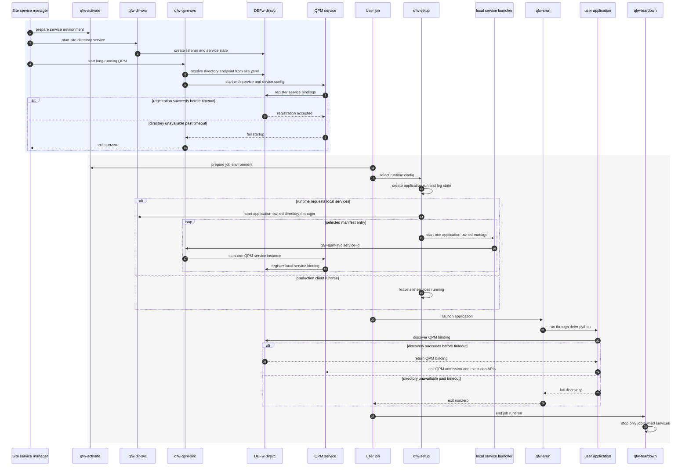
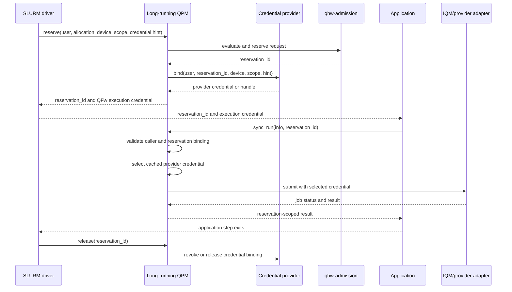
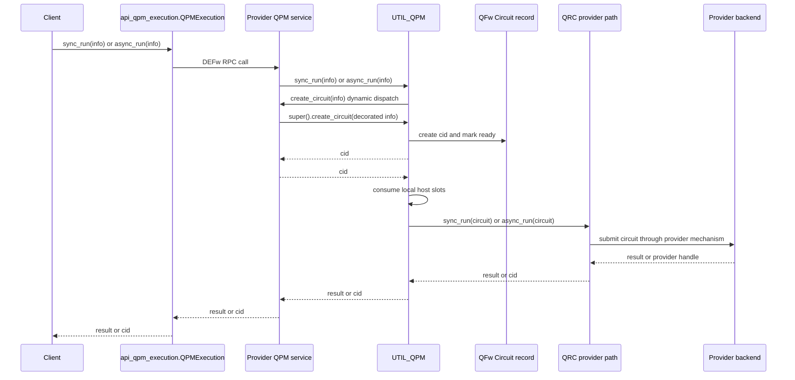
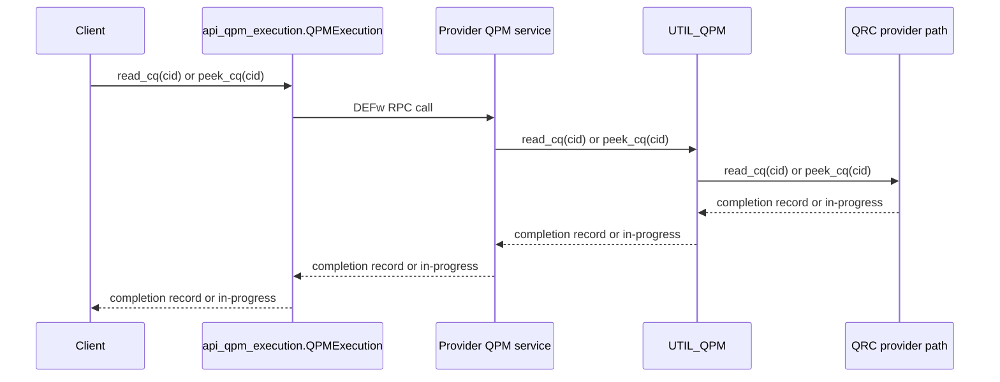
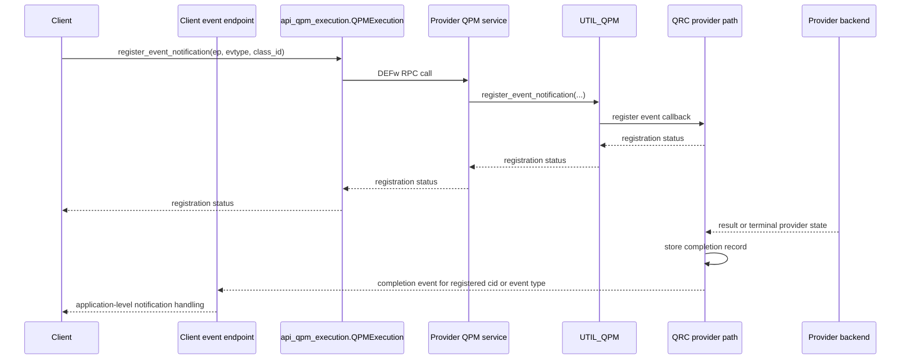
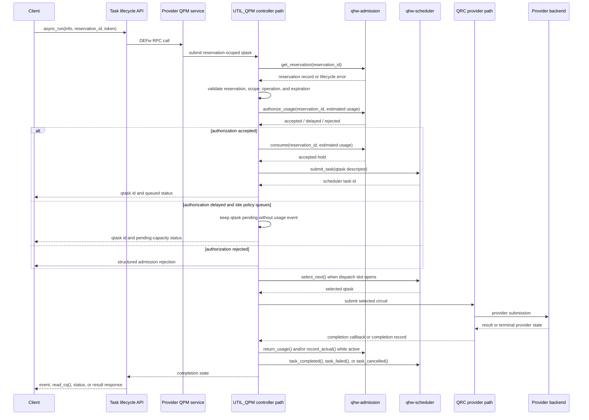
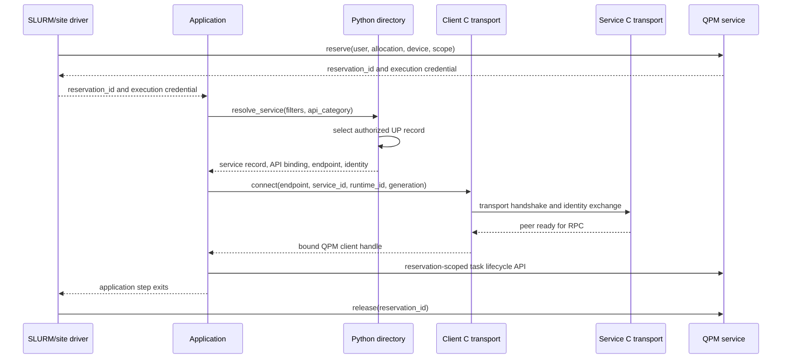
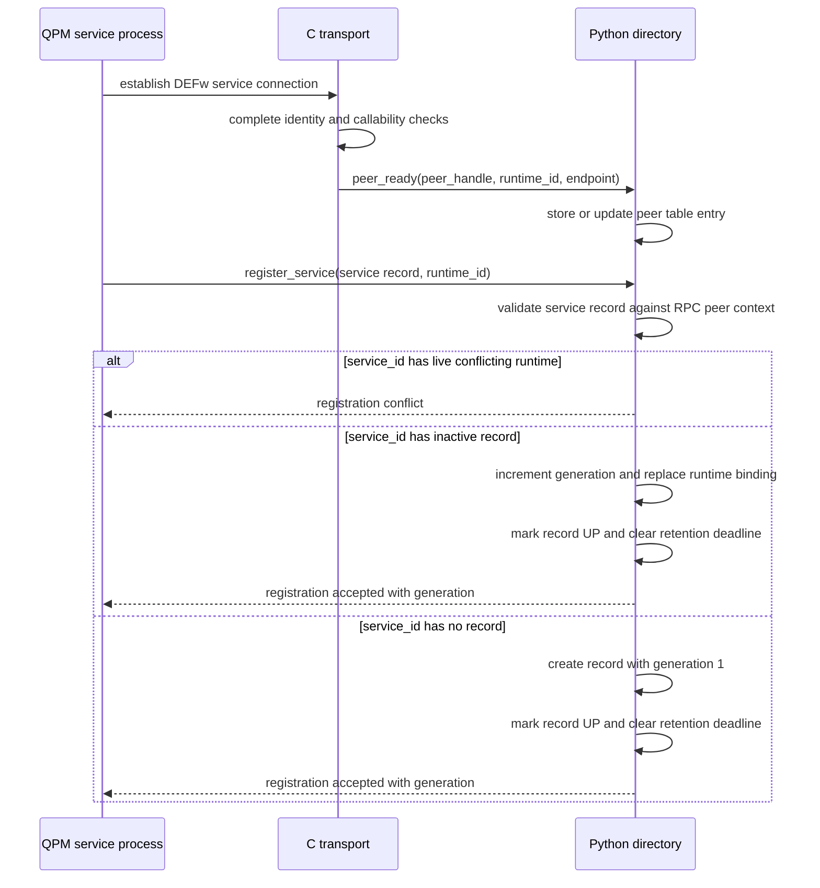
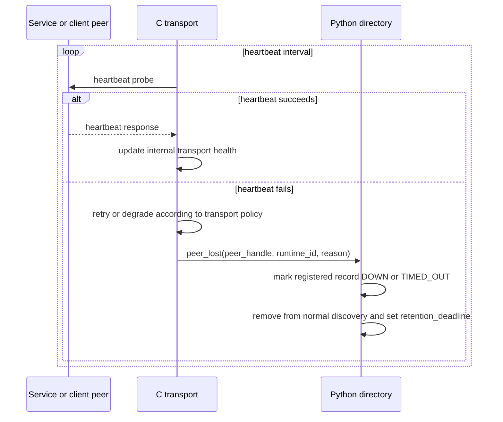
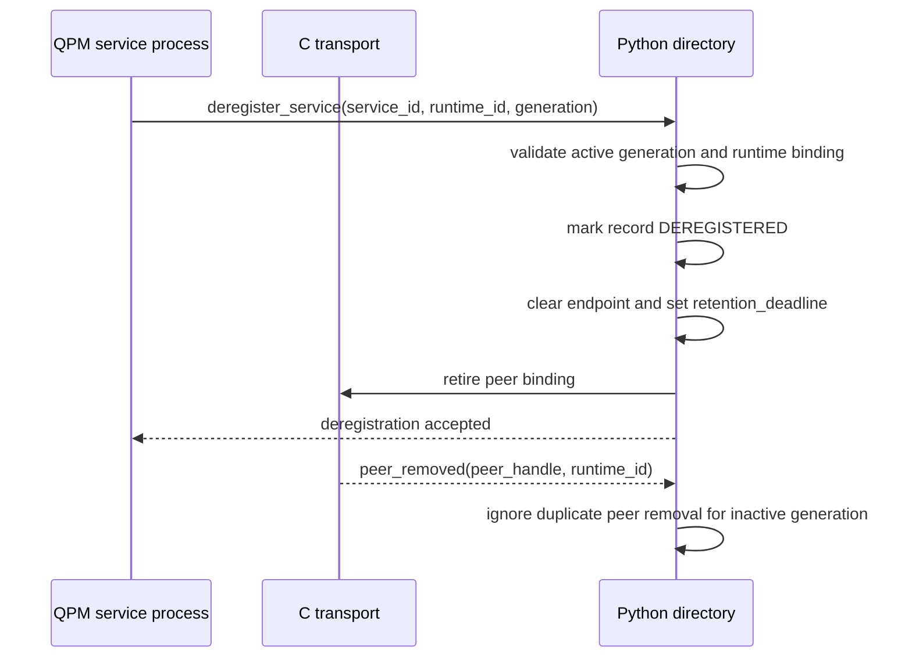

# Detailed Design

## Table Of Contents

- [Purpose](#purpose)
- [Design Context](#design-context)
- [Build And Installation Model](#build-and-installation-model)
- [Installation And Runtime Startup Model](#installation-and-runtime-startup-model)
- [Managed Resource Model](#managed-resource-model)
- [QFw Controller Architecture](#qfw-controller-architecture)
- [Requirement Design Notes](#requirement-design-notes)

<details open>
<summary><strong>Purpose</strong></summary>

## Purpose

This document records implementation-oriented design notes for
`docs/requirements.md`. Each requirement has a matching collapsible subsection
identified by the same requirement ID.

</details>

<details open>
<summary><strong>Design Context</strong></summary>

## Design Context

The QFw client path discovers QPM through DEFw-dirsvc. The Qiskit lookup path
asks DEFw-dirsvc for QPM binding metadata, then calls
`defw.connect_to_binding()` to create the selected QPM client binding. DEFw
directory lookup does not perform capacity accounting or call the QPM
`reserve()` callback.

The current execution flow is:

```text
client
  -> api_qpm.sync_run()/async_run()
  -> QPM service method
  -> UTIL_QPM creates Circuit
  -> QPM/QRC execution path
  -> provider client or frontend
  -> QRC completion queue or event callback
```

The target design separates these concerns. DEFw-dirsvc owns registered-service
discovery for services that choose to register, while QPM owns the active
reservation flow and uses qhw-admission as the authoritative reservation store.
Long-running QPM services remain DEFw-wrapped RPC services. Depending on site
configuration, they either register with a selected DEFw-dirsvc or expose a
configured direct DEFw endpoint that clients resolve without directory-service
registration.

Relevant implementation points:

- `backends/qfw_qiskit/qfw_lookup_service.py` resolves QPM through
  `QPMResolver`, using configured DEFw-dirsvc scopes or a configured direct
  endpoint scope.
- `backends/qfw_qiskit/qpm_resolver.py` resolves service records, selected API
  bindings, and direct endpoint records, then asks DEFw to construct the
  requested service API wrapper.
- `DEFw/python/infra/defw.py` implements `connect_to_binding()` by connecting
  to the selected endpoint and constructing the requested service API wrapper.
- `DEFw/python/services/svc_dirsvc/svc_dirsvc.py` implements registration,
  deregistration, directory queries, binding resolution, and generation checks.
- `services/util/qpm/util_qpm.py` currently owns QPM execution submission,
  local host-slot accounting, completion queues, and event registration.
- Provider-specific QPM services derive from `UTIL_QPM`, set metadata, and
  delegate hardware operations to a provider-specific QRC object.
- QRC owns the current provider execution mechanics, including asynchronous
  Python workers, provider calls, completion records, and callback delivery.
- `backends/qfw_qiskit/qfw_simulator.py` preserves simulator options plus the
  reservation execution context options `reservation_id`, `token`, `timeout`,
  and `cancel_on_timeout` when constructing a `QFwJob`.
- `backends/qfw_qiskit/qfw_job.py` calls `qpm.async_run(info, **context)` and
  rejects unreserved execution when the launcher did not provide
  `reservation_id`.
- `backends/qfw_qiskit/qfw_sampler.py` and
  `backends/qfw_qiskit/qfw_estimator.py` expose `Options.run_options` and
  forward that dictionary to backend `run()` calls.

</details>

<details open>
<summary><strong>Build And Installation Model</strong></summary>

## Build And Installation Model

DEFw should use CMake as its authoritative build and installation system.
SCons is removed after CMake produces equivalent C, SWIG, Python extension,
test, and install artifacts. The migration is behavior-neutral. Transport,
directory, and C/Python interface refactors start after the CMake baseline can
build and install the existing DEFw behavior.

The build should support normal out-of-source CMake workflows:

```text
cmake -S DEFw -B build/defw -DCMAKE_INSTALL_PREFIX=<prefix>
cmake --build build/defw
ctest --test-dir build/defw
cmake --install build/defw
```

A conventional source layout gives CMake stable ownership boundaries:

```text
DEFw/
  CMakeLists.txt
  cmake/
    DEFwConfig.cmake.in
    modules/
  include/defw/
  src/
  swig/
    defw.i
    typemaps/
      compat_charpp.i
      compat_charppp.i
      owned_string.i
      owned_string_list_counted.i
      opaque_handle.i
  python/defw/
  tests/
```

Generated SWIG files belong in the build tree. The source tree should contain
the canonical `.i`, typemap, C, header, and Python sources, while generated C
wrappers, generated Python proxy files, object files, and staging artifacts
stay under the CMake binary directory.

Installation should make DEFw usable without running from the source tree. A
standard install prefix should contain:

```text
<prefix>/include/defw/...
<prefix>/lib/libdefw.so
<prefix>/lib/cmake/DEFw/DEFwConfig.cmake
<prefix>/lib/cmake/DEFw/DEFwTargets.cmake
<prefix>/lib/pythonX.Y/site-packages/defw/_defw.so
<prefix>/lib/pythonX.Y/site-packages/defw/*.py
<prefix>/share/defw/swig/typemaps/*.i
```

C clients use `find_package(DEFw CONFIG REQUIRED)` and link the exported
`DEFw::defw` target. QFw and other Python clients use the installed Python
package with `import defw`. The CMake package should publish include
directories, library targets, runtime search path behavior, Python extension
install location, and the installed SWIG typemap directory for optional
downstream wrappers.

The SWIG cleanup should preserve current DEFw Python API behavior unless an
individual wrapper is explicitly migrated with tests. Existing broad typemaps
remain available as compatibility includes for the current API surface, but new
or refactored interfaces should opt in to narrower typemaps. This lets DEFw
wrap external libraries, such as libfabric, without forcing every interface to
inherit DEFw-specific pointer semantics by default.

The target typemap set should separate compatibility from new contracts:

| Typemap include | Purpose |
| --- | --- |
| `compat_charpp.i` | Preserve existing `char **` output behavior for audited current DEFw APIs. |
| `compat_charppp.i` | Preserve existing `char ***` pointer-return behavior until each API is migrated. |
| `owned_string.i` | Convert malloc/calloc-owned `char **` output to a Python string and free the transferred buffer. A NULL output means allocation failure and raises a Python memory/allocation exception. |
| `owned_string_list_counted.i` | Convert counted `char ***out, size_t *count` output to `list[str]`, then free each transferred string and the transferred array. |
| `opaque_handle.i` | Expose typed opaque handles without enabling arbitrary global `void *` conversion. |

New string-list APIs should prefer an explicit count, such as
`char ***out, size_t *count`, over an uncounted `char ***`. The counted typemap
returns a Python list of strings and owns cleanup for malloc/calloc-transferred
memory. Existing uncounted `char ***` wrappers should keep their current return
shape until a targeted migration changes that API and adds tests.

The commented global `void *` typemap should be removed rather than carried as
dead code. Peer handles and future libfabric handles should use typed opaque
handle wrappers or library-specific SWIG modules. That keeps external-library
wrapping possible while preventing accidental conversion of unrelated raw
pointers.

CMake validation should include build-tree imports and install-tree imports.
Tests should cover generated SWIG outputs, installed Python package imports,
exported CMake targets, runtime search paths, string output typemaps, counted
string-list typemaps, compatibility typemaps used by current wrappers, NULL
allocation-failure handling, and typed opaque-handle round trips.

</details>

<details open>
<summary><strong>Installation And Runtime Startup Model</strong></summary>

## Installation And Runtime Startup Model

QFw supports two runtime layouts. A source-tree layout is used for development
and local testing. An installed-prefix layout is used for shared cluster
deployments. Both layouts expose the same command surface, so applications and
batch scripts do not depend on the filesystem shape behind the installation.

The installed prefix owns QFw commands, role launchers, installed Python
packages, service definitions, default configuration templates, and examples.
DEFw may be installed in the same prefix or in a separate prefix selected by
site configuration. On a system installation, the software prefix should live
under `/opt/openqse`, such as `/opt/openqse/qfw/current`. Client-readable
default configuration files live under the QFw installation. Privileged
service and device configuration belongs under `/etc/openqse/qfw` or a
site-selected equivalent. A typical combined prefix has this shape:

```text
<prefix>/
  bin/
    qfw-activate
    defw-python
    qfw-setup
    qfw-status
    qfw-srun
    qfw-teardown
    qfw-dir-svc
    qfw-qpm-svc
  libexec/qfw/
    qfw-setup-driver
    service-lifecycle/
    shell-helpers/
  lib/qfw/
    services/
    service-apis/
  lib/pythonX.Y/site-packages/
    qfw_qiskit/
    defw/
  share/qfw/
    examples/
    config/
      site.yaml
      runtime.yaml
      runtime/
        local.yaml
        hybrid.yaml
      services/
        local-services.yaml
        site-services.yaml
  share/defw/
    config/
      defw_generic.yaml
```

The canonical `site.yaml` records installation paths, site directory discovery,
the site service manifest, device-access configuration, and common QPM runtime
policy. The default runtime file is client-readable. Client and job behavior
comes from a runtime configuration selected by `qfw-setup`, wrapper defaults,
or an explicit operator override. Configuration files form the stable
deployment contract.

### Installation Paths

The implementation uses fixed installed locations for packaged QFw material.
The examples below use `/opt/openqse/qfw/current` as the QFw prefix and
`/opt/openqse/defw/current` as the DEFw prefix. A deployment may choose a
different prefix, but the relative paths under each prefix remain the same.

| Path | Owner | Purpose |
| --- | --- | --- |
| `/opt/openqse/qfw/current` | QFw package | QFw installation prefix, exported as `QFW_PREFIX`. |
| `/opt/openqse/qfw/current/bin/qfw-activate` | QFw package | Shell activation entry point. |
| `/opt/openqse/qfw/current/bin/defw-python` | QFw package | DEFw-backed Python launcher for user applications. |
| `/opt/openqse/qfw/current/bin/qfw-setup` | QFw package | User job setup command. |
| `/opt/openqse/qfw/current/bin/qfw-status` | QFw package | User job status command. |
| `/opt/openqse/qfw/current/bin/qfw-srun` | QFw package | User application launch command. |
| `/opt/openqse/qfw/current/bin/qfw-teardown` | QFw package | User job cleanup command. |
| `/opt/openqse/qfw/current/bin/qfw-dir-svc` | QFw package | One directory-service manager. |
| `/opt/openqse/qfw/current/bin/qfw-qpm-svc` | QFw package | One QPM and optional DVM manager. |
| `/opt/openqse/qfw/current/libexec/qfw` | QFw package | Private helper scripts used by public commands. |
| `/opt/openqse/qfw/current/lib/qfw/services` | QFw package | Installed QPM and utility service modules. |
| `/opt/openqse/qfw/current/lib/qfw/service-apis` | QFw package | Installed DEFw service API bindings and proxies. |
| `/opt/openqse/qfw/current/lib/pythonX.Y/site-packages` | QFw package | Installed QFw Python packages and adapters. |
| `/opt/openqse/qfw/current/share/qfw/config/site.yaml` | QFw package | Default client-readable site configuration. |
| `/opt/openqse/qfw/current/share/qfw/config/runtime.yaml` | QFw package | Implicit site-only runtime profile. |
| `/opt/openqse/qfw/current/share/qfw/config/runtime/local.yaml` | QFw package | Local runtime profile. |
| `/opt/openqse/qfw/current/share/qfw/config/runtime/hybrid.yaml` | QFw package | Hybrid runtime profile. |
| `/opt/openqse/qfw/current/share/qfw/config/services/local-services.yaml` | QFw package | Job-local simulator and fake-device inventory with local launch policy. |
| `/opt/openqse/qfw/current/share/qfw/config/services/site-services.yaml` | QFw package | Reference inventory for site-owned hardware QPM services. |
| `/opt/openqse/qfw/current/share/qfw/examples` | QFw package | Installed examples. |
| `/opt/openqse/defw/current` | DEFw package | DEFw installation prefix, exported as `DEFW_PREFIX`. |
| `/opt/openqse/defw/current/share/defw/config/defw_generic.yaml` | DEFw package | Default DEFw configuration template. |

Site-owned files live outside the software prefix when they contain privileged
policy or service material. These files are not modified by normal user jobs:

| Path | Owner | Purpose |
| --- | --- | --- |
| `/etc/openqse/qfw/env.sh` | Site | Environment file for service-manager units. |
| `/etc/openqse/qfw/site.yaml` | Site | Site directory, service inventory, device-access path, and common QPM policy. |
| `/etc/openqse/qfw/services/site-services.yaml` | Site | Active inventory of site-owned QPM services. |
| `/etc/openqse/qfw/device/device-access.yaml` | Site | Provider devices and credential-provider selection. |

The default user-facing site configuration remains the packaged
`share/qfw/config/site.yaml` unless `--site-config` or `QFW_SITE_CONFIG`
selects a different file. Job-local service inventory remains packaged under
`share/qfw/config/services/local-services.yaml`; a standard installation does not
copy it to `/etc/openqse/qfw`.

### Activation

`qfw-activate` is an environment bootstrap step. It makes QFw commands and
runtime paths visible in the current shell, prepends `(qfw) ` to the existing
prompt, and defines `qfw-deactivate` to restore the previous environment and
prompt. Existing prompt escapes and dynamic behavior remain intact. The QFw
activation layer owns this prefix; virtual-environment activation does not
supply it. Activation does not start a directory
service, start QPM, register a service, connect to a directory service, or
replace the user's Python executable.

Every public command installed under `<prefix>/bin` must be executable.
Activation prepends that directory to `PATH` so users and service wrappers can
call `qfw-setup`, `qfw-status`, `qfw-srun`, `qfw-teardown`, `qfw-dir-svc`,
and `qfw-qpm-svc` by name. Activation also augments `LD_LIBRARY_PATH` only for
libraries that are not already reachable through RPATH or runpath.

An installed activation exports the logical path variables used by the role
wrappers:

```bash
QFW_PREFIX=/opt/openqse/qfw/current
QFW_BIN_PATH=$QFW_PREFIX/bin
QFW_LIBEXEC_DIR=$QFW_PREFIX/libexec/qfw
QFW_SHARE_DIR=$QFW_PREFIX/share/qfw
QFW_CONFIG_DIR=/etc/openqse/qfw
QFW_SITE_CONFIG=$QFW_SHARE_DIR/config/site.yaml
DEFW_PREFIX=/opt/openqse/defw/current
DEFW_CONFIG_PATH=$DEFW_PREFIX/share/defw/config/defw_generic.yaml
```

When DEFw is installed in the same prefix as QFw, `DEFW_PREFIX` points at
`QFW_PREFIX`. A source-tree activation exports the same logical variables, but
resolves them to checkout-relative directories. This keeps scripts from
encoding source paths such as `QFw/setup` or `QFw/DEFw/src`.

Activation may also add installed QFw and DEFw Python package directories to
`PYTHONPATH` for source or non-wheel deployments. A normal Python package
installation should prefer the active environment's site-packages over ad hoc
path injection.

### DEFw Python Entry Point

DEFw embeds CPython in the `defwp` executable. QFw therefore needs an explicit
Python-through-DEFw entry point for client applications and command-line
helpers that must run inside a DEFw agent. The installed entry point is named
`defw-python`.

`defw-python` preserves the user's active Python environment. It detects the
active virtual environment through `VIRTUAL_ENV` or through `python3` and adds
that environment's site-packages to the interpreter search path used by DEFw.
It then invokes the installed `defwp-wrapper` with the original script and
arguments.

```bash
source /path/to/user/venv/bin/activate
pip install qiskit pennylane supermarq
source /opt/openqse/qfw/current/bin/qfw-activate
defw-python my_app.py
```

DEFw and the active virtual environment must use the same Python major and
minor version. `defw-python` checks the active Python version against
`defwp --py-version` and fails with a direct diagnostic when they differ. This
keeps user dependencies in the user's virtual environment while avoiding the
source-mode practice of replacing `python`, `python3`, and `pythonX.Y` inside
the virtual environment.

The venv-rewriting behavior can remain as an explicit legacy development
option. Installed deployments use `defw-python` and leave the Python
environment intact.

### Runtime Roles

Installed public commands use hyphenated names. Source modules may keep normal
Python naming, but user-facing executables should not mix underscores and
hyphens. QFw startup has three layers.

`qfw-activate` is the common environment bootstrap. It prepares commands,
library paths, Python paths, and DEFw defaults for every role. It does not own
any process lifecycle.

`qfw-setup`, `qfw-status`, `qfw-srun`, and `qfw-teardown` define the user job
lifecycle.
This lifecycle is used for both production client jobs and local simulator
jobs. `qfw-setup` reads `site.yaml`, reads the selected runtime configuration,
creates job-owned run and log directories, and validates resolver policy. When
`local-services` is present, it delegates the application-owned directory to
the `qfw-dir-svc` lifecycle engine and each selected QPM and optional DVM to
the `qfw-qpm-svc` lifecycle engine. It records those manager run directories
and the generated directory connection record in application state.
`qfw-srun` runs the user application in the prepared QFw context through
`defw-python`. `qfw-status` composes the recorded runtime with current manager
health. `qfw-teardown` stops the recorded QPM managers and directory manager in
reverse order, then cleans job-owned runtime state. It never stops site-owned
service managers.

Each setup invocation creates one run directory for one logical application
run. Several application steps may use that directory through `qfw-srun`.
Activation is reusable across sequential or concurrent application runtimes;
it does not select an application run directory.

`qfw-dir-svc` and `qfw-qpm-svc` define the operator-facing service lifecycle.
Each manager accepts one explicit run directory and supports `start`, `run`,
`status`, and `stop`. The directory manager owns one DEFw directory service.
The QPM manager owns one named QPM and starts a PRTE DVM only when its provider
requires one. The role managers invoke a private installed Python module when
they need to start a DEFw process on another node.

| Command | Lifecycle | Responsibility |
| --- | --- | --- |
| `qfw-activate` | Environment | Prepare QFw, DEFw, Python, and library paths for the current shell or service unit. |
| `qfw-setup` | User job | Prepare a job runtime context and orchestrate requested application-owned role managers. |
| `qfw-status` | User job | Report runtime state and recorded role-manager health. |
| `qfw-srun` | User job | Run one application in the prepared QFw runtime context. |
| `qfw-teardown` | User job | Stop recorded application-owned role managers and clean job runtime state. |
| `qfw-dir-svc` | Service | Manage one DEFw directory-service instance. |
| `qfw-qpm-svc` | Service | Manage one QPM and its optional PRTE DVM. |

The job lifecycle and service lifecycle share lower-level helpers for config
loading, DEFw preparation, run-directory creation, PID files, signal handling,
and cleanup. The user-visible lifecycles remain separate so user job cleanup
cannot stop site-owned services.

### Deployment Modes

Production deployments run site infrastructure outside user allocations. The
site starts the production directory service and long-running QPM services
through privileged service management. User jobs still use the standard job
lifecycle, but `qfw-setup` starts no local services when the runtime file does
not contain `local-services`.

Simulator and development deployments use the same job lifecycle. A named
runtime profile opts in to local service startup. The local profile starts a
job-owned DEFw-dirsvc, launcher, PRTE or other simulator support, and QPM
services, then uses only those local services for discovery. The hybrid profile
starts the same local services while also allowing discovery through the site
directory. `qfw-teardown` stops the job-owned processes and clears the run
directory.

The normal user flow is the same in both modes:

```bash
source /opt/openqse/qfw/current/bin/qfw-activate
qfw-setup
qfw-status
qfw-srun my_app.py
qfw-teardown
```

Local simulator jobs select the local profile:

```bash
source /opt/openqse/qfw/current/bin/qfw-activate
qfw-setup --profile local
qfw-status
qfw-srun my_app.py
qfw-teardown
```

Site services use independent role managers instead of the job lifecycle:

```bash
source /opt/openqse/qfw/current/bin/qfw-activate
qfw-dir-svc start \
  --run-dir /shared/openqse/qfw/services/directory \
  --site-config /etc/openqse/qfw/site.yaml \
  --scope site \
  --node dirsvc01
qfw-qpm-svc start \
  --run-dir /shared/openqse/qfw/services/iqm-ornl-20q \
  --service-id iqm-ornl-20q \
  --site-config /etc/openqse/qfw/site.yaml \
  --scope site \
  --node qpm01
```

A service manager may either source `qfw-activate` in a small wrapper or use an
equivalent environment file, such as `/etc/openqse/qfw/env.sh`, before calling
the executable under `/opt/openqse/qfw/current/bin`.

Long-running production services should be manageable through Linux service
management when the host supports it. A site package can install systemd unit
templates such as `qfw-dirsvc@.service` and `qfw-qpm@.service`. A deployment
can then start, stop, restart, and enable specific service instances with
standard commands:

```bash
systemctl enable --now qfw-dirsvc@site.service
systemctl enable --now qfw-qpm@iqm.service
systemctl restart qfw-qpm@iqm.service
```

The unit should load `/etc/openqse/qfw/env.sh` or call a wrapper that sources
`qfw-activate`, then use `qfw-dir-svc run` or `qfw-qpm-svc run`. The foreground
`run` action lets systemd supervise the manager and trigger reverse-order
cleanup with SIGTERM. For QPM units, the instance configuration supplies one
service ID and one QPM run directory. A deployment that runs several
production QPM services enables several `qfw-qpm@...` units.

The selected behavior comes from client runtime configuration or an explicit
command-line option. It does not come from `site.yaml`. The compatibility
between production and local deployments comes from keeping the user job flow
the same.

The following sequence shows the two lifecycles and where they meet:



### Site Configuration

The canonical site configuration records installed prefixes, the site
directory endpoint, the site service manifest, the device-access path, and
common QPM runtime policy. Clients use its directory section. Site service
launchers also use the service and QPM sections. Provider secrets remain in
the credential store referenced by the device-access file.

Each QFw installation provides a default site configuration path:

```text
<prefix>/share/qfw/config/site.yaml
```

`qfw-setup` resolves the site configuration in this order:

1. `qfw-setup --site-config <path>`;
2. `QFW_SITE_CONFIG`;
3. `<prefix>/share/qfw/config/site.yaml`.

The command-line override is intended for debugging, tests, alternate local
deployments, and service-manager wiring. `QFW_SITE_CONFIG` may also select a
non-default site file when a site wrapper or service manager prepares the
environment.

Production deployments may manage the active site file through site packaging
or set `QFW_SITE_CONFIG` to a site-owned path such as
`/etc/openqse/qfw/site.yaml`. Device material and the site service inventory
live outside the software prefix so permissions can differ by configuration
class:

```text
/etc/openqse/qfw/site.yaml
/etc/openqse/qfw/env.sh
/etc/openqse/qfw/services/site-services.yaml
/etc/openqse/qfw/device/device-access.yaml
```

The production site file can be written as:

```yaml
install:
  qfw-prefix: /opt/openqse/qfw/current
  defw-prefix: /opt/openqse/defw/current

directory-service:
  name: ornl-site-dirsvc
  listen-port: 8090
  connect-timeout-seconds: 300
  connection-file: /shared/openqse/qfw/directory-service.json

service:
  manifest: /etc/openqse/qfw/services/site-services.yaml
  device-access-config: /etc/openqse/qfw/device/device-access.yaml

qpm:
  completion-queues:
    retention:
      completion-ttl-seconds: 3600
      terminal-reservation-retention-seconds: 3600
      max-records-per-reservation: 1024
      max-bytes-per-reservation: 67108864
      purge-interval-seconds: 60
```

Configuration paths may reference activated environment variables with the
strict `${NAME}` form. `qfw-activate` establishes `QFW_PREFIX` and
`DEFW_PREFIX` before QFw reads the site and runtime files. Referencing an unset
or empty variable is an error. Unbraced `$NAME` references and legacy
angle-bracket placeholders are invalid.

A source-tree development site file may use the same shape with a localhost
site endpoint. That endpoint gives the implicit profile a directory to query
during local development:

```yaml
install:
  qfw-prefix: /home/user/openQSE/QFw
  defw-prefix: /home/user/openQSE/QFw/DEFw

directory-service:
  name: qfw-local-dirsvc
  endpoint: localhost:8090
  connect-timeout-seconds: 300

service:
  manifest: ${QFW_PREFIX}/share/qfw/config/services/site-services.yaml
  device-access-config: /etc/openqse/qfw/device/device-access.yaml
```

Local and hybrid profiles create a separate job-local endpoint from runtime
settings, described below.

The path to the canonical configuration is exported as `QFW_SITE_CONFIG`.
Source-tree examples are templates only; production startup should not depend
on writable source-tree files.

### Directory Readiness

Clients and QPM services must not run indefinitely without a reachable
directory service. Each configured directory endpoint has a bounded connection
window. The default timeout is 300 seconds. Site endpoints set this value
through `connect-timeout-seconds` in `site.yaml`; job-local endpoints set it
through the selected runtime profile.

`qfw-setup` waits for the directory endpoint needed by the selected runtime
configuration. A production client job waits for the site directory service. A
local profile job starts the local directory service and then waits for it to
accept registrations and lookups. A hybrid profile job waits for both the
started local directory service and the configured site directory service. If a
required directory is not reachable before the timeout, setup fails and
`qfw-srun` should not run the application.

`qfw-qpm-svc` uses the same timeout when starting one named service instance.
The QPM must register its bindings with the configured directory before it is
considered ready. If registration cannot complete before the timeout, the
manager exits nonzero and cleans its owned components. This prevents it from
continuing in a state where clients cannot discover it.

`qfw-srun` may also validate the prepared directory environment before
launching the application. A direct client lookup that loses directory
connectivity returns a structured discovery error rather than falling back to
an undiscoverable QPM.

### Client Runtime Configuration

Client runtime configuration controls how a job discovers services and whether
the job starts local services. It is a client or job selection, not a site
configuration file.

Each QFw installation provides runtime profile templates. The implicit profile
is selected when `qfw-setup` receives no profile or explicit runtime file:

```text
<prefix>/share/qfw/config/runtime.yaml
```

The implicit profile is the production/client shape. It uses only the
site-global directory endpoint from the selected `site.yaml` and starts no
job-owned services:

```yaml
resolver:
  scope-order:
    - site
```

Named profiles map to installed runtime templates under:

```text
<prefix>/share/qfw/config/runtime/
```

The local profile launches a job-owned directory service and local QPM
services. It never queries the site-global directory service:

```text
<prefix>/share/qfw/config/runtime/local.yaml
```

```yaml
resolver:
  scope-order:
    - local

local-services:
  start-dirsvc: true
  start-qpm: true
```

The hybrid profile launches local services and can also discover site-global
services. The resolver tries local services first and then the site-global
directory when the requested service is not available locally:

```text
<prefix>/share/qfw/config/runtime/hybrid.yaml
```

```yaml
resolver:
  scope-order:
    - local
    - site

local-services:
  start-dirsvc: true
  start-qpm: true
```

The local directory endpoint is prepared from runtime configuration. A runtime
can set a fixed `endpoint` when the bind address and port are known in advance.
For normal job-local startup, the runtime names the bind host and lets
`qfw-setup` choose a free port:

```yaml
local-services:
  dirsvc:
    name: qfw-local-dirsvc
    bind-host: 127.0.0.1
    port: auto
  service-manifest: ${QFW_PREFIX}/share/qfw/config/services/local-services.yaml
```

When `local-services.start-dirsvc` is true, `qfw-setup` starts a job-owned
DEFw-dirsvc at the resolved local endpoint and waits for it to accept
registrations and lookups. Job-owned QPM services register with that local
directory. Site-global services continue to register with the site directory
from `site.yaml`.

`qfw-setup` keeps generated local endpoints in the launcher environment. It
sets the DEFw listener and parent-directory environment values used by the
job-owned DEFw-dirsvc, QPM services, and `qfw-srun`. Dynamic endpoints are
never written back to `site.yaml`, installed runtime templates, or an endpoint
state file. Service wrappers and client resolvers read the prepared
environment to find the local directory endpoint, the site directory endpoint,
and the selected lookup order. The QFw shell wrapper layer must make this
environment visible to `qfw-srun`; a standalone setup subprocess cannot export
new values back to its parent shell.

Clients and wrappers resolve the runtime configuration in this order:

1. explicit command-line option, such as `qfw-setup --runtime-config`;
2. explicit profile, such as `qfw-setup --profile local`;
3. `QFW_RUNTIME_CONFIG`;
4. `QFW_RUNTIME_PROFILE`;
5. the installed default runtime at `<prefix>/share/qfw/config/runtime.yaml`.

A profile name resolves to
`<prefix>/share/qfw/config/runtime/<profile>.yaml`. The implicit profile is
the installed default runtime file and does not require a profile name.

This keeps production client jobs on the installed default. Examples, tests,
and local simulator runs select a named profile or a dedicated runtime file
explicitly.

For example, a local simulator run can select the local profile:

```bash
qfw-setup --profile local
qfw-srun my_app.py
qfw-teardown
```

A hybrid run starts local services while still allowing discovery of
site-global services:

```bash
qfw-setup --profile hybrid
qfw-srun my_app.py
qfw-teardown
```

If `local-services` is absent, `qfw-setup` starts no local services. This
keeps production client jobs on the site-only discovery path while letting each
runtime file decide whether local infrastructure is created.

### Job-Local Service Manifest

The job-local service manifest describes QPM and simulator services that QFw
starts inside a user job. The package-owned installed form is:

```text
<prefix>/share/qfw/config/services/local-services.yaml
```

Local and hybrid runtime profiles reference this manifest. It contains
simulators and the fake IQM service. Hardware QPMs are site-owned services with
an independent lifecycle.

The packaged manifest is the normal service inventory for local and hybrid
profiles. A standard installation does not copy this file to
`/etc/openqse/qfw`. The runtime profile may select a subset of manifest entries
for a particular local job. If a profile does not provide a subset,
`qfw-setup` starts all entries in the packaged manifest.

Each manifest entry names one service and the information needed to start it:

| Field | Meaning |
| --- | --- |
| `name` | Stable service name used by runtime profile selection and logs. |
| `module` | QPM service module to start. |
| `load-modules` | DEFw modules loaded into the service process. |
| `agent-prefix` | Prefix used for the DEFw agent name. |
| `target` | Launch target or placement group selected by the local runtime. |
| `assigned-hosts` | Optional host group for simulator or local service placement. |
| `assigned-hosts-env` | Environment variable that receives the selected host list. |
| `device-id` | Optional device profile identifier for device-backed QPM services. |
| `provider-launch` | Launch type and optional wrapper for the selected local provider. |

The manifest also contains the `mpi-launch` block used by local simulator
services. This keeps allocation-specific MPI policy with the services that
consume it. Provider wrappers live in each service's `provider-launch` block.

`qfw-setup` expands the selected runtime profile into one manager request per
selected manifest entry. It invokes the `qfw-qpm-svc` lifecycle engine once
for each selected QPM. Each manager starts only its named service and reports
readiness only after registration with the application directory. If a
required entry fails, setup stops all application-owned managers already
started and reports a failed runtime.

### Configure Profiles

Install-profile files, such as the YAML files under `setup/config`, are inputs
to `qfw_configure`. They select the source or install base, module or explicit
dependency paths, virtual environment, MPI transport setup, dependency build
version, and installation defaults. `qfw_configure` uses these profiles to
generate activation and build helper scripts. Clients and QPM services do not
read them during normal execution.

The existing `runtime-mode` key in these profiles describes the configure
environment, such as `cluster` or `container`. It is separate from client
runtime behavior and resolver order.

### Site Service Manifest And QPM Policy

Site-owned services use the manifest selected by `service.manifest` in
`site.yaml`. A packaged reference lives at:

```text
<prefix>/share/qfw/config/services/site-services.yaml
```

The site manifest contains native hardware QPM entries, including the IQM QPM
and the experimental QRMI/QDMI shim. It identifies modules, API bindings,
device IDs, and provider launch types. It carries no Slurm group placement or
MPI simulator settings. A production installation may copy and customize this
manifest under `/etc/openqse/qfw/services`.

Common QPM runtime behavior belongs in the `qpm` section of `site.yaml`. The
`qpm.completion-queues.retention` block controls completion queue TTL and
retention limits for every QPM started with that site configuration:

```yaml
qpm:
  completion-queues:
    retention:
      completion-ttl-seconds: 3600
      terminal-reservation-retention-seconds: 3600
      max-records-per-reservation: 1024
      max-bytes-per-reservation: 67108864
      purge-interval-seconds: 60
```

If the block is omitted, QPM uses these defaults:

| Key | Default | Meaning |
| --- | --- | --- |
| `completion-ttl-seconds` | `3600` | A completed queue record may be retained for up to one hour after enqueue. |
| `terminal-reservation-retention-seconds` | `3600` | A terminal reservation's completion queue may remain readable for up to one hour after release, cancel, or expiration. |
| `max-records-per-reservation` | `1024` | QPM may evict the oldest completed queue records once one reservation exceeds this count. |
| `max-bytes-per-reservation` | `67108864` | QPM may evict the oldest completed queue records once measured retained result bytes for one reservation exceed 64 MiB. When result size cannot be measured, the byte limit is skipped but TTL and record-count limits still apply. |
| `purge-interval-seconds` | `60` | QPM should scan for expired completion records at least once per minute while the service is active. |

Explicit non-positive values are invalid except where a future schema version
defines a named value such as `unlimited`. Invalid explicit retention settings
should fail QPM readiness rather than silently disabling queue bounds.

### Device Access Configuration

Device-access configuration contains provider endpoints, provider device
aliases, library preferences, per-device capability overrides, and credential
provider selection. Source-tree files under `services/dev-config` are
development templates. Development installations place them under
`<prefix>/lib/qfw/services/dev-config`. Production configuration belongs under
a protected site-owned path such as
`/etc/openqse/qfw/device/device-access.yaml`. The
`service.device-access-config` field in `site.yaml` selects the active file.
User jobs should not receive the credential store referenced by that file.

QPM obtains provider secrets through a credential-provider interface. The
interface is a QFw service-side Python module or library used by QPM before it
calls QRMI, QDMI, or a provider adapter. The caller passes the authenticated
caller identity, device id, provider name, and requested operation. The
provider returns the credential material or a credential handle needed by the
adapter. User applications, directory discovery, qhw-admission, and
qhw-scheduler never receive provider API keys.

The credential provider is called when a QPM creates or first needs a
service-side caller session. QPM caches the returned provider credential inside
the service process and reuses it for later submit, status, cancel, and result
operations. The cache entry is scoped by caller identity, device id, provider,
and credential scope. Deregistration, disconnect, session timeout, credential
expiration, provider refresh failure, or policy revocation removes the cached
entry. QPM still authorizes every operation against QPM policy and reservation
state; cached provider credentials do not grant blanket access to QPM APIs.

Production credential providers run with the QPM service identity and may read
site secret stores, privileged files, hardware security modules, external
credential services, or site-specific plugins. Local and hybrid profiles run
job-owned QPM services with user-level permissions. Those profiles should use
simulators, development credentials, or explicitly safe test material rather
than production hardware credentials. No provider secret is exported to the
user application environment.

The referenced device-access file can be written as:

```yaml
qpus:
  ornl-iqm-20q:
    provider: iqm
    provider-device-id: default
    url: https://qccsw.ccs.ornl.gov/
    credential-provider: iqm-site
    libraries:
      - qrmi
      - qdmi
    preference: qdmi
    execution-owner: qrmi

credential-providers:
  iqm-site:
    type: site-plugin
    plugin: openqse_qfw_iqm_credentials
  iqm-dev-yaml:
    type: yaml-file
    path: /path/to/dev/qpu-users.yaml
```

The YAML credential provider is a reference and development implementation.
Its input file can be written as:

```yaml
users:
  alice:
    devices:
      ornl-iqm-20q:
        api-key: iqm-token-reference-or-secret
```

### Reservation-Scoped Provider Credentials

A long-running QPM that serves more than one user resolves provider credentials
at reservation scope. The service process identity is not treated as the
hardware caller. It is only the identity that is allowed to run the QPM and to
access privileged credential-provider configuration.

The QPM starts with credential-provider configuration from the device-access
file. The configured provider may be a site plugin, a protected secret store, a
SLURM-owned helper, or a development file-backed provider. QPM execution code
calls the provider through a common interface and does not depend on the backing
store format. A development provider may read the `qpu_users.json` file named by
the device-access YAML, while a production provider may return an opaque handle
or short-lived credential from a site-managed service.

Directory service registration never carries provider API keys. The directory
record advertises the QPM service, API bindings, provider, device identity, and
selector metadata. Privileged credential exchange happens through the trusted
reservation path, not through service discovery.

The SLURM plugin or site driver initiates a reservation using trusted launcher
context. The request binds a user identity, allocation or job identity, target
device, requested scope, and policy metadata. It may also carry either a
provider credential handle or a credential-provider hint. When the QPM accepts
the reservation, it asks the configured provider to bind a provider credential
to that reservation. If the driver supplies a credential handle, QPM validates
the handle with the provider before storing it.

The credential cache is internal to the QPM process. Entries are keyed by the
normalized reservation id, user identity, device id, provider, and credential
scope. The cached value may be raw provider credential material when the
deployment policy allows that, or an opaque handle that the lower adapter can
exchange for a provider session. Raw values are never placed in directory
records, application environments, normal logs, qhw-admission records, or
qhw-scheduler records.

Applications receive a reservation id and a QFw execution credential or trusted
launcher context. They do not receive the provider API key. On `sync_run`,
`async_run`, status, cancel, or result retrieval, QPM validates the caller
against the reservation binding before touching the provider credential cache.
After validation, QPM selects the cache entry for the reservation and caller
scope, creates or reuses a provider client for that credential, and passes the
credential to the lower adapter submission path. For IQM this means the selected
credential is passed to the IQM client used for run creation, submission, job
status, cancellation, and result retrieval.

Credential lifetime follows reservation and provider policy. Release, cancel,
reservation expiration, user disconnect, provider refresh failure, or explicit
revocation removes the cached entry and any provider client derived from it. A
resource-affecting operation with no valid reservation-scoped credential fails
before provider submission.

For example and Docker validation, `examples/qfw_slurm_driver.sh` is the
canonical development stand-in for the future SLURM/SPANK integration. The
driver runs after `qfw-setup` and before `qfw-teardown` in allocation-local
profiles, and after an application-scoped `qfw-setup` in site or long-running
profiles. In both modes it performs the same reserve, launch, and release
sequence. It resolves QPM through the active QFw runtime, creates a reservation
from trusted launcher metadata, exports `QFW_RESERVATION_ID` only for the
application step, launches the application with `qfw-srun`, releases the
reservation after the application step returns, and emits JSON evidence. The
application never creates the normal execution reservation itself; it only uses
the launcher-supplied reservation context.

The expected long-running QPM flow is:



QPM services register with directory services. Clients only resolve services
and bind to the selected endpoint. A long-running QPM reads the site
configuration at startup to locate the site DEFw-dirsvc. It reads
the site service manifest, device-access path, and QPM policy from that same
configuration, then registers service records with selected API bindings. User
applications read the runtime environment prepared by `qfw-setup`, then connect
directly to the selected QPM binding.

### Environment Variables

Configuration files are the primary deployment interface. Environment variables
select a configuration file, override a narrow setting for tests or one-off
runs, or expose paths prepared by activation. Command-line options take
precedence over environment variables when both are present.

Client and resolver variables:

| Variable | Purpose |
| --- | --- |
| `QFW_SITE_CONFIG` | Path to the canonical QFw site configuration. |
| `QFW_RUNTIME_CONFIG` | Optional path to any runtime-schema YAML file. |
| `QFW_RUNTIME_PROFILE` | Optional profile name, such as `local` or `hybrid`, used when no explicit runtime path is supplied. |
| `QFW_SITE_DIRSVC_ENDPOINTS` | Override for site directory endpoints from `site.yaml`; normally unset. |
| `QFW_QPM_RESOLVER_SCOPE_ORDER` | Override for `resolver.scope-order` from runtime configuration. |
| `QFW_QPM_DIRECT_ENDPOINT_ENABLED` | Enables the configured direct-endpoint resolver scope for an explicitly configured direct QPM. |
| `QFW_DIRECT_QPM_ENDPOINT` | Configured direct DEFw endpoint for an unregistered or directly selected long-running QPM. |
| `QFW_DIRECT_QPM_SERVICE_MODULE` | Optional service module override for a direct endpoint binding. |
| `QFW_DIRECT_QPM_SERVICE_CLASS` | Optional service class override for a direct endpoint binding. |

Service-launch variables:

| Variable | Purpose |
| --- | --- |
| `QFW_QPM_OPERATION_MODE` | QPM operation-mode override, such as `long-running` or `qfw-managed`. |
| `QFW_QPM_REGISTER_WITH_DIRSVC` | Override controlling whether a QPM registers with a directory service. |
| `QFW_QPM_DIRECT_ENDPOINT_ENABLED` | Enables direct listener readiness when a service runs without directory-service registration. |
| `QFW_DIRECT_QPM_ENDPOINT` | Stable endpoint advertised to direct clients for long-running listener mode. |
| `DEFW_DISABLE_DIRSVC` | Low-level DEFw listener setting written by wrappers; users should not set it directly. |

Activation variables:

| Variable | Purpose |
| --- | --- |
| `QFW_PREFIX` | Installed or source-tree QFw root selected by activation. |
| `QFW_BIN_PATH` | QFw command directory. |
| `QFW_LIBEXEC_DIR` | Directory for helper scripts used by wrapper commands. |
| `QFW_SHARE_DIR` | Installed QFw share directory for examples and templates. |
| `QFW_CONFIG_DIR` | Default site-owned configuration directory. |
| `DEFW_PREFIX` | DEFw installation root selected by activation. |
| `DEFW_CONFIG_PATH` | Default DEFw configuration template path. |

Standard external variables used by the runtime:

| Variable | Purpose |
| --- | --- |
| `VIRTUAL_ENV` | Active Python virtual environment detected by `defw-python`. |
| `LD_LIBRARY_PATH` | Dynamic-library search path augmented by activation or MPI policy. |

### Lifecycle Ownership

Every process started by QFw has an owning scope. Site-owned directory services
and long-running QPM services are managed by site service management and are
not stopped by user teardown. Job-local directory services, simulator QPMs,
launchers, and temporary runtime helpers are owned by the job and are cleaned
up by `qfw-teardown`.

Run directories hold logs, generated DEFw preference files, PID files, and
local service state. The activation layer selects the base temp directory,
while `qfw-setup` or the role-specific start commands create a run ID
beneath it. This lets client-only jobs collect logs without owning the site
services they use.

</details>

<details open>
<summary><strong>Managed Resource Model</strong></summary>

## Managed Resource Model

The target resource boundary is a managed quantum resource, not direct hardware
access. Direct hardware access is the provider-facing boundary below the
managed resource. The managed resource boundary adds policy, admission,
scheduling, accounting, telemetry, and lifecycle semantics before work reaches
the provider queue.

`qhw-admission` evaluates whether a quantum job or hybrid job can enter the
active pool for a managed device. It owns device profiles, estimator plugins,
admission policies, reservations, capacity accounting, usage records, and
compliance state.

`qhw-scheduler` orders accepted qtasks for one QPU execution target. It owns
task queue state, scheduler policy plugins, task lifecycle state, slicing, and
selection of the next qtask to occupy the QPU.

Neither library owns the hosting framework's remote API, service registration,
provider connection setup, provider submission, result transport, event
notification, or shutdown. Those responsibilities remain in the active managed
resource implementation that hosts the libraries.

In this QFw design, the public resource API is the QFw QPM service API exposed
through DEFw. That API includes reservation-scoped task submission, task status,
cancellation, result retrieval, and related metadata operations. The QPM API is
the scheduled path: it invokes admission, inserts admitted qtasks into the
scheduler, and enforces lifecycle and policy before work can reach a backend.

QRMI and QDMI fit below or alongside the QPM boundary depending on deployment.
When QRMI or QDMI is used as a lower device adapter behind QPM, QPM presents the
unified client-facing interface and calls the adapter only after scheduler
selection. When a deployment exposes QRMI or QDMI directly as the managed
resource interface, its public submit operation should provide the same
admission and scheduling semantics before provider submission. The desired
convergence point is a common QRMI/QDMI managed-resource contract, so clients do
not need to care which library sits underneath QPM or a future equivalent
resource service.

Conceptually, the stack becomes:

```text
application / SDK / runtime
  -> QFw QPM service API
  -> qhw-admission
  -> qhw-scheduler
  -> QRMI, QDMI, QRC, or native device adapter
  -> provider queue
  -> quantum device
```

The lower device adapter can be QRMI, QDMI, QPM/QRC provider code, or a native
vendor API. The admission and scheduler libraries remain independent of that
choice. They operate on resource envelopes, qtask descriptors, estimates, and
lifecycle events.

A managed-resource standard should define observable behavior and data
contracts rather than require one implementation library. `qhw-admission` and
`qhw-scheduler` can serve as reference infrastructure for those contracts, and
other implementations can satisfy the same semantics with their own logic.

Managed-resource API categories are:

| Category | Primary consumers | Standardization role |
| --- | --- | --- |
| Execution | Applications, runtimes, SDK adapters | Defines submit, synchronous execution, asynchronous execution, cancellation, status, result, metadata, and event behavior for managed quantum tasks. Scheduling is implicit in this lifecycle. |
| Admission control | Workflow managers, load managers, resource managers, site services | Defines evaluate, reserve, renew, release, cancel, inspect, and decision-reporting operations for capacity requests. |
| Scheduler control | Site operators, administrators, site automation | Defines scheduling policy, queue-control, drain, pause, and dispatch-tuning operations for a device. |
| Telemetry and discovery | Applications, workflow managers, operators, monitoring services, admission policy | Defines device, job, reservation, queue, calibration, timing, capacity, and provenance data. |

Telemetry and discovery are one top-level API category because they are read
and query surfaces. Access can still be partitioned inside that category by
the later authentication feature rather than splitting telemetry into unrelated
top-level categories.

| Access class | Typical data | Primary consumers |
| --- | --- | --- |
| Basic discovery | Device identity, supported capabilities, public topology, and public metadata. | Applications, runtimes, SDK adapters. |
| Caller-owned state | Job, task, reservation, event, and result data owned by the caller or workflow. | Submitting users, applications, workflow managers. |
| Manager aggregate state | Aggregate queue depth, capacity summaries, reservation summaries, and workload-level wait estimates. | Workflow managers, load managers, site automation. |
| Operator telemetry | Policy state, scheduler internals, cross-user views, audit records, and detailed operational health. | Site operators, administrators, monitoring services. |

Lifecycle semantics should be defined before API names or bindings.
qhw-admission uses decision kinds for request outcomes and reservation states
for committed reservations. Request outcomes are accepted, delayed, and
rejected. The concrete reservation states are
`QHW_ADM_RESERVATION_PENDING`, `QHW_ADM_RESERVATION_ACTIVE`,
`QHW_ADM_RESERVATION_RELEASED`, `QHW_ADM_RESERVATION_EXPIRED`, and
`QHW_ADM_RESERVATION_CANCELLED`. Renew is an operation that extends an active
reservation. Over-limit is reported through reason, usage, and compliance data
rather than a reservation state.

The managed qtask lifecycle covers pending for capacity, queued, selected,
submitted to the provider, running, completed, failed, cancelled, and timed
out. qhw-scheduler provides the concrete scheduler states
`QHW_SCHED_TASK_QUEUED`, `QHW_SCHED_TASK_ASSIGNED`,
`QHW_SCHED_TASK_RUNNING`, `QHW_SCHED_TASK_COMPLETED`,
`QHW_SCHED_TASK_FAILED`, `QHW_SCHED_TASK_CANCELLED`, and
`QHW_SCHED_TASK_WAITING`. QPM adds pending-capacity, submitted-provider, and
timed-out overlays where those concepts live outside qhw-scheduler.

</details>

<details open>
<summary><strong>QFw Controller Architecture</strong></summary>

## QFw Controller Architecture

### Current QPM Structure

QFw exposes quantum execution through QPM services. Each QPM service implements
the QPM service API and advertises a QPM type and capability set through its
`query()` method. A deployment that enables TNQVM, NWQSIM, IQM, QB, and the
QRMI/QDMI shim has separate QPM services for those resources. One QPM service
does not multiplex all QPM categories.

The current service modules follow this pattern:

| Service module | QPM type and role | Shared base |
| --- | --- | --- |
| `services/svc_tnqvm_qpm` | TNQVM tensor-network simulator QPM. | `UTIL_QPM` with a TNQVM QRC. |
| `services/svc_nwqsim_qpm` | NWQSIM state-vector simulator QPM. | `UTIL_QPM` with an NWQSIM QRC. |
| `services/svc_qb_qpm` | Quantum Brilliance simulator QPM with managed vQPU startup. | `UTIL_QPM` with a QB QRC and QB-specific run preparation. |
| `services/svc_iqm_qpm` | Native IQM hardware QPM. | `UTIL_QPM` with an IQM QRC. |
| `services/svc_lib_qpm` | QRMI/QDMI shim QPM. | `UTIL_QPM` with a QRC front end that routes calls to QRMI or QDMI drivers. |

`UTIL_QPM` owns the common QPM execution path. It creates circuit records,
tracks local host-slot availability, queues circuits that cannot obtain local
slots, delegates selected work to QRC, reads or peeks completion queues,
registers event callbacks, and handles QPM shutdown. Provider-specific QPM
classes choose the QRC implementation, advertise type and capability metadata,
and add provider-specific circuit metadata.

The aggregate QPM class is replaced by execution, admission control, admission
policy configuration, scheduler control, telemetry, and privileged QPM control
bindings. The split changes remote API ownership without creating separate
execution paths inside each QPM service.

### Current Execution Flow

The current execution path sends client work directly from QPM into QRC after
local host-slot checks. DEFw-dirsvc may be used to discover the service and
construct the client binding, but it does not participate in execution after
the client is bound to the QPM service.

#### Execution Submission Flow



Synchronous execution blocks in the provider path until a result is available.
Asynchronous execution returns a circuit ID after QRC accepts the work. The
client can then observe completion through a completion-queue read or through
event notification.

#### Completion Queue Read Flow

Completion-queue reads are a polling path. `peek_cq()` observes a visible
completion record without removing it, while `read_cq()` returns and consumes
the completion record when one is available.



#### Event Notification Flow

Event notification is the preferred path for asynchronous completion when the
client can expose a callback endpoint. The client registers interest before or
after submission, and QRC publishes the terminal result notification when the
provider path completes.



Local out-of-resource handling happens in `UTIL_QPM` before provider
submission. The notification path avoids unbounded polling while preserving
completion-queue reads as a fallback and recovery mechanism.

### Admission And Scheduler Integration

The admission and scheduler libraries should be integrated once in the common
QPM utility layer. Each QPM service continues to be a separate DEFw service
with its own QRC and provider-specific behavior, but the common
reservation-scoped path is inherited from `UTIL_QPM`.

`UTIL_QPM` should gain an internal controller that composes the Python bindings
for `qhw-admission` and `qhw-scheduler`. The controller is service-local in
the current QPM layout, where a QPM service usually owns one managed execution
target. The controller contract is still target-scoped. A service that manages
several QPUs owns separate admission and scheduler state for each target. A
future QPU control service can preserve the same controller contract if a
deployment centralizes policy for several QPM service instances.

DEFw remote proxy objects and service-side API adapter objects are separate
from the controller. Client proxies are per-caller handles. Service-side API
objects may be per connection or shared through DEFw singleton policy, but
they delegate reservation, scheduler, provider, task, and capacity operations
to the target-scoped controller. This keeps long-running QPM state stable when
clients disconnect, reconnect, or bind through different API surfaces.

The internal QFw controller owns:

- one `qhw_adm_t` admission context per managed QPU or execution target
- one `qhw_sched_t` scheduler instance per managed QPU or execution target
- device-profile registration for each managed QPU
- reservation-to-job and reservation-to-user mappings
- qtask-to-circuit mappings
- capacity snapshot generation for admission
- control-plane request handling for qhw-admission and qhw-scheduler
- usage authorization and accounting
- dispatch of selected qtasks to the QRC provider path
- completion handling back into scheduler and admission state

Each controller instance creates both library contexts with explicit threading
attributes. The default QPM service configuration uses
`QHW_ADM_THREAD_SAFE` for qhw-admission and `QHW_SCHED_THREAD_SAFE` for
qhw-scheduler because DEFw RPC handlers, dispatcher threads, timeout handling,
and QRC completion callbacks can touch the same target state. The Python
qhw-admission wrapper defaults to caller-serialized `THREAD_USER`, so QPM must
override that default during context construction.

A deployment may select `QHW_ADM_THREAD_USER` and `QHW_SCHED_THREAD_USER` only
when the QPM controller runs all calls for that execution target through one
serialized event loop or one controller lock. The selected mode must be recorded
in controller telemetry. Even in thread-safe library mode, QPM uses its own
target controller lock around compound transitions that update QPM mappings,
qhw-admission usage, and qhw-scheduler state together. The library locks
protect each context internally; they do not make a multi-library transition
atomic.

Provider calls are outside the controller lock. QPM records the dispatch state,
releases the lock, calls QRC or the provider adapter, and then re-enters the
controller on completion, failure, timeout, or cancellation. This avoids
blocking admission and status calls behind long provider operations while
preserving ordered lifecycle updates.

The controller does not become the source of truth for library configuration.
`qhw-admission` maintains device profiles, admission policy, estimator
configuration, reservation state, and usage records. `qhw-scheduler` maintains
scheduler policy, scheduler options, task queue state, and selection state. QPM
validates authorized control-plane requests, invokes the library APIs, and
returns or records configuration versions where audit and telemetry require
them.

QPM continues to own the DEFw-visible API. QRC continues to own provider
submission, result construction, completion queues, and event notification.

The scheduled execution path becomes:



The `sync_run()` path uses the same controller path and blocks according to the
task lifecycle API contract. It should not bypass admission authorization or
scheduler selection.

QRC should receive work only after scheduler selection. The provider queue can
still hold a bounded number of selected qtasks when a backend benefits from
prefetching. QPMController enforces the smaller nonzero value of operator
`max_inflight` and device-profile `max_provider_queue_depth`. Zero means that
the corresponding limit is unspecified. Lowering either limit does not cancel
submitted work; it blocks new selection until occupancy falls below the new
effective limit.

The qhw-admission call sequence uses `qhw_adm_usage_t.task_id` as the stable
key for estimated usage operations. QPM fills that field with the QPM qtask ID
and stores the matching QFw circuit ID and scheduler task ID, once available,
in its runtime mapping. The same estimated usage payload is used for dry-run
authorization and commit.

`authorize_usage()` is the retryable capacity probe. It does not create a
usage event, so QPM may repeat it for a pending qtask with the same nonzero
task ID and identical usage data as capacity changes. A qtask enters the
QPM pending-capacity queue only after `authorize_usage()` returns delayed and
site policy chooses queueing.

`consume()` is the one-way commit that creates the estimated hold. For a
nonzero task ID, qhw-admission stores the consume decision under that key and
returns the stored decision on repeated calls with identical usage. QPM
therefore calls `consume()` only after an accepted authorization decision and
only when it is ready to submit the qtask to qhw-scheduler. A delayed or
rejected `consume()` result is a commit failure for that qtask rather than a
retryable pending-capacity state. QPM must not retry `consume()` with the same
qtask ID, and it must not switch to a different qtask ID for the same logical
qtask to bypass admission idempotency.

If a consumed qtask is cancelled before provider execution, fails before
execution, or uses less than the charged estimate, QPM calls `return_usage()`
once for the unused amount. After provider completion, QPM calls
`record_actual()` with `qhw_adm_actual_usage_t` before publishing the terminal
result. Repeating a usage operation with the same nonzero task ID must use
identical usage data so qhw-admission can apply its duplicate-usage rules.

Reservation lifecycle events use the same active-state accounting rule.
qhw-admission usage APIs find an active reservation before accepting
`consume()`, `return_usage()`, or `record_actual()`. QPM therefore treats
release, cancel, and expiration as controller close requests rather than as
immediate terminal-state calls into qhw-admission.

The close protocol has a fixed order. QPM marks the reservation closing in its
runtime map, rejects new resource-affecting work for that reservation, removes
pending-capacity entries that never obtained a hold, and stops retries. It then
drains, cancels, fails, or reconciles held qtasks according to the close reason
and site policy. For every held qtask, QPM calls `return_usage()` for unused
estimated capacity and `record_actual()` for known measured usage while
`get_reservation()` still reports `QHW_ADM_RESERVATION_ACTIVE`. Only after all
held qtasks have final accounting does QPM call `qhw_adm_release()` or
`qhw_adm_cancel()`.

TTL expiration follows a reservation sweep with the same ordering. The sweep
collects active reservations whose `expires_at_ns` is at or before the
controller time, closes each expired reservation's local work while the
reservation remains active, and then invokes `qhw_adm_expire(now)` only after
every expired reservation in the sweep has no unreconciled held qtasks. A
request path that finds an active but expired reservation starts this close
protocol and returns an expired-reservation status. It does not call
`qhw_adm_expire()` before usage reconciliation.

If QPM discovers unreconciled held work after a reservation is already
`RELEASED`, `CANCELLED`, or `EXPIRED`, current qhw-admission cannot accept
normal final accounting for that work. QPM reports a reconciliation fault and
operator-visible audit record. A future qhw-admission extension may add
terminal-state final-accounting APIs, but this design works with the existing
active-only usage contract.

Managed task status is a QPM-facing view over QPM pending state,
qhw-scheduler task state, dispatcher state, and provider state:

| QPM status | Concrete scheduler state or owner | Required transition |
| --- | --- | --- |
| `PENDING_CAPACITY` | QPM pending queue; no scheduler task exists. | Entered after `authorize_usage()` returns delayed and site policy queues the qtask without calling `consume()`. |
| `QUEUED` | `QHW_SCHED_TASK_QUEUED`. | Entered after accepted `consume()` and successful `qhw_sched_submit_task()`. |
| `WAITING` | `QHW_SCHED_TASK_WAITING`. | Used for a sliced parent while child qtasks are queued or running. |
| `SELECTED` | `QHW_SCHED_TASK_ASSIGNED`. | Entered after `qhw_sched_select_next()` returns the assignment. |
| `SUBMITTED` | QPM dispatcher overlay on `ASSIGNED`. | Entered after QPM hands selected work to QRC or the provider adapter. |
| `RUNNING` | `QHW_SCHED_TASK_RUNNING`. | Entered after QPM calls `qhw_sched_task_started()` when provider execution starts or provider acceptance is the first observable running point. |
| `COMPLETED` | `QHW_SCHED_TASK_COMPLETED`. | Entered through `qhw_sched_task_completed()` before final result publication. |
| `FAILED` | `QHW_SCHED_TASK_FAILED`. | Entered through `qhw_sched_task_failed()` for scheduler, dispatcher, provider, or reconciliation failure. |
| `CANCELLED` | `QHW_SCHED_TASK_CANCELLED` or QPM pending cancellation. | Entered through `qhw_sched_task_cancelled()` when a scheduler task exists, or by removing a pending-capacity entry before scheduler insertion. |
| `TIMED_OUT` | QPM response overlay. | Returned when a synchronous waiter expires while the underlying qtask remains in its current non-terminal state. |

`SUBMITTED` and `TIMED_OUT` are not qhw-scheduler states. They are stable QPM
API states derived from dispatcher and waiter context. A provider that does not
distinguish accepted and running work may move directly from `ASSIGNED` to
`RUNNING` when the provider accepts the submission.

### DEFw Directory And Identity Model

DEFw-dirsvc is the directory service for QFw-managed and long-running services.
It owns registration, deregistration, service discovery, endpoint resolution,
and service liveness state. It does not own QPM admission, QPM capacity
accounting, QPM scheduling, or provider queue admission.

The directory returns service records, selected API bindings, and live
endpoints. A client then binds to the selected QPM service and calls the
selected QPM API surface. A workflow manager, load manager, launcher
integration, or site service uses the QPM admission API to create reservations.
Applications and runtimes use execution APIs with the returned reservation ID
and opaque token placeholder.

The transport layer and the directory layer need separate identities:

| Identity | Owner | Stability | Purpose |
| --- | --- | --- | --- |
| `service_id` | Python directory and service registration | Stable across service restarts | Identifies the logical service or client registration. |
| `runtime_id` | Service process | Stable for one process lifetime | Identifies one running instance of a logical service. |
| `peer_handle` | C transport abstraction exposed to Python | Stable while C considers a peer callable | Lets Python associate registration and liveness with an opaque transport peer. |
| `generation` | Python directory | Increments when a new runtime registers for a known `service_id` | Separates stale endpoints from the active runtime. |

`service_id` should come from deployment configuration or another stable
registration source. A generated `service_id` is acceptable only for ephemeral
services that do not need restart continuity. Services should register with a
stable `service_id`, service type, concrete API bindings, selector metadata,
and endpoint metadata.

C manages connection state, sockets, heartbeat transmission, heartbeat failure
detection, connection block UUIDs, and low-level connection events. It exports
an opaque peer lifecycle abstraction to Python. Socket stages, channel pairing,
heartbeat details, and future libfabric endpoint mechanics remain behind that
abstraction.

Python should own the service and client directory. It maps each logical
`service_id` to the active `runtime_id`, active `peer_handle`, service record,
registration kind, and liveness state. Directory records use lifecycle states
that are meaningful above the transport layer:

| State | Meaning |
| --- | --- |
| `UP` | The service is registered and has a live connection. |
| `DOWN` | The service record is known, but the active connection is unavailable. |
| `TIMED_OUT` | Heartbeat or transport failure exceeded the configured timeout. |
| `DEREGISTERED` | The service explicitly removed its registration. |

Heartbeat failure is a transport event. C detects it and reports only the
affected peer and protocol-neutral reason to Python. Python updates the
directory record and stops returning that endpoint for normal discovery.
Operator queries can still show the inactive service record until the retention
window expires. If the same `service_id` registers again with a new
`runtime_id`, the directory increments the generation, marks the record `UP`,
and treats older endpoints as stale.

Python does not refresh transport state by polling sockets, reloading C
connection lists, or reconstructing heartbeat state. The Python peer or agent
table is updated by C peer lifecycle events and by C-produced outbound connect
results. Service and client semantics enter Python through explicit
registration and deregistration RPCs.

Purging is a retention action rather than a lifecycle state. Once retention
expires, the directory deletes the inactive record from its database.
A separate audit log may record that deletion, but service discovery and
operator directory queries no longer return the purged record.

The legacy combined discovery and service-activation behavior is replaced by
separate directory, transport, and QPM operations. The directory owns service
registration, service lifecycle, service-record lookup, selected API binding
resolution, and endpoint resolution. The transport layer owns connection
establishment and heartbeat events. The QPM service owns admission reservation,
scheduler insertion, task lifecycle, and provider dispatch.

The control flow should use these steps:

1. A service process establishes a DEFw transport connection.
2. C completes the transport identity and callability checks, then reports an
   opaque ready peer to Python.
3. The service registers its stable `service_id`, runtime identity, endpoint,
   API bindings, service type, and selector metadata.
4. The Python directory creates or updates the service record, assigns a
   generation, and marks the service `UP`.
5. A SLURM plugin, workflow manager, load manager, launcher integration, or
   site service creates the reservation through the QPM admission API.
6. The application receives the reservation ID and execution credential through
   trusted launcher context.
7. The application resolves a QPM endpoint and concrete API binding from the
   directory using service and selector filters.
8. The application binds to the selected endpoint through the DEFw transport.
9. Task lifecycle calls use the QPM service directly after reservation
   authorization. The launcher releases the reservation after the application
   step exits. DEFw-dirsvc does not perform QPM capacity accounting.

#### Connection Establishment Flow

Connection establishment creates a transport binding. It does not register the
service and does not reserve QPM capacity.



The resolve response carries enough identity for the client side to reject
stale bindings. A later directory generation supersedes any endpoint returned
for an older generation.

#### Peer Lifecycle Events

The Python-visible transport contract is a peer lifecycle abstraction. C keeps
the socket, channel, heartbeat, connection-block, and future libfabric endpoint
details inside the transport layer. Python receives only the information needed
to associate an RPC-capable peer with registration records and to remove that
peer when C declares it no longer callable.

A service becomes discoverable only after `register_service()` binds a stable
`service_id`, runtime identity, generation, service record, API bindings, and
live peer handle. Accepted sockets, outbound connect starts, control-channel
setup, RPC-channel setup, heartbeat success, socket close, and reference-count
cleanup are C transport details. They are not Python directory events.

The C/Python callback boundary separates message delivery from peer lifecycle
state. Request, response, and event callbacks deliver DEFw RPC payloads to
Python. The active-connect completion callback satisfies the Python
`WR_CONNECT` waiter for an outbound connection attempt and returns a ready peer
handle or a structured failure. A separate peer lifecycle callback updates the
Python peer or agent table.

The Python event path uses one serialized handler:

```text
C peer lifecycle event
  -> defw_workers.put_peer_event(event)
  -> worker thread serializes event handling
  -> defw.peers.apply_event(event)
  -> directory transition function consumes events for registered records
  -> discovery cache changes only through directory records
```

The peer event payload is intentionally small:

| Field | Meaning |
| --- | --- |
| `event_type` | `PEER_READY`, optional `PEER_DEGRADED`, `PEER_LOST`, or `PEER_REMOVED`. |
| `peer_handle` | Opaque handle assigned by C for the callable peer. |
| `remote_runtime_id` | Remote runtime UUID when the transport identity is known. |
| `is_self` | True when the remote runtime identity matches the local runtime identity. |
| `transport_context` | Protocol-neutral launch or endpoint metadata, such as launcher metadata, endpoint identity, or a site-configured peer handle. |
| Endpoint metadata | Address, listen port, node name, hostname, and PID when C can report them without exposing protocol internals. |
| `reason` | Machine-readable reason for degraded, lost, removed, or failed connect state. |
| `timestamp` | Observation time for ordering, liveness, and audit. |

Python handles these events as inputs to two distinct data structures:

| C peer event | Python peer or agent table action | Directory effect |
| --- | --- | --- |
| `PEER_READY` | Insert or update the peer handle, runtime identity, endpoint metadata, and transport context. | No discovery change until an entity registers. A registered service with matching runtime and generation may become `UP`. |
| `PEER_DEGRADED` | Store the warning reason and observation time for diagnostics. | Discovery policy may keep the registered service `UP` or remove it from normal discovery while C continues recovery. |
| `PEER_LOST` | Mark the peer not callable and store the loss reason. Reasons can include heartbeat timeout, socket failure, socket close, handshake failure, or transport shutdown. | Mark the associated registered service `DOWN` or `TIMED_OUT`, remove it from normal discovery, and start inactive-record retention. |
| `PEER_REMOVED` | Remove or tombstone the peer table entry after C cleanup. | Delete inactive directory records only when directory retention expires. Peer removal is not a service lifecycle state. |

Python never derives peer liveness by refreshing C transport state. A
C-provided snapshot may be used during startup recovery or tests, but it is a
resynchronization from the C source of truth rather than a polling path.

##### Heartbeat Policy

Heartbeat behavior is a policy on each C connection record rather than an
implicit consequence of the old service, client, active-service, and
active-client lists. The policy is evaluated after the transport learns enough
identity to classify the connection.

Each connection record stores the selected heartbeat mode, the last heartbeat
transmit time, the last heartbeat receive time, and the last control-channel
activity time. It also stores whether the connection is local loopback. A
loopback connection is one whose remote runtime identity matches the local
runtime identity. Resmgr self-registration uses this path.

Remote directory-service connections are ordinary remote peers for heartbeat
purposes. A service should detect loss of its dirsvc connection, and the
dirsvc should detect loss of remote services and clients. The `peer_role` field
does not disable heartbeat by itself.

Local loopback records use `heartbeat_mode = NONE`. They do not enter the
remote heartbeat send path or the remote heartbeat timeout path. C may still
report peer readiness or peer loss for loopback callability, but Python does
not see socket or channel events for that path.

Accepted sockets that have not completed session identity exchange use a
handshake timeout rather than a heartbeat timeout. If the peer never
identifies itself, C closes the transport state and may complete the outbound
connect request with a structured failure. Python does not create a peer table
entry for an unidentified socket. Once identity is known, every non-self live
control channel uses the configured remote heartbeat policy, independent of
connection direction or peer role.

Heartbeat send failures, heartbeat receive failures, heartbeat timeouts, socket
failures, socket close, connection death, and reference-count cleanup remain
separate transport outcomes. They may happen near each other, but each outcome
is folded into the smallest Python-visible peer lifecycle change needed for
directory behavior. Heartbeat success remains internal to C unless a telemetry
API explicitly requests aggregated transport health.

Python ignores peer events that reference an older runtime identity, peer
handle, or directory generation after a newer runtime has become active for the
same `service_id`. This rule prevents late loss events from taking down a
restarted service.

#### Service Registration Flow

Registration is the point where a ready peer becomes a directory record that
can be returned to clients.

The directory stores one service record per logical service generation. The
record is intentionally small. It contains the data DEFw needs for service
selection, concrete RPC binding, peer validation, and lifecycle management.
Service-specific details that are not needed for selection remain inside the
service implementation or behind one of the service APIs.

```yaml
service_id: qpm-iqm-ornl
service_type: qfw.qpm
runtime_id: 6a3ef0b2-...
generation: 1
transport_binding:
  peer_handle: opaque-c-peer-handle
endpoint:
  address: qpm-host.example.org
  listen_port: 8095
  node_name: qpm_iqm
  hostname: qpm-host.example.org
  pid: 12345
api_bindings:
  - binding_name: execution
    client_module: api_qpm_execution
    client_class: QPMExecution
    service_module: svc_iqm_qpm.svc_qpm
    service_class: QPM
    version: 1
  - binding_name: telemetry
    client_module: api_qpm_telemetry
    client_class: QPMTelemetry
    service_module: svc_iqm_qpm.svc_qpm
    service_class: QPM
    version: 1
selector:
  name: IQM-20q
  aliases:
    - ornl-iqm-20q
  resources:
    - IQM-20q
```

The `transport_binding` is attached by the directory from the DEFw RPC peer
context. It is not service-provided metadata and it is not a discovery
selector. Python treats the handle as opaque and updates its callability only
from C peer lifecycle events.

The `service_type` field is a generic service-family identifier. QFw can use
`qfw.qpm` for QPM services, but DEFw treats the value as an opaque selector.

Each `api_bindings` entry identifies a real DEFw RPC binding. The client module
and class name identify the `BaseRemote` proxy class used by the caller. The
service module and class name identify the server-side class that receives the
RPC. DEFw does not interpret `execution`, `telemetry`, or any other binding
name as a managed-resource category. Those names are ordinary binding selectors
chosen by the service family.

The binding record replaces the legacy implicit DEFw convention where the
service name, client API class, and service-side class all share one name. A
binding may route several client API classes to the same service-side class
when that class implements the methods for each surface. It may also route to
separate service-side adapter classes when a service family chooses that
layout. Both forms are DEFw RPC bindings. QFw decides which binding to request;
DEFw only constructs the selected proxy and routes calls to the selected
module, class, and method.

The `selector` block describes logical targets exposed for selection. The
values should be user-facing resources or service targets, such as `IQM-20q`,
`NWQSIM`, `TNQVM`, or `IBM-156q`. Internal routing libraries and provider SDK
choices, such as QRMI or QDMI when they are only implementation paths, stay out
of normal discovery selectors. A service that can execute against several
logical targets lists each target in `selector.resources`.

Directory lookup returns a selected service record and a selected API binding.
The service remains the lifecycle unit. Multiple API bindings on the same
service share one `service_id`, endpoint, generation, liveness state, and
registration lifecycle.



Concurrent live registrations for the same `service_id` should be rejected
unless a deployment explicitly enables a controlled takeover policy. Restart of
an inactive service uses the same `service_id` with a new `runtime_id` and a
new generation.

#### DEFw Registration Infrastructure Changes

DEFw registration should support one logical service advertising multiple API
bindings. The directory stores the binding records and uses them during lookup,
but the RPC layer keeps its existing responsibility: it imports a module,
instantiates or reuses a class, and invokes the requested method. If the
selected class or method is missing, normal DEFw remote exception handling
returns the failure to the caller.

The existing single-class assumption in the connection helper should be
replaced by binding-aware construction. A caller resolves a service by service
filters and requested binding filters, then creates the client proxy from the
selected binding's `client_module` and `client_class`. The proxy sends RPCs to
the selected binding's `service_module` and `service_class`.

The old connection helper constructed the proxy by looking up
`service_apis[service_name]` and then instantiating a class with the same name
as `service_name`. `BaseRemote` then sends `type(self).__name__` as the remote
service class during `instantiate_class` and `method_call` RPCs. The
binding-aware path keeps that convention as a compatibility fallback, but it
adds an explicit RPC target override.

The binding-aware construction path is:

```text
QFw resolver
  -> resolve service filters and requested binding filters
  -> receive selected service record and selected API binding
  -> connect to the selected endpoint
  -> import selected binding.client_module
  -> instantiate selected binding.client_class as the local BaseRemote proxy
  -> pass selected binding.service_module and service_class as the RPC target
```

A generic helper can expose this as `connect_to_binding(resolved_binding)`.
The helper should pass the selected service record, endpoint, generation,
remote module, and remote class into the proxy constructor. `BaseRemote`
should use the remote module and remote class for `instantiate_class`,
`method_call`, and `destroy_class` when they are provided. When no override is
present, `BaseRemote` keeps the existing behavior based on the proxy module and
class name.

Client code then asks for the desired surface directly:

```python
resolver = QPMResolver.from_environment()

qpm = resolver.connect(
    service_type="qfw.qpm",
    selector_resource="IQM-20q",
    binding_name="execution",
)

telemetry = resolver.connect(
    service_type="qfw.qpm",
    selector_resource="IQM-20q",
    binding_name="telemetry",
)
```

QFw API categories are implemented above DEFw by selecting different API
bindings. For example, the QFw resolver can map its execution category to the
`execution` binding and its telemetry category to the `telemetry` binding.
DEFw does not need category-specific rules, authorization behavior, or QPM
knowledge to route those calls.

#### Heartbeat And Liveness Flow

C owns heartbeat probes and connection-level failure detection. Python owns the
service lifecycle state derived from peer lifecycle events.



Python should ignore peer loss events that reference an older generation after
a newer runtime has registered for the same `service_id`.
Normal discovery omits `DOWN`, `TIMED_OUT`, and `DEREGISTERED` records.
Operator queries may include inactive records until the retention deadline.

#### Service Deregistration Flow

Deregistration removes the service from normal discovery while preserving the
inactive record for operator visibility during the configured retention period.



After the retention deadline, a directory purge deletes the inactive record
from the service database. Purge activity may remain in an audit log, but the
record is no longer part of service discovery or operator directory queries.

#### Directory Service Scope And Resolver Policy

QFw discovery should use directory services in every normal operation mode.
The selected `site.yaml` defines the site-global directory endpoint for the job
or service environment. Runtime profiles decide whether a job also starts and
uses a job-local directory service.

Installed jobs read the packaged job-local service manifest under
`<prefix>/share/qfw/config/services/local-services.yaml`. The manifest tells QFw
setup which local services may be started inside a job allocation, where to
start them, which DEFw modules to load, and which environment values to
provide to the service processes. Those job-managed services register with the
job-local DEFw-dirsvc started by `qfw-setup` after startup.

Long-running QPM services are site infrastructure. They are not launched from
the local manifest for each allocation. The site service manager resolves them
from the manifest selected by `service.manifest` in `site.yaml`. They register
with one or more DEFw-dirsvc instances managed by the site, partition, node
group, or service group. A single shared directory service should front many
long-running services when possible.

A scheduler plugin, prolog, or equivalent site launcher may export
`QFW_SITE_CONFIG`, `QFW_RUNTIME_CONFIG`, or `QFW_RUNTIME_PROFILE` into the job
environment. In production, `QFW_SITE_CONFIG` normally points at the production
site file and the implicit runtime profile uses only the site-global directory.
In simulator and development runs, the local or hybrid profile starts a
job-local directory service from runtime profile settings. Provider
credentials remain outside the user job environment.

The QFw resolver uses one discovery model for both site-global and job-local
directory services:

```text
QFw resolver
  -> read site-global and prepared job-local endpoints plus policy
  -> query enabled DEFw-dirsvc instances
  -> collect service records and selected API bindings
  -> filter by service type, selector, API binding, caller policy, and mode
  -> return a selected binding or a structured ambiguity/error outcome
```

Each returned record should be annotated with its directory identity. The
resolver may query directories in configured order or query them all and then
apply a deterministic selection policy. The policy should define preferences,
tie-breakers, and ambiguity handling. A resolver must not
silently replace a requested hardware service with a simulator just because the
hardware is busy. Hardware admission delay, rejection, or queue pressure is an
admission and scheduler outcome. Fallback to a job-local simulator is a
workflow, caller, or site-policy decision that should be explicit.

The minimal resolver implementation supports multiple directory endpoints,
ordered lookup, filtering by service record and API binding, directory identity
annotation, deterministic tie-breaking, and structured ambiguity errors. A later QFw
internal scheduler can use the same multi-directory candidate set to choose
among endpoints based on load, admission estimates, scheduler state, or policy.
That scheduler is a higher-level selection component rather than the baseline
resolver behavior.

Direct configured QPM endpoint resolution is the supported model for
unregistered long-running QPM services and also remains useful for diagnostics
and controlled fallback. It still uses DEFw RPC and the same selected QPM API
binding model; it only bypasses directory-service registration and lookup.
Runtime profiles decide whether clients use site directory discovery, job-local
directory discovery, direct endpoint resolution, or an ordered combination of
those scopes.

### QPM Override Handling

The common admission and scheduler path must remain in `UTIL_QPM` so every QPM
service picks it up. Provider-specific QPMs can still customize circuit
preparation, metadata, and shutdown, but execution overrides must call utility
methods that enforce reservation verification, capacity holds, scheduler
insertion, dispatch, completion accounting, and cancellation.

The design keeps the existing inheritance structure where each provider QPM
subclasses `UTIL_QPM`. The change is the execution customization boundary.
`UTIL_QPM` owns the public `sync_run()` and `async_run()` managed path for
reservation-scoped execution. Provider subclasses customize provider-specific
behavior through named hooks that the shared path calls at fixed points.
This prevents a provider override from bypassing admission, scheduler
selection, task accounting, completion handling, or cancellation.

Execution-relevant `UTIL_QPM` overrides are:

| QPM service | `UTIL_QPM` overrides | Integration handling |
| --- | --- | --- |
| `svc_tnqvm_qpm` | `__init__`, `create_circuit`, `test` | Keep `create_circuit()` as a provider-decorating hook that sets `qfw_backend`. Admission and scheduler work should run after circuit creation in shared `UTIL_QPM` methods. |
| `svc_nwqsim_qpm` | `__init__`, `create_circuit`, `test` | Keep the NWQSIM backend tag and max-qubit setup. The shared run path should wrap the returned circuit. |
| `svc_iqm_qpm` | `__init__`, `create_circuit`, `test` | Keep the IQM backend tag and QRC metadata delegation. Hardware admission, scheduling, and capacity accounting should live in shared `UTIL_QPM` methods. |
| `svc_lib_qpm` | `__init__`, `create_circuit`, `test` | Keep the QRMI/QDMI shim backend tag. QPM schedules once, then the QRC front end routes selected work to QRMI or QDMI. |
| `svc_qb_qpm` | `__init__`, `create_circuit`, `sync_run`, `async_run`, `shutdown`, `test` | Preserve QB vQPU setup and `qb_common_run()` as provider preparation. The QB `sync_run()` and `async_run()` overrides must call a shared utility method that performs admission and scheduling around the QB-specific preparation hook. Shutdown should drain or cancel scheduled work before tearing down vQPU processes and then call the common shutdown path. |

Provider-specific metadata methods such as `get_backend_info()`,
`get_device_info()`, calibration queries, coupling graph queries, timing
queries, and metadata queries are implemented in the QPM subclasses or their
QRC layers. They are telemetry/discovery methods rather than execution-path
overrides. The API split should expose them through telemetry/discovery APIs
instead of relying on task lifecycle calls. Policy-controlled filtering is
deferred to `docs/detailed-design-authentication.md`.

The shared utility layer should provide provider hooks instead of requiring
subclasses to override the public run methods. Useful hooks include:

| Utility hook | Purpose |
| --- | --- |
| `prepare_circuit(info)` | Create and provider-decorate a QFw circuit record before admission and scheduling. Existing `create_circuit()` overrides can migrate here. |
| `prepare_provider_submission(circuit)` | Apply provider-specific launch metadata after capacity has been held and before scheduler insertion or dispatch. QB can use this for vQPU configuration. |
| `submit_scheduled_circuit(circuit, mode)` | Submit only scheduler-selected work to QRC for synchronous or asynchronous execution. |
| `complete_scheduled_circuit(cid, result)` | Return unused consumed capacity, record actual usage, update scheduler lifecycle state, and publish result state. |
| `cancel_scheduled_circuit(cid, reservation_id, reason)` | Propagate cancellation through pending state, scheduler state, provider handles, active-state admission accounting, and result state. |
| `shutdown_provider()` | Tear down provider-specific runtime after the shared shutdown path has drained or cancelled managed work. QB can use this for vQPU cleanup. |

Existing `create_circuit()` overrides map to `prepare_circuit(info)`.
The QB-specific `qb_common_run()` path maps to
`prepare_provider_submission(circuit)`, where the selected host can be
translated into vQPU configuration before QRC submission. Provider-specific
public `sync_run()` and `async_run()` overrides use the shared managed path.
Metadata methods remain telemetry and discovery API methods rather than
execution hooks.

### QFw API Categories

Each QPM API category owns a separate service API package and remote class.
The QPM service process implements all categories through the shared
controller, while each remote class exposes only the methods for its caller
role.

| API surface | Candidate service API | Primary callers |
| --- | --- | --- |
| Execution | `api_qpm_execution` | Applications, runtimes, SDK adapters. |
| Admission control | `api_qpm_admission_control` | Workflow managers, load managers, resource managers, prolog or epilog code. |
| Admission policy configuration | `api_qpm_admission_policy_config` | Site operators, administrators, site automation. |
| Scheduler control | `api_qpm_scheduler_control` | Site operators, administrators, site automation. |
| Telemetry/discovery | `api_qpm_telemetry` | Applications, workflow managers, operators, telemetry collectors, admission policies. |
| QPM control | `api_qpm_control` | Service owners, site operators, and authorized service managers. |

These QFw API categories are implemented as concrete DEFw API bindings on a
registered service. A QPM service may advertise several bindings under the
same `service_id`, such as execution and telemetry. The QFw resolver chooses
the binding that matches the requested API surface and then constructs the
corresponding `BaseRemote` proxy. DEFw stores and routes the binding. It does
not interpret the binding as a QFw authorization category.

Admission control APIs are called before or around application launch by a
workflow or load manager. They return a reservation ID. Applications and
runtimes submit qtasks through execution APIs using that reservation ID and the
token parameter described below. Site operators configure admission policy
through the admission policy configuration surface.

#### Token Placeholder For Current Milestone

The QPM API keeps a `token` parameter on control, admission, execution, and
telemetry methods so the call signatures are ready for the later
authentication feature. In the current milestone, authentication is disabled.
QPM treats the token as opaque request metadata. It accepts, stores, and
forwards the value where useful for compatibility, but does not parse it,
verify it, derive caller identity from it, or reject requests because of it.

Reservation IDs remain the mechanism that ties execution calls to admission
state. Any user, job, allocation, or project fields supplied with a request are
treated as unverified metadata in this milestone. Authentication requirements
and design are defined separately in `docs/requirements-authentication.md` and
`docs/detailed-design-authentication.md`.

DEFw remains outside this token contract. It stores service records, resolves
selected API bindings, establishes transport, and routes RPCs to
`service_module.service_class.method`.

#### Admission Policy Configuration APIs

Admission policy configuration APIs configure qhw-admission policy. They are
operator-facing. The current milestone accepts the `token` parameter but does
not validate it. These APIs are separate from admission control reservation
workflows. In this design, admission control refers to reservation evaluation
and lifecycle management.

| API | Parameters | Result |
| --- | --- | --- |
| `configure_device_profile(token, device_id, profile)` | `token`, `device_id`, device capacity and timing profile. | Stores or updates the qhw-admission device profile. |
| `get_device_profile(token, device_id)` | `token`, `device_id`. | Returns the configured admission device profile. |
| `set_admission_policy(token, device_id, configuration)` | `token`, `device_id`, and one structured policy, estimator, baseline, capacity, options, and optional expected-version object. | Validates and atomically activates the complete admission configuration. |
| `get_admission_policy(token, device_id)` | `token`, `device_id`. | Returns the complete normalized admission configuration and version. |

The configuration contains `policy`, `estimator`, `baseline`, and `capacity`.
The policy object contains `name` and `options`. The only supported estimator
is `baseline`, with no estimator-specific options. Its baseline circuit
contains `qubit_count`, `depth`, `one_q_gate_count`, `two_q_gate_count`,
`shots`, and `measurement_count`.

An `unlimited` policy has an empty capacity object. A `credit` policy uses
`total_credits`. A `rate` policy uses `device_rate` and `time_span_ns`. Missing
credit or rate capacity may be derived from the registered device profile.
Physical timing, concurrency, TTL, and provider queue limits remain in the
device profile. QPM validates the complete object before calling
qhw-admission and restores the previous configuration if application fails.
The optional `expected_version` rejects stale control-plane updates.

qhw-admission estimates each task in `baseline_units` and `total_ns`. QPM maps
those values to qhw-scheduler `estimated_cost` and `estimated_runtime_ns`;
qhw-scheduler does not interpret the baseline circuit.

#### Scheduler Control APIs

Scheduler control APIs configure qhw-scheduler behavior for a QPM-managed
execution target. They are operator-facing. The current milestone accepts the
`token` parameter but does not validate it.

| API | Parameters | Result |
| --- | --- | --- |
| `configure_scheduler_policy(token, device_id, configuration)` | `token`, `device_id`, structured scheduler policy name and options. | Validates and activates the scheduler policy for the device. |
| `get_scheduler_status(token, device_id)` | `token`, `device_id`. | Returns running, paused, or draining state and configured, device, and effective dispatch limits. |
| `get_scheduler_policy(token, device_id)` | `token`, `device_id`. | Returns active scheduler policy, options, and version. |
| `pause_execution_target(token, device_id, reason)` | `token`, `device_id`, optional reason. | Stops dispatching newly selected qtasks while preserving queue state. |
| `resume_execution_target(token, device_id)` | `token`, `device_id`. | Re-enables scheduler dispatch. |
| `drain_execution_target(token, device_id, mode, timeout_s)` | `token`, `device_id`, drain mode, optional timeout. | Stops new dispatch and lets selected or running work finish according to policy. |
| `configure_dispatch_limits(token, device_id, limits)` | `token`, `device_id`, structured operator limits containing `max_inflight`. | Atomically updates operator dispatch limits. |
| `get_scheduler_queue_state(token, device_id, include_restricted)` | `token`, `device_id`, access selector. | Returns scheduler queue state. Access filtering is deferred to the authentication feature. |

There are no short-form `pause()`, `resume()`, or `drain()` aliases and no
alternate scheduler-policy setter. Provider queue capability remains in the
device profile rather than the dispatch-limits payload.

#### Admission Control APIs

Admission control APIs create and manage reservation lifecycle state. Workflow
managers, load managers, resource managers, and launcher integration code are
the primary callers.

| API | Parameters | Result |
| --- | --- | --- |
| `evaluate(token, request)` | `token`; request ID; user ID; job or allocation ID when applicable; target `device_id`; `scope_id`; workload kind; circuit, shot, walltime, or device-time estimate; expiration or TTL; policy metadata. | Returns accepted, delayed, or rejected with machine-readable reason and estimate context. |
| `reserve(token, request)` | Same request fields as `evaluate()`. Ownership fields are accepted as unverified metadata in the current milestone. | Creates an accepted reservation and returns `reservation_id`, lifecycle state, and expiration. |
| `renew(token, reservation_id, expiration_or_ttl)` | `token`, `reservation_id`, new expiration or TTL. | Extends reservation lifetime when policy permits it. |
| `release(token, reservation_id, reason)` | `token`, `reservation_id`, optional reason. | Starts the QPM close protocol, stops new work, finalizes held-task accounting, and then moves the reservation to released. |
| `cancel(token, reservation_id, reason)` | `token`, `reservation_id`, cancellation reason. | Starts the QPM close protocol, cancels or fails reservation-scoped work according to site policy, finalizes held-task accounting, and then moves the reservation to cancelled. |
| `get_reservation(token, reservation_id)` | `token`, `reservation_id`. | Returns reservation state, owner metadata, expiration, allowance, and usage summary. |
| `list_reservations(token, filters)` | `token`, device, owner, job, state, or time filters. | Returns reservation summaries matching the filters. |

#### Execution APIs

Execution APIs provide the resource-affecting operations through
`api_qpm_execution.QPMExecution`. Applications and runtimes call these APIs
with a reservation ID and an opaque token parameter. The current milestone
does not validate the token. The API contract uses a managed task lifecycle so
status, cancellation, result retrieval, and events share the same state
vocabulary.

Each accepted execution submit is an independent qtask creation. QPM does not
require an idempotency key for `sync_run()` or `async_run()`, and it does not
collapse repeated submits into an existing task. Clients should retry submit
calls only when duplicate task creation is acceptable or when a higher-level
workflow can detect and handle duplicates. Read, status, result, metadata, and
queue-observation calls do not create new work and may reuse the same token
placeholder.

| API | Parameters | Result |
| --- | --- | --- |
| `sync_run(info, reservation_id, token, timeout_s, cancel_on_timeout)` | Current circuit `info`; `reservation_id`; opaque token placeholder; optional timeout and timeout-cancellation policy. | Runs through admission and scheduler, then blocks until a terminal result or returns structured timeout, delayed, cancelled, or failure status. |
| `async_run(info, reservation_id, token)` | Current circuit `info`; `reservation_id`; opaque token placeholder. | Returns QFw circuit ID, qtask ID, scheduler task ID when available, and managed lifecycle status. |
| `cancel_task(cid, reservation_id, token, reason)` | QFw circuit or qtask ID; `reservation_id`; opaque token placeholder; optional reason. | Cancels pending, queued, selected, or provider-submitted work and updates admission accounting. |
| `task_status(cid, reservation_id, token)` | QFw circuit or qtask ID; `reservation_id`; opaque token placeholder. | Returns pending, queued, selected, submitted, running, completed, failed, cancelled, or timed-out state. |
| `get_task_timing(token, reservation_id, task_id)` | Opaque token placeholder, required reservation ID, and required QPM task ID. | Returns provider and QPM timing for the reservation-scoped task. |
| `get_task_metadata(token, reservation_id, task_id)` | Opaque token placeholder, required reservation ID, and required QPM task ID. | Returns managed lifecycle, scheduler, provider, and result metadata permitted to the caller. |
| `read_cq(cid, reservation_id, token)` | Optional circuit ID; required reservation ID for managed work; opaque token placeholder. | Returns and removes a completion record from the reservation-scoped completion queue or a structured in-progress status. |
| `peek_cq(cid, reservation_id, token)` | Optional circuit ID; required reservation ID for managed work; opaque token placeholder. | Returns a completion record from the reservation-scoped completion queue without removing it. |
| `register_event_notification(ep, evtype, class_id, token, reservation_id, filters)` | Event endpoint, event type, class ID, opaque token placeholder, optional reservation scope and filters. | Registers event delivery for task lifecycle events. |
| `delete_circuit(cid, reservation_id, token)` | Circuit ID; reservation ID when reservation-scoped; opaque token placeholder. | Removes client-visible circuit state when lifecycle and retention policy allow it. |

<details>
<summary><strong>Per-Reservation Completion Queues</strong></summary>

##### Per-Reservation Completion Queues

QPM owns completion queues at the controller layer. Provider QRC objects may
produce raw completion records, but they do not own reservation scoping or
client-visible polling semantics. QPM resolves each completion through its
runtime mapping from QFw circuit ID to qtask ID and reservation ID, then places
the record in the matching reservation queue.

QPM creates a logical completion queue when `reserve()` accepts a reservation
and returns a `reservation_id`. QPM also lazily ensures the queue exists when it
registers a task for a valid reservation, so recovery from older or partially
migrated reservation records does not lose completions. The queue is keyed by
the QPM reservation ID. QPM does not accept unreserved execution work.

`read_cq()` and `peek_cq()` require `reservation_id` for managed work. The
`cid` selector is optional within the supplied reservation. When `cid` is
omitted, `peek_cq()` observes the oldest ready completion in that reservation
queue and `read_cq()` removes the oldest ready completion in that reservation
queue. When `cid` is supplied, QPM searches only that reservation queue and
rejects the request if the circuit belongs to a different reservation. An
unscoped managed `read_cq()` or `peek_cq()` must return a structured invalid
reservation or missing-reservation response instead of reading from a
service-local provider queue.

The logical queue can be implemented as an ordered per-reservation deque plus a
`cid` or qtask index for targeted reads. `peek_cq()` must not mutate queue
state. `read_cq()` consumes exactly one matching completion and records dequeue
metadata. Consuming a completion may remove the retained terminal task snapshot
for that circuit only after reservation-scope validation has succeeded.

QPM publishes terminal completions in this order:

1. Finalize scheduler lifecycle and qhw-admission accounting for the qtask.
2. Enqueue the completion record in the reservation-scoped completion queue.
3. Dispatch matching event notifications by event type, reservation ID, and
   filters such as `cid` or `qtask_id`.

Notification delivery does not consume the reservation queue. A client that
receives an event can still call `peek_cq()` or `read_cq()` with the same
reservation ID to inspect or retrieve the completion while the completion is
within the configured retention window. The internal QPM completion sink
installed in QRC should acknowledge ownership after QPM enqueues the completion,
regardless of whether any client event registration matched. This replaces the
current push-or-store behavior where a delivered notification can prevent the
completion from being stored for polling.

Completion queue retention is bounded. QPM should enforce a site-configured
combination of per-completion TTL, per-reservation maximum retained records,
per-reservation maximum retained bytes when result sizes are known, and a
terminal-reservation retention window. This policy lives in the `qpm` section
of the selected `site.yaml`.

The YAML path is `qpm.completion-queues.retention`:

```yaml
qpm:
  completion-queues:
    retention:
      completion-ttl-seconds: 3600
      terminal-reservation-retention-seconds: 3600
      max-records-per-reservation: 1024
      max-bytes-per-reservation: 67108864
      purge-interval-seconds: 60
```

If the block is omitted, QPM uses the same defaults shown above.

Results that exceed retention limits may be evicted even if the client never
calls `read_cq()`. Eviction should remove only completed queue records, preserve
task metadata needed for audit and status where policy requires it, and return a
structured expired or no-longer-retained response for later polling requests.

Reservation close operations do not immediately delete the completion queue.
Release, cancel, and expiration stop or reconcile reservation-scoped work, but
completed results remain available to the owning reservation until they are
drained, explicitly deleted, or evicted by the retention policy. A queue may be
garbage-collected after the reservation is terminal, no active reservation-scoped
work remains, and either no retained completion records remain or all remaining
records have exceeded the configured retention limits.

</details>

#### Synchronous Execution Contract

`sync_run()` uses the same controller path as `async_run()`. It validates the
reservation state, preserves the token placeholder, creates the QFw circuit and
managed qtask, establishes the admission hold, inserts the task into
qhw-scheduler, and waits on the managed task lifecycle.

The call returns a terminal result when the task completes before the effective
timeout. The effective timeout is the caller-supplied `timeout_s` when present;
otherwise the QPM service applies the site-configured synchronous execution
timeout for the target device. A zero timeout is an immediate status request
after the task has entered the managed lifecycle.

If the task is still pending for capacity, queued, selected, submitted, or
running when the timeout expires, `sync_run()` returns a structured timeout
status. The task remains active unless `cancel_on_timeout` is set. The response
includes `reservation_id`, QFw circuit ID, QPM qtask ID, scheduler task ID when
available, lifecycle state, reason code, and any wait estimate or retry time
that policy can provide.

When `cancel_on_timeout` is set, QPM attempts cancellation before returning.
If cancellation reaches a terminal state during the timeout path, the response
reports `CANCELLED`. If cancellation is still in progress or provider
cancellation cannot be confirmed, the response reports the current lifecycle
state with a timeout or cancellation-pending reason.

Callers can cancel a non-terminal synchronous request through `cancel_task()`
using the returned task identifiers. Cancellation while pending, queued, or
selected is controller-local. Cancellation after provider submission is
best-effort and reconciles with provider completion. A completion that becomes
terminal before cancellation is committed remains visible as the terminal
result.

All synchronous responses use the same structured status envelope:

| Field | Meaning |
| --- | --- |
| `outcome` | `COMPLETED`, `TIMEOUT`, `DELAYED`, `CANCELLED`, `FAILED`, or `REJECTED`. |
| `lifecycle_state` | Current managed task state such as pending, queued, selected, submitted, running, completed, failed, cancelled, or timed out. |
| `reason` | Machine-readable reason code suitable for retry, cancellation, or operator escalation. |
| `reservation_id`, `cid`, `qtask_id`, `scheduler_task_id` | Stable handles visible to the caller when the task entered the managed lifecycle. |
| `result` | Present only for completed work. |
| `error` | Structured failure details for rejected, failed, expired, or invalid requests. Authentication-specific errors are added by the separate authentication feature. |
| `retry_after_ns` or `estimated_start_ns` | Optional scheduling guidance when the policy can provide it. |

#### Telemetry And Discovery APIs

Telemetry and discovery APIs contain aggregate read-only QPM, scheduler,
capacity, reservation, and device telemetry. Responses are
structured around the telemetry access classes in the managed-resource model.
Access filtering is deferred to the authentication feature.

| API | Parameters | Result |
| --- | --- | --- |
| `get_backend_info(lib, token)` | Optional QRMI/QDMI library selector for shim QPMs; optional opaque token placeholder. | Returns backend metadata. |
| `get_device_info(lib, token)` | Optional library selector; optional opaque token placeholder. | Returns device properties. |
| `get_dynamic_backend_info(calibration_set_id, lib, token)` | Optional calibration set, library selector, and token. | Returns dynamic backend metadata. |
| `get_calibration_snapshot(calibration_set_id, lib, token)` | Optional calibration set, library selector, and opaque token placeholder. | Returns calibration data. |
| `get_coupling_graph(calibration_set_id, lib, token)` | Optional calibration set, library selector, and opaque token placeholder. | Returns topology data. |
| `get_capacity_snapshot(token, device_id, scope_id)` | Opaque token placeholder, device ID, optional scope. | Returns admission capacity, held capacity, active reservations, and confidence values. |
| `get_queue_metrics(token, device_id, access_class)` | Opaque token placeholder, device ID, requested access class. | Returns pending count, scheduler depth, estimated queued device time, active task count, and policy-specific metrics. |

Task timing and metadata are execution-lifecycle operations. They require an
explicit QPM task ID and reservation scope; telemetry never infers a global or
per-service "last job".

#### Privileged QPM Control APIs

The `api_qpm_control` binding is reserved for service owners, site operators,
and service managers. Its token remains opaque until QFw authentication is
enabled, but the distinct binding permits policy to deny ordinary application
proxies.

| API | Parameters | Result |
| --- | --- | --- |
| `test(token)` | Operator token placeholder. | Returns structured RPC, initialization, and process liveness without provider work. |
| `is_ready(token)` | Operator token placeholder. | Returns structured initialization, provider, lifecycle, and request-acceptance readiness. |
| `get_service_status(token)` | Operator token placeholder. | Returns lifecycle state, readiness, active reservation and task counts, provider state, and shutdown state. |
| `reconcile_runtime_state(token, reason)` | Operator token and required audit reason. | Repairs runtime mappings and accounting, then records the reason and summary. |
| `shutdown(token, mode, timeout_s, reason)` | Operator token, `graceful` or `cancel` mode, optional timeout, and reason. | Acknowledges quiescing before asynchronous service termination. |

Shutdown changes the service from `running` to `draining` or `quiescing` and
rejects new reservations and execution. A graceful timeout changes the action
to cancellation. QPM then stops background workers, clears provider
credentials, stops the QRC, and enters `stopped`. It returns the acknowledgement
before calling the DEFw process exit path, which performs normal directory
deregistration. Repeated requests return the original shutdown state without
starting another finalizer.

### Integration Sequence

The integration should proceed in the shared QPM utility layer:

1. Add controller construction to `UTIL_QPM.__init__()` after QRC selection.
2. Add admission and scheduler configuration methods on the controller.
3. Add reservation-scoped request parsing for `reservation_id`, opaque
   `token`, timeout, and policy metadata.
4. Wrap `sync_run()` and `async_run()` with reservation verification,
   estimated capacity hold, scheduler insertion, and selected-task dispatch.
5. Convert QRC completion handling into controller completion handling before
   results become visible through completion queues or events.
6. Add cancellation and timeout paths that update pending queues, scheduler
   state, provider handles, result state, and admission accounting.
7. Keep each remote API definition in its category-specific service API
   package. Do not advertise an aggregate or default QPM binding.

State maintained by `qhw-admission`:

| Data | Notes |
| --- | --- |
| Device profiles | Device ID, timing baseline, maximum qubits, maximum shots, total credits, device rate, concurrency, default TTL, and metadata. |
| Policy and estimator configuration | Per-device selected policy, selected estimator, plugin state, and policy, estimator, and device-profile versions. |
| Reservation records | Reservation ID, request ID, device ID, scope ID, user ID, job ID, workload kind, lifecycle state, expiration, policy version, estimator version, and metadata. |
| Credit and rate ledger | Reserved credits, consumed credits, reserved rate, consumed rate, remaining usage, and unused capacity. |
| Usage events | Per-reservation usage events keyed by task ID. These records support idempotent hold, consume, and return calls. |
| Actual usage records | Observed device time, compile time, transfer time, and control-overhead timing recorded after execution. |
| Compliance state | Overuse count, underuse score, unused capacity, and compliance action or message. |
| Capacity views | Derived views that combine the admission ledger with optional external capacity snapshots. |

State maintained by QPM:

| Data | Why QPM Owns It |
| --- | --- |
| Reservation ID to submitted qtasks | QPM manages transitions across pending work, scheduler tasks, provider jobs, and client-visible status. |
| QFw circuit and job IDs | These are QFw execution objects rather than admission records. |
| Token placeholder and request metadata | QPM preserves the token value and unverified request metadata so the later authentication feature can add validation without changing public API shapes. |
| Pending qtasks waiting for capacity | These qtasks are not yet admitted to `qhw-scheduler` and remain under QPM control. |
| `qhw-scheduler` task IDs | Scheduler correlation belongs to the QPM and scheduler integration path. |
| Provider job handles | QPM needs provider handles for cancellation, polling, result retrieval, and reconciliation. |
| Capacity-hold bookkeeping | QPM tracks which qtask has obtained estimated capacity so it can release, consume, or record actual usage at the correct lifecycle point. |
| Event, callback, and result endpoints | These endpoints belong to the client-facing QFw execution path. |
| Worker state, timeouts, and cancellation state | These lifecycle details sit outside admission accounting. |
| Live telemetry inputs | QPM supplies queue depth, pending count, active task count, device availability, and related values through the admission capacity-provider callback. |

### Identifier Allocation And Mapping

QPM is the canonical allocator for managed qtask IDs. It allocates the qtask ID
once, before any qhw-admission usage call and before any qhw-scheduler
insertion. The ID is represented as a `uint64_t` at the QPM and qhw library
integration boundary.

A QPM qtask ID is unique within one QPM service instance and remains stable for
the lifetime of the logical qtask. QPM must not allocate a replacement qtask ID
for the same logical qtask to bypass qhw-admission duplicate-usage checks.
Retries of pending-capacity admission checks, usage holds, usage returns, and
actual-usage records all use the same qtask ID and matching usage data for that
logical task.

The QFw circuit ID remains the client-visible QFw execution handle. The QPM
qtask ID is the managed-resource numeric handle used for qhw-admission usage
records, QPM runtime state, and scheduler correlation. QPM records the mapping
among `cid`, `qtask_id`, `reservation_id`, qhw-scheduler task ID, and provider
job handle as those handles become available.

QPM also owns canonicalization of external site identifiers before it calls the
qhw libraries. Site user IDs, job IDs, allocation IDs, project IDs, and similar
external strings must be converted into stable numeric IDs when they are passed
to qhw-admission or qhw-scheduler fields that require numbers. The original
external identifiers remain available as metadata when policy, audit, or
operator telemetry needs the site-native value.

Library-owned identifiers keep their library ownership. qhw-admission allocates
reservation IDs. qhw-scheduler does not allocate task IDs; the caller supplies
the scheduler task identifier. For unsliced QPM-managed work, QPM supplies its
canonical qtask ID as the qhw-scheduler task ID and records that one-to-one
mapping. If a future scheduler integration introduces task splitting, the
component that creates child task descriptors must allocate unique child task
IDs and QPM must retain the parent/child mapping beside the original qtask ID.

</details>

<details open>
<summary><strong>Requirement Design Notes</strong></summary>

## Requirement Design Notes

<details>
<summary><strong>OPM-001</strong></summary>

### OPM-001

QFw-managed mode should preserve the current launch pattern: QFw starts the
job-local DEFw-dirsvc and starts QPM services described by QFw service
configuration. QPM services register with DEFw-dirsvc so clients can resolve
service records and selected API bindings through the directory service.

The design change is that registration is only discovery metadata. Admission
reservation semantics should be removed from the DEFw-dirsvc service-selection
path and implemented inside QPM.

</details>

<details>
<summary><strong>OPM-002</strong></summary>

### OPM-002

Long-running mode should allow a QPM service to start as a DEFw-wrapped
service and either register with the DEFw-dirsvc selected by its site
configuration or listen on a configured direct DEFw endpoint without
registration. QFw initialization should receive the permitted production
directory-service endpoint, configured QPM endpoint, or resolver profile from
site infrastructure and use the same QPM reservation and release APIs after
binding.

The service still uses DEFw RPC after the client resolves the selected service
record and API binding. This avoids turning the long-running service into a
separate non-DEFw protocol while removing the requirement that the allocation
itself launches the QPM service.

The current QPM modules mark themselves ready only after `defw.dirsvc` exists.
Long-running mode must replace that readiness gate. A long-running QPM is ready
when its DEFw listener is accepting RPC calls, its QRC provider path is
initialized, its qhw-admission and qhw-scheduler contexts are constructed, the
target device profile and policies have been loaded, and registration with the
configured DEFw-dirsvc has completed when site discovery requires it. In direct
endpoint mode, directory-service registration is not part of readiness; the
listener and controller readiness checks are the production readiness gate for
that profile.

</details>

<details>
<summary><strong>OPM-003</strong></summary>

### OPM-003

Deployment ownership should be orthogonal to reservation ownership. Whether QFw
starts a QPM service or connects to an existing QPM service, reservation calls
should enter QPM and then qhw-admission. This keeps admission behavior stable
across both deployment modes.

</details>

<details>
<summary><strong>DISC-001</strong></summary>

### DISC-001

DEFw-dirsvc should track registered agents and registered services.
Its useful responsibilities are registration, deregistration, discovery,
endpoint resolution, and liveness state.

Service registration should provide the service record used by discovery. The
directory should return matching service records, selected API bindings, and
endpoints without rebuilding its view by querying every service. Discovery
filters should include service name, service type, API binding name, API
binding class, selector name, selector aliases, and selector resources.

</details>

<details>
<summary><strong>DISC-002</strong></summary>

### DISC-002

The removed discovery-service activation path changed capacity on queried
service metadata before activating the service callback. That state was not
stored in an admission-grade resource database. The target design removes QPM
admission capacity accounting from this path.

Directory resolution should return service records, selected API bindings, and
endpoints. Transport binding should connect the client to the selected
endpoint. QPM reservation should be exposed only through the QPM admission API.

</details>

<details>
<summary><strong>DISC-003</strong></summary>

### DISC-003

DEFw service startup should distinguish job-local registration,
site-global registration, and direct listener mode. Registration settings should
be explicit so accidental unregistered services are easy to diagnose.

Candidate configuration fields:

| Field | Meaning |
| --- | --- |
| `register-with-dirsvc` | Boolean controlling whether the service registers with a DEFw-dirsvc. |
| `listen-endpoint` | Stable endpoint or port used by long-running clients. |
| `dirsvc-endpoint` | DEFw-dirsvc endpoint used for job-local or site-global registration. |
| `startup-readiness-gate` | `dirsvc-ready` for registered mode or `listener-and-controller-ready` for direct endpoint mode. |

The option must map to the existing DEFw startup behavior. `defwp-wrapper`
defaults `DEFW_DISABLE_DIRSVC` to `yes`, and the C listener attempts a parent
directory-service connection only when directory-service use is enabled and a
parent name is configured. QFw-managed service launch sets
`DEFW_DISABLE_DIRSVC=no` and provides parent host, port, and name. A
long-running QPM may register with the configured production DEFw-dirsvc or run
as a configured direct endpoint, depending on the selected runtime profile.
Direct unregistered listener mode should set `DEFW_DISABLE_DIRSVC=yes`, leave
registration disabled, and use the listener/controller readiness gate.

Provider QPM modules that currently wait in `qpm_wait_dirsvc()` need a
configuration-aware readiness path. In registered mode they may keep the
existing directory-service wait after it is renamed. In direct endpoint mode
they should call the common QPM completion routine after listener and
controller initialization, then expose health and metadata over DEFw RPC so the
direct resolver can validate the service.

</details>

<details>
<summary><strong>DISC-004</strong></summary>

### DISC-004

QFw should provide a QPM resolver layer between clients and QPM discovery. The
resolver queries one or more DEFw-dirsvc instances and can also synthesize a
binding record from a configured direct endpoint. QFw-managed local services
register with the job-local directory service started by `qfw-setup`.
Long-running services either register with the shared directory service whose
resolved endpoint is published in its connection record or listen on a
configured direct DEFw endpoint without registration.

The resolver input is the site configuration plus client runtime profile rather
than a list of primary QPM endpoints. `site.yaml` provides the site-global
directory connection record:

```yaml
directory-service:
  name: ornl-site-dirsvc
  listen-port: 8090
  connection-file: /shared/openqse/qfw/directory-service.json
```

The selected runtime configuration provides lookup order. Directory scopes and
direct endpoint scopes are explicit entries in that order:

```yaml
resolver:
  scope-order:
    - local
    - site
    - direct
```

The implicit profile uses only `site`. The local profile uses only `local`.
The hybrid profile uses `local` first and then `site`. A direct long-running
profile can use only `direct`, while a controlled fallback profile can place
`direct` after the permitted directory scopes.

The resolver path should:

1. Read enabled directory-service endpoints, configured direct endpoints, and
   selection policy.
2. Connect to each enabled DEFw-dirsvc or synthesize direct endpoint records as
   required by ordered policy.
3. Query service records and selected API bindings, or build the selected
   binding for a direct endpoint.
4. Annotate candidates with resolver scope and resolver identity.
5. Filter by service type, selector resource, selector alias, API binding,
   caller policy, and operation mode.
6. Apply deterministic ordering and tie-breakers.
7. Return a structured ambiguity or policy error when no safe default exists.
8. Bind to the selected QPM service using the selected API binding.

QPM service selection should combine C-friendly enum masks with structured
service metadata. `QPMType` remains a broad service-kind mask owned by QFw/QPM,
such as hardware or simulator. `QPMCapability` remains a stable feature mask,
such as state-vector simulation, tensor-network simulation, or superconducting
device support. Provider and device identity are not encoded as type bits.
They are service-record metadata fields such as `provider`, `device_id`,
selector resource, and selector alias.

DEFw stores these masks opaquely and performs generic bit-mask filtering only;
it does not define provider-specific QPM semantics. QFw clients that care about
a class of service request broad type and capability masks. Clients that need a
specific backend may also provide metadata filters, for example
`provider=nwqsim`, without changing the enum definitions. If multiple services
match the requested masks and metadata, the resolver applies the configured
deterministic policy or returns a structured ambiguity error. Scheduler-driven
or load-aware selection is outside this resolver layer.

After resolution, reservation and release behavior should be identical for
QFw-managed and long-running QPM services. Directory-service discovery and
configured direct endpoint resolution are both supported resolver contracts; the
selected runtime profile determines which scopes are allowed and in what order.

Load-aware selection among multiple matching QPM endpoints belongs to a later
QFw scheduler layer. The DISC-004 resolver should only apply deterministic
selection policy or return a structured ambiguity error when no safe default is
defined.

</details>

<details>
<summary><strong>DISC-005</strong></summary>

### DISC-005

The long-running QPM service should remain a DEFw service module with a DEFw
service API wrapper. The endpoint resolution mechanism changes, but callers
should still communicate through DEFw RPC and the QPM service API surface.

</details>

<details>
<summary><strong>ADM-001</strong></summary>

### ADM-001

QPM should treat qhw-admission as the source of truth for reservation identity
and lifecycle. The qhw-admission API models reservation IDs, user IDs, job IDs,
device IDs, scope IDs, reservation state, usage, compliance, and actual usage
records.

QPM should not reimplement these records. It should translate QFw request data
into qhw-admission request and usage structures and query qhw-admission when it
needs reservation details.

</details>

<details>
<summary><strong>ADM-002</strong></summary>

### ADM-002

QPM should expose a reservation API that accepts a QFw-level reservation
request, constructs a qhw-admission request, calls qhw-admission `reserve()`,
and returns the admission decision. An accepted decision includes the
reservation ID that later resource-affecting QPM calls must supply.

The request should include owner metadata when available, scheduler job or
allocation identifier when present, target device, reservation scope,
expiration, and policy-specific metadata needed for admission decisions. In
the current milestone those owner and launcher fields are stored as request
metadata.

</details>

<details>
<summary><strong>ADM-003</strong></summary>

### ADM-003

QPM should expose a release API that accepts a reservation ID and reason code
when available. It should run the QPM close protocol for that reservation and
then call qhw-admission `release()` after held-task accounting has been
finalized while the reservation is still active.

During release, QPM marks the reservation closing in runtime state, stops new
work and pending retries, removes pending entries that never obtained a
committed hold, and drains or cancels held qtasks according to site policy.
Each held qtask is reconciled with `return_usage()` for unused estimated
capacity and `record_actual()` when measured usage is known. The terminal
`qhw_adm_release()` call is the last admission operation for the reservation.

Release is an admission lifecycle operation, not a DEFw-dirsvc deregistration
operation.

</details>

<details>
<summary><strong>ADM-004</strong></summary>

### ADM-004

QPM may cache or index transient execution objects, but it should not maintain a
second durable reservation database. If QPM needs reservation details, it should
query qhw-admission using the reservation ID.

</details>

<details>
<summary><strong>ADM-005</strong></summary>

### ADM-005

Before QPM performs or queues resource-affecting work, it should verify the
reservation through qhw-admission. The verification should confirm that the
reservation exists, is active, has not expired, has not been released or
cancelled, and matches the requested job, session, scope, target device, and
operation type.

The concrete check is a controller sequence. QPM calls
`get_reservation(reservation_id)` and requires the returned state to be
`QHW_ADM_RESERVATION_ACTIVE`. It compares the controller time with
`expires_at_ns` before permitting work. When an active reservation is past its
expiration, QPM starts the expiration close protocol and returns an
expired-reservation status. The request path does not call `qhw_adm_expire()`
before held-task usage has been reconciled.

For usable reservations, QPM compares requested device, scope, operation, and
policy metadata with the reservation record and metadata stored in
qhw-admission.

This check belongs on every reservation-scoped execution path, including
synchronous execution, asynchronous execution, cancellation that affects
provider state, and any queued retry path that later submits work.

</details>

<details>
<summary><strong>ADM-006</strong></summary>

### ADM-006

Before QPM submits a reservation-scoped qtask to qhw-scheduler, the controller
should estimate the task's required policy capacity and establish an in-flight
hold through qhw-admission. The estimate can include credits, rate allowance,
shot count, circuit count, walltime, estimated device time, or policy-specific
capacity.

The capacity hold is the bridge between admission and scheduling. It prevents a
large number of accepted qtasks from entering the scheduler when their combined
estimated usage would exceed the reservation allowance.

QPM maps that hold to qhw-admission usage calls. It builds a
`qhw_adm_usage_t` with `reservation_id`, the QPM qtask ID in `task_id`, the
estimated device time, credits, rate units, shot-derived baseline units, and
policy metadata. `authorize_usage()` is the dry run used for initial admission
guidance and pending-capacity retry. A delayed authorization decision can be
rechecked later because it does not create a qhw-admission usage event.

`consume()` is the committed hold. Only an accepted `consume()` decision permits
`qhw_sched_submit_task()`. Because qhw-admission stores consume decisions for
nonzero task IDs, QPM calls `consume()` only after an accepted authorization
decision and only when the qtask is ready to enter qhw-scheduler. A delayed or
rejected consume decision keeps the qtask out of qhw-scheduler, but it is not a
retryable pending-capacity state for the same qtask ID.

</details>

<details>
<summary><strong>ADM-007</strong></summary>

### ADM-007

QPM should record both estimated and actual usage for accepted
reservation-scoped operations. Estimated usage is attached to the hold before
scheduler insertion. Actual usage is recorded after provider execution or after
a terminal failure point where final accounting is known.

QPM should include the qtask ID, QFw circuit ID, reservation ID, timing data,
and provider result metadata needed to make usage records idempotent and
auditable.

Estimated usage is recorded by the accepted `consume()` call. Actual measured
usage is recorded with `record_actual()` using `qhw_adm_actual_usage_t`. When a
consumed estimate is not used, or only part of it is used, QPM calls
`return_usage()` for the unused amount before or alongside final accounting.

</details>

<details>
<summary><strong>ADM-016</strong></summary>

### ADM-016

QPM reservation APIs should return the structured outcome produced by
qhw-admission. At a minimum, the response should distinguish accepted, delayed,
and rejected decisions and include a machine-readable reason when the request
is not accepted.

Delayed outcomes should include any available retry, wait, or capacity context.
Rejected outcomes should distinguish policy rejection, invalid request,
unknown device or scope, insufficient capacity, and expired or cancelled
lifecycle state where applicable.

</details>

<details>
<summary><strong>ADM-017</strong></summary>

### ADM-017

QPM should expose or enforce the reservation lifecycle states tracked by
qhw-admission: pending, active, released, expired, and cancelled.

The lifecycle state should control whether new qtasks can be accepted, whether
queued qtasks can remain pending, whether provider-side work must be cancelled,
and how final usage and compliance records are emitted.

`renew()` is a lifecycle operation, not a distinct qhw-admission state. A
successful renew leaves the reservation active with an updated expiration.
Over-limit is also not a qhw-admission reservation state. QPM reports
over-limit conditions through `QHW_ADM_REASON_OVER_LIMIT`, usage state,
`get_compliance()`, and structured QPM error or telemetry fields.

</details>

<details>
<summary><strong>ADM-018</strong></summary>

### ADM-018

The admission allowance check and usage update must be concurrency-safe. When
multiple QPM worker paths try to submit qtasks under the same reservation,
qhw-admission should atomically establish holds or reject/delay requests so the
combined in-flight and consumed usage cannot exceed the reservation policy.

QPM should avoid split checks such as "read remaining capacity, then later
record usage" without an admission-side concurrency guard.

The concurrency guard is the `consume()` call on the shared admission context.
QPM should never implement a separate capacity check with
`get_usage()` or `get_capacity()` followed by scheduler insertion. Those reads
are telemetry and diagnostics. They are not admission holds.

</details>

<details>
<summary><strong>ADM-019</strong></summary>

### ADM-019

If qhw-admission cannot establish the estimated capacity hold for a
reservation-scoped qtask, QPM should not submit the qtask to qhw-scheduler or
to the provider path.

This keeps the scheduler queue limited to work that is already authorized and
covered by estimated capacity.

In concrete terms, `qhw_sched_submit_task()` is called only after
`authorize_usage(reservation_id, usage)` returns an accepted decision and
`consume(reservation_id, usage)` commits the hold. If `authorize_usage()`
returns delayed or rejected, QPM applies the ADM-020 policy outcome without
creating a scheduler task ID or qhw-admission usage event. If `consume()`
returns delayed or rejected during commit, QPM reports a structured admission
commit failure for that qtask instead of placing the same task ID into the
pending-capacity retry queue.

</details>

<details>
<summary><strong>ADM-020</strong></summary>

### ADM-020

When a qtask cannot obtain estimated capacity, QPM should apply site policy to
choose one of three outcomes: reject the qtask, delay it with a structured
delayed response, or place it in a QPM-managed pending queue.

Pending qtasks have not entered qhw-scheduler. They remain under QPM control
until capacity becomes available, the request times out, the caller cancels the
task, or the reservation lifecycle prevents further work.

A pending-capacity entry stores the stable QPM qtask ID, the exact estimated
usage payload, caller binding, timeout, and cancellation state. It does not
represent a qhw-admission usage event. While the entry is pending, QPM retries
`authorize_usage()` with the same task ID and identical usage data. QPM calls
`consume()` only when an authorization retry is accepted and the controller is
ready to commit the hold and submit the qtask to qhw-scheduler.

</details>

<details>
<summary><strong>ADM-021</strong></summary>

### ADM-021

QPM should treat estimated qtask capacity as an in-flight hold. If the qtask is
cancelled, rejected after the hold, fails before provider execution, or reaches
any terminal state, QPM should finalize the hold and record final usage
according to qhw-admission policy.

The completion callback into the controller should return unused consumed
capacity, record actual usage when available, update scheduler state, and only
then expose terminal results to clients.

The hold lifecycle maps to concrete usage operations. The accepted `consume()`
decision creates the hold. `return_usage()` releases unused consumed capacity
for cancellation, pre-execution failure, partial execution, and reconciled
timeout cancellation. `record_actual()` stores measured execution feedback for
completed or partially completed work. QPM must call these operations before
publishing completion events, making `read_cq()` records visible, or returning
a terminal `sync_run()` response.

Reservation close events follow the same rule. Release, cancel, and expiration
requests finalize every held qtask with `return_usage()` and `record_actual()`
while qhw-admission still reports the reservation as active. The QPM close
protocol calls `qhw_adm_release()`, `qhw_adm_cancel()`, or `qhw_adm_expire()`
only after those active-state accounting calls have finished or after QPM has
reported a reconciliation fault.

</details>

<details>
<summary><strong>ADM-022</strong></summary>

### ADM-022

When held capacity is released or additional reservation capacity becomes
available, QPM should retry pending qtasks for the affected reservation.
Pending retry means rechecking `authorize_usage()`, not repeating `consume()`.
Retry ordering should follow site policy and should not bypass scheduler policy
once the qtask obtains a hold and enters qhw-scheduler.

When a pending retry receives an accepted authorization decision, QPM commits
the hold with `consume()` using the same qtask ID and identical usage payload.
After `consume()` accepts the hold, QPM removes the pending entry and inserts
the qtask into qhw-scheduler. If the commit-time `consume()` call returns a
delayed or rejected decision, QPM treats that decision as final for the qtask
ID and reports a structured admission commit failure rather than retrying the
same consumed-attempt key.

Retry should also respond to reservation lifecycle changes. Released,
cancelled, or expired reservations should cause their pending qtasks to fail or
cancel with a structured lifecycle reason. Over-limit conditions reported by
usage or compliance state should apply the configured compliance action, such
as delay, reject, throttle, terminate, or allow.

The lifecycle change is observed through the controller close state before the
qhw-admission reservation enters a terminal state. Pending qtasks without a
consumed hold can be removed immediately. Held qtasks stay in the close set
until their final accounting is recorded.

</details>

<details>
<summary><strong>SCHED-001</strong></summary>

### SCHED-001

Reservation-scoped execution should route through qhw-scheduler during normal
scheduled execution. QPM creates the QFw circuit record, the controller
verifies admission and establishes capacity, and then the qtask enters
qhw-scheduler.

Only scheduler-selected qtasks should be submitted to QRC or the provider
execution path. This avoids turning the provider queue into the effective
scheduler.

</details>

<details>
<summary><strong>SCHED-002</strong></summary>

### SCHED-002

The controller should maintain scheduler state per managed QPU execution
target. A service that manages multiple devices should either create one
`qhw_sched_t` instance per device or use a QPU control service that preserves
the same per-target isolation.

Per-target state prevents one device's policy, queue depth, dispatch depth, or
task lifecycle from interfering with another device.

</details>

<details>
<summary><strong>SCHED-003</strong></summary>

### SCHED-003

When QPM creates a scheduler task, it should record the relationship among the
reservation ID, QFw circuit ID, QPM qtask ID, qhw-scheduler task ID, and any
later provider job handle.

This mapping belongs in QPM runtime state because it is needed for status,
events, cancellation, result retrieval, and admission usage accounting.

</details>

<details>
<summary><strong>SCHED-004</strong></summary>

### SCHED-004

QPM should keep qtasks in a QPM-managed pending state when they are waiting for
reservation capacity. These qtasks have not yet entered qhw-scheduler because
the admission hold has not been established.

Once capacity may be available, QPM retries dry-run authorization for the
pending entry. If authorization succeeds, QPM calls `consume()` to commit the
hold. After the accepted consume decision, QPM inserts the qtask into
qhw-scheduler and the scheduler policy controls ordering from that point
forward.

</details>

<details>
<summary><strong>SCHED-005</strong></summary>

### SCHED-005

QPM should update scheduler task lifecycle state for insertion, selection,
provider submission, completion, failure, cancellation, and timeout.

The provider callback path should return to the controller before client-visible
terminal state is exposed. That gives the controller a single place to update
qhw-scheduler, qhw-admission, QPM result state, and events in the correct
order.

The concrete scheduler mapping is:

| Lifecycle event | qhw-scheduler call and state |
| --- | --- |
| Scheduler insertion | `qhw_sched_submit_task()` creates `QHW_SCHED_TASK_QUEUED`, or `QHW_SCHED_TASK_WAITING` for a sliced parent. |
| Scheduler selection | `qhw_sched_select_next()` returns an assignment and moves the task to `QHW_SCHED_TASK_ASSIGNED`. |
| Provider accepted or started work | `qhw_sched_task_started()` moves the assigned task to `QHW_SCHED_TASK_RUNNING`. |
| Successful provider completion | `qhw_sched_task_completed()` moves the task to `QHW_SCHED_TASK_COMPLETED`. |
| Provider, dispatcher, or reconciliation failure | `qhw_sched_task_failed()` moves a non-terminal task to `QHW_SCHED_TASK_FAILED`. |
| Cancellation after scheduler insertion | `qhw_sched_task_cancelled()` moves a non-terminal task to `QHW_SCHED_TASK_CANCELLED`. |
| Synchronous wait timeout | No scheduler transition by default; QPM returns a timeout overlay that includes the current scheduler state. |

Provider submission itself is QPM dispatcher state while the scheduler task is
assigned. qhw-scheduler does not have a submitted state, so QPM must store the
provider handle and submitted timestamp in runtime state and expose
`SUBMITTED` as a managed-task status overlay.

</details>

<details>
<summary><strong>SCHED-006</strong></summary>

### SCHED-006

QPM should update qhw-admission usage and accounting state from task lifecycle
events before exposing terminal reservation-scoped task results to clients.

This ordering ensures that result retrieval, completion events, telemetry, and
reservation inspection agree on whether usage was consumed, returned, or
recorded as actual device time.

For reservation-level release, cancel, and expiration events, QPM also updates
qhw-admission usage before invoking the terminal reservation transition. This
keeps active-only calls such as `return_usage()` and `record_actual()` valid
while still ensuring that clients never observe a terminal task result before
admission accounting is final.

</details>

<details>
<summary><strong>SCHED-007</strong></summary>

### SCHED-007

The scheduler-backed dispatcher bounds provider queue depth with the smaller
nonzero value of operator `max_inflight` and device-profile
`max_provider_queue_depth`. A strict single-dispatch policy submits one
selected qtask at a time. A prefetching policy may keep a small bounded number
of selected qtasks in the provider queue when the backend benefits from it.

In either case, qhw-scheduler remains the ordering authority for normal
execution and the provider queue should not grow without a configured bound.
Scheduler status and queue telemetry report both configured limits, their
effective value, and current provider occupancy.

</details>

<details>
<summary><strong>SCHED-008</strong></summary>

### SCHED-008

Synchronous execution should enter the same managed task lifecycle as
asynchronous execution. `sync_run()` blocks until the task reaches a terminal
state or until the effective timeout expires.

Timeout returns a structured non-terminal response with the task handles and
current lifecycle state. The task continues after timeout unless
`cancel_on_timeout` is set. The caller can use `cancel_task()` with the
returned identifiers to cancel pending, queued, selected, submitted, or running
work according to the managed lifecycle rules.

The response envelope should distinguish completed, delayed, timed-out,
cancelled, failed, rejected, unauthorized, expired, and invalid-reservation
outcomes. It should also carry wait estimates or retry guidance when the
scheduler and policy can provide them.

</details>

<details>
<summary><strong>SCHED-009</strong></summary>

### SCHED-009

Public execution APIs should not provide a normal path that bypasses admission
authorization and scheduler selection before provider submission. `sync_run()`
and `async_run()` should both enter the controller path for reservation-scoped
work.

Provider-direct calls should remain internal implementation hooks below the
managed-resource boundary.

</details>

<details>
<summary><strong>SCHED-010</strong></summary>

### SCHED-010

QPM must not expose a public execution path that bypasses admission
authorization or scheduler selection. Diagnostic and administrative clients
may inspect health and telemetry, but circuit execution always requires a
reservation and follows the managed admission and scheduling path.

</details>

<details>
<summary><strong>SCHED-011</strong></summary>

### SCHED-011

Cancellation should propagate across every state that may hold work: the
QPM-managed pending queue, qhw-scheduler, selected-but-not-submitted dispatcher
state, provider-side work after submission, result or completion state, and
qhw-admission accounting.

The controller should use the runtime mapping from reservation ID and qtask ID
to locate the scheduler task, provider handle, capacity hold, callback endpoint,
and result record affected by the cancellation.

</details>

<details>
<summary><strong>SCHED-012</strong></summary>

### SCHED-012

Reservation-scoped task status should expose the managed-resource lifecycle,
not just provider state. The visible states should distinguish pending for
capacity, queued in qhw-scheduler, selected, submitted to provider, running,
completed, failed, cancelled, and timed out.

Provider-specific states can be attached as metadata, but the public QPM status
should normalize them into the managed-resource lifecycle.

The status API derives visible state from the mapping in SCHED-005. Pending
capacity has no qhw-scheduler task. Queued, selected, running, completed,
failed, cancelled, and waiting are derived from `qhw_sched_task_get_state()`.
Submitted and timed-out are QPM overlays from dispatcher and waiter state.

</details>

<details>
<summary><strong>SCHED-013</strong></summary>

### SCHED-013

When site policy permits it, QPM should expose pending-queue position,
scheduler queue position, or scheduling-order information for
reservation-scoped tasks.

The design should allow policy to hide exact queue position when it would leak
restricted operational data, while still exposing enough status for clients and
trusted automation to make progress decisions.

</details>

<details>
<summary><strong>SCHED-014</strong></summary>

### SCHED-014

QPM should provide estimated wait time or estimated start time for pending or
queued tasks when the scheduler policy and telemetry support a credible
estimate.

Estimates should be labeled with confidence, timestamp, and policy context. If
the scheduler cannot provide a defensible estimate, QPM should report that the
estimate is unavailable rather than fabricate one.

</details>

<details>
<summary><strong>CAT-001</strong></summary>

### CAT-001

The QFw service API model should separate execution, admission control,
scheduler control, and telemetry/discovery APIs. The controller can implement
these workflows internally, but the remote API surface should remain organized
by workflow role.

Execution APIs expose the managed task lifecycle to applications. Admission
control APIs expose reservation evaluation and reservation lifecycle workflows
to workflow or load managers. Scheduler control APIs expose scheduler policy
and execution-target controls to operators. Telemetry/discovery APIs provide
the read surfaces used by applications, operators, and policy services.

</details>

<details>
<summary><strong>CAT-002</strong></summary>

### CAT-002

The execution category should be modeled as task lifecycle APIs. These APIs
cover task submission, synchronous execution, asynchronous execution, completion
polling, event notification, cancellation, result retrieval, and task metadata.
Scheduling is implicit in these lifecycle operations.

An application-level submit operation means "submit this task to the managed
resource", not "place this task directly on the provider queue".

</details>

<details>
<summary><strong>CAT-003</strong></summary>

### CAT-003

Admission control APIs should expose workflow-level operations such as
`evaluate`, `reserve`, `renew`, `release`, `cancel`, and `get_reservation`.
They should accept workload metadata, target device, walltime or expiration,
workload kind, owner metadata, and policy hints.

Workflow managers, load managers, resource managers, prolog or epilog code,
and site automation use these APIs to request and manage quantum capacity. The
current milestone accepts token placeholders without validation. Caller
validation is defined in `docs/detailed-design-authentication.md`.

</details>

<details>
<summary><strong>CAT-004</strong></summary>

### CAT-004

Scheduler control APIs should expose workflow-level operations for selecting
scheduler policy, configuring policy options, inspecting queue state, draining
or pausing a device, and tuning dispatch behavior.

These APIs are operator and site-automation controls. They should not be part
of the normal application task-run path.

</details>

<details>
<summary><strong>CAT-005</strong></summary>

### CAT-005

Telemetry and discovery APIs should expose backend metadata, calibration data,
topology, task state, reservation state, queue state, scheduler policy state,
capacity state, and provenance data. They serve applications, workflow and load
managers, operators, telemetry collectors, and admission policy.

QFw should treat telemetry as one API category that can serve applications,
workflow managers, operators, telemetry collectors, and admission policy.
Policy-controlled filtering is deferred to
`docs/detailed-design-authentication.md`.

</details>

<details>
<summary><strong>CAT-006</strong></summary>

### CAT-006

QFw should not re-expose the complete low-level qhw-admission or qhw-scheduler
C API as remote service APIs. The C libraries provide implementation
primitives, not the client-facing protocol.

QFw APIs should expose workflow operations and stable managed-resource
semantics. The controller calls low-level library functions internally to
implement those workflows.

</details>

<details>
<summary><strong>CAT-007</strong></summary>

### CAT-007

QFw service APIs should define observable workflow semantics independently of
the exact service boundary used by a deployment. The QFw integration places the
controller inside QPM, while a closely associated QPU control service can
preserve the same external behavior.

The stable contract is the managed-resource lifecycle, state transitions, data
contracts, telemetry, and structured error semantics.

</details>

<details>
<summary><strong>API-001</strong></summary>

### API-001

Current `api_qpm` execution calls such as `sync_run(info)` and
`async_run(info)` do not require a reservation ID. The target API shape should
add reservation-scoped execution calls or extend the request payload so the
reservation ID is always present for resource-affecting operations.

Compatibility can be handled by an explicit transition path, but the target
production behavior should require the reservation ID.

The Qiskit adapter uses the same reservation-scoped API path. The current
`qfw_lookup_service.get_qpm()` path is a QPM resolver wrapper. The resolver
talks to the enabled DEFw-dirsvc instances or configured direct endpoint scopes
from the selected runtime profile. It may use the site-global directory, the
job-local directory, direct endpoint resolution, or an ordered combination. It
resolves the selected service record and API binding, then constructs the same
QPM client binding regardless of which configured scope returned the record.

`QFwBackend.run()` accepts reservation context through backend options or run
keyword arguments, including `reservation_id`, opaque token, timeout, and
timeout-cancellation policy. The method copies those values into `QFwJob`
options instead of dropping them as unused kwargs.
`QFwJob._run_experiment_async()` then passes those fields to the managed
execution request and calls the reservation-scoped QPM execution API. If a
future idempotency key is added to the public adapter options, it should follow
the same option-copy and QPM-request path.

The primitive wrappers share this pass-through model. `QFwSamplerV2` and
`QFwEstimatorV2` expose `Options.run_options` and forward that dictionary when
they invoke the backend. Estimator execution preserves the same run options for
every derived measurement circuit generated from an Estimator PUB, without
renaming reservation fields.

The adapter must not treat DEFw-dirsvc service selection as a reservation.
Reservation creation belongs to the QPM admission API and is performed by a
SLURM plugin, workflow manager, load manager, launcher integration, or site
service before the application runs. Application backends, Qiskit adapters, and
primitive wrappers only forward reservation context that they received through
the launcher or caller options. They do not create hidden reservations.
Resource-affecting runs that lack a reservation ID fail before QPM submission.
Token validation is added by the separate authentication feature.

</details>

<details>
<summary><strong>API-002</strong></summary>

### API-002

Read-only service metadata calls can remain available before reservation when
site policy permits. Current examples include backend information, device
information, calibration snapshots, and coupling graph queries.

Policy may later restrict some metadata calls. The QPM API should not assume
that every read-only call is always public.

</details>

<details>
<summary><strong>API-003</strong></summary>

### API-003

Once a QPM client binding is resolved, QPM reservation, release, and execution
APIs should have the same externally visible semantics in QFw-managed mode and
long-running QPM mode. Differences should stay inside resolver and service
startup paths.

Long-running QPM services can serve multiple independent jobs over the same
service instance. Reservation IDs provide the stable caller-visible key for
distinguishing those jobs and sessions in both operation modes.

</details>

<details>
<summary><strong>API-004</strong></summary>

### API-004

QPM APIs should return structured status and error information that can be
handled by applications, resource managers, and operators. The error model
should distinguish invalid reservation, insufficient allowance, pending
capacity, policy-delayed work, cancelled work, expired reservation, timeout,
scheduler failure, and provider failure.

Authentication-specific status codes are defined in
`docs/requirements-authentication.md` and
`docs/detailed-design-authentication.md`.

Structured outcomes should include machine-readable reason codes and enough
context for callers to decide whether to retry, wait, cancel, renew a
reservation, or escalate to an operator.

</details>

<details>
<summary><strong>CTRL-001</strong></summary>

### CTRL-001

Admission policy configuration and scheduler policy configuration should be
control-plane operations. The current milestone accepts token placeholders
without validating them. Caller validation is deferred to
`docs/detailed-design-authentication.md`.

The controller should receive normalized policy requests rather than raw
unstructured input.

</details>

<details>
<summary><strong>CTRL-002</strong></summary>

### CTRL-002

The QPM service or associated QPU control service should provide admission
capacity snapshots. The controller is the natural owner because it sees pending
qtasks, scheduler queue state, provider availability, active reservations, and
held capacity in one process.

Snapshots should include pending qtask count, scheduler queue depth, estimated
queued device time, active reservation count, held or in-flight capacity,
available capacity or credits, current scheduler policy, device availability,
and confidence when those values are available.

</details>

<details>
<summary><strong>CTRL-003</strong></summary>

### CTRL-003

Admission policies should consume capacity snapshots through a defined QPM or
QPU control interface. They should not read QFw service internals or
qhw-scheduler internal state directly.

This keeps qhw-admission independent of QFw internals while still allowing
policies to account for live queue depth, device availability, and scheduler
state.

</details>

<details>
<summary><strong>CTRL-004</strong></summary>

### CTRL-004

QFw telemetry should expose the managed-resource state needed by operators and
trusted automation: pending queue state, scheduler queue state, scheduler
policy state, device availability, and capacity state.

Telemetry should use the same lifecycle vocabulary as task status and
reservation status so operational dashboards, clients, and admission policies
observe consistent state.

</details>

<details>
<summary><strong>CTRL-005</strong></summary>

### CTRL-005

The QPM service or associated QPU control service should configure a
qhw-admission device profile for each managed QPU before accepting admission
reservations for that QPU.

The profile should include the target device identity, capacity model, timing
baseline, concurrency or rate limits, default TTLs, and metadata needed by
estimator and policy plugins.

</details>

<details>
<summary><strong>CTRL-006</strong></summary>

### CTRL-006

The QPM service or associated QPU control service should expose authorized
control-plane operations for admission policy, estimator policy, and scheduler
policy configuration on each managed QPU.

`qhw-admission` is authoritative for admission policy and estimator state.
`qhw-scheduler` is authoritative for scheduler policy and scheduler options.
QPM should record policy, estimator, and scheduler versions with reservation,
task, or usage state when auditability requires later interpretation of
decisions.

</details>

<details>
<summary><strong>CTRL-007</strong></summary>

### CTRL-007

QFw telemetry should expose aggregate queue metrics when permitted by site
policy. Useful metrics include pending qtask count, scheduler queue depth,
estimated queued device time, active task count, held or in-flight capacity,
and policy-specific scheduling state.

These metrics should be derived from controller-owned runtime state,
qhw-scheduler state, qhw-admission state, and provider availability rather than
from unrelated service internals.

</details>

<details>
<summary><strong>CTRL-008</strong></summary>

### CTRL-008

Queue telemetry APIs should label estimates with confidence, timestamp, and
policy context when those values are available. This applies to estimated wait
time, estimated start time, estimated queued device time, available capacity,
and similar derived values.

When confidence or policy context is unavailable, the API should make that
explicit instead of presenting the estimate as authoritative.

</details>

<details>
<summary><strong>STATE-001</strong></summary>

### STATE-001

QPM should maintain the in-memory runtime mappings needed to orchestrate active
execution: reservation IDs, job IDs, qtask IDs, QFw circuit IDs,
qhw-scheduler task IDs, qhw-admission usage events, provider job handles,
request owner metadata, token placeholder metadata, pending-queue entries,
capacity holds, worker state, event endpoints, and result state.

This state belongs in QPM because it represents active execution, provider
interaction, callbacks, and client-visible status rather than the durable
admission ledger.

</details>

<details>
<summary><strong>STATE-002</strong></summary>

### STATE-002

When transient execution state is created for reservation-scoped work, QPM
should store or derive the reservation ID alongside the execution object. This
lets QPM route status, completion, cancellation, cleanup, scheduler updates,
and admission accounting through the correct reservation.

The reservation ID should be attached to pending entries, scheduler task
records, capacity-hold bookkeeping, provider handle mappings, result records,
and event metadata where those objects participate in a reservation-scoped
lifecycle.

</details>

<details>
<summary><strong>STATE-003</strong></summary>

### STATE-003

QPM should use its runtime mappings to correlate QFw circuit records,
qhw-scheduler tasks, qhw-admission usage records, provider job handles,
completion events, and client-visible status.

The correlation map is also the foundation for cancellation and reconciliation.
Given a qtask, reservation, circuit ID, or provider handle, QPM should be able
to find the affected scheduler task, capacity hold, result state, and callback
metadata.

</details>

<details>
<summary><strong>STATE-004</strong></summary>

### STATE-004

QPM cleanup should be tied to both execution terminal states and reservation
lifecycle events. When a qtask completes, fails, is cancelled, or times out,
QPM should finalize its capacity hold, record actual usage where available,
update scheduler state, emit final result or event state, and remove
transient mappings that are no longer needed.

When a reservation is released, cancelled, or expired, QPM should stop accepting
new resource-affecting work for that reservation, cancel or fail pending work
according to policy, reconcile provider-side work, and clean local transient
state when it is safe to do so.

The reservation terminal transition is the final step of cleanup. QPM keeps the
reservation active in qhw-admission while it drains or cancels in-flight held
qtasks and records final usage. After the active close set is empty, QPM calls
the matching qhw-admission lifecycle API and removes transient mappings whose
retention windows have elapsed.

</details>

</details>
