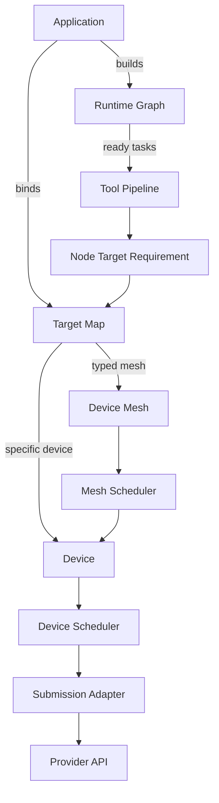
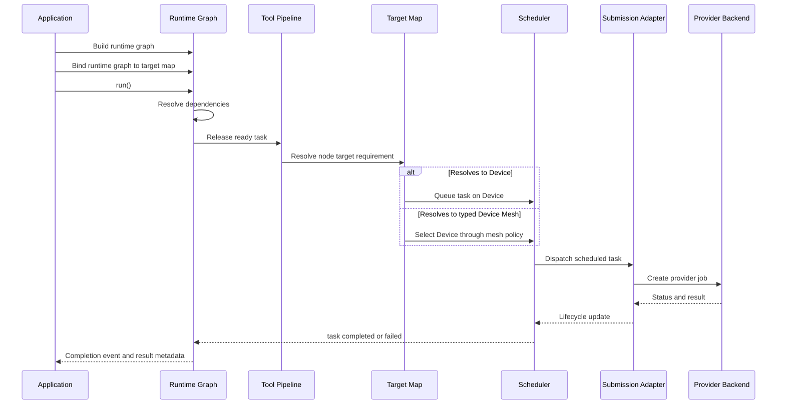
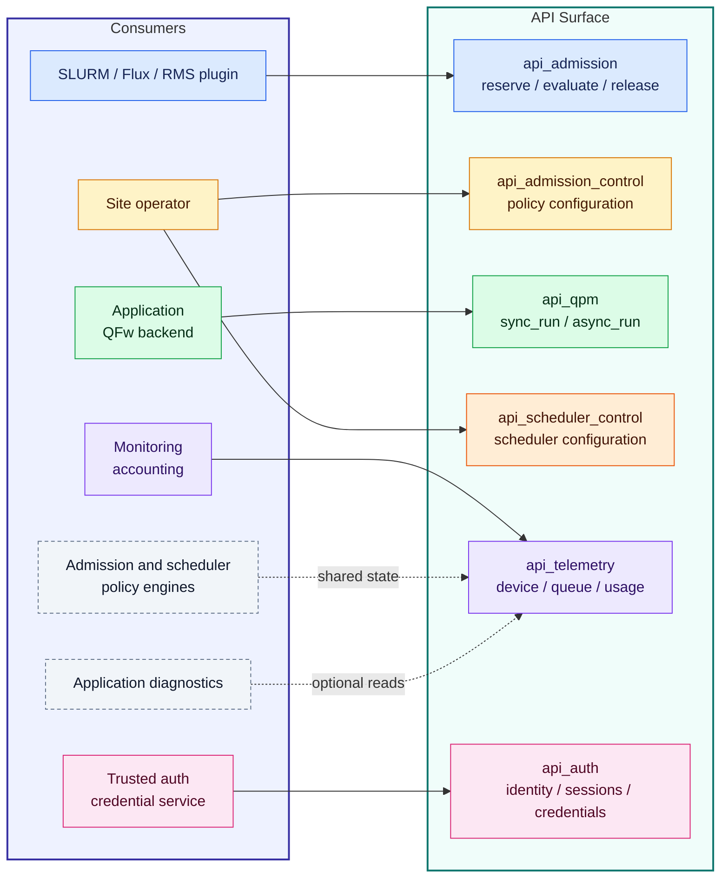
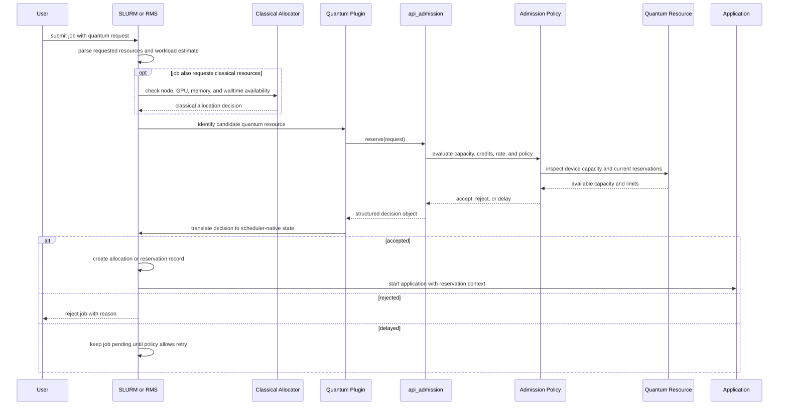
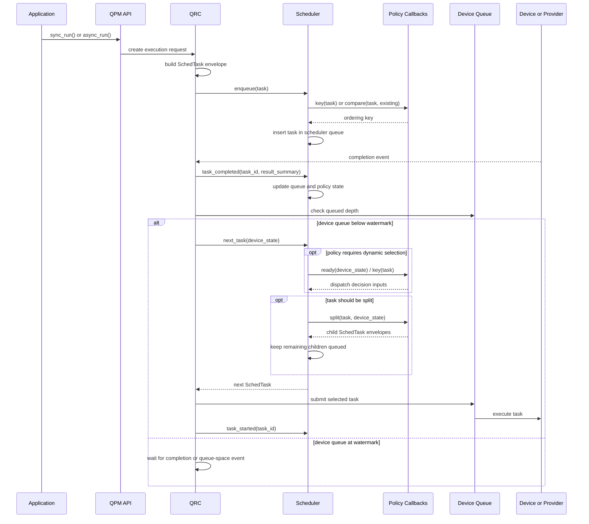

# openQSE Software Architecture High level Design

## Table Of Contents

| Title |
| --- |
| [Overview](#overview) |
| [Requirements](#requirements) |
| [Design](#design) |
| [Admission Control](#admission-control) |
| [Device Scheduler](#device-scheduler) |
| [QFw Runtime Integration](#qfw-runtime-integration) |
| [QFw Scheduler Integration](#qfw-scheduler-integration) |
| [Implementation Plan](#implementation-plan) |
| [QPU Front-End Contract](qpu-frontend-contract.md) |

## Overview

This document is a detailed design companion to the openQSE reference
architecture introduced in [Quantum-HPC Software Stacks and the openQSE
Reference Architecture: A Survey](https://arxiv.org/pdf/2604.20912). That paper
surveys nine production QHPC stacks. Its main contribution is a vendor-neutral
reference architecture that captures common layer boundaries across those
systems.

This HLD expands those layer boundaries into a concrete runtime design. It
defines the responsibilities of each layer. It also identifies the information
that crosses each boundary and the policies that should remain pluggable. The
goal is to expose interfaces that can become interoperable across
implementations, and eventually serve as candidates for standardization.

The first part of the document describes the reference design without binding
it to one implementation. Later sections apply that design to ORNL's Quantum
Framework as one concrete implementation path.

## Requirements

The requirements start from the application view. An application needs a path
to express work, bind that work to available resources, and receive results.
That path is the application workflow. The runtime must support this workflow
for current single-QPU systems and for future systems with multiple QPUs.

The workflow should not assume that work is always one quantum task or one
local queue. An application may submit a single quantum task, or qtask, a
linear stream, or a dependency graph that mixes classical and quantum
operations. The runtime therefore needs an internal representation that can
track dependencies and release ready work. Later sections call this
representation the runtime graph.

Ready quantum work must be able to target one execution resource or a group of
resources. Later sections call these abstractions Device and Device Mesh. A
Device is one schedulable target. A Device Mesh provides a common view over
several compatible devices so the runtime can place work according to policy.

Applications may also have domain-specific information that is not visible to
the system scheduler. One circuit may need a high-fidelity superconducting
device. Another may be able to run on a simulator or a less busy QPU. The
runtime should support both explicit device binding and policy-driven
placement through a mesh.

The runtime should expose granular interfaces for discovery, admission,
scheduling, telemetry, job lifecycle management, and submission. It should not
hide all decisions behind one opaque submit call. The requirements below define
the behavior those interfaces need to support.

| Req ID | Category | Requirement |
| --- | --- | --- |
| APP-01 | Application workflow | Applications must be able to express work as a single qtask, a linear stream, or a dependency graph. |
| APP-02 | Application workflow | Applications must be able to express dependencies between classical and quantum tasks. |
| APP-03 | Application workflow | Runtime dependencies may include single-path execution and coarse conditional execution resolved while the application is running. |
| APP-04 | Application workflow | Applications must be able to target a single QPU or a set of QPUs without changing the higher-level workload expression. |
| APP-05 | Application compilation | It must be possible to write quantum circuit portions of an application in more than one common quantum SDK. |
| APP-06 | Application compilation | Applications can be written with quantum circuits that do not use QPU-specific features. If they are written in this way, they can be run on any supported QPU with only minor changes to scheduling requests. |
| APP-07 | Application compilation | Applications can be written with quantum circuits that use QPU-specific features. If they are written in this way, they are not automatically portable to other types of QPUs. However, they can be written to use QPU-specific features while still using the QPU-independent OpenQSE facilities for writing workflows, scheduling, and enforcing policy. |
| APP-08 | Application compilation | Applications should be able to request QPU and HPC resources and have them scheduled at the same time. When co-scheduling is requested, it should be possible for QPU and HPC components of the application to communicate. |
| APP-09 | Application compilation | Applications should be able to use dynamic circuits that include mid-circuit measurements, simple classical processing, and by gates conditional on a classical value. |
| APP-10 | Application compilation | Applications should be able to request QEC at a particular logical error rate & the system should provide this QEC or an indication that it is not possible. |
| APP-11 | Application compilation | Applications should be able to request specific compilation passes be applied to a quantum circuit before running it. |
| RT-01 | Runtime representation | The runtime must normalize supported workload forms into an internal runtime graph. |
| RT-02 | Runtime representation | The runtime graph must track dependency readiness and release ready work for scheduling. |
| DEV-01 | Device abstraction | The runtime must expose one schedulable execution target as a Device. |
| DEV-02 | Device abstraction | The runtime must expose compatible sets of devices through a Device Mesh. |
| DEV-03 | Device abstraction | A Device Mesh must preserve per-device capabilities, queue state, and telemetry. |
| DISC-01 | Discovery | The runtime must expose discovery interfaces for device and mesh capabilities. |
| SCHED-01 | Scheduling | The system must support system-level scheduling before the application starts. |
| SCHED-02 | Scheduling | The system must support application-level placement across QPUs granted to a running application. |
| SCHED-03 | Scheduling | The system must support device-level scheduling before accepted tasks are submitted for execution. |
| SCHED-04 | Scheduling | Scheduling must remain separate from lower-level provider job submission. |
| SCHED-05 | Scheduling | Multi-device placement must be governed by default runtime policies, site policies, or application-configured policies. |
| POL-01 | Policy | System-level admission, application-level placement, and device-level scheduling policies must be replaceable independently. |
| POL-02 | Policy | Sites must be able to tune policy at one layer without changing the rest of the runtime stack. |
| ADM-01 | Admission | The system must support admission control before quantum resources are granted to a job. |
| ADM-02 | Admission | Admission control must support pluggable policy implementations. |
| ADM-03 | Admission | Admission control must support unlimited, rate-based, and credit-based policies. |
| ADM-04 | Admission | Sites must be able to add site-specific admission policies. |
| ADM-05 | Admission | Admission policies must support quality of service, fairness, allocation limits, and device-specific cost models. |
| LIFE-01 | Job lifecycle | The system must expose provider-neutral operations to submit work. |
| LIFE-02 | Job lifecycle | The system must expose provider-neutral operations to cancel work. |
| LIFE-03 | Job lifecycle | The system must expose provider-neutral operations to query status and retrieve results. |
| LIFE-04 | Job lifecycle | The system must expose provider-neutral operations to inspect execution metadata. |
| TLM-01 | Telemetry | The system must expose telemetry and device-state data through provider-neutral interfaces. |
| TLM-02 | Telemetry | Telemetry must support application scheduling decisions and runtime policy decisions. |
| TLM-03 | Telemetry | Telemetry must support monitoring, accounting, provenance tracking, and telemetry collection services. |

## Design

### System-Level Resource Entitlement

The first decision happens before the application starts. A user submits a job
that requests access to quantum resources. That request must include enough
information for QPU admission control to decide whether the target resource can
handle the expected quantum load during the lifetime of the application. At a
minimum, the request should describe the expected number of circuits, qubit
requirements, circuit depth, shot counts, and the expected mix of one-qubit and
two-qubit gates.

The system resource manager evaluates the request against admission rules,
credit policy, allocation state, and site policy. Device-specific admission
control may be part of this evaluation, since the credit cost of a job is tied
to the characteristics and limits of the QPU being requested. If the request is
accepted, the job receives a resource allocation, reservation, or lease, and
only then does the application begin execution.

The system should support both pure quantum jobs and hybrid jobs that require
classical HPC resources and quantum resources at the same time. A pure quantum
job may need only QPU admission control and a quantum resource allocation. A
hybrid job must be evaluated against both classical resource availability and
quantum resource admission. The application should not start until all required
resource classes are granted together, otherwise the job can deadlock or waste
one resource while waiting for the other.

```text
User submits job
    -> system-level resource request
    -> admission / credit / policy check
    -> resource allocation or lease
    -> application starts
```

During application execution, the runtime may still validate that a task fits
within the granted resource. That validation is not the same as system-level
admission. It protects the allocation boundary and prevents invalid task
submissions.

### Application Intent

Applications should be able to express quantum work at more than one level.
Some applications submit a single quantum task. Others build a linear stream
of operations, and more advanced cases need a runtime representation with
classical and quantum dependencies.

The runtime needs to support graphs that are constructed and extended while
the application runs. A quantum application may not know the full workload
before execution starts. Classical computation, measurement results,
calibration data, queue state, or convergence logic can determine which
quantum tasks are created next. This makes a purely static, precompiled
workflow too restrictive for adaptive applications.

The runtime should preserve this intent long enough to make useful placement
and scheduling decisions. It should not reduce every request to an opaque
device submission too early.

#### Relevant Analogs

Several existing runtime systems use related patterns. They separate the
application's expression of work from the policy that schedules the work, which
supports the need for a runtime layer rather than only a static compile step.

- [StarPU](https://starpu.gitlabpages.inria.fr/) is a heterogeneous CPU/GPU
  runtime where the application provides task implementations, constraints, and
  a task graph. The runtime handles dependencies, heterogeneous scheduling, and
  data movement.
- [Dask task graphs](https://docs.dask.org/en/stable/graphs.html) model tasks
  as graph nodes and dependencies as edges, then let schedulers execute the
  graph while respecting those dependencies.
- [Dask scheduling](https://docs.dask.org/en/stable/scheduling.html) separates
  graph construction from scheduler choice, including local and distributed
  schedulers.
- [PyTorch autograd](https://docs.pytorch.org/docs/2.12/notes/autograd.html)
  rebuilds its graph dynamically each iteration, which allows normal Python
  control flow to change graph shape at runtime.
- [Legion](https://legion.stanford.edu/overview/) is especially relevant for
  HPC. It supports dynamic decisions about task placement, data partitioning,
  and runtime mapping while separating correctness from performance policy.
- [Ray](https://arxiv.org/abs/1712.05889) was designed for AI applications
  with a dynamic execution engine that supports both task-parallel and
  actor-based computations.

### Runtime Layer

The runtime layer begins after system-level entitlement has been granted. It
does not decide whether the user job should run. Instead, it represents the
application's quantum work, resolves dependencies, applies tool pipelines,
binds work to runtime resources, and drives work toward scheduling and
submission.

The core runtime constructs are runtime graphs, tasks, Devices, Device Meshes,
tool pipelines, event queues, and completion queues. These constructs give the
application a consistent interface for single-device and multi-device
execution while keeping provider-specific submission behind lower layers.

#### Runtime Workflow



#### Runtime Sequence



#### Qtask

A qtask is one unit of quantum work. It is a runtime envelope around an opaque
quantum payload. The payload may be a Qiskit `QuantumCircuit`, OpenQASM, Quil,
QIR, MLIR, a provider-native object, or another intermediate representation.
The runtime should not require one canonical circuit representation in order to
schedule or track the qtask.

The qtask envelope carries the information the runtime needs without looking
inside the payload. This includes a task identifier, payload format, inline
payload or payload reference, execution options, resource requirements,
placement hints, priority, lifecycle state, result routing, metadata, and
provenance. Scheduling policy should operate on this envelope and on explicit
task metadata, not by parsing the payload. If a policy needs qubit count,
circuit depth, two-qubit gate count, estimated runtime, or fidelity estimates,
those values should be supplied as qtask metadata by the frontend, admission
layer, or tool pipeline.

Payload interpretation belongs to the tool pipeline and submission adapter. The
tool pipeline must be configured to understand the qtask payload format so it
can validate, transform, lower, or annotate the payload. The submission adapter
then receives a provider-compatible payload and performs the provider-specific
job operation.

```text
qtask = runtime envelope + opaque payload + payload format metadata
```

A qtask should not be bound directly to a device by the application. It is
released by a runtime graph when its dependencies are satisfied.

##### Relevant Analogs

GPU runtimes use a similar split between an opaque executable payload and
explicit launch metadata. In NVIDIA CUDA, `cudaLaunchKernel` takes a kernel
function plus launch configuration such as grid dimensions, block dimensions,
dynamic shared memory, kernel arguments, and stream. CUDA graph kernel nodes
carry the same kind of metadata through `cudaKernelNodeParams`, which includes
the kernel function, launch geometry, arguments, and shared-memory settings.

AMD ROCm/HIP follows the same pattern. `hipLaunchKernelGGL` launches a kernel
with explicit grid dimensions, block dimensions, dynamic shared memory, stream,
and kernel arguments. HIP graph APIs also represent dependencies and kernel
node parameters separately from the kernel implementation.

These GPU interfaces do not require the scheduler or graph runtime to inspect
the kernel body in order to launch or order work. They use explicit metadata
around an opaque compute payload. The qtask model applies the same pattern to
quantum work: the payload remains opaque, while the runtime envelope carries
the scheduling, resource, placement, and lifecycle metadata needed by the
runtime.

- NVIDIA CUDA Runtime API, `cudaLaunchKernel`:
  <https://docs.nvidia.com/cuda/cuda-runtime-api/group__CUDART__EXECUTION.html>
- NVIDIA CUDA Runtime API, `cudaKernelNodeParams`:
  <https://docs.nvidia.com/cuda/cuda-runtime-api/structcudaKernelNodeParams.html>
- NVIDIA CUDA graph management APIs:
  <https://docs.nvidia.com/cuda/cuda-runtime-api/group__CUDART__GRAPH.html>
- AMD ROCm/HIP C++ language extensions, `hipLaunchKernelGGL`:
  <https://rocm.docs.amd.com/projects/HIP/en/latest/how-to/hip_cpp_language_extensions.html>
- AMD ROCm/HIP graph management APIs:
  <https://rocm.docs.amd.com/projects/HIP/en/latest/reference/hip_runtime_api/modules/graph_management.html>

#### Runtime Graph

A runtime graph is the runtime representation of application work that has
entered the runtime layer. It is not a workflow engine or a programming
language. It is a lower-level construct that captures when already-defined work
units become schedulable and where they are allowed to run.

The graph can contain quantum task nodes, classical task nodes, and
control/dependency nodes. A quantum node releases a qtask when its dependencies
are satisfied. A classical node can represent CPU or GPU work owned by the
runtime, such as preprocessing, postprocessing, feedback logic, or a classical
kernel that produces inputs for later quantum work. If the classical work stays
inside the application process and does not need runtime scheduling, it does
not need to become a graph node.

The runtime graph represents scheduling dependencies, not programming
semantics. It may encode the following dependency types:

- Ordering dependency. Node B cannot be released until node A reaches a
  terminal state. This is simple run-after sequencing.
- Parallel eligibility. Nodes with no dependency edge between them may be
  released concurrently, subject to resource policy. The graph does not need a
  special parallel-language construct, because parallelism follows from the
  absence of ordering or data dependencies.
- Data dependency. Node B consumes a declared output artifact from node A. The
  runtime tracks artifact readiness and passes artifact references, not
  arbitrary variables or language-level values.
- Conditional release. Node B is released only if a prior node produces a
  runtime-visible status or metadata value that matches a simple predicate.
  This should be restricted to coarse lifecycle or result metadata, not general
  program control flow.
- Resource or placement constraint. Node B requires a device type, capability,
  locality, affinity, or anti-affinity relation. This is scheduling metadata,
  not program semantics.

This boundary should remain explicit. The runtime graph may represent
readiness, ordering, artifact availability, coarse conditional release,
placement constraints, and lifecycle tracking. It should not encode loops,
functions, arbitrary expressions, variable scope, type systems, rich branching
logic, or language-level quantum/classical semantics.

A single qtask is represented as a runtime graph with one quantum node. A
stream is represented as a restricted linear runtime graph. This keeps
execution on one path instead of creating separate semantics for tasks,
streams, and graphs.

```text
Application builds graph
    -> graph binds to target map
    -> graph.run()
    -> graph executor releases ready task
    -> task declares target requirement
    -> target map resolves requirement to Device or typed Device Mesh
    -> Device queues task, or typed Device Mesh selects a Device
    -> selected Device schedules/submits task
```

##### Relevant Analogs

Quantinuum Guppy is a useful contrast. Guppy is a Python-embedded quantum
programming language for high-level hybrid quantum programs with complex
control flow. It expresses the program. The runtime graph proposed here does
not try to provide that language layer. It only expresses when already-defined
work units become schedulable and where those units are allowed to run.

This distinction keeps the runtime graph smaller than a Guppy-like language.
High-level program construction, loops, typed quantum/classical semantics, and
rich control flow should remain in the application, a quantum programming
language, or an external workflow system. The runtime graph receives the work
units that those layers produce and manages dependency readiness, placement,
scheduling, lifecycle tracking, and completion reporting.

- GUPPY: Pythonic Quantum-Classical Programming:
  <https://arxiv.org/abs/2510.12582>
- Imperative Quantum Programming with Ownership and Borrowing in Guppy:
  <https://arxiv.org/abs/2510.13082>

#### Target Map

A target map is the binding context for a runtime graph. It maps a node's
target requirement to the runtime resource abstraction that can satisfy it. It
is not a scheduler. It is closer to a routing table that tells the graph
executor whether a ready task should go to a specific Device or to a typed
Device Mesh.

Each graph node declares a target requirement. The requirement can be explicit,
such as a specific Device identifier, or abstract, such as a required Device
type and capability set. The target map resolves that requirement against the
resources granted to the application.

```text
target_map:
    cpu -> CPU Device Mesh
    gpu -> GPU Device Mesh
    qpu -> QPU Device Mesh
    ornl-iqm-20q -> specific QPU Device
```

```text
node_a target requirement: type=cpu
node_b target requirement: type=gpu, min_memory_gb=40
node_c target requirement: type=qpu, min_qubits=20
node_d target requirement: device_id=ornl-iqm-20q
```

In this example, `node_a` resolves to the CPU mesh, `node_b` resolves to the
GPU mesh, `node_c` resolves to the QPU mesh, and `node_d` resolves directly to
the named Device. If resolution returns a Device, the task is queued for that
Device. If resolution returns a Device Mesh, the mesh policy selects the
concrete Device.

The target map lets one runtime graph contain CPU, GPU, and QPU nodes without
binding the whole graph to one execution target. It also keeps type-specific
placement policy inside typed meshes while the graph executor remains
responsible for dependency resolution and cross-type sequencing.

#### Device

A Device is the runtime abstraction for one schedulable execution target. The
same base abstraction can represent a CPU, GPU, QPU, simulator, or service.
The device type is an attribute of the Device rather than a separate top-level
abstraction. This lets the runtime keep one lifecycle and scheduling interface
while still allowing type-specific behavior through capability blocks and
adapters.

All Devices should expose a common view that includes identity, type,
availability, load, queue state, telemetry, lifecycle events, execution limits,
and a submission path. Type-specific data should live in typed capability
blocks. A QPU capability block can expose qubit count, coupling graph, gate set,
calibration data, shot support, and placement constraints. A GPU capability
block can expose accelerator memory, vendor, compute capability, kernel support,
and locality. A CPU capability block can expose core count, memory limits,
process launch constraints, and locality.

Applications define task nodes that target Devices through requirements rather
than by calling provider-specific APIs. A node may require a specific Device,
such as `ornl-iqm-20q`, or a class of Devices, such as `type=qpu` with at least
20 qubits. The runtime graph binds a target map that maps those requirements
to concrete Devices or typed Device Meshes.

When a node resolves to a Device, the ready task is queued for that Device and
scheduled by the Device-level policy.

#### Device Mesh

A Device Mesh is the runtime abstraction for a set of Devices of the same
type. A QPU mesh contains QPUs. A GPU mesh contains GPUs. A CPU mesh contains
CPU execution targets. This keeps each mesh as a policy domain for one class
of work instead of forcing one scheduler to reason about incompatible payloads,
capabilities, and submission mechanisms.

The runtime graph can still contain heterogeneous work. It does so by binding
a target map that contains one or more typed meshes. A CPU node resolves to a
CPU Device or CPU mesh. A GPU node resolves to a GPU Device or GPU mesh. A QPU
node resolves to a QPU Device or QPU mesh. Cross-type sequencing remains in
the runtime graph, while same-type placement remains inside the typed mesh.

A typed mesh can expose an aggregate view of the Devices it owns, including
their capabilities, load, queue state, availability, calibration quality,
topology, locality, and policy constraints.

The mesh acts as a policy boundary. An application can configure selection
policies on the mesh, and every compatible task released into that mesh is
evaluated through those policies before it reaches a concrete Device. A policy
can prefer devices by load, queue depth, calibration quality, connectivity,
estimated runtime, fairness rules, or application-provided placement hints. If
the application does not configure a policy, the mesh can use a default such as
round-robin, least-loaded, or shortest-queue placement.

This is similar in spirit to Lustre Networking LNet User Defined Selection
Policy, where a user or site policy influences target selection without
forcing the application to hard-code every endpoint decision. Execution through
the mesh does not imply that every task runs on every Device. Broadcast,
aggregate query, or distributed execution behavior should be explicit mesh
operations or policies.

#### Tool Pipeline

A tool pipeline manages transformations applied to qtasks before scheduling or
submission. It can contain compiler passes, circuit cutting, gate reduction,
mapping, validation, or provider-specific lowering steps. A single pipeline can
be bound to one or more runtime graphs so that the same processing policy is
applied to all qtasks released by those graphs.

The pipeline may use classical HPC resources when transformations are
expensive. This keeps compiler and preprocessing policy visible to the runtime
instead of hiding it inside provider submission code.

Dynamically allocating classical resources for each small compiler pass can be
inefficient. The setup cost may be larger than the compilation work itself,
especially when a pass runs for only a short time. One way to handle this is to
run compilation and preprocessing as runtime services on a small pool of HPC
nodes. The tool pipeline can offload work to those services instead of creating
a new allocation for every transformation.

This introduces a sizing tradeoff. If the compiler-service pool is too small,
quantum work may wait behind compilation. If it is too large, the pool may sit
idle when few quantum workloads are active. The runtime should therefore treat
these services as managed resources with queue state, load, and policy
controls, rather than assuming that unlimited classical preprocessing capacity
is always available.

#### Event And Completion Queues

An event queue receives runtime or Device events. A Device can have zero or
more event queues. If no event queue is bound, events may still be generated by
the provider or service, but the application does not receive them through this
runtime interface. Multiple event queues can be used to separate event classes
such as health changes, calibration updates, queue-state changes, and job
lifecycle transitions.

A runtime graph should have a completion sink rather than requiring one fixed
completion mechanism. The completion sink is the graph-facing interface that
receives normalized completion events from the scheduler, Device, or submission
layer. The graph executor uses those events to update node state, record
results, and release downstream nodes.

```text
graph executor releases task
    -> scheduler/device submits task
    -> provider completes task
    -> submission/device layer emits completion event
    -> completion sink receives event
    -> graph executor updates node state and releases downstream nodes
```

The completion sink can be implemented in several ways:

- Polling. A completion queue stores completed task events. The graph executor
  or application polls and drains the queue.
- Notification. The graph executor registers a callback or event endpoint. The
  Device or submission layer pushes completion events when task state changes.
- Hybrid. A callback or event endpoint receives provider notifications and
  pushes normalized events into a queue that the graph executor consumes. This
  decouples provider callbacks from graph execution logic.

Completion ordering depends on graph policy and execution mode. A strict
sequential graph can preserve completion order. A graph that releases
independent tasks in parallel may receive completions out of submission order.
The runtime should normalize completion events so the graph executor does not
need to know whether completion was delivered by polling, notification, or a
hybrid implementation.

## Admission Control

Admission control is the lower-stack mechanism that decides how much work may
enter the active quantum execution system. It is needed because a QPU is a
scarce, high-contention resource. The system cannot allow every submitted job
to immediately consume the same device without bounding concurrency, queue
growth, and walltime risk. At the same time, the QPU should not be reserved for
only one job unless the site policy requires exclusivity. A useful admission
layer lets multiple jobs share a device while still providing predictable
service behavior.

Admission control is QPU-specific because the cost of a job depends on device
characteristics. A request that is cheap on one QPU may be expensive on
another because of qubit count, topology, gate set, shot limits, circuit
duration, calibration state, queue state, provider-side compilation, batching
behavior, and per-job overheads. The admission layer should therefore evaluate
expected quantum load against the target device or device class before a job is
allowed into the active pool.

### Job Classes

Submitted jobs fall into two broad classes.

- Quantum-only jobs request access to the quantum device without a coupled
  classical allocation. They can wait in the quantum admission queue without
  holding unrelated HPC resources.
- Hybrid jobs request both classical resources and quantum access. Once these
  jobs begin, stalled quantum progress can leave classical resources idle while
  the job waits for the QPU. If that waiting is not bounded, the job can overrun
  its walltime allocation.

That distinction matters for prioritization. Hybrid jobs often need stronger
protection because they can tie up both classical and quantum allocations. A
site may choose to prioritize hybrid jobs over quantum-only jobs, or to
reserve part of the quantum capacity for hybrid work, so that expensive
classical allocations do not sit idle behind a long quantum backlog. The
admission policy still needs guardrails, because prioritizing hybrid jobs
without bounding total active quantum load can oversubscribe the QPU and push
completion time into hours.

### Admission Models

Three admission models capture the main policy space.

The unlimited model admits every job immediately. It is useful as a baseline
because it removes admission friction and exposes all work to downstream
schedulers. This can be attractive for workflow-centric systems where the
outer job is not holding scarce resources while it waits. The risk is that
device queues can grow without bound. Immediate activation can hide a large
downstream wait, and the admitted backlog can turn into long completion times
or walltime overruns.

The rate-limited model admits a job only when enough device rate capacity is
available. The job reserves a rate slice derived from device throughput and
site concurrency policy. This keeps the active set small and protects the
device queue from uncontrolled growth. The tradeoff is visible at the
admission boundary: jobs may wait longer before activation, but once admitted
they are more likely to complete within their expected walltime.

The time-credit model admits jobs against a finite shared credit budget. At
admission time, the job reserves a credit budget derived from its expected
quantum-task count and a device baseline, such as baseline circuit depth and
shot count. The model rejects jobs whose estimated credit demand is larger than
the device can support, and delays jobs when the shared credit pool does not
currently have enough available credit. After admission, each quantum task
consumes from the job's remaining credit budget using a device-specific task
cost.

This model acts as a middle ground. It admits more work than strict rate
limiting, but it still applies pressure before the active set becomes
unbounded. The expected behavior is that time-credit admission sits between
the two extremes: it adds more activation delay than unlimited admission, less
activation delay than strict rate limiting, and should reduce completion-time
risk compared with a high-congestion unlimited policy. It can also shift
waiting between scheduler queue and device queue depending on the downstream
scheduler policy. Time-sliced schedulers can make this model more cooperative
by splitting large quantum tasks into smaller slices and returning credits as
slices complete.

### QoS Implications

Admission control defines the envelope inside which downstream scheduling
operates. A strong scheduler cannot fully compensate for an admission policy
that admits too much work into a saturated device. Once the active set is too
large, scheduling can redistribute who waits, but it cannot remove the queueing
pressure created by over-admission.

The policy choice should therefore match the site objective.

- Sites that care about bounded latency, walltime protection, and avoiding
  idle classical allocations should use tighter admission, such as rate-based
  or time-credit control.
- Sites that care about exposing as much work as possible to downstream
  scheduling may choose broader admission, but they must accept deeper queues
  and rely on scheduling policy to enforce fairness or priority.
- Sites with mixed quantum-only and hybrid workloads should account for the
  external cost of waiting. A hybrid job waiting on a QPU may also hold CPUs,
  GPUs, memory, licenses, or node allocations.

Admission control interacts with the higher-level reservation system, such as
SLURM, Flux, or another site resource manager. During job admission, the
reservation layer asks the quantum device or quantum runtime whether the
requested work can be supported. That request must include enough information
for the admission layer to estimate required quantum capacity, such as expected
task count, qubit count, circuit depth, shot count, gate mix, walltime, and
job class.

The admission layer is tied closely to the hardware type because capacity is
derived from device-specific execution behavior. Gate execution times,
measurement time, transfer overheads, shot limits, topology, calibration state,
batching behavior, provider-side compilation, queueing, and per-job overheads
all affect the amount of device capacity a job will consume. After the capacity
estimate is calculated, the admission layer can assign credits, reserve a rate
slice, delay the job until capacity becomes available, or reject the job if the
request exceeds what the device can support.

Admission control also depends on the accuracy of the request. A user may
understate the expected workload and then submit more quantum work than was
reserved. The runtime must therefore track actual consumption against the
admitted budget. Once a job exceeds its reserved credits, rate slice, walltime,
or task limits, the system should be able to throttle it, deprioritize it,
delay additional submissions, or reject additional work according to site
policy.

The opposite error also matters. A user may request more quantum capacity than
the job actually needs. If the work is packed tightly, unused capacity can be
returned quickly or consumed by other jobs. If the work is spread across a long
period of time, the reservation can leave the QPU underutilized while other
jobs wait. Admission control should therefore support accounting and release
mechanisms that recover unused capacity when policy allows, while still
protecting jobs that legitimately require a reserved quantum budget.

## Device Scheduler

The device scheduler is the policy layer closest to the QPU execution queue. It
decides which ready quantum task should occupy the QPU next. For current
devices, a useful mental model is a one-core processor: only one quantum task
can occupy the QPU at a time. The scheduler therefore selects the next quantum
task that is allowed to take the device.

Device scheduling is different from admission control. Admission control limits
how much work is allowed into the active set. The device scheduler decides how
the admitted work is ordered. The scheduler usually cannot make the total
amount of quantum execution time disappear. If the device must execute the same
set of circuits and shots, the aggregate device busy time is mostly fixed by
the workload and the hardware. What the scheduler can control is who waits,
which jobs make progress first, whether priority is respected, and whether
large or small tasks dominate the queue.

### Scheduler Policy Space

Several scheduler families are useful at the device level.

- FIFO dispatches quantum tasks in enqueue order. It is the baseline policy
  because it avoids fairness, priority, and size heuristics.
- Round robin rotates across job queues so that one job does not monopolize
  the QPU when multiple jobs have ready tasks.
- Priority scheduling drains work from higher-priority jobs first. This is
  useful when the site wants explicit QoS classes or urgent jobs.
- Size-aware policies select tasks based on estimated task size. A
  shortest-job-first policy favors small circuits and can reduce latency for
  short work. A longest-job-first policy favors larger circuits when a site
  wants to make large jobs progress earlier.
- Hybrid policies can combine priority with size, such as priority plus
  shortest-job-first or priority plus longest-job-first.
- Urgency-aware policies can update priority from remaining walltime slack.
  This can move waiting upstream into the scheduler queue so that work close to
  its deadline is considered earlier.

These policies implement site behavior rather than universal optimality. A
site dominated by small circuits may prefer a different scheduler than a site
dominated by large circuits. A site that values fairness may choose round robin
even if another policy improves one workload class. A site that values urgent
workflow progress may choose priority or deadline-aware scheduling.

### Shot Slicing And Cooperative Progress

Some quantum tasks are large because they require many shots. A scheduler can
split that work into smaller shot-based slices and requeue the remaining work
between dispatches. This is similar to time slicing on a classical processor:
large tasks can make progress without holding the QPU until all requested shots
complete.

Shot slicing gives the site another fairness mechanism. It can prevent a large
shot-heavy task from blocking every smaller task behind it, and it can let
priority or round-robin policy operate at slice granularity instead of whole
task granularity. The slice size should be tied to a device baseline, such as
baseline shots and baseline circuit depth, so that slices represent a
meaningful amount of QPU work.

This mechanism also interacts with crediting. If a task is split into slices,
credits can be consumed and returned per completed slice rather than only at
whole-task boundaries. That makes long-running quantum work more cooperative,
but it also adds bookkeeping complexity. The scheduler must preserve parent
task identity, result aggregation, priority inheritance, and cancellation
semantics across all slices.

### Scheduler Inputs And Outputs

The device scheduler should operate on task metadata and device state rather
than parsing the quantum payload. Useful inputs include job identity, priority,
estimated runtime, circuit-size metadata, shot count, qubit count, deadline or
walltime slack, remaining credits, queue age, and cancellation state. Device
state can include queue depth, availability, calibration state, and execution
limits.

The scheduler output is a dispatch decision: which task or task slice should
be submitted next to the device. After execution starts, completes, fails, or
is cancelled, lifecycle events feed back into the scheduler so it can update
queue state, credits, fairness accounting, and retry policy.

## QFw Runtime Integration

TODO: This section will describe how QFw implements the runtime-layer design
described earlier in this document. The first implementation will likely focus
on quantum tasks and the QFw qtask execution path. CPU and GPU task support can
be added later once the quantum path is stable.

QFw is also working with BSC on COMPSs integration. COMPSs provides a
task-based runtime layer with dependency tracking and scheduling, so it
overlaps with part of the runtime graph concept described here. It does not
necessarily match this HLD exactly, especially around typed Device Meshes, QPU
admission control, QPM/QRC scheduling, bounded device queues, and device
authentication. The integration should therefore treat COMPSs as a candidate
runtime orchestration layer, while keeping QFw-specific quantum resource
management below it.

### Relevant Analogs

[COMPSs](https://compss-doc.readthedocs.io/en/stable/Sections/0_Intro.html)
is a relevant analog for the runtime layer. It is a task-based programming
model and runtime for distributed infrastructures. It provides an application
programming interface and a runtime that exploits application parallelism at
execution time. In PyCOMPSs, the runtime builds a task-dependency graph from
data dependencies in Python code and schedules the graph across compute
resources. COMPSs also supports several task forms, including Python methods,
external binaries, multi-threaded tasks, and MPI or multinode tasks.

| Area | COMPSs | QFw runtime design |
| --- | --- | --- |
| Main purpose | General distributed task runtime for HPC, cloud, and container infrastructure. | Quantum/HPC runtime layer for admission, device binding, qtask scheduling, device queues, and provider submission. |
| Graph model | Builds a task-dependency graph from application task and data dependencies. | Runtime graph represents scheduling dependencies, artifact readiness, coarse conditional release, and placement constraints. |
| Task types | Supports Python methods, external binaries, multi-threaded tasks, MPI tasks, and multinode tasks. | Starts with quantum tasks, then can add CPU, GPU, and classical tasks through typed devices and meshes. |
| Resource abstraction | Abstracts compute infrastructure and data movement. | Exposes Device, typed Device Mesh, target map, QPU admission, queueing, and quantum provider access. |
| Scheduling | Runtime schedules task graph across compute resources. | Separates runtime graph scheduling, mesh/device selection, QPM/QRC device scheduling, and bounded device queue management. |
| Quantum-specific controls | Not designed around QPU admission, shots, calibration, provider keys, or QPU queue watermarks. | These are core concerns in the QFw design. |
| Fit with QFw | Candidate orchestration layer for broader task-graph execution. | QFw still owns quantum-specific admission, execution, telemetry, scheduling, and device-authentication layers. |

## QFw Scheduler Integration

The QFw implementation should add admission control and device scheduling
without turning the existing QPM interface into a single overloaded API. The
implementation strategy is to split service APIs by responsibility and by the
type of consumer that needs them.

Resource managers need admission decisions before an application starts. They
should not need to import the full QPM execution API. Applications and QFw
backends still need the existing `sync_run()` and `async_run()` execution path.
Site operators need a small control surface to configure device scheduling
policy without submitting work or acting as an application. Monitoring and
policy code need telemetry without submitting work. Authentication and
credential management need a trusted API boundary because provider access keys
and elevated site operations should not be handled by ordinary application
code.

This leads to six API categories.

- `api_admission` exposes reservation and admission operations for resource
  managers, test harnesses, and future SLURM integration.
- `api_admission_control` exposes site-facing admission policy configuration
  and administrative controls.
- `api_qpm` remains the execution API. Scheduling is placed behind
  `sync_run()` and `async_run()`, so applications submit work rather than
  selecting the next device task directly.
- `api_scheduler_control` exposes site-facing scheduler configuration and
  administrative controls. It does not submit qtasks and it does not select the
  next qtask directly.
- `api_telemetry` exposes device, queue, calibration, health, and usage data
  for admission policy, scheduling policy, accounting, monitoring, and
  application diagnostics.
- `api_auth` handles identity, authorization, credential/session lifecycle,
  and privileged access needed by site infrastructure.

The API categories and their consumers are:



Solid arrows show primary consumers. Dashed arrows show secondary or optional
consumers. The QPM implementation, QRC scheduling, and device dispatch flows
are shown separately in the detailed sequence diagrams.

The initial implementation can still be backed by the same QPM service. The
separation is an API boundary, not necessarily a process boundary. Over time,
sites can deploy only the API surface they need for each integration point.

### Admission Control Module

Admission control should start as a new service API under
`service-apis/api_admission`. The first backend can be the existing QPM
service. That keeps the implementation close to the device-specific code while
allowing external consumers to depend on a narrow interface.

The first milestone should not require SLURM integration. A test program should
be able to load `api_admission`, build an admission request, call `reserve()`,
and receive the same structured decision object that a resource-manager plugin
would consume. That object should be more than a Boolean. It should carry the
admission result, reservation identifier, selected device or device class,
reserved credits or rate slice, limits, expiration, rejection or delay reason,
and any policy metadata needed by the caller. This provides a direct way to
test rate limits, credit models, rejection paths, and reservation accounting
before tying the logic to a site scheduler.

SLURM integration can then be layered on top. A SPANK plugin, job-submit
plugin, prolog/epilog pair, GRES integration, or HRES integration can translate
site job options into an admission request. The integration point should call
the QFw admission API and translate the returned decision into the native form
expected by the reservation system. For SLURM, that may mean accepting or
rejecting the job, attaching a reservation identifier to the job environment,
recording limits for later prolog or epilog use, or mapping the accepted
quantum resource into a GRES or HRES allocation. QFw can then validate and
charge actual qtasks against that reservation during execution.

The SLURM mechanism should remain a deployment choice. GRES or HRES may be a
good fit for making QPU resources visible to SLURM. A SPANK plugin or job
submit plugin may be a better fit for passing workload estimates and enforcing
policy. The admission API should be independent of that choice.

Admission policy configuration should be separated from `reserve()`. A site may
want to switch from unlimited admission to rate-limited admission, tune a
time-credit model, change per-device limits, or load a site-specific admission
plugin. Those operations are control-plane actions and should require elevated
authorization. They should not be part of the resource-manager-facing
`api_admission` path that runs for every job request.

Potential admission-control configuration APIs are:

| API | Explanation |
| --- | --- |
| `list_admission_policies(device_id=None)` | Return admission algorithms supported by a service or device, such as unlimited, rate-limited, time-credit, or site-specific policies. |
| `get_admission_config(device_id=None)` | Return the active admission policy and effective configuration. |
| `set_admission_policy(device_id, policy, config=None)` | Select the admission algorithm for a device or service instance and apply policy-specific configuration. |
| `update_admission_config(device_id, config)` | Adjust policy tunables such as credit pool size, rate slice, maximum active reservations, delay thresholds, or rejection thresholds. |
| `get_admission_state(device_id=None)` | Return current reservation count, available capacity, delayed requests, rejected requests, and policy-visible accounting state. |
| `pause_admission(device_id, reason=None)` | Stop accepting new reservations while preserving existing reservations. |
| `resume_admission(device_id)` | Resume admission decisions after a pause. |

The admission workflow should look like:



Potential admission APIs are:

| API | Explanation |
| --- | --- |
| `reserve(request)` | Evaluate a job-level quantum resource request and, if accepted, create a reservation or lease. The response should include the decision, reservation ID, assigned device or device class, limits, expiration, and reason text. |
| `evaluate(request)` | Evaluate the same request without creating a reservation. This is useful for dry-run testing, scheduler previews, and policy debugging. |
| `get_reservation(reservation_id)` | Return reservation state, assigned limits, consumed capacity, remaining capacity, and expiration metadata. |
| `release(reservation_id, reason=None)` | Release a reservation when the job exits, is cancelled, or no longer needs quantum capacity. |
| `renew(reservation_id, ttl=None, request_update=None)` | Extend or adjust a reservation if site policy allows it. |
| `expire(now=None)` | Expire stale reservations and return unused capacity according to site policy. |
| `get_policy(device_id=None)` | Return admission policy metadata for diagnostics and for tools that need to explain admission decisions. |

Runtime validation and credit charging should not be exposed as
resource-manager-facing admission APIs. Once a job has a reservation, actual
qtask validation, credit consumption, slice accounting, and retry accounting
belong behind the QPM execution and scheduler path. The scheduler can use the
reservation state internally when `sync_run()` or `async_run()` enqueues work.
Capacity return should happen through `release()` when the job ends, through
reservation expiration, or through internal scheduler/accounting events when
partial work is cancelled or sliced.

### Scheduler Module

Device scheduling should live behind the QPM execution APIs. Applications call
`sync_run()` or `async_run()` with quantum work. The service enqueues that work,
and the scheduler decides when each qtask or qtask slice is allowed to occupy
the device.

The natural integration point is the QRC utility layer. Today the QRC path owns
the local queue and command dispatch flow. A scheduler module can replace the
FIFO queue with an explicit policy object. The QRC submits new qtasks to the
scheduler, asks for the next runnable task when the device can accept work, and
feeds lifecycle events back into the scheduler after start, completion,
failure, or cancellation.

The scheduler itself should be a standalone module. It should be reusable
outside QFw and should not import QPM, QRC, Qiskit, QASM, IQM, or any other
quantum-specific type. It schedules generic task envelopes. QFw is responsible
for translating an execution request into that envelope and for translating the
selected envelope back into the QRC execution path.

The task envelope should contain only common scheduling fields plus an opaque
payload and namespaced extensions:

```python
SchedTask(
    task_id="task-7",
    parent_task_id=None,
    owner="reservation-or-job-id",
    priority=100,
    deadline=None,
    created_at=timestamp,
    payload=<opaque execution request>,
    extensions={
        "qfw.quantum": {
            "shots": 10000,
            "qubit_count": 20,
            "circuit_depth": 64,
            "gate_counts": {"1q": 120, "2q": 32},
            "estimated_runtime": 0.82,
            "estimated_credits": 10,
        }
    },
)
```

The scheduler core may use `task_id`, `parent_task_id`, `owner`, `priority`,
`deadline`, `created_at`, and insertion order. It must preserve `payload` and
`extensions`, but it should not interpret either field. Domain-specific values
such as size, cost, shots, depth, qubit count, fidelity estimate, or provider
limits belong in `extensions`, not in the scheduler core fields.

Policies fall into two classes. Core policies use only common fields. FIFO uses
insertion order, round robin uses `owner`, priority uses `priority`, and
deadline-aware policies use `deadline`. Domain-aware policies receive the full
task envelope and may inspect namespaced extensions through a configured
policy key or comparison function. For example, a QFw SJF policy can compute a
key from `extensions["qfw.quantum"]["circuit_depth"]` and
`extensions["qfw.quantum"]["qubit_count"]`. The scheduler stores and orders
tasks by the returned key without knowing what the key means.

Task splitting follows the same pattern. The scheduler can be configured with
a `split(task, device_state=None)` callback. The callback receives the full
task envelope, inspects any domain-specific extension data it understands, and
returns one or more `SchedTask` instances. If no split is needed, it returns
the original task. For quantum shot slicing, QFw can inspect the `qfw.quantum`
extension, create child tasks with reduced shot counts, and attach correlation
metadata:

```python
SchedTask(
    task_id="task-7.slice-0",
    parent_task_id="task-7",
    owner="reservation-or-job-id",
    priority=100,
    deadline=None,
    created_at=timestamp,
    payload=<slice-specific execution request>,
    extensions={
        "qfw.quantum": {
            "shots": 1000,
            "qubit_count": 20,
            "circuit_depth": 64,
        },
        "scheduler.slice": {
            "slice_id": 0,
            "slice_count": 10,
            "aggregate_key": "task-7",
        },
    },
)
```

The scheduler should schedule slices independently and emit lifecycle events
for each selected envelope. Result aggregation should remain outside the
generic scheduler core. QFw or a QFw scheduler adapter can correlate child
tasks through `parent_task_id` and `scheduler.slice` metadata and then produce
the final parent result.

The QRC also needs to manage the boundary between the scheduler queue and the
device queue. The scheduler queue is owned by QFw and can hold admitted work
without exposing it to the provider or device. The device queue may be a local
service queue, a simulator input queue, or an external provider queue. QFw
should avoid dumping all scheduler-ready work into that queue because it loses
control over ordering, cancellation, priority changes, and fairness. It should
also avoid keeping the device queue empty, because that can leave the device
idle between tasks.

The practical model is a bounded device-queue watermark. QRC asks the scheduler
for more work only when the device queue has capacity below a configured
target. The target can be one task for strict control, or a small number of
tasks when provider latency makes an empty queue expensive. This keeps most
policy control inside QFw while still allowing enough queued work to avoid
device starvation.



This scheduler is not a new application-facing submission API. Applications
should not manually select the next qtask to run. The user-facing surface is a
site control API that configures device scheduling policy and exposes
observability needed by operators.

The internal scheduler interface can stay smaller and closer to the QRC
implementation:

| API | Explanation |
| --- | --- |
| `enqueue(task)` | Add an accepted `SchedTask` envelope to the scheduler. The scheduler may call the configured split callback before storing it. |
| `cancel(task_id, reason=None)` | Remove a pending task or mark an active task for cancellation. |
| `next_task(device_state=None)` | Select the next runnable task according to the configured policy and current device state. |
| `task_started(task_id, metadata=None)` | Record that a task has begun execution. |
| `task_completed(task_id, result_summary=None)` | Update scheduler state after successful completion. |
| `task_failed(task_id, error_summary=None)` | Update retry, fairness, accounting, and queue state after failure. |
| `queue_state()` | Return scheduler-internal queue state for telemetry and debugging. |

### Scheduler Control API

`api_scheduler_control` should be treated as a site control-plane API. It is
not consumed by the resource manager during job admission and it is not used by
ordinary applications during execution. Its purpose is to let a site configure
the scheduler policy used by a QPM service and inspect the queue state that
policy is operating on.

This API requires control-plane authentication and authorization. The
authentication model is separate from device or provider credential handling,
because it protects QFw administrative operations rather than hardware access
keys.

Potential scheduler control APIs are:

| API | Explanation |
| --- | --- |
| `list_scheduler_policies(device_id=None)` | Return the scheduler policies supported by a service or device, such as FIFO, round robin, priority, size-aware, deadline-aware, or shot-slicing policies. |
| `get_scheduler_config(device_id=None)` | Return the active scheduler policy and effective configuration. |
| `set_scheduler_policy(device_id, policy, config=None)` | Select the scheduler policy for a device or service instance and apply policy-specific configuration. |
| `update_scheduler_config(device_id, config)` | Adjust tunables such as slice size, priority weights, deadline thresholds, or fairness windows when policy allows runtime changes. |
| `get_queue_state(device_id=None, filter=None)` | Return queue depth, per-job queue state, runnable task count, blocked task count, and scheduler-visible accounting. |
| `pause_scheduler(device_id, reason=None)` | Stop dispatching new work while preserving queued state. This is useful for maintenance and controlled testing. |
| `resume_scheduler(device_id)` | Resume dispatch after a pause. |
| `drain_scheduler(device_id)` | Prevent new work from being admitted into the scheduler while allowing queued work to complete. |

### Control API Authentication

Control APIs include `api_admission_control`, `api_scheduler_control`, and any
privileged telemetry or administrative operation. These APIs are not normal
application submission paths. They change site policy, reveal operational
state, or affect whether other users can run. A caller must authenticate before
using them and must pass the resulting auth context, session, or token with
each request.

Authentication proves the caller identity. Authorization decides whether that
identity may perform the requested action on the requested target. The target
can be a device, service instance, queue, policy object, reservation, or
telemetry scope. An authenticated user should not automatically be allowed to
change admission policy or scheduler policy.

The authorization model should be action-specific and resource-specific. A
monitoring service may be allowed to call `get_queue_state()` but not
`pause_scheduler()`. A scheduler-management role may configure one device but
not another. A SLURM integration may call `reserve()` through `api_admission`
but should not change admission-control policy unless it has an explicit site
role. A trusted credential service may mint sessions but should not submit
qtasks through `api_qpm`.

Control API tokens should be short-lived and scoped where possible. Useful
scopes include API category, action, device ID, service ID, role, reservation
ID, and tenant or account. Read-only operations and write/configuration
operations should use different permissions. Policy-changing calls should be
audited with caller identity, action, target, previous value, new value,
decision, and timestamp. Failed authorization should return an explicit
authorization error so the caller can distinguish policy denial from service
failure.

This section is distinct from provider or device authentication. Control API
authentication protects QFw configuration and administrative actions. Device
authentication manages the credentials needed to access a quantum provider or
hardware service on behalf of an admitted job.

### Telemetry API

Telemetry should be split into its own service API because it has several
consumers. Admission control needs device capacity and current load.
Schedulers need queue state, availability, and policy-relevant device state.
Monitoring and accounting systems need usage and health information.
Applications may need device information, calibration summaries, execution
timing, and provenance for analysis.

The telemetry API should expose normalized data where possible. Provider-native
payloads can still be attached through extension fields or explicit raw-data
options, but common consumers should not need provider-specific parsing for the
standard path.

Potential telemetry APIs are:

| API | Explanation |
| --- | --- |
| `get_device_info(device_id=None)` | Return static device identity, type, capabilities, and limits. |
| `get_dynamic_device_info(device_id=None)` | Return dynamic state such as availability, current calibration ID, queue state, and current operating limits. |
| `get_coupling_graph(device_id=None, calibration_id=None)` | Return normalized topology and supported two-qubit loci. |
| `get_calibration_snapshot(device_id=None, calibration_id=None)` | Return normalized calibration summaries and extension data. |
| `get_queue_metrics(device_id=None)` | Return queue depth, runnable work, blocked work, per-job queue summaries, and scheduler policy state. |
| `get_usage(reservation_id=None, user=None, job_id=None)` | Return consumed credits, executed tasks, shots, estimated device time, and accounting metadata. |
| `get_health(device_id=None)` | Return service health, device availability, maintenance state, and recent error summaries. |
| `subscribe_events(filter=None, endpoint=None)` | Register for normalized device, queue, completion, health, or calibration events when the transport supports notifications. |

### Device Authentication

Device authentication is separate from control API authentication. Control API
authentication protects QFw administrative operations such as admission-policy
configuration and scheduler-policy configuration. Device authentication
manages the credentials needed to access a quantum provider or hardware
service for an admitted job.

This section focuses on the second problem. Once the resource manager admits a
job and QFw has a reservation context, the runtime still needs a way to access
the selected quantum device on behalf of the user. That access must be
short-lived, auditable, revocable, and tied to the reservation rather than to a
long-lived user-managed API key.

Many current quantum systems expose a cloud-style model. A user logs into a
web GUI, generates an API key, and then passes that key with each request. That
model is awkward for HPC centers. The center needs a central authority that can
authenticate the local user, enforce allocation policy, create short-lived
access for a job, audit usage, and revoke access at the end of the allocation.
Long-lived user-managed API keys bypass most of that control plane.

#### Current Deployment Workaround

For existing systems that do not expose an HPC-oriented identity delegation
model, QFw can use administrator-owned mirror accounts on the quantum device.
These accounts are not normal user accounts. They are controlled by trusted
site infrastructure and accessed only by elevated SLURM, Flux, or resource
manager components.

The preferred workaround is to mint one provider API key per admitted user
session. The resource manager authenticates the HPC user, maps that user and
reservation to a mirror account, asks the quantum service to create a fresh
API key, and passes the resulting credential to QFw. QFw should avoid placing
the provider key in the general job environment when possible. A better
prototype is to pass an opaque session identifier to the application and inject
the provider credential directly into the QFw service process or a protected
credential cache.

At job teardown, cancellation, or session expiration, the trusted component
revokes that session key. If a single session fans out to multiple QFw
processes, the auth layer should track consumers and revoke only after the
session is no longer in use or after a hard expiration. Since each user session
receives its own provider key, reference counting is local to that session
rather than shared across unrelated jobs. The mirror account should also have a
hard cap on active keys so leaks or failed epilogs cannot accumulate without
limit.

This workaround keeps the site in control of key lifecycle, but it is still a
compromise. The mirror account owner may be able to see jobs submitted through
that account, depending on the quantum vendor's permission model. That is
acceptable for early integration testing, but it does not fully preserve
per-user privacy or accountability on the quantum system.

#### Vendor Requirements

A production-quality integration needs vendor support for delegated,
short-lived, auditable access. The quantum provider should expose APIs that let
the HPC center act as a trusted identity and policy broker without sharing
long-lived user API keys or relying on GUI-only token generation.

The minimum useful feature set is:

- A service or admin API that can mint short-lived access tokens for a specific
  HPC user, reservation, job, device, and scope.
- Token scopes that distinguish submission, status polling, result retrieval,
  calibration read access, telemetry read access, and administrative device
  operations.
- Explicit token lifetime, refresh, revocation, and introspection operations.
- An audit log that records the real HPC user, site account, job ID,
  reservation ID, device ID, token ID, operation, and timestamp.
- Optional token binding to a reservation, audience, device, source service, or
  job identity so a stolen token has limited use outside its intended context.
- A role model that separates normal users, resource-manager integrations,
  scheduler administrators, telemetry readers, and provider administrators.
- Support for non-interactive flows such as OAuth2 client credentials, OAuth2
  token exchange, OIDC federation, SciTokens-like capability tokens, or an
  equivalent site-to-provider delegation mechanism.
- A way to prevent provider-side visibility from collapsing all jobs into the
  mirror account identity. The provider should preserve the real end-user
  identity as an auditable delegated subject.

Potential device-authentication APIs are:

| API | Explanation |
| --- | --- |
| `mint_session(user, reservation_id, device_id, ttl=None)` | Create a short-lived quantum device-access session for a reservation and device. The session may carry a scoped token or a reference to provider credentials managed by the site. |
| `get_session(session_id)` | Return session state, expiration, associated user, reservation, device, and authorization scope. |
| `refresh_session(session_id)` | Rotate or refresh provider credentials when policy allows. |
| `revoke_session(session_id, reason=None)` | Revoke device access at job end, cancellation, policy failure, or administrative request. |
| `inject_session(session_id, target)` | Make the device credential available to a QFw service process or protected credential cache without exposing a raw provider key in the user environment. |
| `audit_device_sessions(filter=None)` | Return device-session lifecycle events for accounting and incident review. |

#### Relevant Analogs

[MUNGE](https://dun.github.io/munge/) is the classic HPC example of a local
authentication realm. It lets processes create and validate credentials that
carry UID and GID information inside a cluster security domain. Slurm can use
MUNGE to authenticate RPCs and verify that requests come from hosts with
matching users and groups. This solves cluster-local identity propagation, but
it does not by itself solve provider API-key delegation.

[Slurm authentication](https://slurm.schedmd.com/authentication.html) now also
supports its own `auth/slurm` and `cred/slurm` plugins. The important design
point is that Slurm treats authentication as an internal trusted control-plane
function. Quantum integration should follow the same pattern: the resource
manager authenticates the local user and a trusted component obtains the
short-lived provider credential.

[SPANK](https://slurm.schedmd.com/spank.html) shows where job-launch
integration can occur. SPANK plugins can run in allocator, local, remote,
slurmd, and job-script contexts, and they can set or unset job environment
variables. That makes SPANK a practical prototype mechanism for minting a
quantum session and passing only an opaque handle to the job, although a final
design should avoid exposing raw provider keys when possible.

[SciTokens](https://scitokens.org/) is closer to the long-term authorization
model. It uses OAuth2 and JWTs for capability-based authorization in
distributed scientific computing. Its architecture lets a queue manager obtain
an access token from a token manager and place that token in the job runtime
environment. The useful lesson is capability scoping: the token should say
what the job may do, not simply impersonate a broad account.

[Globus Auth](https://docs.globus.org/api/auth/developer-guide/) is a mature
federated identity and OAuth2 service used in research computing. It supports
scopes, access tokens, refresh tokens, client registration, confidential
clients, PKCE, and session policies. The relevant pattern is delegated access
with explicit scopes and refresh semantics rather than user-managed static API
keys.

[Kubernetes service account tokens](https://kubernetes.io/docs/reference/access-authn-authz/service-accounts-admin/)
provide a useful non-HPC analogy. Modern Kubernetes uses the TokenRequest API
to mount time-bound, audience-bound tokens into Pods and refreshes them before
expiration. Tokens are bound to the workload rather than being long-lived
cluster secrets. Quantum sessions should follow the same direction: short
lifetime, workload binding, explicit audience, and automatic cleanup.

[Vault secrets engines](https://developer.hashicorp.com/vault/docs/secrets)
show the operational model for dynamic secrets. A secrets engine can generate
credentials on demand, tune TTLs, and revoke secrets when an engine is disabled
or moved. That maps well to provider API keys that should exist only for the
duration of an admitted quantum session.

## Implementation Plan

The implementation should proceed from the reusable scheduler core toward QFw
integration and then into admission, resource-manager integration, and
authentication. This keeps the generic pieces from being shaped too tightly by
the first QFw integration point.

### Scheduler Core

Build the standalone scheduler module first. It should define `SchedTask`, the
policy interface, queue state, lifecycle events, split handling, and policy
statistics. The first policy set should include FIFO, round robin, priority,
key-based SJF, key-based LJF, priority plus SJF, priority plus LJF, and
shot/time slicing through the split callback. The module should not import QFw,
QPM, QRC, Qiskit, QASM, IQM, QRMI, or QDMI.

### QFw Scheduler Integration

Add QFw adapters that convert QPM/QRC execution requests into `SchedTask`
envelopes and route selected tasks back into the existing QRC execution path.
FIFO should remain the default policy so the initial integration preserves
current behavior. This step should also add the bounded device-queue watermark
logic so QFw controls how much work is handed to the provider or device queue.

### Scheduler Control APIs

Add `api_scheduler_control` and the corresponding QPM implementation. The API
should list supported policies, return the active configuration, change policy,
update tunables, inspect queue state, pause, resume, and drain the scheduler.
These APIs are site-facing control-plane APIs, not application submission APIs.

### Scheduler Tests

Test the scheduler core independently from QFw. Cover FIFO, round robin,
priority, SJF, LJF, priority hybrids, split behavior, cancellation, lifecycle
updates, and queue-state reporting. Then add QFw integration tests for adapter
conversion, default FIFO behavior, device-queue watermark behavior, and result
correlation for split tasks.

### Admission APIs

Add `api_admission` first. It should expose the resource-manager-facing
reservation path: evaluate, reserve, get-reservation, release, renew, expire,
and policy inspection. The response from `reserve()` should be a structured
decision object that can be translated by a SLURM, Flux, QRMI, SPANK, GRES, or
HRES integration.

The first implementation should use an unlimited admission policy. This proves
the reservation object, decision object, and resource-manager-facing API shape
without requiring policy tuning.

### Admission Control APIs

Add `api_admission_control` after the admission API shape is stable. This API
should configure the admission algorithm and its tunables. It should list
available policies, return the active policy and configuration, set the active
policy, update policy configuration, pause admission, resume admission, and
inspect admission-control state.

The first bounded policy should be rate-limited or time-credit admission. More
advanced policies can be added once the configuration API and accounting
behavior are stable.

### Admission Tests

Test accept, reject, and delay decisions. Cover reservation creation, release,
renewal, expiration, delayed-request behavior, and the shape of the structured
decision object consumed by a resource-manager plugin. Tests should also verify
that runtime qtask charging is not exposed through the admission API and
remains behind the QPM/scheduler execution path.

Admission-control tests should cover policy listing, policy selection,
configuration updates, pause/resume behavior, bounded-policy decisions, and
admission-control state reporting.

### Resource Manager Integration

Add the first resource-manager integration after the admission API is stable.
The first target should be QRMI/SPANK or an equivalent SLURM integration path.
The plugin should translate scheduler job options and workload estimates into
an admission request, call `reserve()`, and translate the returned decision
into scheduler-native state. On success it should propagate the reservation
context to the job. On failure or delay it should report the reason through the
resource manager.

GRES or HRES mapping can be added as a deployment option when the site wants
QPU resources to appear as scheduler-visible resources. The admission API
should remain independent of the specific SLURM mechanism.

### Device Authentication APIs

Add device-session APIs after the reservation path exists. The first
implementation can use the mirror-account workaround: mint one provider API key
per admitted session, inject the credential into QFw or a protected credential
cache, and revoke it at job teardown or expiration. The API surface should
include mint, get, refresh, revoke, inject, and audit operations.

### Device Authentication Tests

Test session creation, credential injection, refresh, revocation, expiration,
failed epilog cleanup, max active key limits, and audit records. Tests should
also cover the case where a single admitted session fans out to multiple QFw
processes and the credential must not be revoked until the session is no
longer in use or a hard expiration is reached.

### Device Authentication Resource-Manager Integration

Integrate device authentication with SLURM, Flux, or the selected resource
manager after the device-session APIs are tested. The resource-manager plugin,
prolog, or trusted launch component should mint a device session after
admission succeeds, pass only the session context needed by QFw into the job,
and arrange teardown through epilog or cancellation handling.

The integration should avoid exposing raw provider API keys in the general job
environment. Prefer an opaque session identifier, protected credential cache,
or direct injection into the QFw service process. On job exit, cancellation, or
reservation expiration, the resource-manager integration should revoke the
device session and record the lifecycle event for audit and accounting.

### Control API Authentication

Add authentication and authorization enforcement for control-plane APIs after
the control APIs exist. This includes `api_admission_control`,
`api_scheduler_control`, privileged telemetry operations, and any
policy-changing call. Authorization should be action-specific and
resource-specific.

### Control Authentication Tests

Test role, action, and resource authorization. Cover read-only access versus
write/configuration access, explicit authorization failures, audit records, and
short-lived scoped tokens or sessions for control-plane callers.
