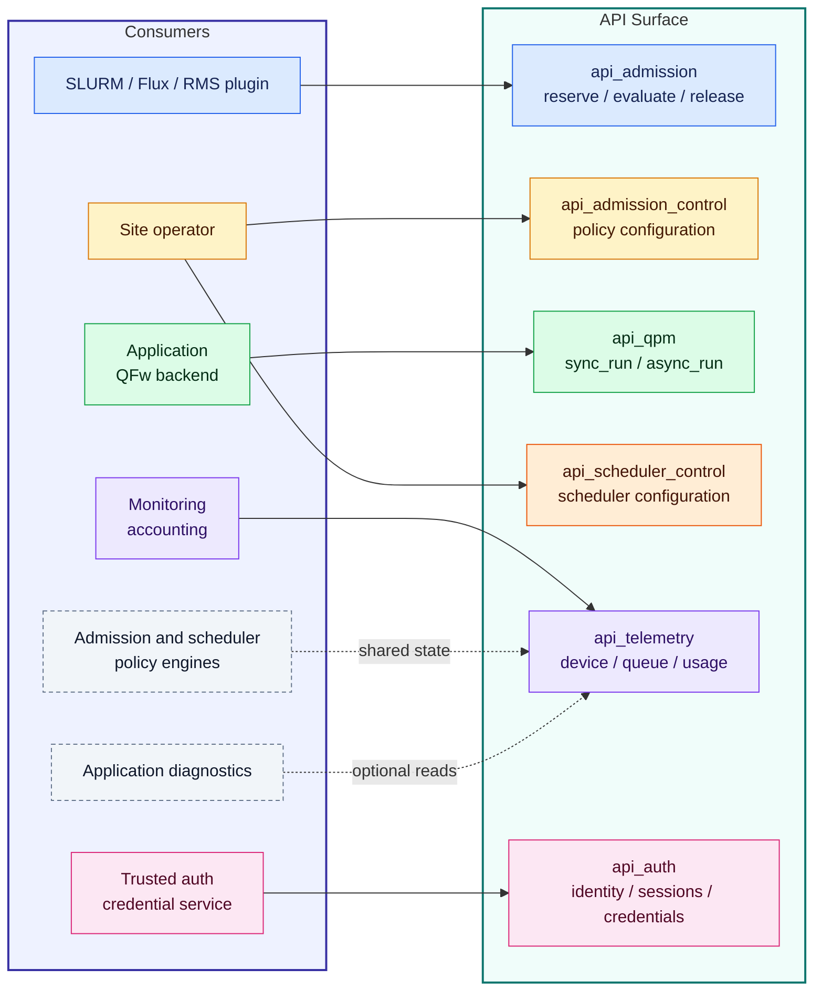
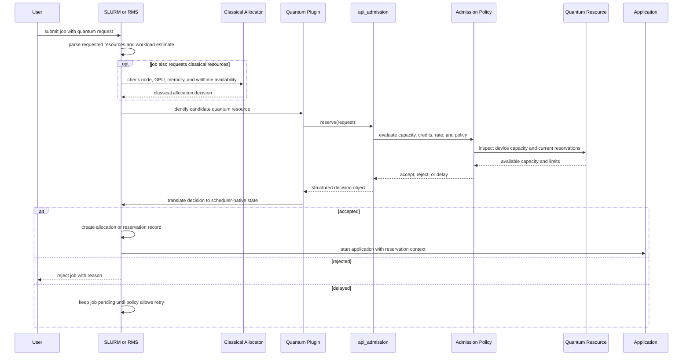
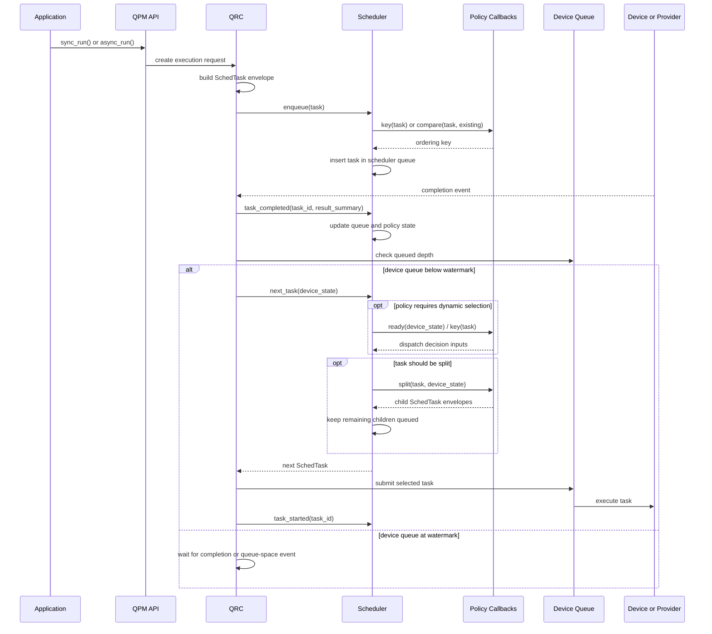

# openQSE Software Architecture High level Design

## Table Of Contents

| Title |
| --- |
| [QFw Runtime Integration](#qfw-runtime-integration) |
| [QFw Scheduler Integration](#qfw-scheduler-integration) |
| [Implementation Plan](#implementation-plan) |
| [QPU Front-End Contract](qpu-frontend-contract.md) |

## QFw Runtime Integration

TODO: This section will describe how QFw implements the runtime-layer design
described earlier in this document. The first implementation will likely focus
on quantum tasks and the QFw qtask execution path. CPU and GPU task support can
be added later once the quantum path is stable.

QFw is also working with BSC on COMPSs integration. COMPSs provides a
task-based runtime layer with dependency tracking and scheduling, so it
overlaps with part of the runtime graph concept described here. It does not
necessarily match this HLD exactly, especially around typed Device Meshes, QPU
admission control, QPM/QRC scheduling, bounded device queues, and device
authentication. The integration should therefore treat COMPSs as a candidate
runtime orchestration layer, while keeping QFw-specific quantum resource
management below it.

### Relevant Analogs

[COMPSs](https://compss-doc.readthedocs.io/en/stable/Sections/0_Intro.html)
is a relevant analog for the runtime layer. It is a task-based programming
model and runtime for distributed infrastructures. It provides an application
programming interface and a runtime that exploits application parallelism at
execution time. In PyCOMPSs, the runtime builds a task-dependency graph from
data dependencies in Python code and schedules the graph across compute
resources. COMPSs also supports several task forms, including Python methods,
external binaries, multi-threaded tasks, and MPI or multinode tasks.

| Area | COMPSs | QFw runtime design |
| --- | --- | --- |
| Main purpose | General distributed task runtime for HPC, cloud, and container infrastructure. | Quantum/HPC runtime layer for admission, device binding, qtask scheduling, device queues, and provider submission. |
| Graph model | Builds a task-dependency graph from application task and data dependencies. | Runtime graph represents scheduling dependencies, artifact readiness, coarse conditional release, and placement constraints. |
| Task types | Supports Python methods, external binaries, multi-threaded tasks, MPI tasks, and multinode tasks. | Starts with quantum tasks, then can add CPU, GPU, and classical tasks through typed devices and meshes. |
| Resource abstraction | Abstracts compute infrastructure and data movement. | Exposes Device, typed Device Mesh, target map, QPU admission, queueing, and quantum provider access. |
| Scheduling | Runtime schedules task graph across compute resources. | Separates runtime graph scheduling, mesh/device selection, QPM/QRC device scheduling, and bounded device queue management. |
| Quantum-specific controls | Not designed around QPU admission, shots, calibration, provider keys, or QPU queue watermarks. | These are core concerns in the QFw design. |
| Fit with QFw | Candidate orchestration layer for broader task-graph execution. | QFw still owns quantum-specific admission, execution, telemetry, scheduling, and device-authentication layers. |

## QFw Scheduler Integration

The QFw implementation should add admission control and device scheduling
without turning the existing QPM interface into a single overloaded API. The
implementation strategy is to split service APIs by responsibility and by the
type of consumer that needs them.

Resource managers need admission decisions before an application starts. They
should not need to import the full QPM execution API. Applications and QFw
backends still need the existing `sync_run()` and `async_run()` execution path.
Site operators need a small control surface to configure device scheduling
policy without submitting work or acting as an application. Monitoring and
policy code need telemetry without submitting work. Authentication and
credential management need a trusted API boundary because provider access keys
and elevated site operations should not be handled by ordinary application
code.

This leads to six API categories.

- `api_admission` exposes reservation and admission operations for resource
  managers, test harnesses, and future SLURM integration.
- `api_admission_control` exposes site-facing admission policy configuration
  and administrative controls.
- `api_qpm` remains the execution API. Scheduling is placed behind
  `sync_run()` and `async_run()`, so applications submit work rather than
  selecting the next device task directly.
- `api_scheduler_control` exposes site-facing scheduler configuration and
  administrative controls. It does not submit qtasks and it does not select the
  next qtask directly.
- `api_telemetry` exposes device, queue, calibration, health, and usage data
  for admission policy, scheduling policy, accounting, monitoring, and
  application diagnostics.
- `api_auth` handles identity, authorization, credential/session lifecycle,
  and privileged access needed by site infrastructure.

The API categories and their consumers are:



Solid arrows show primary consumers. Dashed arrows show secondary or optional
consumers. The QPM implementation, QRC scheduling, and device dispatch flows
are shown separately in the detailed sequence diagrams.

The initial implementation can still be backed by the same QPM service. The
separation is an API boundary, not necessarily a process boundary. Over time,
sites can deploy only the API surface they need for each integration point.

### Admission Control Module

Admission control should start as a new service API under
`service-apis/api_admission`. The first backend can be the existing QPM
service. That keeps the implementation close to the device-specific code while
allowing external consumers to depend on a narrow interface.

The first milestone should not require SLURM integration. A test program should
be able to load `api_admission`, build an admission request, call `reserve()`,
and receive the same structured decision object that a resource-manager plugin
would consume. That object should be more than a Boolean. It should carry the
admission result, reservation identifier, selected device or device class,
reserved credits or rate slice, limits, expiration, rejection or delay reason,
and any policy metadata needed by the caller. This provides a direct way to
test rate limits, credit models, rejection paths, and reservation accounting
before tying the logic to a site scheduler.

SLURM integration can then be layered on top. A SPANK plugin, job-submit
plugin, prolog/epilog pair, GRES integration, or HRES integration can translate
site job options into an admission request. The integration point should call
the QFw admission API and translate the returned decision into the native form
expected by the reservation system. For SLURM, that may mean accepting or
rejecting the job, attaching a reservation identifier to the job environment,
recording limits for later prolog or epilog use, or mapping the accepted
quantum resource into a GRES or HRES allocation. QFw can then validate and
charge actual qtasks against that reservation during execution.

The SLURM mechanism should remain a deployment choice. GRES or HRES may be a
good fit for making QPU resources visible to SLURM. A SPANK plugin or job
submit plugin may be a better fit for passing workload estimates and enforcing
policy. The admission API should be independent of that choice.

Admission policy configuration should be separated from `reserve()`. A site may
want to switch from unlimited admission to rate-limited admission, tune a
time-credit model, change per-device limits, or load a site-specific admission
plugin. Those operations are control-plane actions and should require elevated
authorization. They should not be part of the resource-manager-facing
`api_admission` path that runs for every job request.

Potential admission-control configuration APIs are:

| API | Explanation |
| --- | --- |
| `list_admission_policies(device_id=None)` | Return admission algorithms supported by a service or device, such as unlimited, rate-limited, time-credit, or site-specific policies. |
| `get_admission_config(device_id=None)` | Return the active admission policy and effective configuration. |
| `set_admission_policy(device_id, policy, config=None)` | Select the admission algorithm for a device or service instance and apply policy-specific configuration. |
| `update_admission_config(device_id, config)` | Adjust policy tunables such as credit pool size, rate slice, maximum active reservations, delay thresholds, or rejection thresholds. |
| `get_admission_state(device_id=None)` | Return current reservation count, available capacity, delayed requests, rejected requests, and policy-visible accounting state. |
| `pause_admission(device_id, reason=None)` | Stop accepting new reservations while preserving existing reservations. |
| `resume_admission(device_id)` | Resume admission decisions after a pause. |

The admission workflow should look like:



Potential admission APIs are:

| API | Explanation |
| --- | --- |
| `reserve(request)` | Evaluate a job-level quantum resource request and, if accepted, create a reservation or lease. The response should include the decision, reservation ID, assigned device or device class, limits, expiration, and reason text. |
| `evaluate(request)` | Evaluate the same request without creating a reservation. This is useful for dry-run testing, scheduler previews, and policy debugging. |
| `get_reservation(reservation_id)` | Return reservation state, assigned limits, consumed capacity, remaining capacity, and expiration metadata. |
| `release(reservation_id, reason=None)` | Release a reservation when the job exits, is cancelled, or no longer needs quantum capacity. |
| `renew(reservation_id, ttl=None, request_update=None)` | Extend or adjust a reservation if site policy allows it. |
| `expire(now=None)` | Expire stale reservations and return unused capacity according to site policy. |
| `get_policy(device_id=None)` | Return admission policy metadata for diagnostics and for tools that need to explain admission decisions. |

Runtime validation and credit charging should not be exposed as
resource-manager-facing admission APIs. Once a job has a reservation, actual
qtask validation, credit consumption, slice accounting, and retry accounting
belong behind the QPM execution and scheduler path. The scheduler can use the
reservation state internally when `sync_run()` or `async_run()` enqueues work.
Capacity return should happen through `release()` when the job ends, through
reservation expiration, or through internal scheduler/accounting events when
partial work is cancelled or sliced.

### Scheduler Module

Device scheduling should live behind the QPM execution APIs. Applications call
`sync_run()` or `async_run()` with quantum work. The service enqueues that work,
and the scheduler decides when each qtask or qtask slice is allowed to occupy
the device.

The natural integration point is the QRC utility layer. Today the QRC path owns
the local queue and command dispatch flow. A scheduler module can replace the
FIFO queue with an explicit policy object. The QRC submits new qtasks to the
scheduler, asks for the next runnable task when the device can accept work, and
feeds lifecycle events back into the scheduler after start, completion,
failure, or cancellation.

The scheduler itself should be a standalone module. It should be reusable
outside QFw and should not import QPM, QRC, Qiskit, QASM, IQM, or any other
quantum-specific type. It schedules generic task envelopes. QFw is responsible
for translating an execution request into that envelope and for translating the
selected envelope back into the QRC execution path.

The task envelope should contain only common scheduling fields plus an opaque
payload and namespaced extensions:

```python
SchedTask(
    task_id="task-7",
    parent_task_id=None,
    owner="reservation-or-job-id",
    priority=100,
    deadline=None,
    created_at=timestamp,
    payload=<opaque execution request>,
    extensions={
        "qfw.quantum": {
            "shots": 10000,
            "qubit_count": 20,
            "circuit_depth": 64,
            "gate_counts": {"1q": 120, "2q": 32},
            "estimated_runtime": 0.82,
            "estimated_credits": 10,
        }
    },
)
```

The scheduler core may use `task_id`, `parent_task_id`, `owner`, `priority`,
`deadline`, `created_at`, and insertion order. It must preserve `payload` and
`extensions`, but it should not interpret either field. Domain-specific values
such as size, cost, shots, depth, qubit count, fidelity estimate, or provider
limits belong in `extensions`, not in the scheduler core fields.

Policies fall into two classes. Core policies use only common fields. FIFO uses
insertion order, round robin uses `owner`, priority uses `priority`, and
deadline-aware policies use `deadline`. Domain-aware policies receive the full
task envelope and may inspect namespaced extensions through a configured
policy key or comparison function. For example, a QFw SJF policy can compute a
key from `extensions["qfw.quantum"]["circuit_depth"]` and
`extensions["qfw.quantum"]["qubit_count"]`. The scheduler stores and orders
tasks by the returned key without knowing what the key means.

Task splitting follows the same pattern. The scheduler can be configured with
a `split(task, device_state=None)` callback. The callback receives the full
task envelope, inspects any domain-specific extension data it understands, and
returns one or more `SchedTask` instances. If no split is needed, it returns
the original task. For quantum shot slicing, QFw can inspect the `qfw.quantum`
extension, create child tasks with reduced shot counts, and attach correlation
metadata:

```python
SchedTask(
    task_id="task-7.slice-0",
    parent_task_id="task-7",
    owner="reservation-or-job-id",
    priority=100,
    deadline=None,
    created_at=timestamp,
    payload=<slice-specific execution request>,
    extensions={
        "qfw.quantum": {
            "shots": 1000,
            "qubit_count": 20,
            "circuit_depth": 64,
        },
        "scheduler.slice": {
            "slice_id": 0,
            "slice_count": 10,
            "aggregate_key": "task-7",
        },
    },
)
```

The scheduler should schedule slices independently and emit lifecycle events
for each selected envelope. Result aggregation should remain outside the
generic scheduler core. QFw or a QFw scheduler adapter can correlate child
tasks through `parent_task_id` and `scheduler.slice` metadata and then produce
the final parent result.

The QRC also needs to manage the boundary between the scheduler queue and the
device queue. The scheduler queue is owned by QFw and can hold admitted work
without exposing it to the provider or device. The device queue may be a local
service queue, a simulator input queue, or an external provider queue. QFw
should avoid dumping all scheduler-ready work into that queue because it loses
control over ordering, cancellation, priority changes, and fairness. It should
also avoid keeping the device queue empty, because that can leave the device
idle between tasks.

The practical model is a bounded device-queue watermark. QRC asks the scheduler
for more work only when the device queue has capacity below a configured
target. The target can be one task for strict control, or a small number of
tasks when provider latency makes an empty queue expensive. This keeps most
policy control inside QFw while still allowing enough queued work to avoid
device starvation.



This scheduler is not a new application-facing submission API. Applications
should not manually select the next qtask to run. The user-facing surface is a
site control API that configures device scheduling policy and exposes
observability needed by operators.

The internal scheduler interface can stay smaller and closer to the QRC
implementation:

| API | Explanation |
| --- | --- |
| `enqueue(task)` | Add an accepted `SchedTask` envelope to the scheduler. The scheduler may call the configured split callback before storing it. |
| `cancel(task_id, reason=None)` | Remove a pending task or mark an active task for cancellation. |
| `next_task(device_state=None)` | Select the next runnable task according to the configured policy and current device state. |
| `task_started(task_id, metadata=None)` | Record that a task has begun execution. |
| `task_completed(task_id, result_summary=None)` | Update scheduler state after successful completion. |
| `task_failed(task_id, error_summary=None)` | Update retry, fairness, accounting, and queue state after failure. |
| `queue_state()` | Return scheduler-internal queue state for telemetry and debugging. |

### Scheduler Control API

`api_scheduler_control` should be treated as a site control-plane API. It is
not consumed by the resource manager during job admission and it is not used by
ordinary applications during execution. Its purpose is to let a site configure
the scheduler policy used by a QPM service and inspect the queue state that
policy is operating on.

This API requires control-plane authentication and authorization. The
authentication model is separate from device or provider credential handling,
because it protects QFw administrative operations rather than hardware access
keys.

Potential scheduler control APIs are:

| API | Explanation |
| --- | --- |
| `list_scheduler_policies(device_id=None)` | Return the scheduler policies supported by a service or device, such as FIFO, round robin, priority, size-aware, deadline-aware, or shot-slicing policies. |
| `get_scheduler_config(device_id=None)` | Return the active scheduler policy and effective configuration. |
| `set_scheduler_policy(device_id, policy, config=None)` | Select the scheduler policy for a device or service instance and apply policy-specific configuration. |
| `update_scheduler_config(device_id, config)` | Adjust tunables such as slice size, priority weights, deadline thresholds, or fairness windows when policy allows runtime changes. |
| `get_queue_state(device_id=None, filter=None)` | Return queue depth, per-job queue state, runnable task count, blocked task count, and scheduler-visible accounting. |
| `pause_scheduler(device_id, reason=None)` | Stop dispatching new work while preserving queued state. This is useful for maintenance and controlled testing. |
| `resume_scheduler(device_id)` | Resume dispatch after a pause. |
| `drain_scheduler(device_id)` | Prevent new work from being admitted into the scheduler while allowing queued work to complete. |

### Control API Authentication

Control APIs include `api_admission_control`, `api_scheduler_control`, and any
privileged telemetry or administrative operation. These APIs are not normal
application submission paths. They change site policy, reveal operational
state, or affect whether other users can run. A caller must authenticate before
using them and must pass the resulting auth context, session, or token with
each request.

Authentication proves the caller identity. Authorization decides whether that
identity may perform the requested action on the requested target. The target
can be a device, service instance, queue, policy object, reservation, or
telemetry scope. An authenticated user should not automatically be allowed to
change admission policy or scheduler policy.

The authorization model should be action-specific and resource-specific. A
monitoring service may be allowed to call `get_queue_state()` but not
`pause_scheduler()`. A scheduler-management role may configure one device but
not another. A SLURM integration may call `reserve()` through `api_admission`
but should not change admission-control policy unless it has an explicit site
role. A trusted credential service may mint sessions but should not submit
qtasks through `api_qpm`.

Control API tokens should be short-lived and scoped where possible. Useful
scopes include API category, action, device ID, service ID, role, reservation
ID, and tenant or account. Read-only operations and write/configuration
operations should use different permissions. Policy-changing calls should be
audited with caller identity, action, target, previous value, new value,
decision, and timestamp. Failed authorization should return an explicit
authorization error so the caller can distinguish policy denial from service
failure.

This section is distinct from provider or device authentication. Control API
authentication protects QFw configuration and administrative actions. Device
authentication manages the credentials needed to access a quantum provider or
hardware service on behalf of an admitted job.

### Telemetry API

Telemetry should be split into its own service API because it has several
consumers. Admission control needs device capacity and current load.
Schedulers need queue state, availability, and policy-relevant device state.
Monitoring and accounting systems need usage and health information.
Applications may need device information, calibration summaries, execution
timing, and provenance for analysis.

The telemetry API should expose normalized data where possible. Provider-native
payloads can still be attached through extension fields or explicit raw-data
options, but common consumers should not need provider-specific parsing for the
standard path.

Potential telemetry APIs are:

| API | Explanation |
| --- | --- |
| `get_device_info(device_id=None)` | Return static device identity, type, capabilities, and limits. |
| `get_dynamic_device_info(device_id=None)` | Return dynamic state such as availability, current calibration ID, queue state, and current operating limits. |
| `get_coupling_graph(device_id=None, calibration_id=None)` | Return normalized topology and supported two-qubit loci. |
| `get_calibration_snapshot(device_id=None, calibration_id=None)` | Return normalized calibration summaries and extension data. |
| `get_queue_metrics(device_id=None)` | Return queue depth, runnable work, blocked work, per-job queue summaries, and scheduler policy state. |
| `get_usage(reservation_id=None, user=None, job_id=None)` | Return consumed credits, executed tasks, shots, estimated device time, and accounting metadata. |
| `get_health(device_id=None)` | Return service health, device availability, maintenance state, and recent error summaries. |
| `subscribe_events(filter=None, endpoint=None)` | Register for normalized device, queue, completion, health, or calibration events when the transport supports notifications. |

### Device Authentication

Device authentication is separate from control API authentication. Control API
authentication protects QFw administrative operations such as admission-policy
configuration and scheduler-policy configuration. Device authentication
manages the credentials needed to access a quantum provider or hardware
service for an admitted job.

This section focuses on the second problem. Once the resource manager admits a
job and QFw has a reservation context, the runtime still needs a way to access
the selected quantum device on behalf of the user. That access must be
short-lived, auditable, revocable, and tied to the reservation rather than to a
long-lived user-managed API key.

Many current quantum systems expose a cloud-style model. A user logs into a
web GUI, generates an API key, and then passes that key with each request. That
model is awkward for HPC centers. The center needs a central authority that can
authenticate the local user, enforce allocation policy, create short-lived
access for a job, audit usage, and revoke access at the end of the allocation.
Long-lived user-managed API keys bypass most of that control plane.

#### Current Deployment Workaround

For existing systems that do not expose an HPC-oriented identity delegation
model, QFw can use administrator-owned mirror accounts on the quantum device.
These accounts are not normal user accounts. They are controlled by trusted
site infrastructure and accessed only by elevated SLURM, Flux, or resource
manager components.

The preferred workaround is to mint one provider API key per admitted user
session. The resource manager authenticates the HPC user, maps that user and
reservation to a mirror account, asks the quantum service to create a fresh
API key, and passes the resulting credential to QFw. QFw should avoid placing
the provider key in the general job environment when possible. A better
prototype is to pass an opaque session identifier to the application and inject
the provider credential directly into the QFw service process or a protected
credential cache.

At job teardown, cancellation, or session expiration, the trusted component
revokes that session key. If a single session fans out to multiple QFw
processes, the auth layer should track consumers and revoke only after the
session is no longer in use or after a hard expiration. Since each user session
receives its own provider key, reference counting is local to that session
rather than shared across unrelated jobs. The mirror account should also have a
hard cap on active keys so leaks or failed epilogs cannot accumulate without
limit.

This workaround keeps the site in control of key lifecycle, but it is still a
compromise. The mirror account owner may be able to see jobs submitted through
that account, depending on the quantum vendor's permission model. That is
acceptable for early integration testing, but it does not fully preserve
per-user privacy or accountability on the quantum system.

#### Vendor Requirements

A production-quality integration needs vendor support for delegated,
short-lived, auditable access. The quantum provider should expose APIs that let
the HPC center act as a trusted identity and policy broker without sharing
long-lived user API keys or relying on GUI-only token generation.

The minimum useful feature set is:

- A service or admin API that can mint short-lived access tokens for a specific
  HPC user, reservation, job, device, and scope.
- Token scopes that distinguish submission, status polling, result retrieval,
  calibration read access, telemetry read access, and administrative device
  operations.
- Explicit token lifetime, refresh, revocation, and introspection operations.
- An audit log that records the real HPC user, site account, job ID,
  reservation ID, device ID, token ID, operation, and timestamp.
- Optional token binding to a reservation, audience, device, source service, or
  job identity so a stolen token has limited use outside its intended context.
- A role model that separates normal users, resource-manager integrations,
  scheduler administrators, telemetry readers, and provider administrators.
- Support for non-interactive flows such as OAuth2 client credentials, OAuth2
  token exchange, OIDC federation, SciTokens-like capability tokens, or an
  equivalent site-to-provider delegation mechanism.
- A way to prevent provider-side visibility from collapsing all jobs into the
  mirror account identity. The provider should preserve the real end-user
  identity as an auditable delegated subject.

Potential device-authentication APIs are:

| API | Explanation |
| --- | --- |
| `mint_session(user, reservation_id, device_id, ttl=None)` | Create a short-lived quantum device-access session for a reservation and device. The session may carry a scoped token or a reference to provider credentials managed by the site. |
| `get_session(session_id)` | Return session state, expiration, associated user, reservation, device, and authorization scope. |
| `refresh_session(session_id)` | Rotate or refresh provider credentials when policy allows. |
| `revoke_session(session_id, reason=None)` | Revoke device access at job end, cancellation, policy failure, or administrative request. |
| `inject_session(session_id, target)` | Make the device credential available to a QFw service process or protected credential cache without exposing a raw provider key in the user environment. |
| `audit_device_sessions(filter=None)` | Return device-session lifecycle events for accounting and incident review. |

#### Relevant Analogs

[MUNGE](https://dun.github.io/munge/) is the classic HPC example of a local
authentication realm. It lets processes create and validate credentials that
carry UID and GID information inside a cluster security domain. Slurm can use
MUNGE to authenticate RPCs and verify that requests come from hosts with
matching users and groups. This solves cluster-local identity propagation, but
it does not by itself solve provider API-key delegation.

[Slurm authentication](https://slurm.schedmd.com/authentication.html) now also
supports its own `auth/slurm` and `cred/slurm` plugins. The important design
point is that Slurm treats authentication as an internal trusted control-plane
function. Quantum integration should follow the same pattern: the resource
manager authenticates the local user and a trusted component obtains the
short-lived provider credential.

[SPANK](https://slurm.schedmd.com/spank.html) shows where job-launch
integration can occur. SPANK plugins can run in allocator, local, remote,
slurmd, and job-script contexts, and they can set or unset job environment
variables. That makes SPANK a practical prototype mechanism for minting a
quantum session and passing only an opaque handle to the job, although a final
design should avoid exposing raw provider keys when possible.

[SciTokens](https://scitokens.org/) is closer to the long-term authorization
model. It uses OAuth2 and JWTs for capability-based authorization in
distributed scientific computing. Its architecture lets a queue manager obtain
an access token from a token manager and place that token in the job runtime
environment. The useful lesson is capability scoping: the token should say
what the job may do, not simply impersonate a broad account.

[Globus Auth](https://docs.globus.org/api/auth/developer-guide/) is a mature
federated identity and OAuth2 service used in research computing. It supports
scopes, access tokens, refresh tokens, client registration, confidential
clients, PKCE, and session policies. The relevant pattern is delegated access
with explicit scopes and refresh semantics rather than user-managed static API
keys.

[Kubernetes service account tokens](https://kubernetes.io/docs/reference/access-authn-authz/service-accounts-admin/)
provide a useful non-HPC analogy. Modern Kubernetes uses the TokenRequest API
to mount time-bound, audience-bound tokens into Pods and refreshes them before
expiration. Tokens are bound to the workload rather than being long-lived
cluster secrets. Quantum sessions should follow the same direction: short
lifetime, workload binding, explicit audience, and automatic cleanup.

[Vault secrets engines](https://developer.hashicorp.com/vault/docs/secrets)
show the operational model for dynamic secrets. A secrets engine can generate
credentials on demand, tune TTLs, and revoke secrets when an engine is disabled
or moved. That maps well to provider API keys that should exist only for the
duration of an admitted quantum session.

## Implementation Plan

The implementation should proceed from the reusable scheduler core toward QFw
integration and then into admission, resource-manager integration, and
authentication. This keeps the generic pieces from being shaped too tightly by
the first QFw integration point.

### Scheduler Core

Build the standalone scheduler module first. It should define `SchedTask`, the
policy interface, queue state, lifecycle events, split handling, and policy
statistics. The first policy set should include FIFO, round robin, priority,
key-based SJF, key-based LJF, priority plus SJF, priority plus LJF, and
shot/time slicing through the split callback. The module should not import QFw,
QPM, QRC, Qiskit, QASM, IQM, QRMI, or QDMI.

### QFw Scheduler Integration

Add QFw adapters that convert QPM/QRC execution requests into `SchedTask`
envelopes and route selected tasks back into the existing QRC execution path.
FIFO should remain the default policy so the initial integration preserves
current behavior. This step should also add the bounded device-queue watermark
logic so QFw controls how much work is handed to the provider or device queue.

### Scheduler Control APIs

Add `api_scheduler_control` and the corresponding QPM implementation. The API
should list supported policies, return the active configuration, change policy,
update tunables, inspect queue state, pause, resume, and drain the scheduler.
These APIs are site-facing control-plane APIs, not application submission APIs.

### Scheduler Tests

Test the scheduler core independently from QFw. Cover FIFO, round robin,
priority, SJF, LJF, priority hybrids, split behavior, cancellation, lifecycle
updates, and queue-state reporting. Then add QFw integration tests for adapter
conversion, default FIFO behavior, device-queue watermark behavior, and result
correlation for split tasks.

### Admission APIs

Add `api_admission` first. It should expose the resource-manager-facing
reservation path: evaluate, reserve, get-reservation, release, renew, expire,
and policy inspection. The response from `reserve()` should be a structured
decision object that can be translated by a SLURM, Flux, QRMI, SPANK, GRES, or
HRES integration.

The first implementation should use an unlimited admission policy. This proves
the reservation object, decision object, and resource-manager-facing API shape
without requiring policy tuning.

### Admission Control APIs

Add `api_admission_control` after the admission API shape is stable. This API
should configure the admission algorithm and its tunables. It should list
available policies, return the active policy and configuration, set the active
policy, update policy configuration, pause admission, resume admission, and
inspect admission-control state.

The first bounded policy should be rate-limited or time-credit admission. More
advanced policies can be added once the configuration API and accounting
behavior are stable.

### Admission Tests

Test accept, reject, and delay decisions. Cover reservation creation, release,
renewal, expiration, delayed-request behavior, and the shape of the structured
decision object consumed by a resource-manager plugin. Tests should also verify
that runtime qtask charging is not exposed through the admission API and
remains behind the QPM/scheduler execution path.

Admission-control tests should cover policy listing, policy selection,
configuration updates, pause/resume behavior, bounded-policy decisions, and
admission-control state reporting.

### Resource Manager Integration

Add the first resource-manager integration after the admission API is stable.
The first target should be QRMI/SPANK or an equivalent SLURM integration path.
The plugin should translate scheduler job options and workload estimates into
an admission request, call `reserve()`, and translate the returned decision
into scheduler-native state. On success it should propagate the reservation
context to the job. On failure or delay it should report the reason through the
resource manager.

GRES or HRES mapping can be added as a deployment option when the site wants
QPU resources to appear as scheduler-visible resources. The admission API
should remain independent of the specific SLURM mechanism.

### Device Authentication APIs

Add device-session APIs after the reservation path exists. The first
implementation can use the mirror-account workaround: mint one provider API key
per admitted session, inject the credential into QFw or a protected credential
cache, and revoke it at job teardown or expiration. The API surface should
include mint, get, refresh, revoke, inject, and audit operations.

### Device Authentication Tests

Test session creation, credential injection, refresh, revocation, expiration,
failed epilog cleanup, max active key limits, and audit records. Tests should
also cover the case where a single admitted session fans out to multiple QFw
processes and the credential must not be revoked until the session is no
longer in use or a hard expiration is reached.

### Device Authentication Resource-Manager Integration

Integrate device authentication with SLURM, Flux, or the selected resource
manager after the device-session APIs are tested. The resource-manager plugin,
prolog, or trusted launch component should mint a device session after
admission succeeds, pass only the session context needed by QFw into the job,
and arrange teardown through epilog or cancellation handling.

The integration should avoid exposing raw provider API keys in the general job
environment. Prefer an opaque session identifier, protected credential cache,
or direct injection into the QFw service process. On job exit, cancellation, or
reservation expiration, the resource-manager integration should revoke the
device session and record the lifecycle event for audit and accounting.

### Control API Authentication

Add authentication and authorization enforcement for control-plane APIs after
the control APIs exist. This includes `api_admission_control`,
`api_scheduler_control`, privileged telemetry operations, and any
policy-changing call. Authorization should be action-specific and
resource-specific.

### Control Authentication Tests

Test role, action, and resource authorization. Cover read-only access versus
write/configuration access, explicit authorization failures, audit records, and
short-lived scoped tokens or sessions for control-plane callers.
