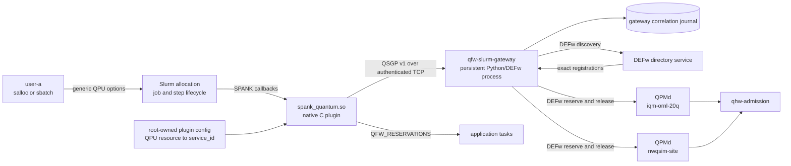
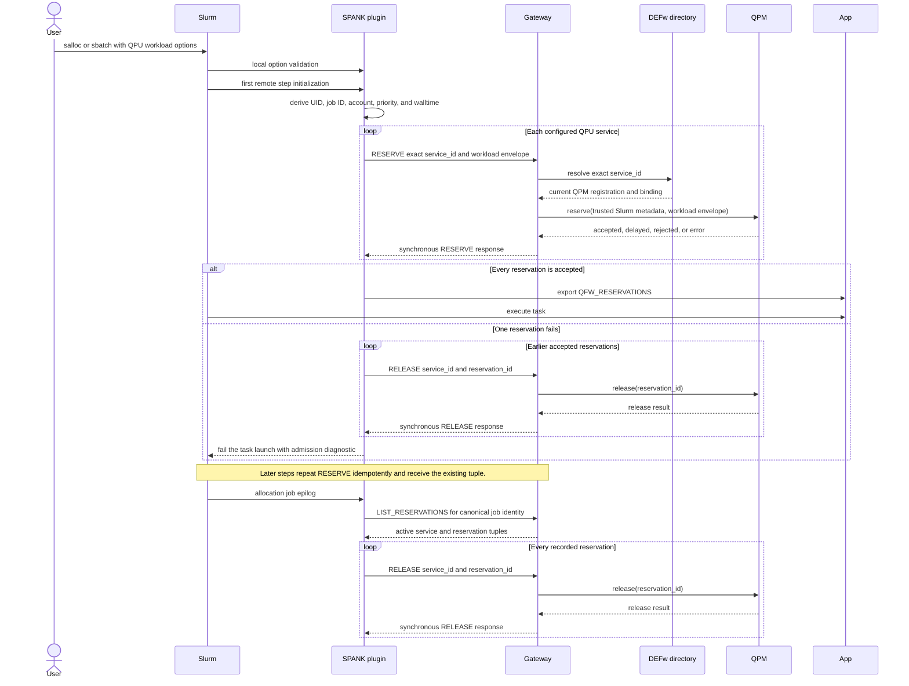

# Slurm Quantum Plugin Requirements

**Status:** draft

## Purpose and Role

The Slurm quantum plugin connects a Slurm allocation lifecycle to managed
quantum-resource reservation APIs. Users describe the quantum workload in
ordinary `salloc`, `sbatch`, or `srun` options. The plugin combines those
values with trusted Slurm job metadata and reserves the requested QPM services
before an application task starts.

The plugin is native C code loaded into Slurm processes. It does not initialize
Python or DEFw. A persistent gateway process provides the language boundary.
The plugin sends small synchronous requests directly to the gateway through a
native protocol. The gateway is a DEFw client that resolves directory records
and invokes the existing Python QPM APIs.

The plugin drives reservation and release. The gateway performs no autonomous
admission decisions and does not choose when a Slurm allocation acquires or
releases a QPM. It supplies connectivity, exact service resolution, RPC
forwarding, idempotency, and a durable correlation journal.

The implementation belongs in a separate OpenQSE repository. QFw, DEFw,
qhw-admission, QRMI, and QDMI remain independently buildable components.

## Deployment Object Diagram

The following object diagram shows one deployed allocation path. The gateway
runs as a persistent service on a site-selected service host, such as the
Slurm controller host. SPANK callbacks can execute on other Slurm nodes and
therefore reach the gateway through its protected network listener.



The application receives reservation identifiers and service identifiers. It
does not receive provider credentials, device-access files, gateway
credentials, or QPM operator state.

## Allocation Sequence

The sequence uses the first remote job step as the acquisition point. This
works for a batch script and for the first `srun` inside an interactive
allocation. A reservation remains active across later steps. The job epilog,
which corresponds to allocation termination, drives release.



SPANK step exit does not release a QPM reservation. Releasing there would end
the reservation after the first `srun` while its `salloc` allocation remains
active.

## User Workload Interface

The user interface describes one conservative circuit envelope for each QPU
reservation. Each value has its own typed Slurm option. The interface does not
use a packed comma-separated workload string and does not carry a QFw-specific
prefix.

```bash
salloc \
    --qpu=ornl-iqm-20q \
    --workload-kind=hybrid \
    --circ-count=20 \
    --max-qubits=5 \
    --max-depth=120 \
    --max-shots=1024 \
    --max-one-q-gates=300 \
    --max-two-q-gates=80 \
    --max-measurements=5 \
    --nodes=1 \
    --ntasks=1 \
    --time=01:00:00
```

| Option | Meaning | Admission mapping |
| --- | --- | --- |
| `--qpu` | Administrator-defined Slurm QPU resource name. | Root-owned configuration maps the name to one exact QPM `service_id`. |
| `--workload-kind` | `quantum` or `hybrid`. | `qhw_adm_request_t.workload_kind` |
| `--circ-count` | Maximum circuits covered by the reservation. | QFw maps the declared circuits into the task-class count used for admission accounting. |
| `--max-qubits` | Maximum qubits used by one declared circuit. | `qhw_adm_qtask_class_t.qubit_count` |
| `--max-depth` | Maximum depth of one declared circuit. | `qhw_adm_qtask_class_t.depth` |
| `--max-shots` | Maximum shots for one declared circuit. | `qhw_adm_qtask_class_t.shots` |
| `--max-one-q-gates` | Maximum one-qubit gates in one declared circuit. | `qhw_adm_qtask_class_t.one_q_gate_count` |
| `--max-two-q-gates` | Maximum two-qubit gates in one declared circuit. | `qhw_adm_qtask_class_t.two_q_gate_count` |
| `--max-measurements` | Maximum measurement operations in one declared circuit. | `qhw_adm_qtask_class_t.measurement_count` |
| Slurm `--time` | Allocation walltime. | `qhw_adm_request_t.walltime_ns` after checked conversion. |

The QPM device profile supplies device limits such as `max_qubits`,
`max_shots`, provider queue depth, policy, estimator, and device timing. These
are site-owned limits and are not Slurm user options. Slurm supplies the
trusted UID, job identity, account, QoS, priority, and walltime. QPMd supplies
the reservation identifier and applies site TTL and credential policy.

The gateway protocol preserves the circuit envelope as distinct fields. It
does not serialize the original command line or forward an unparsed option
string.

## Plugin and Gateway Protocol

The QFw Slurm Gateway Protocol is named QSGP. Version 1 uses a synchronous
request-response exchange over TCP. Each connection carries one request and
one response. The connection closes after the response, which avoids shared
connection state inside Slurm processes.

Every request and response is authenticated as a MUNGE credential. The decoded
MUNGE payload is one QSGP frame. On the network, a frame is carried as a
four-byte unsigned credential length in network byte order followed by that
many credential bytes. A receiver rejects a zero length, an oversized length,
an invalid credential, an expired credential, or an unexpected credential
issuer.

### Fixed Header

The decoded QSGP header is 32 bytes. All integer fields use network byte order.

| Offset | Size | Field | Value |
| ---: | ---: | --- | --- |
| 0 | 4 | `magic` | ASCII `QSGP` |
| 4 | 2 | `major_version` | `1` |
| 6 | 2 | `minor_version` | `0` |
| 8 | 2 | `message_type` | Request or response operation code |
| 10 | 2 | `flags` | Defined per message; zero when unused |
| 12 | 4 | `header_size` | `32` |
| 16 | 8 | `correlation_id` | Plugin-generated nonzero request correlation |
| 24 | 4 | `payload_size` | Bytes following the fixed header |
| 28 | 4 | `reserved` | Zero on send and ignored only when the version permits it |

The payload contains aligned type-length-value records. Each TLV begins with a
two-byte type, two-byte flags, and four-byte value length. The value follows
and is padded with zero bytes to a four-byte boundary. Strings are UTF-8 byte
sequences without a terminating nul. Numeric values have fixed sizes and use
network byte order. An unknown required TLV fails the request. An unknown
optional TLV is skipped after validating its length and padding.

### Operations

| Operation | Direction | Purpose |
| --- | --- | --- |
| `HEALTH` | Plugin to gateway | Verify protocol compatibility and gateway readiness without changing state. |
| `RESERVE` | Plugin to gateway | Resolve one exact QPM service and synchronously invoke its reservation API. |
| `LIST_RESERVATIONS` | Plugin to gateway | Retrieve reservation tuples correlated with one canonical Slurm job identity. |
| `RELEASE` | Plugin to gateway | Synchronously invoke one exact QPM release API. |

`RESERVE_SET` is not part of the protocol. The plugin issues one `RESERVE` per
QPM service, owns the transaction, and releases earlier successes if a later
reservation fails.

### Reserve Request

| Field | Type | Required | Source |
| --- | --- | --- | --- |
| Cluster name | UTF-8 string | Yes | Slurm configuration |
| Canonical job ID | `uint64` | Yes | Slurm job metadata |
| Heterogeneous job ID | `uint64` | When applicable | Slurm job metadata |
| Heterogeneous component | `uint32` | When applicable | Slurm job metadata |
| Job UID | `uint32` | Yes | Slurm job metadata |
| Job GID | `uint32` | Yes | Slurm job metadata |
| Service ID | UTF-8 string | Yes | Root-owned QPU resource mapping |
| Workload kind | `uint32` enumeration | Yes | `--workload-kind` |
| Walltime nanoseconds | `uint64` | Yes | Slurm `--time` |
| Circuit count | `uint64` | Yes | `--circ-count` |
| Maximum qubits | `uint32` | Yes | `--max-qubits` |
| Maximum depth | `uint64` | Yes | `--max-depth` |
| Maximum shots | `uint64` | Yes | `--max-shots` |
| Maximum one-qubit gates | `uint64` | No | `--max-one-q-gates` |
| Maximum two-qubit gates | `uint64` | No | `--max-two-q-gates` |
| Maximum measurements | `uint64` | No | `--max-measurements` |

The gateway derives the username from the trusted UID and verifies the job
identity against Slurm-visible state. The request never carries a provider
credential, credential handle, user-selected reservation ID, device profile,
policy name, or estimator configuration.

### Reserve Response

A reserve response echoes the correlation ID and returns an outcome of
`accepted`, `delayed`, `rejected`, or `error`. An accepted response contains
the exact service ID and a nonzero unsigned 64-bit reservation ID. Other
outcomes contain a machine-readable reason code, optional retry delay, and a
bounded diagnostic string. The plugin exports only complete accepted tuples.

### List and Release

`LIST_RESERVATIONS` identifies the canonical Slurm job and returns repeated
records containing `service_id`, `reservation_id`, state, and the QPM runtime
generation recorded at acquisition. `RELEASE` supplies the canonical job,
service ID, reservation ID, and a reason code. Its response distinguishes
released, already terminal, not found, authorization failure, QPM failure, and
gateway failure.

Repeated reserve and release calls are idempotent. A reserve key consists of
cluster name, canonical job ID, and service ID. A release key adds the
reservation ID. The gateway journal supports retries and epilog recovery, but
qhw-admission in QPMd remains the authoritative reservation store.

## Synchronous Result Handling

The plugin performs a blocking connect, complete framed write, complete framed
read, MUNGE verification, header validation, TLV validation, and response
decode. Connect, send, and receive operations use bounded configurable
timeouts. Short reads, short writes, and interrupted system calls are handled
without treating a partial frame as a complete response.

The response correlation ID must match the request. The plugin receives the
reservation result directly from the socket and does not poll a file, inspect
gateway logs, or query DEFw. A timeout has an unknown-outcome status. The
plugin retries the same idempotent request rather than issuing a new logical
reservation.

## Requirements

### Architecture and Ownership Requirements

| ID | Requirement |
| --- | --- |
| SLPARCH-001 | The Slurm quantum integration shall be developed and released from a separate OpenQSE repository rather than from the QFw or Slurm-cluster repository. |
| SLPARCH-002 | The integration shall contain a native C SPANK plugin and a persistent gateway that can run as a DEFw client. |
| SLPARCH-003 | The SPANK plugin shall not initialize Python, import QFw Python modules, or participate directly in DEFw RPC. |
| SLPARCH-004 | The gateway shall expose a native protocol endpoint to the SPANK plugin and shall use DEFw internally for directory and QPM calls. |
| SLPARCH-005 | Slurm callbacks in the plugin shall drive every QPM reservation and release operation. |
| SLPARCH-006 | The gateway shall not autonomously create a reservation, choose its lifetime, or release an active reservation except in response to a plugin request. |
| SLPARCH-007 | QPMd and qhw-admission shall remain authoritative for admission decisions, reservation lifecycle, and capacity accounting. |
| SLPARCH-008 | The gateway journal shall contain only correlation, idempotency, recovery, and diagnostic state and shall not replace QPM reservation state. |

### Slurm Option Requirements

| ID | Requirement |
| --- | --- |
| SLPCLI-001 | The plugin shall register QPU workload options for `salloc`, `sbatch`, `srun`, and the corresponding remote SPANK contexts. |
| SLPCLI-002 | User-facing workload options shall be provider-neutral and shall not carry a QFw-specific prefix. |
| SLPCLI-003 | The plugin shall accept `--qpu`, `--workload-kind`, `--circ-count`, `--max-qubits`, `--max-depth`, `--max-shots`, `--max-one-q-gates`, `--max-two-q-gates`, and `--max-measurements`. |
| SLPCLI-004 | Each workload scalar shall be represented by its own option rather than by a packed comma-separated workload string. |
| SLPCLI-005 | The plugin shall validate option presence, enumeration values, numeric syntax, zero rules, ranges, and conflicting duplicate values in the local option callback. |
| SLPCLI-006 | The plugin shall preserve the validated option values when Slurm propagates them to the remote context and shall validate them again before reservation. |
| SLPCLI-007 | The plugin shall treat `--circ-count`, `--max-qubits`, `--max-depth`, and `--max-shots` as required positive values for a managed QPU request. |
| SLPCLI-008 | The plugin shall permit zero one-qubit gates, two-qubit gates, or measurements when the active estimator accepts those values. |
| SLPCLI-009 | The plugin shall derive walltime from Slurm `--time` and shall not define a second quantum walltime option. |
| SLPCLI-010 | The plugin shall derive user, job, account, QoS, priority, and allocation identity from Slurm rather than accepting user replacements for those values. |
| SLPCLI-011 | Device limits, admission policies, estimators, credential selectors, credential material, and reservation identifiers shall not be user options. |

### Resource Mapping and Admission Requirements

| ID | Requirement |
| --- | --- |
| SLPADM-001 | Root-owned configuration shall map each accepted `--qpu` resource name to one exact QPM service ID. |
| SLPADM-002 | The plugin shall send the configured service ID to the gateway and shall not ask the gateway to select an arbitrary compatible QPM. |
| SLPADM-003 | The gateway shall resolve the exact service ID through the configured DEFw directory service before invoking a QPM API. |
| SLPADM-004 | The gateway shall reject an absent, duplicate, stale, or ambiguous exact service registration rather than substituting another QPM. |
| SLPADM-005 | The QFw gateway adapter shall map the user workload envelope and trusted Slurm metadata into the existing QPM reservation request. |
| SLPADM-006 | The QPM shall compare the requested circuit envelope with its site-owned device profile, estimator, policy, entitlement, and credential configuration. |
| SLPADM-007 | The plugin shall distinguish accepted, delayed, rejected, and transport-error outcomes and shall expose the bounded diagnostic through Slurm logging. |
| SLPADM-008 | The plugin shall export a reservation tuple only after the corresponding QPM returns an accepted decision and a nonzero reservation ID. |

### Lifecycle Requirements

| ID | Requirement |
| --- | --- |
| SLPLIFE-001 | The plugin shall reserve requested QPM services before the first application task in a Slurm allocation executes. |
| SLPLIFE-002 | The plugin shall retain accepted QPM reservations across multiple `srun` steps within the same allocation. |
| SLPLIFE-003 | The plugin shall not release allocation-owned QPM reservations from a step-level `slurm_spank_exit` callback. |
| SLPLIFE-004 | The allocation job epilog shall drive release of every reservation associated with the canonical Slurm job identity. |
| SLPLIFE-005 | The plugin shall issue one `RESERVE` operation per requested QPM service and shall retain ownership of the multi-service transaction. |
| SLPLIFE-006 | If one reserve operation fails, the plugin shall issue `RELEASE` for every reservation accepted earlier in the same transaction. |
| SLPLIFE-007 | Release processing shall attempt every reservation even when an earlier release fails. |
| SLPLIFE-008 | Repeated remote step initialization shall obtain the existing idempotent reservation instead of creating a second reservation for the same service and allocation. |
| SLPLIFE-009 | One Slurm allocation shall reserve a given QPM service ID at most once. |
| SLPLIFE-010 | The plugin shall export the complete QFw tuple set as `QFW_RESERVATIONS` before application execution. |

### Protocol Requirements

| ID | Requirement |
| --- | --- |
| SLPPROTO-001 | Plugin-to-gateway communication shall use the versioned QSGP protocol rather than DEFw RPC. |
| SLPPROTO-002 | QSGP version 1 shall use one synchronous request and one synchronous response per TCP connection. |
| SLPPROTO-003 | Each network message shall contain a bounded length prefix followed by one MUNGE credential whose decoded payload is one QSGP frame. |
| SLPPROTO-004 | The QSGP header shall contain the magic value, major and minor versions, message type, flags, header size, nonzero correlation ID, payload size, and zeroed reserved field. |
| SLPPROTO-005 | QSGP integers shall use fixed widths and network byte order. |
| SLPPROTO-006 | QSGP variable fields shall use bounded aligned TLVs with defined string encoding, padding, unknown-field behavior, and no process-local pointers. |
| SLPPROTO-007 | Version 1 shall define `HEALTH`, `RESERVE`, `LIST_RESERVATIONS`, and `RELEASE` operations and shall not define a gateway-owned `RESERVE_SET` transaction. |
| SLPPROTO-008 | Every response shall echo the request correlation ID and shall contain a machine-readable status. |
| SLPPROTO-009 | A reserve response shall return the exact service ID and unsigned 64-bit reservation ID when accepted. |
| SLPPROTO-010 | Non-accepted responses shall return a machine-readable reason and may return a bounded diagnostic and retry delay. |
| SLPPROTO-011 | The plugin and gateway shall reject malformed lengths, integer overflow, invalid padding, unsupported required TLVs, trailing bytes, and oversized frames before using payload values. |
| SLPPROTO-012 | Protocol evolution shall preserve assigned operation and TLV identifiers within a major version and shall reject an unsupported major version. |

### Gateway Requirements

| ID | Requirement |
| --- | --- |
| SLPGW-001 | The gateway shall initialize DEFw once, connect to the configured directory service, and keep its DEFw runtime alive across Slurm jobs. |
| SLPGW-002 | The gateway shall resolve exact QPM registrations and obtain the admission API binding needed for reserve and release calls. |
| SLPGW-003 | The gateway shall forward one plugin `RESERVE` to one QPM reservation call and one plugin `RELEASE` to one QPM release call. |
| SLPGW-004 | The gateway shall synchronously return the normalized QPM result to the requesting plugin connection. |
| SLPGW-005 | The gateway shall serialize concurrent operations for the same cluster, job, and service while allowing unrelated jobs to progress concurrently. |
| SLPGW-006 | The gateway shall durably journal accepted tuples before acknowledging them to the plugin. |
| SLPGW-007 | `LIST_RESERVATIONS` shall return the journaled tuples for the exact canonical Slurm job identity without querying for compatible replacement services. |
| SLPGW-008 | A gateway restart shall recover the journal, reconnect to DEFw, and permit idempotent list and release operations for previously acknowledged tuples. |
| SLPGW-009 | The gateway shall never return provider credentials, protected configuration contents, or QPM credential bindings to the plugin. |

### Security and Failure Requirements

| ID | Requirement |
| --- | --- |
| SLPSEC-001 | The gateway listener shall reject unauthenticated network requests. |
| SLPSEC-002 | The plugin and gateway shall authenticate QSGP messages with MUNGE and shall reject expired, replayed, or unauthorized credentials. |
| SLPSEC-003 | The gateway shall accept reservation lifecycle requests only from configured privileged Slurm identities. |
| SLPSEC-004 | The gateway shall verify that the claimed job UID and canonical job ID match Slurm-visible job state before forwarding a reservation request. |
| SLPSEC-005 | Root-owned configuration shall protect the gateway endpoint, accepted credential identities, resource mapping, timeouts, and size limits from application modification. |
| SLPSEC-006 | Logs shall omit provider credentials, MUNGE credentials, protected configuration contents, and application payloads. |
| SLPFAIL-001 | Connect, send, receive, DEFw resolution, and QPM invocation shall use bounded configurable timeouts. |
| SLPFAIL-002 | A timeout after sending a request shall be treated as an unknown outcome and shall be retried with the same idempotency identity. |
| SLPFAIL-003 | Plugin initialization failures caused by admission or gateway errors shall fail the affected job or task without draining a healthy compute node. |
| SLPFAIL-004 | A failed epilog release shall remain visible in the gateway journal and logs until an explicit retry succeeds or the QPM reservation expires. |
| SLPFAIL-005 | QPM restart, generation mismatch, or missing reservation shall produce a terminal structured result and shall not bind the old tuple to a replacement service. |

### Validation Requirements

| ID | Requirement |
| --- | --- |
| SLPVAL-001 | Unit tests shall cover every option, boundary value, duplicate, missing value, enumeration, and cross-option validation rule. |
| SLPVAL-002 | Protocol tests shall cover encode/decode round trips, malformed frames, unsupported versions, unknown TLVs, truncation, overflow, timeout, replay, and authentication failure. |
| SLPVAL-003 | Gateway tests shall use mocked directory and QPM bindings to validate exact resolution, synchronous outcomes, idempotency, rollback support, journaling, restart recovery, and release. |
| SLPVAL-004 | Slurm integration tests shall cover `sbatch`, `salloc` with multiple `srun` steps, normal allocations, heterogeneous allocations, multiple users, and multiple QPM services. |
| SLPVAL-005 | Integration tests shall prove that a step exit does not release an allocation reservation and that the job epilog releases every tuple. |
| SLPVAL-006 | End-to-end tests shall run QFw examples against NWQSim and fakeIQM before a bounded real-IQM test is enabled. |
| SLPVAL-007 | Tests shall confirm that application users cannot read gateway credentials, device-access configuration, QPU credentials, or another job's reservation journal. |
| SLPVAL-008 | Compatibility tests shall build the plugin against every supported Slurm major and minor release and shall exercise its declared SPANK contexts. |
