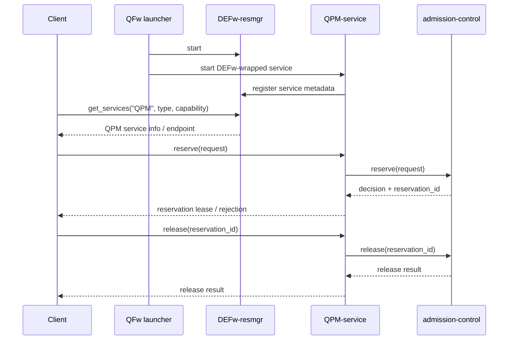
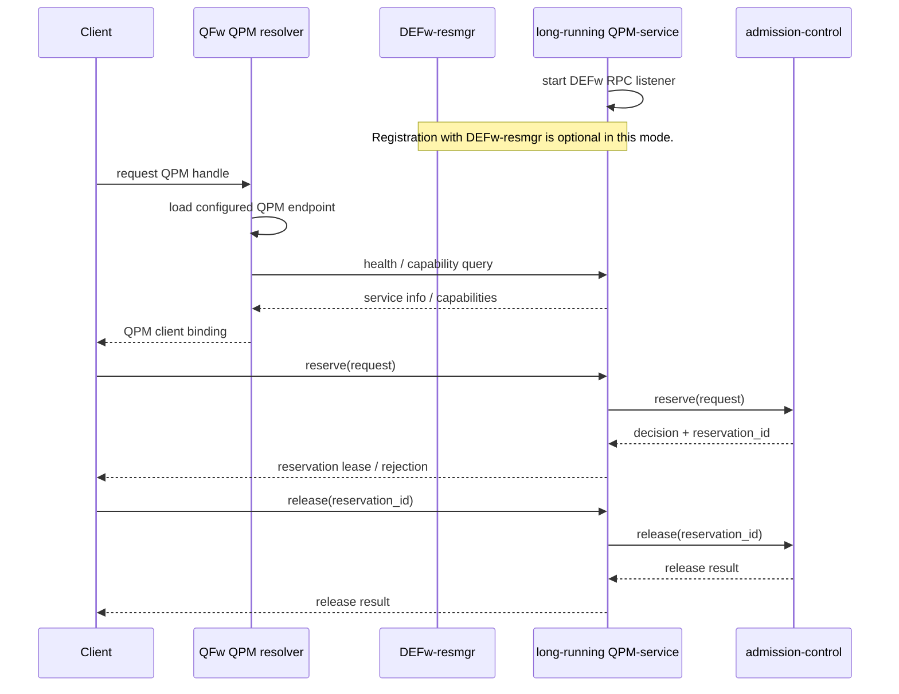

# Requirements

## Table Of Contents

- [Operation Mode: QFw-Managed Services](#operation-mode-qfw-managed-services)
- [Operation Mode: Long-Running QPM Service](#operation-mode-long-running-qpm-service)
- [Requirements](#requirements-1)
  - [Operation Mode Requirements](#operation-mode-requirements)
  - [Discovery And Registration Requirements](#discovery-and-registration-requirements)
  - [Admission And Reservation Requirements](#admission-and-reservation-requirements)
  - [Scheduler And Task Lifecycle Requirements](#scheduler-and-task-lifecycle-requirements)
  - [API Category Requirements](#api-category-requirements)
  - [QPM API Requirements](#qpm-api-requirements)
  - [Control Plane And Telemetry Requirements](#control-plane-and-telemetry-requirements)
  - [Runtime State Requirements](#runtime-state-requirements)

<strong>Operation Mode: QFw-Managed Services</strong>

## Operation Mode: QFw-Managed Services

In QFw-managed mode, QFw owns the lifecycle of the DEFw resource manager and
QPM services. QPM registers with DEFw-resmgr for discovery, but reservation and
release semantics are handled by the QPM service through admission-control.

<strong>Operation Mode: Long-Running QPM Service</strong>

## Operation Mode: Long-Running QPM Service

In long-running mode, the QPM service is already running on the resource as a
DEFw-wrapped service. It listens for DEFw RPC calls on a known endpoint, but it
does not have to register with a DEFw resource manager. QFw initialization must
resolve the QPM endpoint from configuration or another registry and then use the
same QPM reservation and release APIs.

<strong>Requirements</strong>

## Requirements

Requirement IDs are stable references. Matching design notes are maintained in
`docs/detailed-design.md` under the same IDs.

Authentication requirements are maintained separately in
`docs/requirements-authentication.md`. This document describes the current
integration milestone, where QPM APIs may accept token parameters but do not
validate tokens or authorize callers from them.

<strong>Operation Mode Requirements</strong>

### Operation Mode Requirements

| Requirement ID | Requirement |
| --- | --- |
| OPM-001 | The QFw shall support a QFw-managed operation mode in which QFw starts DEFw-resmgr and QPM services, and QPM services register with DEFw-resmgr for discovery. |
| OPM-002 | The QFw shall support a long-running QPM operation mode in which a DEFw-wrapped QPM service is already listening on a known endpoint and is not required to register with DEFw-resmgr. |
| OPM-003 | The QFw shall keep service deployment ownership independent from reservation ownership. A service may be QFw-managed or externally managed, but reservation state shall be owned by the QPM admission path backed by qhw-admission. |

<strong>Discovery And Registration Requirements</strong>

### Discovery And Registration Requirements

| Requirement ID | Requirement |
| --- | --- |
| DISC-001 | The DEFw resource manager shall provide service registration, deregistration, and discovery for services that choose to register with it. |
| DISC-002 | The DEFw resource manager shall not own QPM admission reservation state or perform QPM admission capacity accounting. |
| DISC-003 | DEFw-wrapped services shall support a startup configuration that allows them to listen for DEFw RPC calls without registering with a DEFw resource manager. |
| DISC-004 | The QFw shall provide a QPM resolution path that can obtain a QPM client binding from either DEFw-resmgr discovery or a configured long-running QPM endpoint. |
| DISC-005 | A long-running QPM service shall remain callable by DEFw clients and DEFw services through DEFw RPC. |

<strong>Admission And Reservation Requirements</strong>

### Admission And Reservation Requirements

| Requirement ID | Requirement |
| --- | --- |
| ADM-001 | The QPM service shall use qhw-admission as the authoritative reservation store for reservation IDs, reservation state, request owner/job/device/scope correlation, usage, compliance, and lifecycle updates. |
| ADM-002 | The QPM service shall expose a reservation operation that calls qhw-admission with reservation request fields sufficient to validate later reservation-scoped use, such as owner metadata, scheduler job or allocation identifier when applicable, target device, scope, expiration, and policy-specific request metadata; the operation shall return an admission decision and a reservation ID when the request is accepted. |
| ADM-003 | The QPM service shall expose a release operation that accepts a reservation ID and calls qhw-admission to release that reservation. |
| ADM-004 | The QPM service shall not maintain an independent reservation database that duplicates qhw-admission reservation state. |
| ADM-005 | Before performing or queuing a resource-affecting operation under a reservation ID, the QPM service shall use qhw-admission APIs to verify that the reservation exists, is active, has not expired, has not been cancelled or released, and matches the requested job, session, scope, target device, and operation type. |
| ADM-006 | Before submitting a reservation-scoped qtask to qhw-scheduler, the QPM service shall use qhw-admission APIs to establish an estimated in-flight capacity hold for the credits, rate allowance, shot count, circuit count, walltime, estimated device time, or other policy capacity required for that qtask. |
| ADM-007 | The QPM service shall record estimated and actual usage for accepted reservation-scoped operations in qhw-admission. |
| ADM-016 | QPM reservation APIs shall return structured outcomes from qhw-admission that distinguish accepted, delayed, and rejected requests and include a machine-readable reason when a request is not accepted. |
| ADM-017 | The QPM service shall expose or enforce reservation lifecycle states from qhw-admission that distinguish active, renewed, released, cancelled, expired, and over-limit reservations. |
| ADM-018 | The QPM service shall use qhw-admission APIs to perform reservation allowance checks and usage updates with concurrency control that prevents concurrent reservation-scoped operations from holding or consuming more credits, rate allowance, or policy capacity than the reservation permits. |
| ADM-019 | If qhw-admission cannot establish the estimated in-flight capacity hold required for a reservation-scoped qtask, the QPM service shall not submit that qtask to qhw-scheduler or to the provider execution path. |
| ADM-020 | When a reservation-scoped qtask cannot obtain estimated capacity, the QPM service shall reject the qtask, delay the qtask, or place it in a QPM-managed pending queue according to site policy. |
| ADM-021 | The QPM service shall treat estimated qtask capacity as an in-flight hold. When a reservation-scoped qtask is cancelled, rejected after the hold, fails before provider execution, or reaches a terminal state, the QPM service shall release the hold and record final usage according to admission policy. |
| ADM-022 | When held capacity is released or additional reservation capacity becomes available, the QPM service shall retry pending qtasks for the affected reservation according to scheduler and site policy. |

<strong>Scheduler And Task Lifecycle Requirements</strong>

### Scheduler And Task Lifecycle Requirements

| Requirement ID | Requirement |
| --- | --- |
| SCHED-001 | The QPM service shall route reservation-scoped execution work through qhw-scheduler and submit only scheduler-selected qtasks to the provider execution path during normal scheduled execution. |
| SCHED-002 | The QPM service shall maintain scheduler state per managed QPU execution target. |
| SCHED-003 | The QPM service shall associate scheduler tasks with QFw circuit records and the reservation ID that authorized the work. |
| SCHED-004 | When site policy delays qtasks that are waiting for reservation capacity, the QPM service shall keep those qtasks in a QPM-managed pending state instead of submitting them to qhw-scheduler. |
| SCHED-005 | The QPM service shall update scheduler task lifecycle state for task insertion, selection, provider submission, completion, failure, cancellation, and timeout. |
| SCHED-006 | The QPM service shall update qhw-admission usage and accounting state from task lifecycle events before exposing terminal reservation-scoped task results to clients. |
| SCHED-007 | The QPM service shall bound provider queue depth according to site policy or configuration when dispatching scheduler-selected work. |
| SCHED-008 | The QPM service shall define externally visible behavior for synchronous execution requests that are accepted but waiting for reservation capacity or scheduler selection, including blocking, timeout, cancellation, and delayed-status semantics. |
| SCHED-009 | Public execution APIs shall not provide a normal execution path that bypasses qhw-admission capacity checks and scheduler selection before provider submission. |
| SCHED-010 | Any execution path that bypasses qhw-admission capacity checks or scheduler selection shall be restricted to explicitly configured diagnostic or administrative use. |
| SCHED-011 | The QPM service shall propagate cancellation for reservation-scoped tasks across the managed queue, scheduler state, provider-side work when already submitted, result or completion state, and qhw-admission accounting. |
| SCHED-012 | The QPM service shall provide reservation-scoped task status that distinguishes pending for capacity, queued in qhw-scheduler, selected, submitted to provider, running, completed, failed, cancelled, and timed-out tasks. |
| SCHED-013 | The QPM service shall provide pending-queue position, scheduler queue position, or scheduling-order information for reservation-scoped tasks when permitted by site policy. |
| SCHED-014 | The QPM service shall provide estimated wait time or estimated start time for pending or queued reservation-scoped tasks when the scheduler policy and available telemetry can support an estimate. |

<strong>API Category Requirements</strong>

### API Category Requirements

| Requirement ID | Requirement |
| --- | --- |
| CAT-001 | The QFw service API model shall separate execution APIs, admission control APIs, scheduler control APIs, and telemetry/discovery APIs. |
| CAT-002 | Execution APIs shall provide task submission, synchronous execution, asynchronous execution, completion polling, event notification, cancellation, result retrieval, and task metadata behavior for application and runtime clients. |
| CAT-003 | Admission control APIs shall provide workflow-level operations for evaluating, reserving, renewing, releasing, cancelling, and inspecting admission reservations. |
| CAT-004 | Scheduler control APIs shall provide workflow-level operations for configuring scheduler policy, inspecting queue state, draining or pausing execution targets, and tuning scheduler options. |
| CAT-005 | Telemetry and discovery APIs shall provide workflow-level operations for inspecting backend metadata, calibration data, topology, queue state, scheduler policy state, capacity state, and provenance data. |
| CAT-006 | QFw service APIs shall not re-expose the complete low-level qhw-admission or qhw-scheduler C API as remote service APIs. |
| CAT-007 | QFw service APIs shall define observable workflow semantics independently of whether admission and scheduling are implemented directly in QPM, in a closely associated QPU control service, or by a future passive controller library. |

<strong>QPM API Requirements</strong>

### QPM API Requirements

| Requirement ID | Requirement |
| --- | --- |
| API-001 | QPM execution APIs that submit, cancel, or otherwise affect reservation-scoped execution resources shall require a caller-supplied reservation ID. |
| API-002 | QPM APIs that only provide discovery or read-only metadata may be callable without a reservation ID when site policy permits it. |
| API-003 | QPM reservation, release, and execution APIs shall have the same externally visible semantics in QFw-managed mode and long-running QPM mode. |
| API-004 | QPM APIs shall return structured status and error information that distinguishes invalid reservation, insufficient allowance, pending capacity, policy-delayed work, cancelled work, expired reservation, timeout, scheduler failure, and provider failure. |

<strong>Control Plane And Telemetry Requirements</strong>

### Control Plane And Telemetry Requirements

| Requirement ID | Requirement |
| --- | --- |
| CTRL-001 | Admission policy configuration APIs and scheduler policy configuration APIs shall be exposed as control-plane operations at the QFw service API layer. |
| CTRL-002 | The QPM service or associated QPU control service shall provide admission capacity snapshots that include pending qtask count, scheduler queue depth, estimated queued device time, active reservation count, held or in-flight capacity, available capacity or credits, current scheduler policy, device availability, and confidence. |
| CTRL-003 | Admission policies shall consume capacity snapshots through a defined QPM or QPU control interface instead of reading QFw service internals or qhw-scheduler internal state directly. |
| CTRL-004 | QFw telemetry shall expose pending queue state, scheduler queue state, scheduler policy state, device availability, and capacity state needed by operators and site automation. |
| CTRL-005 | The QPM service or associated QPU control service shall configure a qhw-admission device profile for each managed QPU before accepting admission reservations for that QPU. |
| CTRL-006 | The QPM service or associated QPU control service shall configure admission policy, estimator policy, and scheduler policy for each managed QPU through control-plane configuration. |
| CTRL-007 | QFw telemetry shall expose aggregate queue metrics, including pending qtask count, scheduler queue depth, estimated queued device time, active task count, held or in-flight capacity, and policy-specific scheduling state when permitted by site policy. |
| CTRL-008 | Queue telemetry APIs shall label estimates with their confidence, timestamp, and policy context when those values are available. |

<strong>Runtime State Requirements</strong>

### Runtime State Requirements

| Requirement ID | Requirement |
| --- | --- |
| STATE-001 | The QPM service shall maintain in-memory runtime mappings among reservation IDs, job IDs, qtask IDs, QFw circuit IDs, qhw-scheduler task IDs, qhw-admission usage events, provider job handles, request owner metadata, token placeholder metadata, QPM pending-queue entries, estimated in-flight capacity holds, worker state, event endpoints, and result state. |
| STATE-002 | QPM runtime state for reservation-scoped work shall be associated with the relevant reservation ID. |
| STATE-003 | The QPM service shall use its in-memory runtime state to correlate QFw circuit records, qhw-scheduler tasks, qhw-admission usage records, provider job handles, completion events, and client-visible status. |
| STATE-004 | The QPM service shall clean up runtime state when reservation-scoped work reaches a terminal state or when the reservation is released, cancelled, or expired. |

