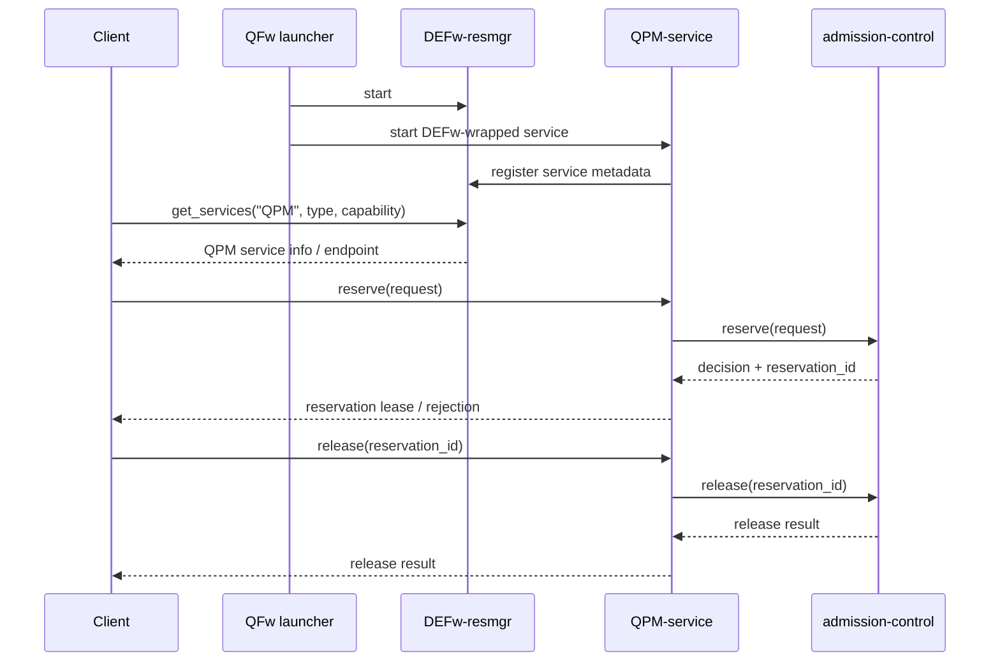
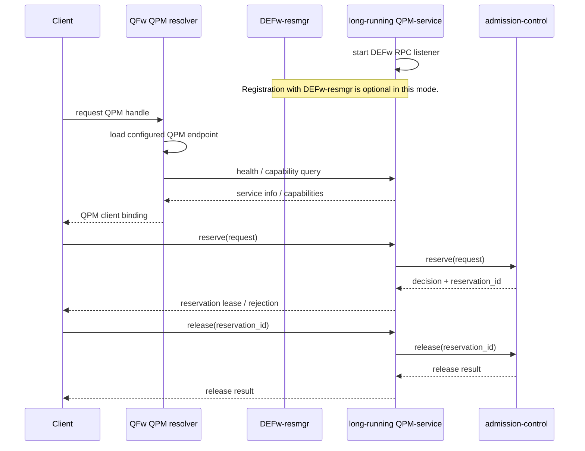

# Requirements

## Table Of Contents

- [Operation Mode: QFw-Managed Services](#operation-mode-qfw-managed-services)
- [Operation Mode: Long-Running QPM Service](#operation-mode-long-running-qpm-service)
- [Requirements](#requirements-1)
  - [Operation Mode Requirements](#operation-mode-requirements)
  - [Discovery And Registration Requirements](#discovery-and-registration-requirements)
  - [Admission And Reservation Requirements](#admission-and-reservation-requirements)
  - [QPM API Requirements](#qpm-api-requirements)
  - [Runtime State Requirements](#runtime-state-requirements)

<strong>Operation Mode: QFw-Managed Services</strong>

## Operation Mode: QFw-Managed Services

In QFw-managed mode, QFw owns the lifecycle of the DEFw resource manager and
QPM services. QPM registers with DEFw-resmgr for discovery, but reservation and
release semantics are handled by the QPM service through admission-control.

<strong>Operation Mode: Long-Running QPM Service</strong>

## Operation Mode: Long-Running QPM Service

In long-running mode, the QPM service is already running on the resource as a
DEFw-wrapped service. It listens for DEFw RPC calls on a known endpoint, but it
does not have to register with a DEFw resource manager. QFw initialization must
resolve the QPM endpoint from configuration or another registry and then use the
same QPM reservation and release APIs.

<strong>Requirements</strong>

## Requirements

Requirement IDs are stable references. Matching design notes are maintained in
`docs/detailed-design.md` under the same IDs.

<strong>Operation Mode Requirements</strong>

### Operation Mode Requirements

| Requirement ID | Requirement |
| --- | --- |
| OPM-001 | The QFw shall support a QFw-managed operation mode in which QFw starts DEFw-resmgr and QPM services, and QPM services register with DEFw-resmgr for discovery. |
| OPM-002 | The QFw shall support a long-running QPM operation mode in which a DEFw-wrapped QPM service is already listening on a known endpoint and is not required to register with DEFw-resmgr. |
| OPM-003 | The QFw shall keep service deployment ownership independent from reservation ownership. A service may be QFw-managed or externally managed, but reservation state shall be owned by the QPM admission path. |

<strong>Discovery And Registration Requirements</strong>

### Discovery And Registration Requirements

| Requirement ID | Requirement |
| --- | --- |
| DISC-001 | The DEFw resource manager shall provide service registration, deregistration, and discovery for services that choose to register with it. |
| DISC-002 | The DEFw resource manager shall not own QPM admission reservation state or perform QPM admission capacity accounting. |
| DISC-003 | DEFw-wrapped services shall support a startup configuration that allows them to listen for DEFw RPC calls without registering with a DEFw resource manager. |
| DISC-004 | The QFw shall provide a QPM resolution path that can obtain a QPM client binding from either DEFw-resmgr discovery or a configured long-running QPM endpoint. |
| DISC-005 | A long-running QPM service shall remain callable by DEFw clients and DEFw services through DEFw RPC. |

<strong>Admission And Reservation Requirements</strong>

### Admission And Reservation Requirements

| Requirement ID | Requirement |
| --- | --- |
| ADM-001 | The QPM service shall use qhw-admission as the authoritative reservation store for reservation IDs, reservation state, user/job/device/scope correlation, usage, compliance, and lifecycle updates. |
| ADM-002 | The QPM service shall expose a reservation operation that calls qhw-admission, returns an admission decision, and returns a reservation ID when the request is accepted. |
| ADM-003 | The QPM service shall expose a release operation that accepts a reservation ID and calls qhw-admission to release that reservation. |
| ADM-004 | The QPM service shall not maintain an independent reservation database that duplicates qhw-admission reservation state. |
| ADM-005 | The QPM service shall validate, authorize, and account for reservation-scoped resource-affecting operations by using qhw-admission APIs before performing the operation. |

<strong>QPM API Requirements</strong>

### QPM API Requirements

| Requirement ID | Requirement |
| --- | --- |
| API-001 | QPM APIs that affect execution resources shall require a caller-supplied reservation ID. |
| API-002 | QPM APIs that only provide discovery or read-only metadata may be callable without a reservation ID when site policy permits it. |
| API-003 | QPM request handling shall use the reservation ID supplied by the caller to distinguish concurrent jobs and sessions using the same long-running QPM service. |
| API-004 | QPM reservation and release APIs shall have the same externally visible semantics in QFw-managed mode and long-running QPM mode. |

<strong>Runtime State Requirements</strong>

### Runtime State Requirements

| Requirement ID | Requirement |
| --- | --- |
| STATE-001 | The QPM service may maintain transient runtime state for in-flight QFw execution, including circuit IDs, worker state, event endpoints, provider job handles, and scheduler task IDs. |
| STATE-002 | QPM transient runtime state shall be associated with the relevant reservation ID when the state belongs to reservation-scoped work. |
| STATE-003 | The QPM service shall clean up transient runtime state when reservation-scoped work reaches a terminal state or when the reservation is released, cancelled, or expired. |

