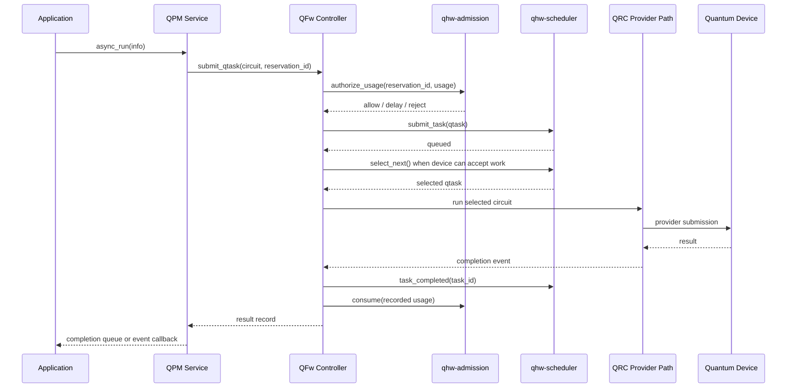

# QFw Integration For qhw-admission And qhw-scheduler

## Purpose

This document first frames `qhw-admission` and `qhw-scheduler` as managed
quantum-resource components. It then applies that model to the QFw QPM/QRC
service path. The split matters because the same libraries should support QFw,
QRMI, QDMI, and standalone site resource services.

The main design question is where the active controller should live. The two C
libraries are passive. They provide policy, state, and ordering primitives, but
they do not own provider execution, service APIs, authentication, result queues,
or shutdown. Those concerns belong to the managed-resource implementation that
hosts the libraries.

## Library Responsibilities

`qhw-admission` evaluates whether a quantum job or hybrid job can enter the
active pool for a managed device. It owns device profiles, estimator plugins,
admission policies, reservations, capacity accounting, and usage compliance
state.

`qhw-scheduler` orders accepted qtasks for one QPU execution target. It owns
task queue state, scheduler policy plugins, task lifecycle state, slicing, and
selection of the next qtask to occupy the QPU.

Neither library should own the hosting framework's remote API, service
registration, provider authentication, provider submission, result transport,
or event notification. Those responsibilities remain in the active managed
resource implementation.

## Placement Relative To QRMI, QDMI, And QPM

The broader goal is to make `qhw-admission` and `qhw-scheduler` useful outside
QFw. Their natural position is the resource-control layer for a quantum
resource. That layer sits below application frameworks and runtime adapters,
but above the provider-native device queue. A user-facing submit operation
should reach the resource-control layer first. The resource-control layer then
decides whether the work is admitted, when it is selected, and when a lower
device adapter may place it on the provider queue.

This placement can be hosted by different integration layers:

| Host layer | How it uses admission/scheduling | Fit |
|---|---|---|
| QPM | QPM exposes the QFw service API. Its implementation calls admission and scheduler libraries before dispatching selected tasks to QRC/provider code. | Best fit for the current QFw implementation because QPM already owns service discovery, remote calls, completions, and provider adapters. |
| QRMI implementation | The QRMI submit path calls admission and scheduler libraries before using the QRMI provider backend to reach the device. | Good fit when QRMI is deployed as the resource-facing interface for a site or middleware layer. |
| QDMI implementation | The QDMI job-submission path calls admission and scheduler libraries before invoking the provider-specific QDMI backend. | Good fit when QDMI is the standardized device-management boundary used by the site or vendor stack. |
| Standalone resource service | A service exposes a site-specific or future standardized resource API and uses QRMI, QDMI, or a native provider API only as the lower device adapter. | Useful when the site wants admission, scheduling, authentication, and telemetry in one resource service independent of any one framework. |

The important distinction is between the public resource API and the lower raw
device adapter. The public resource API is the entry point applications,
resource managers, and runtimes should use. It is responsible for admission,
scheduling, lifecycle management, and policy enforcement. The lower raw device
adapter is the mechanism used after scheduling. It submits selected work to the
provider queue, polls status, retrieves results, and translates provider data.

That split avoids exposing two equivalent `run_job()` APIs. A managed quantum
resource should expose one public submit API. That API is the scheduled path.
The lower provider submit call remains internal to the resource implementation
or restricted to trusted diagnostic tools. If a QRMI or QDMI function is the
public submit function for the deployment, that function should route through
admission and scheduling before it reaches the provider queue. If QRMI or QDMI
is used only as a lower adapter, its submit function is called by the resource
controller and is not the public user entry point.

Conceptually, the stack becomes:

```text
application / SDK / runtime
  -> public resource API
  -> admission control
  -> scheduler
  -> lower device adapter
  -> provider queue
  -> quantum device
```

The lower device adapter can be QRMI, QDMI, QPM/QRC provider code, or a native
vendor API. The admission and scheduler libraries remain independent of that
choice. They operate on resource envelopes, qtask descriptors, estimates, and
lifecycle events.

This also keeps the libraries useful to more audiences. QRMI and QDMI
implementations can embed them. QFw can embed them inside QPM. A standalone
site resource service can embed them while using QRMI or QDMI only for device
submission. The common rule is that scheduling happens before work is placed on
the provider queue.

Public work on QDMI describes it as a standard boundary for managing quantum
hardware and full-stack services, including task lifecycle and result
retrieval. Public QRMI work describes middleware that supports multiple SDKs and
adds a second scheduling layer after the main HPC resource manager to improve
QPU utilization. Those directions are compatible with this placement. The
resource-control layer can be implemented behind either interface while keeping
the admission and scheduler libraries interface-neutral.

### Standardization View

An openQSE-style standardization effort should separate three concerns:
semantics, API categories, and reusable implementations. Admission and
scheduling belong in the semantics of a quantum resource standard. A conforming
resource interface should define what it means to admit work, reserve capacity,
submit work under a reservation, cancel work, report queue state, return
results, and account for usage. Implementations can satisfy those semantics by
using `qhw-admission` and `qhw-scheduler`, by embedding equivalent logic inside
QRMI or QDMI, or by using a site-specific implementation.

The standard should not require one implementation library. It should define
observable behavior and data contracts. `qhw-admission` and `qhw-scheduler`
can then serve as reference implementations for those contracts. This mirrors
how an interface standard can support multiple implementations while still
allowing common test suites, conformance checks, and shared tooling.

Admission is a clean candidate for a separate API category. Resource managers,
workflow managers, and trusted site services need to ask whether a job can be
accepted before the application starts. Those callers do not need the full task
execution API. A standard admission category can expose operations such as
`evaluate`, `reserve`, `renew`, `release`, `cancel`, and `get_reservation`.
The inputs should include workload metadata, target device, walltime, workload
kind, and policy hints. The output should be a structured decision that a
resource manager can translate into its own reservation or allocation model.

Scheduling is different. Device scheduling is not normally a separate
application-facing API. It is part of the semantics behind task lifecycle
operations. A standard `task_run` or `task_submit` operation should mean
"submit this task to the managed resource", not "place this task directly on
the provider queue". The resource implementation then performs reservation
authorization, scheduler insertion, policy ordering, lower-adapter submission,
status tracking, cancellation, and result retrieval. In that model,
scheduling is standardized through task lifecycle semantics and telemetry, not
through a public `select_next()` API exposed to applications.

Scheduler control is a separate category from task execution. Site operators
and trusted automation may need APIs to select a scheduling policy, configure
policy options, inspect queue state, or drain a device. Those APIs should be
control-plane operations with elevated authorization. They are not part of the
normal application task-run path.

This gives the standard four useful API categories:

| Category | Primary consumers | Standardization role |
|---|---|---|
| Admission | Resource managers, workflow managers, trusted site services | Defines how jobs request quantum capacity before execution and how decisions are represented. |
| Task lifecycle | Applications, runtimes, SDK adapters | Defines submit, cancel, status, result, metadata, and event behavior for managed quantum tasks. Scheduling is implicit in this lifecycle. |
| Scheduler control | Site operators and trusted automation | Defines how policy is selected, configured, inspected, and drained. |
| Telemetry and discovery | Applications, operators, monitoring services, admission policy | Defines device properties, queue state, calibration, timing, capacity, and provenance data. |

#### Managed Resource Standard Versus Direct Hardware Access

The standardization target is a managed quantum resource, not direct hardware
access. Direct hardware access is the provider-facing boundary below the
managed resource. The managed resource boundary adds policy, admission,
scheduling, authentication, accounting, telemetry, and lifecycle semantics
before work reaches the provider queue.

This distinction supports two implementation models.

| Model | Description | Consequence |
|---|---|---|
| Complete implementation model | An implementation provides the full managed-resource standard directly. Admission, scheduling, telemetry, task lifecycle, and provider submission are all internal implementation details. | This resembles the MPI model. Multiple independent implementations can expose the same standard behavior without sharing code. |
| Reusable infrastructure model | Common libraries provide reusable admission, scheduling, data structures, policy plugins, estimators, and conformance helpers. Providers implement the device adapter, provider-specific telemetry, and hardware-specific translation. | This resembles the libfabric model. Implementations share common infrastructure while still exposing the same standard behavior. |

Both models can implement the same standard. The standard defines behavior,
state transitions, data contracts, and required error semantics. It does not
require every implementation to use the same code. A complete implementation
can implement all semantics internally. A composable implementation can use
`qhw-admission`, `qhw-scheduler`, `qhw-datastructures`, and provider-specific
adapters to assemble the same externally visible behavior.

This matters for QDMI and QRMI alignment. QDMI can remain a standard interface
while still allowing reusable libraries below the interface. An implementation
can expose the QDMI task lifecycle and admission semantics, use
`qhw-admission` for reservation decisions, use `qhw-scheduler` for local device
ordering, and implement only the provider-specific data paths itself. Another
implementation can expose the same QDMI behavior with its own admission and
scheduling logic. Both are valid if they pass the same conformance tests.

The same applies to QRMI. A QRMI implementation can embed the reusable qhw
libraries behind its public calls. A site resource service can also expose the
standardized managed-resource API and use QRMI as the lower device adapter.
The visible distinction is the boundary chosen by the deployment. The standard
should define the managed-resource behavior above that boundary and the
device-adapter responsibilities below it.

This gives openQSE two complementary deliverables. The first is a managed
resource interface standard. It defines admission, task lifecycle, scheduler
control, telemetry, and device-adapter semantics. The second is a set of
reference infrastructure libraries. Those libraries make it easier to build a
conforming implementation and reduce duplicated code across otherwise
independent QRMI, QDMI, QPM, and site-specific stacks.

#### Lifecycle Before Interface Definitions

QRMI/QDMI alignment should start with the managed-resource lifecycle before it
defines function names or bindings. API names are only stable when the state
machine is stable. The working group needs agreement on the objects, states,
state transitions, ownership rules, events, and error semantics exposed by a
managed quantum resource.

The lifecycle should cover at least two related objects. The first is the
reservation or allocation object. It starts as a capacity request, becomes an
accepted, delayed, or rejected decision, and may later be active, renewed,
released, cancelled, expired, or over-limit. The second is the managed quantum
task. It is submitted under an admitted reservation, accepted by the managed
resource, queued by the scheduler, selected for execution, submitted through a
device adapter, run by the provider, completed, failed, cancelled, or timed
out. Result retrieval, metadata retrieval, and accounting updates attach to
that lifecycle rather than existing as unrelated calls.

Once those lifecycles are defined, interface design becomes more mechanical.
Each API maps to a lifecycle transition or query. `reserve()` maps to the
reservation state machine. `task_submit()` maps to the task entering the
managed-resource queue. `task_cancel()` maps to cancellation semantics across
the managed queue, lower adapter, and provider queue. `task_status()` and
events expose lifecycle state. `task_result()` returns a terminal result and
associated metadata. Scheduler behavior is visible through task states,
queue-state telemetry, and control-plane policy APIs.

The lifecycle definition should also define responsibilities at each boundary:

| Boundary | Lifecycle responsibility |
|---|---|
| Resource manager to managed resource | Request capacity, receive an admission decision, bind an application to a reservation, and release or expire the reservation. |
| Application/runtime to managed resource | Submit qtasks under a reservation, cancel qtasks, observe status, receive events, retrieve results, and inspect metadata. |
| Managed resource to scheduler | Insert eligible qtasks, select work, enforce local policy, and update task lifecycle state. |
| Managed resource to device adapter | Submit only scheduler-selected work, cancel provider-side work, poll provider state, retrieve provider results, and translate provider metadata. |
| Managed resource to telemetry/accounting | Record estimates, actual usage, queue delay, device occupancy, failures, and policy actions. |

Several classical systems follow this lifecycle-first pattern.

| Analogue | Relevant pattern |
|---|---|
| MPI | The standard defines operation semantics, message matching, request lifecycles, completion rules, and error behavior before individual language bindings. Implementations can be independent while preserving observable behavior. |
| libfabric | The API is organized around resource objects, endpoints, event queues, completion queues, counters, and provider operations. Providers implement hardware-specific behavior behind common lifecycle and completion semantics. |
| SLURM, Flux, and other resource managers | Job submission APIs are built around job state machines. Jobs move through pending, running, completing, completed, failed, cancelled, timeout, and held states. CLI and RPC APIs expose transitions and queries over that lifecycle. |
| Kubernetes | The Pod and Job models define lifecycle states, ownership, controller behavior, status conditions, and event reporting. Multiple container runtimes can sit below the same managed-resource semantics. |
| GPU command queues | CUDA, HIP, OpenCL, and Vulkan expose work submission, streams or queues, events, synchronization, and completion semantics. The user submits to a managed runtime queue rather than directly controlling every hardware scheduling decision. |

The QRMI/QDMI alignment effort can use the same approach. Define the managed
resource lifecycle first. Then define API categories and bindings that expose
that lifecycle. Finally, define conformance tests that verify behavior across
complete implementations and composable implementations that reuse common qhw
libraries.

QRMI, QDMI, and QPM can each host these categories. A QRMI/QDMI alignment
effort can define one common task lifecycle and one common admission/control
model, then allow each implementation to decide where the logic lives. The
implementation may place admission and scheduling directly inside QRMI/QDMI, or
it may place them in a resource service that uses QRMI/QDMI as a lower device
adapter. Both placements satisfy the same standard when the external behavior
matches.

The lower provider-facing calls still exist, but they are not the managed
resource interface. They are implementation hooks. A standard can name that
boundary explicitly as the device-adapter boundary. Calls below that boundary
submit selected work to the device provider. Calls above that boundary enforce
admission, scheduling, authentication, accounting, and telemetry semantics.

## QFw Integration Context

The generic managed-resource model maps naturally onto the QFw QPM service.
QPM already exposes the client-visible service API through DEFw, runs as a
Python service, and delegates quantum execution to QRC/provider code. That
makes it the natural QFw integration point for admission control, scheduler
policy, reservation accounting, and provider submission.

QFw exposes the QPM API through `service-apis/api_qpm/api_qpm.py`. The public
methods include `sync_run()`, `async_run()`, `read_cq()`, `peek_cq()`,
notification registration, backend discovery, calibration discovery, and
shutdown.

The shared QPM utility layer in `services/util/qpm/util_qpm.py` owns the common
client-facing flow. It creates circuit records, tracks local compute-resource
availability, queues work that cannot obtain local resources, and delegates
execution to `self.qrc`.

Provider-specific QPM services such as `svc_iqm_qpm` and `svc_lib_qpm` derive
from `UTIL_QPM`. They set provider-specific metadata and delegate hardware
operations to a provider-specific QRC object.

The QRC layer owns the current execution mechanics. In the IQM and shim paths,
QRC starts Python threads for async execution, calls the provider frontend or
client, stores completion records, and pushes completion events when callback
delivery is configured.

The current execution flow is:

```text
client
  -> api_qpm.sync_run()/async_run()
  -> QPM service method
  -> UTIL_QPM creates Circuit
  -> QPM/QRC execution path
  -> provider client or frontend
  -> QRC completion queue or event callback
```

## Controller Placement Options

| Option | Description | Advantages | Problems |
|---|---|---|---|
| Integrate inside the Python QPM service | Add a controller object used by QPM/QRC. The controller wraps the SWIG bindings for `qhw-admission` and `qhw-scheduler`. | Fits the current DEFw API model. Reuses QPM service discovery, authorization hooks, provider clients, result queues, and shutdown. Keeps the C libraries passive and focused. | Python remains in the orchestration path. Care is needed around locking, event callbacks, and GIL behavior. |
| Add a separate active C controller library | Build a C component with worker threads that calls admission, scheduler, and provider callbacks. | Centralizes active device-control logic outside Python. May reduce Python orchestration overhead after the interfaces stabilize. | Conflicts with QRC's current ownership of threads, completion queues, provider calls, and event callbacks. Calling Python providers from C requires careful GIL management. It can duplicate QFw service APIs or create two control planes. |
| Add a passive C controller library | Build a C library that composes admission and scheduler state but has no threads. QPM calls it through event-style APIs. | Keeps hot cross-library bookkeeping in C while preserving QPM as the active service owner. Avoids a second thread model. | It can duplicate `qhw-admission` and `qhw-scheduler` if its scope is not narrow. It adds another public interface that must be maintained. |
| Add a separate QFw controller service | Create a new QFw service that owns admission/scheduling while QPM delegates to it. | Separates control-plane responsibilities from provider-specific QPM services. | Adds another DEFw service hop, another discovery dependency, and more failure modes. It still has to coordinate closely with QPM/QRC for provider execution and completions. |

## Recommended Direction

The first QFw integration should keep QPM as the active service boundary. A new
controller object should live inside the QPM/QRC service process and use the
Python bindings for `qhw-admission` and `qhw-scheduler`.

This avoids duplicating QFw's service API. The existing `api_qpm` data-plane
methods remain the client-facing entry points for execution. New control-plane
APIs can be added as separate QFw service APIs when needed, such as admission
reservation APIs and scheduler policy configuration APIs. Those APIs should be
implemented by the same QPM service process or a closely associated QPU control
service, but their definitions should stay in QFw's Python service API layer.

A C active controller should not be the starting point. It would need to own
threads, callbacks, result queues, and provider dispatch. Those are already
owned by QRC. Moving them into C would require a larger refactor and would
force Python provider integrations to cross the C/Python callback boundary.

A passive C controller can be considered after the first QFw integration. It is
useful only if it owns cross-library sequencing that is not already cleanly
expressed by `qhw-admission` or `qhw-scheduler`. Examples include mapping
reservations to scheduler tasks, producing capacity snapshots, and coordinating
usage accounting with task lifecycle events. It should not expose another copy
of the admission and scheduler APIs.

## Proposed QFw Controller Role

The QFw controller is an internal service object. It is not the public client
API. It coordinates the two C libraries and the QRC provider path.

It owns:

- one `qhw_adm_t` admission context per service instance
- one registered device profile per managed QPU
- one `qhw_sched_t` scheduler instance per managed QPU
- reservation-to-job and reservation-to-user mappings
- qtask-to-circuit mappings
- capacity snapshot generation for admission
- policy and estimator configuration
- scheduler policy configuration
- usage authorization and accounting
- dispatch of selected qtasks to the QRC provider path
- completion handling back into scheduler and admission state

QPM continues to own the DEFw-visible API. QRC continues to own provider
submission, result construction, completion queues, and event notification.

## API Boundary

The QFw public API layer should remain the owner of external method names and
remote-call semantics. The C libraries should not define QFw service APIs.

The API split should be:

| API surface | Consumer | Purpose |
|---|---|---|
| `api_qpm` execution APIs | Applications and runtime clients | Submit qtasks, wait for synchronous completion, poll completion queues, and receive events. |
| Admission control APIs | Resource manager, trusted prolog/epilog, site automation | Evaluate, reserve, renew, release, cancel, and inspect reservation state. |
| Scheduler control APIs | Site operator or trusted automation | Configure scheduler policy, inspect queue state, and tune policy options. |
| Telemetry/discovery APIs | Applications, operators, telemetry collectors | Inspect backend information, calibration, topology, queue state, and policy state. |

The controller should consume `qhw-admission` and `qhw-scheduler` APIs
internally. It should not re-expose every low-level C function through QFw.
QFw APIs should expose workflow-level operations that are meaningful to remote
clients.

## Execution Flow

The scheduler changes the execution path from immediate provider submission to
admitted and scheduled provider submission.



For `sync_run()`, the same path applies. The client call blocks until the
queued task is selected, submitted, completed, and returned.

## Threading Model

The first integration should reuse QFw's Python service process and QRC
provider path. The controller can run as an internal Python object guarded by
locks around admission and scheduler calls. The underlying C libraries can be
created in thread-safe mode when multiple QRC workers or callback paths are
enabled.

The current QRC starts one Python thread per async circuit. A scheduler-backed
path should move toward a small device-dispatch loop instead:

```text
qtask arrives
  -> controller inserts it into scheduler
  -> dispatcher wakes when device slot is available
  -> dispatcher selects next qtask
  -> QRC submits selected qtask
  -> completion updates scheduler/admission
  -> dispatcher wakes again
```

This keeps the device queue bounded. It also avoids pushing all accepted work
directly into an external provider queue. The controller can maintain a target
provider-queue depth if a backend benefits from modest prefetching.

## Avoiding API Duplication

The controller should not duplicate low-level library APIs. It should call them
to implement QFw service behavior.

Examples:

- `reserve()` remains an admission operation. QFw can expose a control-plane
  reserve API that translates remote input into `qhw_adm_request_t`.
- `submit_task()` and `select_next()` remain scheduler operations. The
  controller calls them after admission authorization.
- `consume()` remains an admission-accounting operation. The controller calls
  it when a qtask finishes or when provider timing is known.
- QFw `async_run()` remains a QPM execution API. It creates a QFw circuit/task
  record and hands it to the controller.

A passive `qhw-controller` library becomes useful only if it creates a new
abstraction that combines these operations without mirroring them. The useful
abstraction is an event-driven QPU control state machine, not a second copy of
the admission and scheduler interfaces.

## Development Plan

### Step 1: Define The QFw Internal Controller Interface

Add an internal Python class under the QPM utility layer, for example
`services/util/qpm/qpu_controller.py`. The class should expose service-local
methods, not remote APIs:

```text
configure_device(device_profile)
configure_admission(policy, estimator, options)
configure_scheduler(policy, options)
reserve(request)
release(reservation_id)
submit_qtask(circuit, reservation_id)
on_task_started(task_id)
on_task_completed(task_id, result, timing)
on_task_failed(task_id, error)
select_next()
capacity_snapshot(device_id, scope_id)
```

The controller should translate QFw circuit records into qhw scheduler task
descriptors and qhw admission usage records. It should keep provider payloads
opaque.

### Step 2: Keep Public API Ownership In QFw

Extend QFw service APIs only where remote clients need a new operation.
Execution should continue through `api_qpm`. Reservation and policy control can
use separate service APIs so resource-manager integrations do not need the full
QPM execution surface.

Candidate control APIs:

```text
api_admission.reserve(request)
api_admission.evaluate(request)
api_admission.release(reservation_id)
api_admission.renew(reservation_id, ttl_ns)
api_admission.get_reservation(reservation_id)
api_scheduler_control.set_policy(device_id, policy, options)
api_scheduler_control.get_policy(device_id)
api_scheduler_control.get_queue_state(device_id)
```

These are QFw remote APIs. Internally, they call the controller, which calls the
C libraries.

### Step 3: Add Admission Without Reworking Execution

Start by adding admission reservation state while leaving QRC execution mostly
unchanged. `async_run()` and `sync_run()` can require a reservation identifier
or use a development-mode default reservation. The controller authorizes usage
before allowing provider submission.

This validates resource-manager and reservation behavior before scheduler
dispatch changes the run path.

### Step 4: Insert Scheduler Dispatch

Replace direct QRC async dispatch with controller-backed queueing. QPM creates
the circuit record, the controller inserts a qtask into `qhw-scheduler`, and a
device dispatcher submits only selected tasks to QRC.

Completion must call back into the controller before the result is exposed to
the client. That callback updates scheduler lifecycle state and admission usage
accounting.

### Step 5: Add Capacity Snapshot Feedback

The controller should implement the admission capacity-provider callback. The
snapshot can include scheduler queue depth, estimated queued device time,
active reservation count, available credits, available rate, current scheduler
policy, device availability, and confidence.

This gives admission policies enough live state to delay or reject new
reservations without directly depending on QFw or qhw-scheduler internals.

### Step 6: Harden Authorization

Admission and scheduler-control APIs require trusted callers. QFw should keep
that authorization at the service API layer. The controller should receive a
validated caller identity and reservation ownership information rather than raw
untrusted client input.

In a SLURM integration, the SLURM plugin or trusted prolog calls the admission
control API. Applications submit qtasks under the reservation granted by that
control path.

### Step 7: Evaluate A Passive C Controller

After the Python controller stabilizes, evaluate whether a passive C
composition layer is useful. The evaluation criteria should be concrete:

- Does QFw duplicate the same admission/scheduler sequencing in several
  services?
- Is Python orchestration overhead visible in timing measurements?
- Are cross-library state transitions difficult to keep correct in Python?
- Can the C layer remain event-driven without owning provider threads?

If the answer is yes, add a passive C controller. If the answer is no, keep the
composition in QFw and keep the two C libraries focused.

## Open Decisions

| Decision | Why It Matters |
|---|---|
| Reservation identifier in `sync_run()` and `async_run()` | Applications need a way to bind qtasks to admitted capacity. Development mode may need a default reservation, but production should require an explicit reservation. |
| Scheduler dispatch depth | The controller must decide whether the provider queue receives one selected task at a time or a bounded number of prefetched tasks. |
| QPM versus new QPU control service | Keeping the controller inside QPM is simpler. A separate service may be useful when one process manages several QPM/provider instances. |
| Sync behavior while queued | `sync_run()` can block while queued, return delayed status, or support a timeout. The API contract must define that behavior. |
| Capacity snapshot ownership | The controller is the best owner because it sees reservations, scheduler queue state, and provider availability in one process. |
| Default behavior without admission | Tests and simulators may use `unlimited` admission. Production hardware should use explicit reservations. |

## References

- Practical HPCQC Integration with QDMI: A Real-Hardware Case Study with IQM
  Systems, https://arxiv.org/abs/2604.19869
- Towards a user-centric HPC-QC environment,
  https://arxiv.org/abs/2509.20525
- QDMI-on-IQM implementation, https://github.com/iqm-finland/QDMI-on-IQM

## Bottom Line

The QFw integration should begin inside the existing Python QPM/QRC service
path. QPM remains the DEFw-visible API owner. A controller object inside the
service composes `qhw-admission` and `qhw-scheduler`, then dispatches selected
tasks to the existing QRC provider path.

An active C controller would duplicate too much of QRC's current role. It is a
larger refactor and should wait until the Python integration proves the exact
state machine, callback surface, and performance needs. A passive C controller
is the more realistic future C layer because it can preserve QFw's service API
ownership while moving cross-library state transitions into reusable C code.

## State Ownership Boundary

`qhw-admission` owns the admission ledger. QPM owns the runtime orchestration
state needed to submit, track, cancel, and complete execution work. The two
stores should be linked by reservation IDs and task IDs, but QPM should not
duplicate the admission credit ledger.

State maintained by `qhw-admission`:

| Data | Notes |
|---|---|
| Device profiles | Device ID, timing baseline, maximum qubits, maximum shots, total credits, device rate, concurrency, default TTL, and metadata. |
| Policy and estimator configuration | Per-device selected policy, selected estimator, plugin state, and policy, estimator, and device-profile versions. |
| Reservation records | Reservation ID, request ID, device ID, scope ID, user ID, job ID, workload kind, lifecycle state, expiration, policy version, estimator version, and metadata. |
| Credit and rate ledger | Reserved credits, consumed credits, reserved rate, consumed rate, remaining usage, and unused capacity. |
| Usage events | Per-reservation usage events keyed by task ID. These records support idempotent `consume()` and `return_usage()` calls. |
| Actual usage records | Observed device time, compile time, transfer time, and control-overhead timing recorded through `record_actual()`. |
| Compliance state | Overuse count, underuse score, unused capacity, and compliance action or message. |
| Capacity views | Derived views that combine the admission ledger with optional external capacity snapshots. |

State maintained by QPM:

| Data | Why QPM Owns It |
|---|---|
| Reservation ID to submitted qtasks | QPM manages transitions across pending work, scheduler tasks, provider jobs, and client-visible status. |
| QFw circuit and job IDs | These are QFw execution objects rather than admission records. |
| Authenticated caller or session context | QPM validates credentials and compares caller context with the reservation binding. |
| Pending qtasks waiting for capacity | These qtasks are not yet admitted to `qhw-scheduler` and remain under QPM control. |
| `qhw-scheduler` task IDs | Scheduler correlation belongs to the QPM and scheduler integration path. |
| Provider job handles | QPM needs provider handles for cancellation, polling, result retrieval, and reconciliation. |
| Capacity-hold bookkeeping | QPM tracks which qtask has called `consume()` so it can call `return_usage()` or `record_actual()` at the correct lifecycle point. |
| Event, callback, and result endpoints | These endpoints belong to the client-facing QFw execution path. |
| Worker state, timeouts, and cancellation state | These lifecycle details sit outside admission accounting. |
| Live telemetry inputs | QPM supplies queue depth, pending count, active task count, device availability, and related values through the admission capacity-provider callback. |
