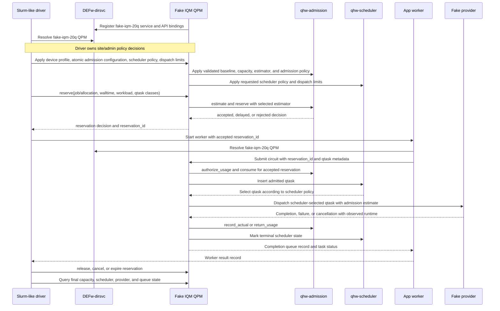

# Test Plan

## Purpose

Define the system-level validation strategy for the admission, scheduler,
operation-mode, and managed-execution work described in
`docs/requirements.md`, `docs/detailed-design.md`, and
`docs/implementation-plan.md`.

This plan focuses on observable behavior across QFw, DEFw-dirsvc, installed
runtime commands, QPM, qhw-admission, qhw-scheduler, provider adapters, client
bindings, telemetry, completion queues, and operator workflows. Component and
phase-level tests from the implementation plan remain required, but they are
not repeated here except where they form system-test entry criteria.

Authentication behavior is out of scope for this milestone. QPM APIs accept
opaque `token` parameters as request metadata, but tests must not expect token
validation, caller authorization, or policy filtering based on token contents.

## Test Environment

System validation requires source-tree and installed-prefix layouts. Each
layout must support the same user-facing command surface and enough deployment
coverage to exercise these runtime modes:

- QFw-managed local runtime: `qfw-setup --profile local` starts a job-owned
  DEFw-dirsvc and one or more local QPM services from the job-local service
  manifest.
- Long-running site runtime: independent `qfw-dir-svc` and `qfw-qpm-svc`
  managers register a long-running QPM with the site-scoped DEFw-dirsvc.
- Hybrid runtime: a job starts local services while also allowing discovery
  through a site-scoped directory service.
- Direct endpoint diagnostic runtime: a DEFw-wrapped QPM listens on an
  explicitly configured endpoint and is used only when the direct endpoint
  resolver scope is explicitly enabled.

The environment must provide:

- Installed or in-tree QFw and DEFw builds matching the implementation under
  test, including DEFw-dirsvc, QPM service APIs, and client proxy bindings.
- CMake install output with executable `qfw-activate`, `defw-python`,
  `qfw-setup`, `qfw-status`, `qfw-srun`, `qfw-teardown`, `qfw-dir-svc`, and
  `qfw-qpm-svc` commands.
- Source-tree activation with the same logical path variables as the installed
  layout.
- Runtime profile templates for implicit production, local, and hybrid
  profiles, plus a service-runtime configuration with
  `qpm.completion-queues.retention` settings.
- qhw-admission and qhw-scheduler bindings available to the QPM controller.
- At least one deterministic execution target, preferably a simulator QPM, for
  repeatable execution, cancellation, timeout, and failure tests.
- A deterministic fake QPM backend for admission and scheduler stress tests.
  The service must register as a normal QPM service, use the common `UTIL_QPM`
  managed execution path, and fake only the provider execution below QPM.
- A fake IQM-like 20-qubit device profile shared by qhw-admission and the fake
  backend execution model so admission estimates, scheduler metadata, and
  provider sleep duration use the same timing assumptions.
- A Slurm-like admission driver that can reserve capacity through QPM with
  scheduler job or allocation metadata, pass the accepted reservation ID to
  workload applications, and release or cancel that reservation after the
  workload completes.
- A long-running service target that can remain up across multiple client jobs.
- Configurable admission device profiles, admission policies, estimator
  selection and options, scheduler policies, dispatch-depth limits, and
  reservation TTLs.
- A way to force capacity pressure, delayed admission, scheduler failure,
  provider failure, peer loss, service restart, and stale directory-generation
  cases without relying on production hardware instability.
- Operator-visible logs, telemetry, audit records, and reservation/task
  inspection APIs for validating state ordering and reconciliation.
- A clock-control or short-TTL mechanism for expiration tests.
- Completion-queue retention controls, including short TTL and small
  max-record settings, for deterministic eviction tests.

Hardware-backed tests may be run as a provider smoke layer after the simulator
system suite passes. Hardware unavailability must not block acceptance of
provider-independent admission, scheduler, resolver, and telemetry semantics.

## Entry Criteria

- Phase-level automated tests from `docs/implementation-plan.md` have passed
  for the implementation slice under test, including operation-mode,
  API/token-pass-through, controller scaffolding, admission integration,
  scheduler integration, telemetry, reconciliation, hardening,
  runtime-startup, and completion-queue tests.
- The target environment can start, stop, and inspect DEFw-dirsvc and QPM
  services without manual code edits.
- The target environment can activate both source-tree and installed-prefix
  layouts and run a trivial application through `defw-python`.
- Test data defines at least two reservations with different owners, jobs or
  allocations, devices or scopes, and capacity limits.
- Stress-test data defines a fake 20-qubit IQM-like target, reservation
  requests with Slurm-style job and allocation metadata, and real circuit
  payloads with controlled qubit count, shots, depth, gate counts, priority,
  estimated runtime, credit units, rate units, and baseline units.
- Hybrid stress-test data defines emulated classical processing phases with
  bounded sleep durations, explicit ordering relative to quantum submission,
  and expected contribution to reservation walltime.
- Structured status and error envelopes are enabled on execution, admission,
  scheduler-control, and telemetry/discovery APIs.

## Admission And Scheduler Stress Fixture

The qhw-admission and qhw-scheduler stress suite uses a deterministic fake QPM
backend. The goal is to test the real QFw managed-resource path under
contention without adding simulator or hardware noise. DEFw discovery, QPM
binding, reservation APIs, qhw-admission contexts, qhw-scheduler contexts,
completion queues, task status, telemetry, and cleanup must all be real. Only
the provider execution below QPM is faked.

The fake backend service must follow the same structure as the other QFw QPM
services:

- It is a service module under `services/` with `svc_info`, `service_classes`,
  `initialize()`, and `uninitialize()` entries.
- Its QPM class derives from `UTIL_QPM` and uses the shared controller for
  reservation validation, admission usage holds, scheduler insertion,
  dispatch-depth control, completion accounting, cancellation, and telemetry.
- It registers as a normal QPM service through DEFw-dirsvc and advertises an
  explicit provider such as `fake-iqm`, a stable `service_id`, a stable target
  ID such as `fake-iqm-20q`, `QPM_TYPE_IQM | QPM_TYPE_HARDWARE` compatibility
  bits, and selector metadata that can distinguish it from live IQM services.
- Its QRC or provider adapter never calls production hardware or a simulator.
  It accepts a real QFw circuit record, derives execution metadata from the
  circuit payload and any supplied annotations, sleeps for a bounded
  deterministic duration, and returns a structured fake result. The result
  includes the circuit ID, qtask ID, reservation ID, requested timing metadata,
  observed fake runtime, and any configured success, failure, or cancellation
  outcome.

The fake IQM-like device profile is the admission profile for qhw-admission and
also the timing model for the fake provider. It should be configured before
accepting reservations and should include at least:

- `device_id` or target ID: `fake-iqm-20q`
- `max_qubits`: `20`
- `max_shots`: a finite test value such as `10000`
- baseline fields: qubit count, depth, one-qubit gate count, two-qubit gate
  count, measurement count, and shots
- timing fields: one-qubit gate time, two-qubit gate time, measurement time,
  compile overhead, control overhead, provider overhead, and accounting window
- credit policy capacity: `total_credits`
- rate policy capacity: `device_rate` and `concurrent_jobs`
- reservation TTL and provider queue-depth limits suitable for short tests

The estimator is part of the test configuration. The default estimator is
qhw-admission's built-in `baseline` estimator, selected by name through the
normal qhw-admission estimator API. The harness must also accept an estimator
plugin path, estimator name, and estimator options so later IQM-specific,
calibration-backed, or topology-aware estimators can be substituted without
rewriting the workload driver, fake provider, or scheduler assertions.

Circuit payload inspection or explicit annotations supply `num_qubits`, `shots`,
`depth`, one-qubit gate count, two-qubit gate count, measurement count,
`priority`, `estimated_cost`, and optional estimator metadata. The QPM
controller must ask qhw-admission's selected estimator for the task estimate and
must treat the returned `estimated_runtime_ns`, `baseline_units`,
`credits_required`, and `rate_required` values as the source of truth. The fake
provider consumes the estimate attached by QPM and does not duplicate admission
credit or rate math. It then sleeps for a scaled duration:

```text
sleep_seconds =
  min(fake_execution_ns * QFW_FAKE_QPM_SLEEP_SCALE / 1000000000,
      QFW_FAKE_QPM_MAX_SLEEP_SECONDS)
```

The scale and maximum sleep limit keep the stress suite fast while preserving
relative ordering and resource pressure. The fake result must report both the
estimated device time and observed fake execution time so QPM can exercise
`return_usage()` and `record_actual()` paths.

The default workload classes should be calibrated against the baseline estimator
rather than a separate qSchedSim formula. The qSchedSim workload shapes are used
only to choose interpretable small, medium, and large circuit families. For the
fake 20-qubit target, the large class must fit within `max_qubits`; any
qSchedSim 40-qubit shape should be adapted to a 20-qubit, deeper circuit rather
than bypassing qhw-admission validation.

The Slurm-like test driver represents the future scheduler integration until
real Slurm admission integration exists. It is not a qhw-scheduler plugin. It
acts as the site administrator and workload manager for the fixture:

- discovers the fake QPM through the same configured resolver path as an
  application
- owns the fake device profile, estimator selection and options, admission
  policy, scheduler policy, and dispatch-depth decisions, then applies them
  through QPM control APIs
- submits reservation requests with owner, user, job ID, allocation ID, account
  or project, scope, target device, walltime, TTL, workload metadata, priority,
  and qtask class information
- records accepted, delayed, and rejected reservation decisions
- passes accepted reservation IDs to application workers through arguments,
  environment, or a run-state file
- releases, cancels, or expires reservations at the end of each scenario and
  verifies that QPM cleanup has no leaked holds, pending capacity, scheduler
  queue entries, provider inflight tasks, or completion-queue ownership errors

The core protocol for every scenario is:



The workload generator should be SuperMarQ-like in shape and use real circuit
payloads. The fake backend provides deterministic execution, but applications
must still submit normal QFw circuit records through QPM using the reservation
ID supplied by the Slurm-like driver. Workloads must cover these categories:

- `short_only`: short circuits with low estimated runtime and cost
- `long_only`: longer circuits with higher estimated runtime and cost
- `mixed_short_long`: one workload mixes short and long quantum tasks
- `mixed_job_types`: hybrid and standalone quantum jobs run together
- `standalone`: quantum-only jobs without an emulated classical phase

Hybrid jobs must emulate classical processing with sleep-based phases. The
supported modes are `sequential_pre`, where classical work completes before
quantum submission; `sequential_post`, where classical work starts after
quantum completion; and `parallel`, where a background classical sleep starts
when quantum work is submitted and the job completes only after both paths
finish. The parallel mode preserves overlap and gives walltime tests a real
elapsed-time difference from purely sequential workflows.

The workload generator must support concurrent application workers and
multiple workload waves against the same fake QPM service. Each worker should
emit structured records containing the reservation ID, circuit ID, qtask ID,
submission order, workload category, classical mode, expected policy class,
task metadata, immediate QPM response, completion record, final task status,
and observed walltime.

Reservation walltime should be derived from the emulated classical phases plus
the qhw-admission estimator-derived quantum estimate and a configurable margin.
For `parallel` jobs, the expected elapsed runtime is the larger of the
overlapped classical path and quantum path, plus any configured setup and
cleanup margin.
The stress harness must also enforce an outer walltime for the whole test run
so stalled reservations, blocked workers, or leaked services fail with
evidence before the allocation limit is reached.

The stress matrix is tiered to avoid an exhaustive product of all policies,
schedulers, workload shapes, and hybrid modes. `unlimited` admission is only a
startup sanity case because it does not exercise finite capacity. The main test
surface is `credit` and `rate` admission.

The default tiers are:

- Startup sanity: run one `unlimited` plus `fifo` scenario with a small workload,
  one worker, one wave, and two to four qtasks. Verify service startup,
  estimator configuration, scheduler configuration, execution, completion, and
  cleanup.
- Credit and rate smoke matrix: run `credit` and `rate` against `fifo`,
  `priority`, `round_robin`, `ordered_sjf`, `ordered_ljf`, and `ordered` with a
  small workload and four to eight qtasks. Verify the policy can reserve,
  authorize, schedule, execute, complete, and release under each scheduler.
- Admission limit stress: run focused `credit` and `rate` cases that force
  accepted, delayed, and rejected decisions. For `credit`, vary `total_credits`
  so requests fit exactly, exceed remaining capacity, and exceed the policy
  limit. For `rate`, vary `device_rate`, `concurrent_jobs`, accounting window,
  and reservation walltime so requests fit, delay into a later window, and
  become infeasible.
- Scheduler stress under finite admission: use finite but generous `credit` or
  `rate` settings so multiple admitted qtasks reach qhw-scheduler together.
  Then validate `priority`, `round_robin`, `ordered_sjf`, `ordered_ljf`, and
  `ordered` dispatch order with controlled priority, group, cost, and estimated
  runtime metadata.
- Workload-shape stress: run representative `credit` and `rate` scenarios over
  `short_only`, `long_only`, `mixed_short_long`, `mixed_job_types`, and
  `standalone` workloads. This tier should use a bounded scenario count by
  pairing each workload with one admission/scheduler combination selected to
  expose a specific behavior.
- Hybrid walltime stress: run `sequential_pre`, `sequential_post`, and
  `parallel` classical emulation modes under at least one `credit` case and one
  `rate` case. Verify reservation walltime and harness walltime remain within
  configured bounds.

The stress matrix must cover these qhw-scheduler policies:

- `fifo`: with dispatch depth one, selected and completed work follows
  submission order for admitted tasks.
- `priority`: higher numeric priority is selected first, and equal priorities
  preserve FIFO order.
- `round_robin`: work from different reservations or jobs alternates by the
  scheduler grouping rules while each group preserves FIFO order.
- `ordered_sjf`: ordered scheduling with shortest-job-first keys selects lower
  `estimated_runtime_ns` work first while preserving configured tie breakers.
- `ordered_ljf`: ordered scheduling with longest-job-first keys selects higher
  `estimated_runtime_ns` work first while preserving configured tie breakers.
- `ordered`: other configured order keys, such as priority, round-robin, and
  FIFO, produce the expected selected order from controlled
  `estimated_runtime_ns` and `estimated_cost` metadata.

For every stress run, evidence must include the selected admission policy,
scheduler policy, estimator name and options, fake device profile, workload
category, classical mode, reservation walltime, harness walltime, reservation
decisions, estimator outputs, capacity snapshots before and after execution,
scheduler queue state, task status history, expected dispatch order, actual
dispatch and completion order, completion-queue output, fake provider timing
records, release or cancel result, and final leak check.

The canonical fixture output is JSONL. The Python driver prints one
`QFW_FAKE_IQM_STRESS_RESULT ` record per scenario and appends the same JSON to
`QFW_EXAMPLE_RESULT_FILE` when that variable is set. The wrapper also emits the
standard `QFW_EXAMPLE_RESULT ` summary record. A passing scenario must have
`status: ok`, successful completion records for every expected qtask, no
runtime-task or provider-inflight leaks in the final scheduler queue state, no
held-capacity or pending-capacity leaks in the final capacity snapshot, and a
measured scenario duration within the configured harness walltime.

## Chemistry Application Provider Smoke

### Test And Expected Results

The chemistry application smoke is a special provider-facing test outside the
main system matrix. It validates an external application that uses QFw through
Qiskit Estimator rather than through a purpose-built QFw example script. The
baseline Docker run targets `nwqsim`. The ORNL IQM run can also be driven from
the Slurm Docker environment: the Docker allocation starts a site-style
DEFw-dirsvc and long-running IQM QPM, and that QPM reaches the ORNL IQM endpoint
over the network. The same procedure can be moved to a production site-owned
service plane later.

The baseline script is
`example_1_He_from_pyscf.py --smoke --no-draw` from a QFw-enabled
`chemistry_example_aim2` checkout. The current Docker validation path uses
`/workspace/qfw-container-base/chemistry_example_aim2` and the matching host
path under `QFw-SLURM-Cluster-doug/shared-dir/chemistry_example_aim2`.

A passing simulator smoke proves that the wrapper activates QFw, uses
`qfw-setup`, `qfw-status`, `qfw-srun`, and `qfw-teardown`, starts only
application-owned simulator services, receives a reservation ID from the
launcher or driver, submits
estimator circuits through QFw, releases the reservation, and cleans job-owned
runtime state. The wrapper must emit a final `QFW_EXAMPLE_RESULT` record with
`status: ok`, app return code zero, teardown return code zero, the backend
provider, run directory, reservation ID, and release result.

A passing ORNL IQM smoke uses site mode even when the services are launched
inside Docker. It proves that the application can discover a long-running IQM
QPM through the configured directory, that `qfw-teardown` does not stop that
directory or IQM QPM, and that IQM credentials are loaded by the service from
the device-access configuration rather than being embedded in the application.
Before the chemistry workload runs, the IQM QPM should pass a telemetry
preflight through the same resolver path the application will use.

The test evidence must preserve application output because chemistry
applications may print scientific results only to stdout or stderr. The result
record should include `stdout_path`, `stderr_path`, embedded `stdout` and
`stderr` snippets, `stdout_truncated`, `stderr_truncated`, and
`max_output_bytes`. The full stdout and stderr files must remain in the run
directory. IQM hardware evidence should also include the selected
`QFW_QPU_DEVICE_ID`, sanitized endpoint, credential source path, IQM job ID,
terminal hardware status, timing metadata, QPM log path, site directory log
path, Slurm job or allocation ID, and target device.

Hardware smoke should use a small shot count and the smallest chemistry script
until IQM QASM translation, qubit mapping, calibration selection, network access
from the Docker service node, TLS trust, and timeslot behavior are confirmed.

### Manual Run Procedure

Build and install QFw and DEFw from the shared checkout that will be visible to
the Docker nodes or to the target allocation:

```bash
export QFW_SRC=/workspace/qfw-container-base/QFw
export QFW_BUILD=/workspace/qfw-container-base/build/qfw-chem
export QFW_PREFIX=/workspace/qfw-container-base/install/qfw-chem

git -C "$QFW_SRC" submodule update --init --recursive
cmake -S "$QFW_SRC" -B "$QFW_BUILD" \
  -DCMAKE_BUILD_TYPE=RelWithDebInfo \
  -DCMAKE_INSTALL_PREFIX="$QFW_PREFIX"
cmake --build "$QFW_BUILD" -j "$(nproc)"
cmake --install "$QFW_BUILD" --prefix "$QFW_PREFIX"
```

Activate the shared application environment and the installed QFw prefix:

```bash
source "$QFW_PREFIX/bin/qfw-activate" \
  --venv /workspace/qfw-container-base/qfw-shared-test-venv
export QFW_RUN_BASE_DIR=/workspace/qfw-container-base/test-runs/chem-$(date +%Y%m%d-%H%M%S)
```

Run the Docker `nwqsim` baseline from a one-node Slurm allocation:

```bash
cd /workspace/qfw-container-base/QFw/examples
salloc --partition=quantum --nodes=1 --nodelist=c5 --time=00:20:00 \
  ./qfw_chem_app.sh --backend nwqsim \
  --chem-app-dir /workspace/qfw-container-base/chemistry_example_aim2 \
  example_1_He_from_pyscf.py --smoke --no-draw \
  --reservation-shots 128 \
  --estimator-precision 0.08838834764831845
```

For the ORNL IQM path, first verify that the Docker service node can reach the
ORNL IQM endpoint and has the required TLS trust configuration. Then prepare a
service-readable device-access directory in the shared Docker filesystem. The
QFw example device map is `services/dev-config/config.yaml`; it defines the
target device and points at a credential database:

```yaml
qpus:
  ornl-iqm-20q:
    provider-device-id: default
    url: https://qccsw.ccs.ornl.gov/
    credential-db: qpu_users.json
```

The API key is stored in the credential DB referenced by that YAML file. The
example DB is `services/dev-config/qpu_users.json`. For a real run, copy both
files to a protected service location, replace the dummy API key, and keep the
credential DB readable only by the service account:

```bash
export QFW_IQM_DEVICE_DIR=/workspace/qfw-container-base/iqm-device
install -d -m 700 "$QFW_IQM_DEVICE_DIR"
cp "$QFW_SRC/services/dev-config/config.yaml" "$QFW_IQM_DEVICE_DIR/config.yaml"
cp "$QFW_SRC/services/dev-config/qpu_users.json" "$QFW_IQM_DEVICE_DIR/qpu_users.json"
chmod 600 "$QFW_IQM_DEVICE_DIR/qpu_users.json"

export QFW_QPU_DEVICE_ID=ornl-iqm-20q
```

Create or select a site configuration shared by the Docker-launched directory,
IQM QPM, and application allocations. The connection record must be visible at
the same path from all Docker Slurm nodes used by the test:

```bash
export QFW_SITE_CONFIG=/workspace/qfw-container-base/iqm-site.yaml
cat > "$QFW_SITE_CONFIG" <<EOF
install:
  qfw-prefix: $QFW_PREFIX
  defw-prefix: $QFW_PREFIX

directory-service:
  name: qfw-docker-iqm-dirsvc
  listen-port: 8090
  connect-timeout-seconds: 300
  connection-file: /workspace/qfw-container-base/qfw-site-services/directory-service.json

service:
  manifest: $QFW_PREFIX/share/qfw/config/services/site-services.yaml
  device-access-config: $QFW_IQM_DEVICE_DIR/config.yaml

qpm:
  completion-queues:
    retention:
      completion-ttl-seconds: 3600
      terminal-reservation-retention-seconds: 3600
      max-records-per-reservation: 1024
      max-bytes-per-reservation: 67108864
      purge-interval-seconds: 60
EOF
```

Start the directory and the long-running IQM QPM inside a Docker Slurm
allocation. These processes are site-style services for the test, even though
Docker owns their lifetime. The service launcher should take the target device
as an input. If the installed service manifest does not already define that
device, the launcher should generate a temporary service manifest entry for the
requested target device and pass the generated manifest to `qfw-qpm-svc`.

```bash
salloc --partition=quantum --nodes=1 --nodelist=c5 --time=00:30:00 bash

export QFW_IQM_SERVICE_ROOT=/workspace/qfw-container-base/test-runs/iqm-smoke-$(date +%Y%m%d-%H%M%S)
qfw-dir-svc start \
  --run-dir "$QFW_IQM_SERVICE_ROOT/directory" \
  --site-config "$QFW_SITE_CONFIG" --scope site --node c5

qfw-qpm-svc start \
  --run-dir "$QFW_IQM_SERVICE_ROOT/iqm-ornl-20q" \
  --service-id iqm-ornl-20q \
  --site-config "$QFW_SITE_CONFIG" \
  --scope site --node c5 --timeout 120
```

Before running the chemistry application, call the IQM QPM telemetry path
through the site resolver and confirm that the service reports the selected
device, can reach the ORNL IQM endpoint, and has no credential errors. Then run
the application allocation in site mode:

```bash
source "$QFW_PREFIX/bin/qfw-activate" \
  --venv /workspace/qfw-container-base/qfw-shared-test-venv
export QFW_SITE_CONFIG=/workspace/qfw-container-base/iqm-site.yaml
export QFW_RUNTIME_CONFIG=/workspace/qfw-container-base/site-runtime.yaml

cd "$QFW_SHARE_DIR/examples"
salloc --partition=quantum --nodes=1 --nodelist=c5 --time=00:20:00 \
  ./qfw_chem_app.sh --service-mode site --backend iqm \
  --site-config "${QFW_SITE_CONFIG}" \
  --runtime-config "${QFW_RUNTIME_CONFIG}" \
  --chem-app-dir /workspace/qfw-container-base/chemistry_example_aim2 \
  example_1_He_from_pyscf.py --smoke --no-draw \
  --reservation-qubits 20 \
  --reservation-shots <small-shot-count> \
  --reservation-walltime-s <walltime> \
  --reservation-ttl-s <ttl>
```

The IQM smoke driver follows the existing Slurm-style driver pattern used by
the admission and scheduler fixture. Site services are started with
`qfw-dir-svc` and `qfw-qpm-svc`; the application test does not own them.
`examples/qfw_iqm_chem_smoke.sh` accepts `--target-device`,
  `--site-config`, `--qfw-src`, `--build-dir`, `--install-prefix`,
  `--shared-venv`, `--chem-app-dir`, `--partition`, `--nodes`, `--nodelist`,
  `--time`, `--shots`, and `--max-output-bytes`;
  captures stdout and stderr; embeds bounded output in a JSONL result record;
  and verifies that app-side teardown does not stop the Docker-hosted
  site-style services.

## System Test Cases

| Test ID | Scenario | Requirements |
| --- | --- | --- |
| ST-001 | QFw-managed service discovery. Start an allocation-local DEFw-dirsvc and QPM service, verify QPM registers service records and API bindings, resolve execution and telemetry bindings, and confirm DEFw-dirsvc performs no QPM admission capacity accounting. | `OPM-001`, `OPM-003`, `DISC-001`, `DISC-002`, `DISC-004`, `API-003` |
| ST-002 | Long-running QPM discovery. Start a long-running DEFw-wrapped QPM, register it with a site-scoped DEFw-dirsvc, inject directory configuration into a client allocation, resolve and call it through DEFw RPC, and verify an unregistered direct endpoint is callable only when the direct endpoint resolver scope is explicitly enabled. | `OPM-002`, `OPM-003`, `DISC-003`, `DISC-004`, `DISC-005`, `API-003` |
| ST-003 | Multi-scope resolver policy. Present local, site-scoped, hybrid, and direct-endpoint candidates, verify scope annotation, deterministic ordering, tie-breaking, ambiguity errors, stale generation rejection, selected API binding validation, and no silent hardware-to-simulator fallback. | `DISC-004`, `DISC-005`, `API-003` |
| ST-004 | API category separation and token placeholders. Resolve and call execution, admission control, admission policy configuration, scheduler control, and telemetry/discovery bindings. Verify tokens are preserved as opaque metadata and are not parsed, validated, or used for authorization. | `CAT-001` through `CAT-007`, `API-001` through `API-004`, `CTRL-001` |
| ST-005 | Client pass-through. Submit through QFw backend, job, sampler, and estimator paths with `reservation_id`, token, timeout, and execution options. Verify context reaches QPM unchanged and production resource-affecting execution without a reservation ID is rejected. | `API-001`, `API-003`, `CAT-002` |
| ST-006 | Admission reservation workflows. Exercise `evaluate`, `reserve`, `renew`, `release`, `cancel`, `get_reservation`, and `list_reservations`. Verify accepted, delayed, and rejected outcomes include machine-readable reasons and that qhw-admission is the authoritative reservation store. | `ADM-001` through `ADM-004`, `ADM-016`, `ADM-017`, `CAT-003` |
| ST-007 | Reservation validation and capacity holds. Attempt work with invalid, expired, released, cancelled, wrong-device, wrong-scope, and over-limit reservations. Verify active matching reservations call `authorize_usage()` and `consume()` before scheduler insertion, while failed holds never enter qhw-scheduler or provider dispatch. | `ADM-005`, `ADM-006`, `ADM-018`, `ADM-019`, `API-004` |
| ST-008 | Pending-capacity workflow. Force delayed authorization and verify QPM creates pending entries without qhw-admission usage events or scheduler tasks. Release capacity and verify retry uses the same qtask ID and usage payload before `consume()` and scheduler insertion. | `ADM-019`, `ADM-020`, `ADM-022`, `SCHED-004` |
| ST-009 | Scheduled asynchronous execution. Submit admitted async work, verify QPM returns circuit and qtask handles, inserts the qtask into qhw-scheduler, dispatches only scheduler-selected work, and blocks normal provider-direct bypasses. Exercise device-only, operator-only, combined, unspecified, and dynamically lowered dispatch limits; verify the smaller nonzero limit is enforced and terminal paths release slots. | `SCHED-001`, `SCHED-003`, `SCHED-005`, `SCHED-007`, `SCHED-009`, `SCHED-010` |
| ST-010 | Synchronous execution contract. Run `sync_run()` through the same managed path as async execution. Verify terminal success, immediate timeout, non-terminal timeout that leaves work active, and `cancel_on_timeout` behavior with structured task handles and lifecycle state. | `SCHED-008`, `API-001`, `API-004`, `CAT-002` |
| ST-011 | Completion ordering and result visibility. Complete, fail, and cancel provider work. Verify QPM records actual usage or returns unused capacity, updates qhw-scheduler terminal state, and only then exposes terminal sync results, reservation-scoped completion-queue records, events, or result metadata. | `ADM-007`, `ADM-021`, `SCHED-005`, `SCHED-006`, `STATE-004` |
| ST-012 | Cancellation propagation. Cancel pending-capacity, queued, selected, submitted, running, and timeout-returned qtasks. Verify cancellation reaches QPM pending state, qhw-scheduler, provider handles when present, result/event state, and qhw-admission accounting. | `SCHED-011`, `ADM-021`, `STATE-003`, `STATE-004` |
| ST-013 | Reservation close protocol. Release, cancel, and expire reservations with pending, held, selected, and provider-running qtasks. Verify QPM marks the reservation closing, rejects new work, stops pending retries, finalizes held-task accounting while qhw-admission still reports active, and then performs the terminal lifecycle call. | `ADM-003`, `ADM-007`, `ADM-017`, `ADM-021`, `ADM-022`, `STATE-004` |
| ST-014 | Managed task status and queue observations. Poll task status through every visible state: pending capacity, queued, waiting, selected, submitted, running, completed, failed, cancelled, and timed out. Verify queue position and wait/start estimates are present only when policy and telemetry support them. | `SCHED-012`, `SCHED-013`, `SCHED-014`, `API-004`, `CTRL-008` |
| ST-015 | Telemetry and capacity snapshots. Atomically configure unlimited, credit, and rate admission policies with a complete baseline circuit; verify invalid and stale-version updates preserve prior state. Query backend metadata, calibration/topology data, reservation state, task-ID-based timing and metadata, capacity snapshots, queue metrics, scheduler policy state, device availability, confidence, timestamps, and policy context. Verify cross-reservation task access is rejected, no last-job API exists, qhw-admission estimates reach qhw-scheduler, and unavailable estimates are explicit. | `API-002`, `CAT-005`, `CTRL-002` through `CTRL-008` |
| ST-016 | Liveness, restart, and reconciliation. Inject peer loss, heartbeat timeout, service deregistration, QPM restart, stale directory generation, incomplete holds, unfinished scheduler tasks, and provider handles requiring recovery. Verify directory state, resolver behavior, reconciliation faults, and audit records. | `DISC-001`, `DISC-004`, `CTRL-004`, `STATE-004` |
| ST-017 | Operation-mode parity. Run the same reservation, execution, cancellation, timeout, release, and telemetry workflows in QFw-managed mode and long-running QPM mode. Verify the externally visible QPM API semantics match after binding. | `OPM-001` through `OPM-003`, `API-003`, `CAT-007` |
| ST-018 | Compatibility debt removal. Verify legacy directory `reserve()` and `release()` capacity semantics and unmanaged public execution bypasses are unavailable. Verify all circuit execution requires a reservation and follows admission and scheduler selection. | `DISC-002`, `SCHED-009`, `SCHED-010`, `API-001` |
| ST-019 | Installed and source runtime parity. Build and install QFw, activate both source-tree and installed-prefix layouts, verify command executability, logical path variables, Python package imports, DEFw Python version checks, virtual-environment preservation, and absence of installed-mode Python executable rewriting. | `OPM-001`, `OPM-002`, `API-003` |
| ST-020 | Runtime profile and lifecycle ownership. Exercise implicit production, local, and hybrid profiles through `qfw-setup`, `qfw-status`, `qfw-srun`, and `qfw-teardown`. Verify local and hybrid profiles start only application-owned managers, status composes manager health, production jobs leave site services running, setup fails on directory readiness timeout, and teardown cleans only application-owned run state. | `OPM-001` through `OPM-003`, `DISC-001`, `DISC-003`, `DISC-004`, `DISC-005`, `API-003` |
| ST-021 | Service lifecycle commands. Start a site directory through `qfw-dir-svc` and one QPM through `qfw-qpm-svc`. Verify independent run directories, PID and readiness state, foreground signal handling, directory connection publication, automatic QPM connection, optional DVM ownership, and nonzero startup on registration timeout. | `OPM-001`, `OPM-002`, `DISC-001`, `DISC-003`, `DISC-005` |
| ST-021A | Privileged QPM lifecycle control. Resolve the control binding, verify structured liveness/readiness/status, audit reconciliation reasons, reject new reservations and execution after quiescing, exercise graceful and cancel shutdown including timeout and repetition, and confirm provider cleanup, response-before-exit, and directory deregistration. | `CAT-008`, `CTRL-009`, `DISC-001`, `STATE-004` |
| ST-022 | Reservation-scoped completion queues. Create reservation queues on accepted reservations, complete multiple tasks under multiple reservations, verify oldest-ready and targeted `peek_cq()` and `read_cq()` behavior, missing-reservation and mismatched-reservation rejection, peek idempotency, and single completion consumption. | `CAT-002`, `API-001`, `API-004`, `SCHED-012`, `STATE-001` through `STATE-003` |
| ST-023 | Completion notifications and retention. Verify terminal completions are enqueued after admission and scheduler finalization and before event dispatch, notifications do not consume polling records, QRC completion sink ownership is acknowledged only after enqueue, retention settings evict records deterministically, no-longer-retained responses are structured, and terminal reservation queues are garbage-collected only after active work and retention conditions are satisfied. | `ADM-021`, `SCHED-005`, `SCHED-006`, `SCHED-011`, `STATE-003`, `STATE-004` |
| ST-024 | Long-running QPM concurrent app waves. Allocate at least three nodes, start a site DEFw-dirsvc, PRTE DVM, and long-running `nwqsim` QPM on one service node, then have a Slurm-style driver create reservations and launch two or more application instances concurrently on separate app nodes through site-scoped `qfw-setup`, `qfw-srun`, and `qfw-teardown`. Repeat a second concurrent wave against the same QPM without restarting the service plane. Verify each app resolves the site QPM, uses only the driver-returned reservation context, submits work, receives completion, releases the reservation, deregisters or disconnects cleanly, and that app teardown does not stop the site directory, DVM, or QPM. | `OPM-002`, `OPM-003`, `DISC-003`, `DISC-004`, `DISC-005`, `API-003`, `CAT-002`, `ADM-001`, `ADM-003`, `SCHED-008`, `STATE-003` |
| ST-025 | qhw-admission and qhw-scheduler stress with a fake IQM-like backend. Start a deterministic fake `fake-iqm-20q` QPM service, configure its qhw-admission device profile, selected estimator, and fake provider timing model from the same profile, and run a Slurm-like admission driver plus concurrent SuperMarQ-like workload workers that submit real circuit payloads. Use one `unlimited` startup sanity case, then focus smoke and stress coverage on `credit` and `rate` admission across `fifo`, `priority`, `round_robin`, `ordered_sjf`, `ordered_ljf`, and `ordered` scheduler policies. Cover representative `short_only`, `long_only`, `mixed_short_long`, `mixed_job_types`, and `standalone` workloads plus `sequential_pre`, `sequential_post`, and `parallel` classical emulation modes without running the full Cartesian product by default. Verify finite capacity is honored, pending-capacity work stays out of qhw-scheduler, scheduler-selected order matches policy expectations, fake provider sleep follows the qhw-admission estimator output, walltime remains within the reservation and harness limits, terminal completions are visible only after admission and scheduler accounting, and final cleanup leaves no active reservations, held capacity, pending qtasks, scheduler tasks, provider inflight work, or leaked completion queues. | `ADM-001` through `ADM-007`, `ADM-016` through `ADM-022`, `SCHED-001` through `SCHED-014`, `CAT-002` through `CAT-005`, `CTRL-001`, `CTRL-002`, `CTRL-004` through `CTRL-008`, `STATE-001` through `STATE-004` |

## Workflow Checks

- For each operation mode, perform a full happy-path workflow: configure
  admission and scheduler policy, have the Slurm-style driver create a
  reservation, launch the application with the returned reservation context,
  resolve QPM, submit async work, observe queued and running state, receive
  completion, inspect usage, release the reservation, and inspect final
  telemetry.
- Run the normal user lifecycle in each runtime profile: source or activate
  QFw, run `qfw-setup`, require `qfw-status` to report ready, launch a trivial
  application with `qfw-srun`, and run `qfw-teardown`.
- Run the site service lifecycle separately from the user job lifecycle:
  start a directory with `qfw-dir-svc` and a QPM with `qfw-qpm-svc`, then
  confirm user teardown does not stop those site-owned managers.
- Run the long-running QPM concurrency workflow from a three-node allocation:
  keep the site directory, PRTE DVM, and `nwqsim` QPM running on the service
  node while two application nodes execute simultaneous app waves through
  site-scoped runtime state.
- Run the fake IQM-like stress workflow with the Slurm-like admission driver:
  configure the fake device profile, reserve through QPM, fan out concurrent
  application workers with the returned reservation IDs, and compare expected
  admission and scheduler outcomes against observed task status, queue state,
  completion order, and capacity snapshots.
- Run one fake stress startup sanity workflow with `unlimited` admission, then
  run the bounded smoke and stress matrix focused on `credit` and `rate`
  admission across the required scheduler policies. Use dispatch depth one for
  deterministic ordering checks and a higher dispatch depth for contention
  checks.
- Repeat the fake stress workflow across `short_only`, `long_only`,
  `mixed_short_long`, `mixed_job_types`, and `standalone` workloads using real
  circuit payloads.
- Run hybrid workloads in `sequential_pre`, `sequential_post`, and `parallel`
  classical emulation modes. Confirm the reported elapsed time matches the
  expected sequential or overlapped walltime model within configured tolerance.
- Enforce the stress harness walltime with enough cleanup margin to terminate
  workers, release or cancel reservations, and stop job-owned services before
  the allocation limit.
- Repeat the happy path with `sync_run()` and verify timeout behavior does not
  create a second execution path.
- Run capacity-pressure workflows where one reservation consumes its allowed
  capacity and another qtask is delayed, rejected, or held pending according to
  site policy.
- Run failure workflows for invalid reservation, expired reservation, scheduler
  failure, provider failure, provider completion racing cancellation, and QPM
  restart while work is active.
- Compare reservation, qtask, circuit, scheduler task, provider handle, usage,
  event, and result identifiers across admission inspection, scheduler
  inspection, task status, completion queues, telemetry, and audit output.
- Read and peek completion queues by reservation with and without `cid`
  selectors, then confirm events remain independent from polling and retention
  produces structured no-longer-retained results.
- Confirm the directory advertises no aggregate or default QPM binding and
  that each workflow resolves only the category bindings it uses.

## Manual Checks

- Inspect the DEFw-dirsvc directory view in both operation modes and confirm
  service records contain stable service identity, runtime identity, generation,
  endpoint metadata, selector metadata, and concrete API bindings.
- Inspect QPM logs for each managed execution and confirm provider submission
  occurs only after reservation validation, accepted capacity hold, scheduler
  insertion, and scheduler selection.
- Inspect qhw-admission state after completion, cancellation, release, cancel,
  and expiration to confirm usage accounting is final before terminal results
  are visible.
- Inspect qhw-scheduler state during queue pressure and provider failure to
  confirm task lifecycle transitions match QPM-visible task status.
- Inspect telemetry and audit records for registration, deregistration, peer
  loss, restart, generation change, policy change,
  reconciliation fault, and reservation close events.
- Review direct endpoint fallback configuration and confirm unmanaged execution
  cannot be selected in production workflows.
- Inspect the installed prefix and confirm commands, private helpers, service
  modules, service API bindings, Python packages, examples, and configuration
  templates are installed under the expected package-owned locations.
- Inspect activation output and confirm `qfw-activate` exports logical QFw and
  DEFw path variables without starting services or replacing the user's Python
  executable.
- Inspect site-owned configuration and confirm privileged service-runtime and
  device-access files live outside the software prefix and are not modified by
  normal user jobs.
- Inspect long-running QPM evidence after the concurrent wave test: the site
  directory log must show service registration before the first app starts,
  the QPM log must show requests from multiple app instances, app runtime
  state must not contain `QFW_LOCAL_DIRSVC_ENDPOINT`, and the QPM process must
  remain alive after each app-side `qfw-teardown`.
- Inspect fake stress backend evidence and confirm the fake provider received
  only scheduler-selected qtasks, slept according to the shared fake IQM-like
  profile, reported observed runtime in completion records, and never executed
  qtasks that were rejected or delayed by qhw-admission.
- Inspect the fake Slurm-like admission driver output and confirm reservation
  requests include job, allocation, owner, target device, walltime, TTL,
  workload, priority, and qtask-class metadata, and that application workers
  use the returned reservation IDs rather than creating hidden reservations.
- Inspect workload evidence and confirm real circuit payloads were submitted,
  circuit-derived metadata matches the fake profile estimates, classical sleep
  phases ran in the configured mode, and parallel hybrid jobs waited for both
  the quantum completion and the background classical path.
- Inspect walltime evidence and confirm reservation walltime was estimated
  from classical and quantum components, over-walltime cases are reported
  structurally, and the harness stopped cleanly before its outer walltime.
- Inspect service-runtime configuration and confirm
  `qpm.completion-queues.retention` is loaded by QPM, invalid explicit values
  fail readiness, and `QFW_QPM_COMPLETION_*` overrides are limited to tests or
  emergency service operation.
- Confirm operator documentation or runbook notes identify which command-line
  options, environment variables, and site or runtime files select local
  directories, site-scoped directories, hybrid lookup, and direct fallback
  endpoints.

## Acceptance Criteria

- All ST-001 through ST-025 scenarios pass in the simulator or deterministic
  test target environment. Provider-specific hardware smoke tests may be
  reported separately when hardware is unavailable.
- Every requirement group in `docs/requirements.md` has at least one passing
  system scenario or a justified lower-level test with equivalent coverage.
- QFw-managed and long-running modes expose the same reservation, release,
  execution, status, cancellation, result, and telemetry semantics after QPM
  binding.
- Source-tree and installed-prefix layouts expose the same public command
  surface and runtime profile behavior.
- User job lifecycle commands never stop site-owned services, and service
  lifecycle commands do not depend on the user job lifecycle.
- Long-running QPM evidence includes at least two concurrent app instances and
  at least two app waves against one continuously running site QPM service.
- Fake IQM-like stress evidence covers all required qhw-admission and
  qhw-scheduler policy combinations, includes both accepted and constrained
  capacity cases, covers the required real-circuit workload categories and
  classical emulation modes, and proves that fake provider execution timing is
  derived from the same device profile used by qhw-admission.
- Stress evidence includes reservation walltime and harness walltime checks,
  including clean failure records for any over-walltime workload or stalled
  test run.
- Normal resource-affecting execution requires an active reservation, an
  accepted qhw-admission capacity hold, qhw-scheduler insertion, and scheduler
  selection before provider submission.
- Pending-capacity work never has a scheduler task or qhw-admission usage event
  before an accepted hold is committed.
- Terminal task results, completion events, and completion-queue records are
  not visible until qhw-admission accounting and qhw-scheduler terminal state
  have been updated.
- Managed completion polling requires a reservation ID, scopes optional
  circuit selectors to that reservation, keeps notifications independent from
  polling, and applies bounded retention with structured eviction outcomes.
- Release, cancel, and expiration close reservations only after pending work
  and held work have been finalized or an operator-visible reconciliation fault
  has been emitted.
- Structured outcomes distinguish invalid reservation, insufficient allowance,
  pending capacity, policy-delayed work, cancelled work, expired reservation,
  timeout, scheduler failure, and provider failure outcomes.
- Telemetry exposes capacity, queue, scheduler policy, task lifecycle,
  reservation lifecycle, estimate confidence, timestamps, and policy context
  consistently with the managed-resource lifecycle.
- Legacy DEFw directory reservation behavior and unmanaged public execution
  bypasses are absent from production workflows.
- Test evidence includes command logs or CI artifacts, relevant service logs,
  telemetry snapshots, and any documented deviations or environment skips.
